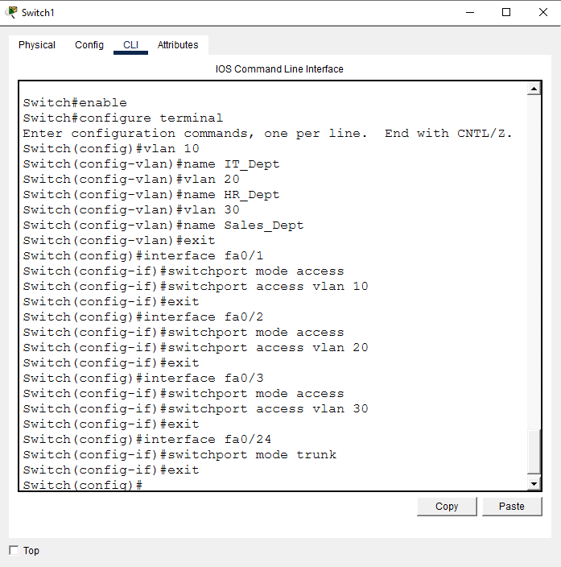
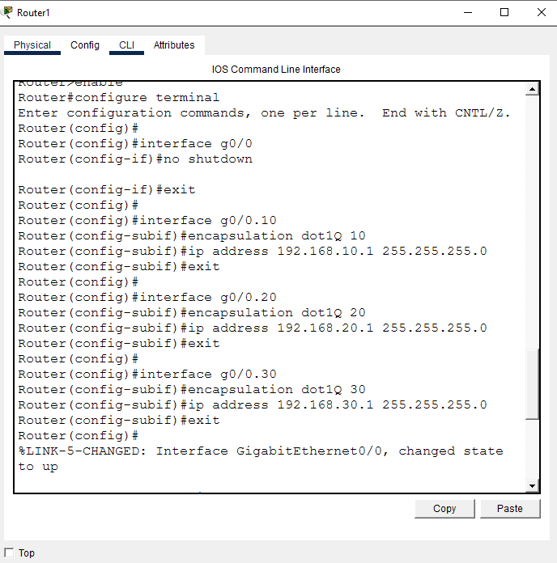
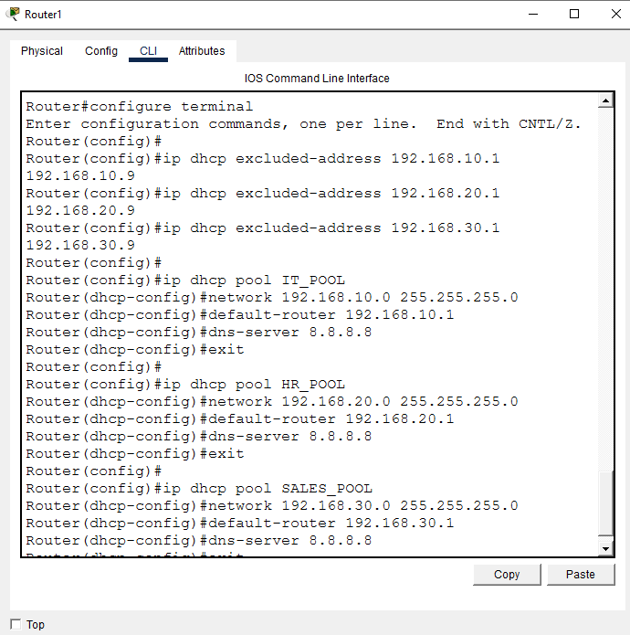
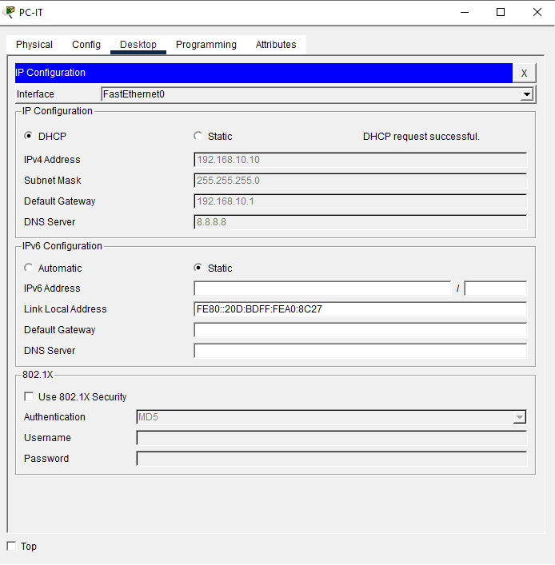
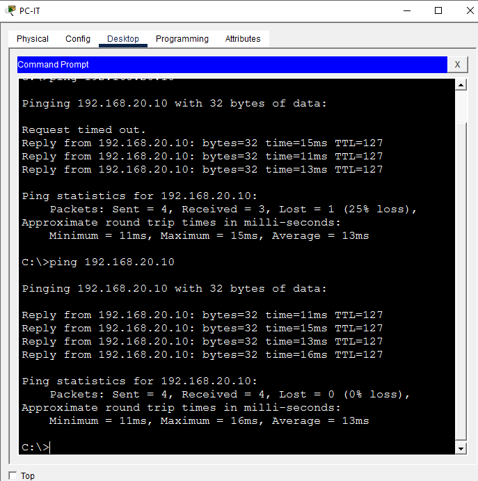
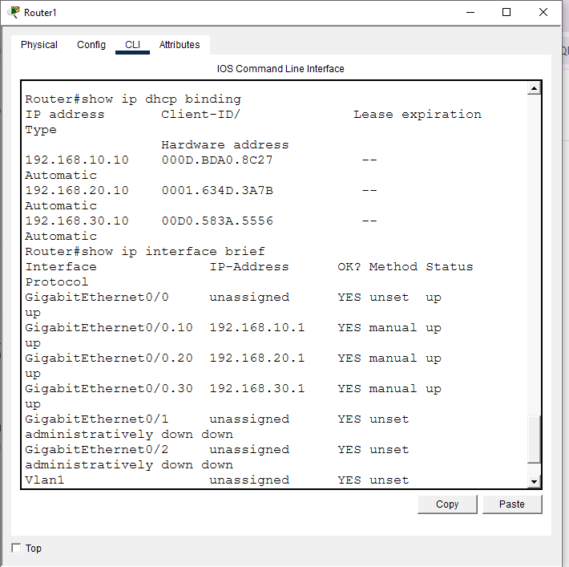
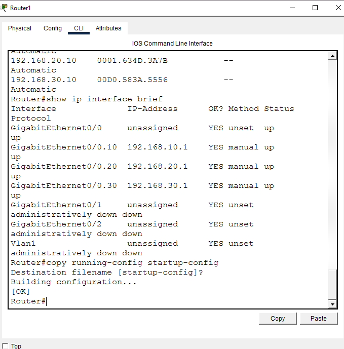

# DHCP Multi-VLAN Deployment

**Domain:** Networking
**Difficulty:** Intermediate
**Tools:** Cisco Packet Tracer

---

## 🎯 Objective
Configure multiple VLANs on a switch, set up Inter-VLAN routing using Router-on-a-Stick (ROAS), deploy DHCP pools directly from the gateway router for each VLAN, and verify automatic client addressing and inter-VLAN connectivity.

---

## 🛠️ Tools & Technologies
| Tool | Purpose |
|------|---------|
| Cisco Packet Tracer | Network simulation |
| Router 2911 (Router1) | Router-on-a-Stick gateway + DHCP server |
| Switch 2960 (Switch1) | VLAN segmentation, access + trunk ports |
| 802.1Q Trunking | Carries all 3 VLANs over a single uplink |
| DHCP | Per-VLAN address pools served from the router |

---

## 🖧 Topology

### Devices
- Router1 (2911) — Router-on-a-Stick + DHCP server
- Switch1 (2960) — access switch for all 3 departments
- PC-IT, PC-HR, PC-Sales — one per VLAN

### Connections
| From | To | Port |
|------|----|------|
| PC-IT | Switch1 | Fa0/1 |
| PC-HR | Switch1 | Fa0/2 |
| PC-Sales | Switch1 | Fa0/3 |
| Switch1 (trunk) | Router1 | Fa0/24 ↔ Gig0/0 |


---

## 🗂️ Network Segmentation Plan

| Department | VLAN | Subnet | Router Sub-Interface | Gateway IP | Client | Expected DHCP IP |
|---|---|---|---|---|---|---|
| IT | 10 | 192.168.10.0/24 | Gi0/0.10 | 192.168.10.1 | PC-IT | 192.168.10.10 |
| HR | 20 | 192.168.20.0/24 | Gi0/0.20 | 192.168.20.1 | PC-HR | 192.168.20.10 |
| Sales | 30 | 192.168.30.0/24 | Gi0/0.30 | 192.168.30.1 | PC-Sales | 192.168.30.10 |

**Excluded range:** `.1`–`.9` in every subnet, reserved for gateways/static infrastructure and kept out of the DHCP lease pool.

---

## 📋 Steps & Screenshots

### Step 1 — Build the Topology
Wire Router1, Switch1, and the 3 PCs per the connections table above.
```
No CLI commands — physical/logical wiring in the Packet Tracer GUI.
```

---

### Step 2 — Configure VLANs and Access Ports on Switch1
```
Switch(config)# vlan 10
Switch(config-vlan)# name IT_Dept
Switch(config-vlan)# vlan 20
Switch(config-vlan)# name HR_Dept
Switch(config-vlan)# vlan 30
Switch(config-vlan)# name Sales_Dept
Switch(config-vlan)# exit
Switch(config)# interface fa0/1
Switch(config-if)# switchport mode access
Switch(config-if)# switchport access vlan 10
Switch(config-if)# exit
Switch(config)# interface fa0/2
Switch(config-if)# switchport mode access
Switch(config-if)# switchport access vlan 20
Switch(config-if)# exit
Switch(config)# interface fa0/3
Switch(config-if)# switchport mode access
Switch(config-if)# switchport access vlan 30
Switch(config-if)# exit
Switch(config)# interface fa0/24
Switch(config-if)# switchport mode trunk
Switch(config-if)# exit
```


---

### Step 3 — Configure Router1 Sub-Interfaces (Inter-VLAN Routing)
```
Router(config)# interface g0/0
Router(config-if)# no shutdown
Router(config-if)# exit
Router(config)# interface g0/0.10
Router(config-subif)# encapsulation dot1Q 10
Router(config-subif)# ip address 192.168.10.1 255.255.255.0
Router(config-subif)# exit
Router(config)# interface g0/0.20
Router(config-subif)# encapsulation dot1Q 20
Router(config-subif)# ip address 192.168.20.1 255.255.255.0
Router(config-subif)# exit
Router(config)# interface g0/0.30
Router(config-subif)# encapsulation dot1Q 30
Router(config-subif)# ip address 192.168.30.1 255.255.255.0
Router(config-subif)# exit
```


---

### Step 4 — Configure DHCP Pools on Router1
```
Router(config)# ip dhcp excluded-address 192.168.10.1 192.168.10.9
Router(config)# ip dhcp excluded-address 192.168.20.1 192.168.20.9
Router(config)# ip dhcp excluded-address 192.168.30.1 192.168.30.9
Router(config)# ip dhcp pool IT_POOL
Router(dhcp-config)# network 192.168.10.0 255.255.255.0
Router(dhcp-config)# default-router 192.168.10.1
Router(dhcp-config)# dns-server 8.8.8.8
Router(dhcp-config)# exit
Router(config)# ip dhcp pool HR_POOL
Router(dhcp-config)# network 192.168.20.0 255.255.255.0
Router(dhcp-config)# default-router 192.168.20.1
Router(dhcp-config)# dns-server 8.8.8.8
Router(dhcp-config)# exit
Router(config)# ip dhcp pool SALES_POOL
Router(dhcp-config)# network 192.168.30.0 255.255.255.0
Router(dhcp-config)# default-router 192.168.30.1
Router(dhcp-config)# dns-server 8.8.8.8
Router(dhcp-config)# exit
```


---

### Step 5 — Verify DHCP IP Assignment
Switched all 3 PCs from static to DHCP. PC-IT's IP configuration confirms a successful lease:
```
IPv4 Address: 192.168.10.10
Subnet Mask: 255.255.255.0
Default Gateway: 192.168.10.1
DNS Server: 8.8.8.8
Status: DHCP request successful.
```
All 3 leases (not just PC-IT's) are independently confirmed in Step 7's DHCP binding table below.



---

### Step 6 — Inter-VLAN Connectivity Test
From PC-IT:
```
PC-IT> ping 192.168.20.10
```
First ping: 1 of 4 requests timed out (normal — first packet triggers ARP resolution), remaining 3 succeeded. Second ping: 4/4 success.



---

### Step 7 — Verify DHCP Bindings on Router1
```
Router# show ip dhcp binding
Router# show ip interface brief
```
Binding table confirms all 3 leases issued:
```
192.168.10.10   000D.BDA0.8C27   Automatic
192.168.20.10   0001.634D.3A7B   Automatic
192.168.30.10   00D0.583A.5556   Automatic
```
All 3 sub-interfaces (Gi0/0.10, .20, .30) confirmed up/up.



---

### Step 8 — Save Configuration
```
Router# copy running-config startup-config
Destination filename [startup-config]?
Building configuration...
[OK]
```


---

## 📟 Summary of Commands
| Command | Purpose |
|---------|---------|
| `vlan <id>` / `name <name>` | Create and name a VLAN |
| `switchport mode access` / `switchport access vlan <id>` | Assign a port to a VLAN |
| `switchport mode trunk` | Carry multiple VLANs over one uplink |
| `interface g0/0.<id>` + `encapsulation dot1Q <id>` | Create a router sub-interface for ROAS |
| `ip dhcp excluded-address <start> <end>` | Reserve addresses out of the DHCP pool |
| `ip dhcp pool <name>` + `network` / `default-router` / `dns-server` | Define a DHCP pool per subnet |
| `show ip dhcp binding` | Confirm active DHCP leases |
| `show ip interface brief` | Confirm sub-interface status |

---

## ⚠️ Challenges & How I Solved Them
| Challenge | Solution |
|-----------|----------|
| First ping between VLANs (PC-IT → PC-HR) showed 1 timeout out of 4 | Expected — the first packet triggers ARP resolution across the new inter-VLAN path; the retry came back 4/4 |
| Two screenshots were both numbered "02-" in the original file set | Resolved by keeping only the one with confirmed content (`02-switch-vlan-config.PNG`) and dropping the duplicate/unverified file |

---

## 🧠 What I Learned
- Router-on-a-Stick lets a single physical interface serve multiple VLANs as separate gateways, using sub-interfaces tagged with `encapsulation dot1Q` — no need for a router port per VLAN.
- A DHCP pool's `network` statement and the router's sub-interface IP have to be on the same subnet — the pool itself doesn't create the gateway, the sub-interface does.
- A single client-side screenshot doesn't have to be the only proof of DHCP working across multiple devices — the binding table on the server side (router) is often stronger evidence since it shows every lease at once.

---

## 📁 Files
| File | Description |
|------|-------------|
| `README.md` | Full lab documentation |
| `Lab4_DHCP_Multi_VLAN.pkt` | Packet Tracer file |
