# Enterprise IP Addressing, Subnetting, VLSM & CIDR Optimization

**Domain:** Networking
**Difficulty:** Intermediate — Advanced
**Tools:** Cisco Packet Tracer

---

## 🎯 Objective
Design and implement an efficient VLSM addressing scheme for a single allocated block (`172.16.0.0/20`), supporting three campus buildings of different sizes plus three point-to-point WAN links, then route between them using OSPF.

---

## 🛠️ Tools & Technologies
| Tool | Purpose |
|------|---------|
| Cisco Packet Tracer | Network simulation |
| Router 2911 x3 | HQ-R1, HQ-R2, HQ-R3 — one per building, interconnected via WAN links |
| Switch 2960 x3 | Building-level switching |
| VLSM | Right-sizing each subnet to actual host need, no waste |
| OSPF (Area 0) | Dynamic routing between buildings and WAN links |

---

## 🖧 Topology

### Devices
- 3 Routers (2911): HQ-R1, HQ-R2, HQ-R3 — connected in a triangle
- 3 Switches (2960): one per building
- 3 PCs: PC-A, PC-B, PC-C — one per building

### Logical Layout
- HQ-R1 — Building A — connected to HQ-R2 (WAN Link 1) and HQ-R3 (WAN Link 3)
- HQ-R2 — Building B — connected to HQ-R1 (WAN Link 1) and HQ-R3 (WAN Link 2)
- HQ-R3 — Building C — connected to HQ-R2 (WAN Link 2) and HQ-R1 (WAN Link 3)

---

## 🏢 Design Scenario

Allocated block: **172.16.0.0/20** (4,096 total addresses)

| Building/Link | Hosts Needed | Scaled To | Prefix |
|---|---|---|---|
| Building A — Core Operations | 1,000 | 1,024 (2¹⁰) | /22 |
| Building B — Engineering & Dev | 500 | 512 (2⁹) | /23 |
| Building C — Sales & Admin | 250 | 256 (2⁸) | /24 |
| WAN Links (×3) | 2 each | 4 each (2²) | /30 |

---

## 📊 VLSM Allocation Table
| Network | Subnet | Mask | Usable Range |
|---|---|---|---|
| Building A | 172.16.0.0/22 | 255.255.252.0 | 172.16.0.1 – 172.16.3.254 |
| Building B | 172.16.4.0/23 | 255.255.254.0 | 172.16.4.1 – 172.16.5.254 |
| Building C | 172.16.6.0/24 | 255.255.255.0 | 172.16.6.1 – 172.16.6.254 |
| WAN Link 1 (R1–R2) | 172.16.7.96/30 | 255.255.255.252 | 172.16.7.97 – 172.16.7.98 |
| WAN Link 2 (R2–R3) | 172.16.7.100/30 | 255.255.255.252 | 172.16.7.101 – 172.16.7.102 |
| WAN Link 3 (R3–R1) | 172.16.7.104/30 | 255.255.255.252 | 172.16.7.105 – 172.16.7.106 |

> **Note:** Buildings A/B/C are packed contiguously with zero gaps (172.16.0.0 → 172.16.6.255). 172.16.7.0–172.16.7.95 is left unused before the WAN links start — that's address space that could be reclaimed in a tighter design.

---

## 📋 Steps & Screenshots

### Step 1 — Build the Topology
Deploy 3 routers (HQ-R1, HQ-R2, HQ-R3) in a triangular structure, each connected down to its own switch and one PC.
```
No CLI commands — physical/logical wiring in the Packet Tracer GUI.
```
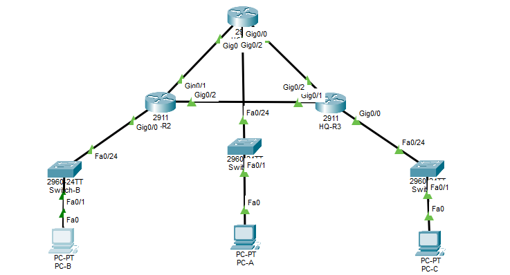

---

### Step 2 — Configure HQ-R1 Interfaces
```
HQ-R1(config)# hostname HQ-R1
HQ-R1(config)# interface GigabitEthernet0/0
HQ-R1(config-if)# ip address 172.16.0.1 255.255.252.0
HQ-R1(config-if)# no shutdown
HQ-R1(config-if)# exit
HQ-R1(config)# interface GigabitEthernet0/1
HQ-R1(config-if)# ip address 172.16.7.97 255.255.255.252
HQ-R1(config-if)# no shutdown
HQ-R1(config-if)# exit
HQ-R1(config)# interface GigabitEthernet0/2
HQ-R1(config-if)# ip address 172.16.7.106 255.255.255.252
HQ-R1(config-if)# no shutdown
HQ-R1(config-if)# end
```
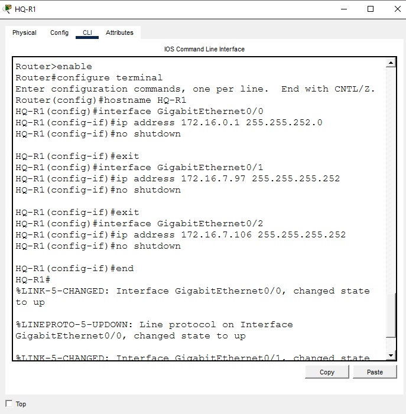

---

### Step 3 — Configure HQ-R2 Interfaces
```
HQ-R2(config)# hostname HQ-R2
HQ-R2(config)# interface GigabitEthernet0/0
HQ-R2(config-if)# ip address 172.16.4.1 255.255.254.0
HQ-R2(config-if)# no shutdown
HQ-R2(config-if)# exit
HQ-R2(config)# interface GigabitEthernet0/1
HQ-R2(config-if)# ip address 172.16.7.98 255.255.255.252
HQ-R2(config-if)# no shutdown
HQ-R2(config-if)# exit
HQ-R2(config)# interface GigabitEthernet0/2
HQ-R2(config-if)# ip address 172.16.7.101 255.255.255.252
HQ-R2(config-if)# no shutdown
HQ-R2(config-if)# end
```
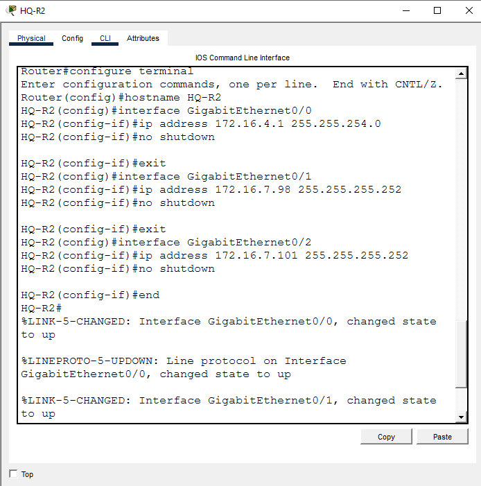

---

### Step 4 — Configure HQ-R3 Interfaces
```
HQ-R3(config)# hostname HQ-R3
HQ-R3(config)# interface GigabitEthernet0/0
HQ-R3(config-if)# ip address 172.16.6.1 255.255.255.0
HQ-R3(config-if)# no shutdown
HQ-R3(config-if)# exit
HQ-R3(config)# interface GigabitEthernet0/1
HQ-R3(config-if)# ip address 172.16.7.102 255.255.255.252
HQ-R3(config-if)# no shutdown
HQ-R3(config-if)# exit
HQ-R3(config)# interface GigabitEthernet0/2
HQ-R3(config-if)# ip address 172.16.7.105 255.255.255.252
HQ-R3(config-if)# no shutdown
HQ-R3(config-if)# end
```
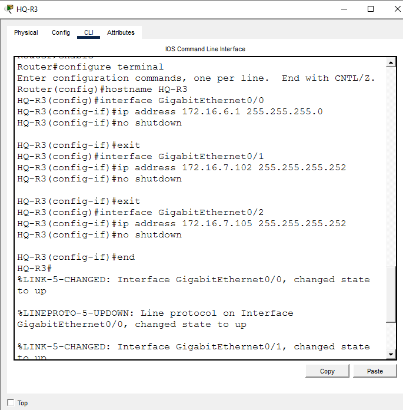

---

### Step 5 — HQ-R1 OSPF Routing
```
HQ-R1(config)# router ospf 10
HQ-R1(config-router)# network 172.16.0.0 0.0.3.255 area 0
HQ-R1(config-router)# network 172.16.7.96 0.0.0.3 area 0
HQ-R1(config-router)# network 172.16.7.104 0.0.0.3 area 0
HQ-R1(config-router)# end
```
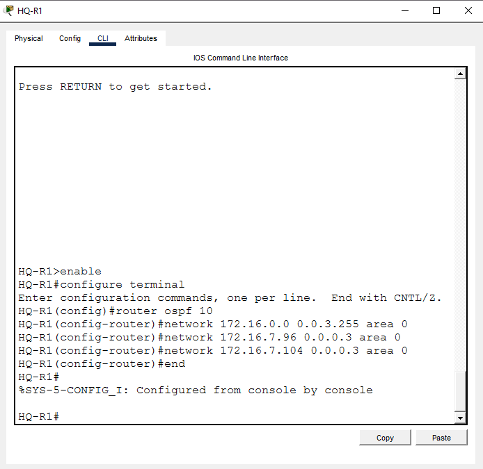

---

### Step 6 — HQ-R2 OSPF Routing
```
HQ-R2(config)# router ospf 10
HQ-R2(config-router)# network 172.16.4.0 0.0.1.255 area 0
HQ-R2(config-router)# network 172.16.7.96 0.0.0.3 area 0
HQ-R2(config-router)# network 172.16.7.100 0.0.0.3 area 0
HQ-R2(config-router)# end
```
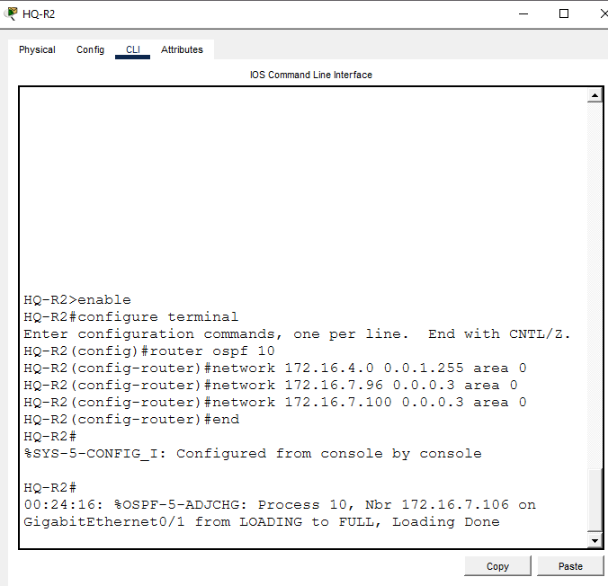

---

### Step 7 — HQ-R3 OSPF Routing
```
HQ-R3(config)# router ospf 10
HQ-R3(config-router)# network 172.16.6.0 0.0.0.255 area 0
HQ-R3(config-router)# network 172.16.7.100 0.0.0.3 area 0
HQ-R3(config-router)# network 172.16.7.104 0.0.0.3 area 0
HQ-R3(config-router)# end
```
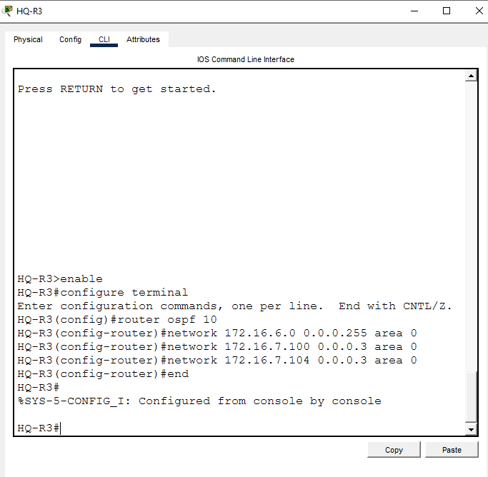

---

### Step 8 — PC-A Static IP Configuration
| Field | Value |
|---|---|
| IP Address | 172.16.0.10 |
| Subnet Mask | 255.255.252.0 |
| Default Gateway | 172.16.0.1 |

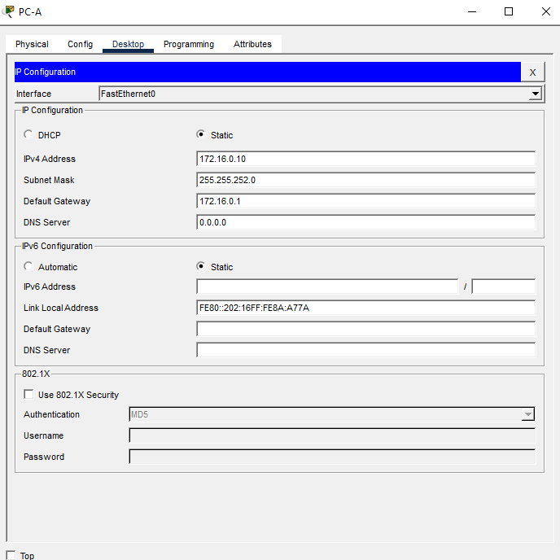

---

### Step 9 — PC-B Static IP Configuration
| Field | Value |
|---|---|
| IP Address | 172.16.4.10 |
| Subnet Mask | 255.255.254.0 |
| Default Gateway | 172.16.4.1 |

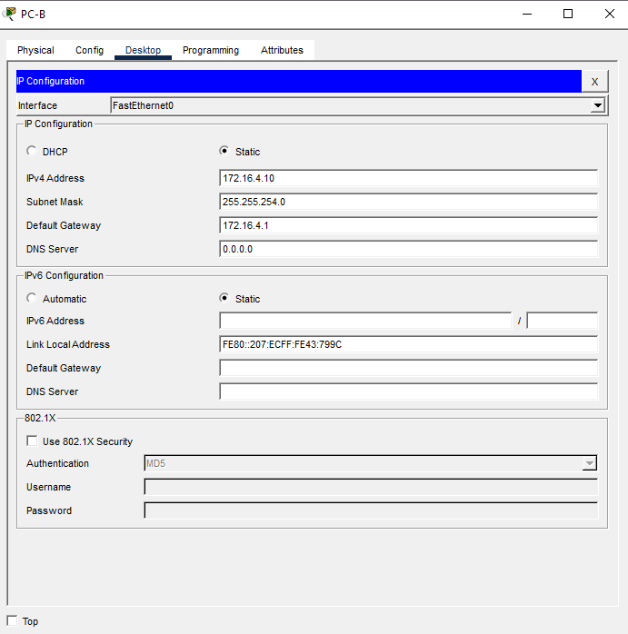

---

### Step 10 — PC-C Static IP Configuration
| Field | Value |
|---|---|
| IP Address | 172.16.6.10 |
| Subnet Mask | 255.255.255.0 |
| Default Gateway | 172.16.6.1 |

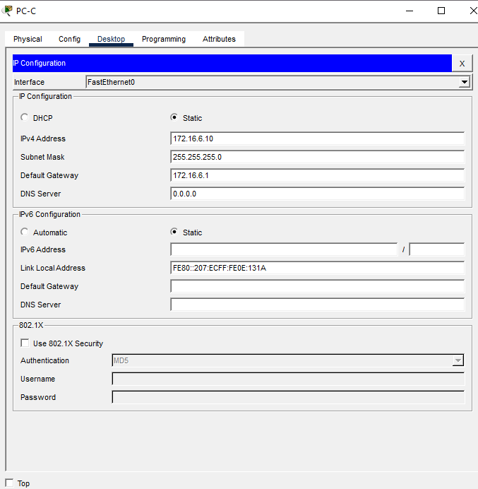

---

### Step 11 — Cross-Campus Verification
```
PC-A> ping 172.16.4.10
PC-A> ping 172.16.6.10
```
> **Gap to close:** this only verifies A→B and A→C. It doesn't confirm B→C reachability. For a complete full-mesh test, also run `PC-B> ping 172.16.6.10`.

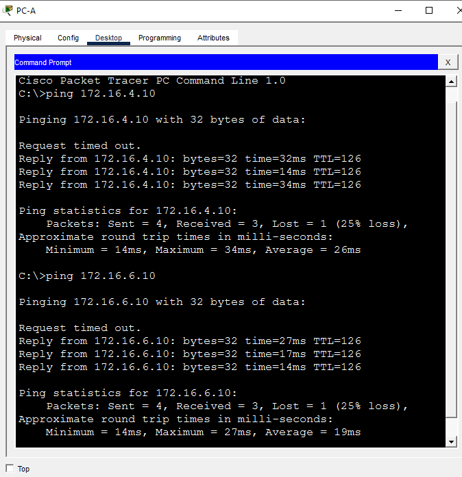

---

### Step 12 — Routing Table Verification
```
HQ-R1# show ip route ospf
HQ-R2# show ip route ospf
HQ-R3# show ip route ospf
```
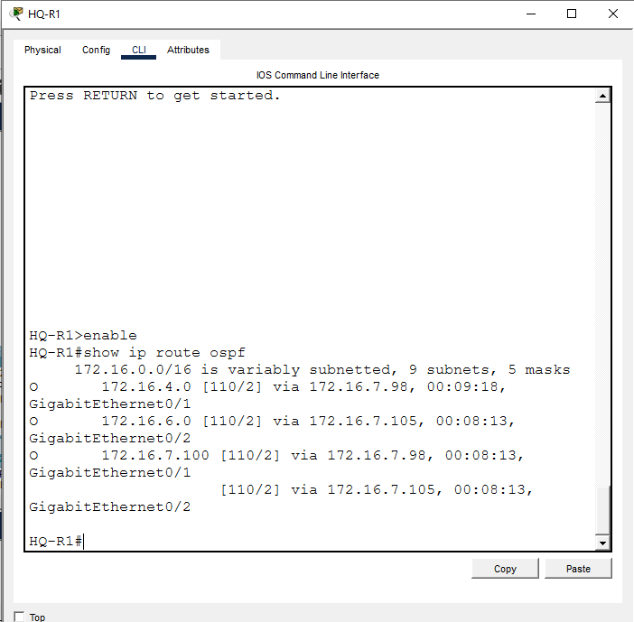

---

### Step 13 — Save Config
```
HQ-R1# copy running-config startup-config
HQ-R2# copy running-config startup-config
HQ-R3# copy running-config startup-config
```
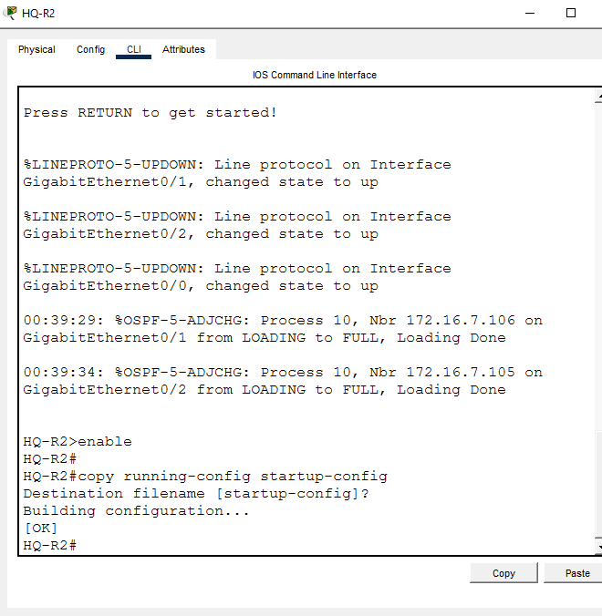

---

## 📟 Summary of Commands
| Command | Purpose |
|---------|---------|
| `ip address <ip> <mask>` | Assign IP to interface |
| `router ospf <process-id>` | Enable OSPF routing process |
| `network <ip> <wildcard> area <id>` | Advertise a network into OSPF area |
| `show ip route ospf` | View OSPF-learned routes |
| `copy running-config startup-config` | Save configuration |

---

## ⚠️ Challenges & How I Solved Them
| Challenge | Solution |
|-----------|----------|
| PC-C was configured with subnet mask 255.255.0.0 (/16) instead of 255.255.255.0 (/24). Pings to PC-C still succeeded, which masked the error at first. | Confirmed the router's default Proxy ARP was answering on PC-C's behalf, which is why connectivity worked despite the wrong mask. Corrected PC-C's mask to 255.255.255.0 and re-verified. |

---

## 🧠 What I Learned
A ping success does not confirm a config is correct — Proxy ARP on the router can mask a wrong subnet mask on an end device. Always check the actual configuration (interface settings, masks) rather than relying only on connectivity test results.

---

## 📁 Files
| File | Description |
|------|-------------|
| `README.md` | Full lab documentation |
| `Lab3_Enterprise_IP_Addressing_VLSM.pkt` | Packet Tracer file |
