# Enterprise Network VLAN & InterVLAN Routing — Troubleshooting (Lab 4)

**Domain:** Networking
**Difficulty:** Intermediate — Advanced
**Tools:** Cisco Packet Tracer

---

## 🎯 Objective
Troubleshoot and repair a pre-built hierarchical enterprise LAN with VLAN switching and router-on-a-stick-style InterVLAN routing — fixing a trunk/native VLAN mismatch, a disabled SVI, and missing default/return routes — until both end-user VLANs have full end-to-end reachability to the edge router.

---

## 🛠️ Tools & Technologies
| Tool | Purpose |
|------|---------|
| Cisco Packet Tracer | Network simulation |
| Router 2911 (HQ-Edge-R1) | Edge gateway, static routing |
| Switch 3560-24PS (Core-SW01) | Inter-VLAN routing (SVIs), core distribution |
| Switch 2960-24TT x2 (Access-SW02, Access-SW03) | Access-layer VLAN switching |
| Static Routing | Default route + explicit return routes |
| 802.1Q Trunking | VLAN tagging between switches |

---

## 🖧 Topology

### Devices
- 1 Router (Cisco 2911) — HQ-Edge-R1
- 1 Core Switch (Cisco 3560-24PS) — Core-SW01
- 2 Access Switches (Cisco 2960-24TT) — Access-SW02, Access-SW03
- 2 PCs — PC0, PC1

### Physical Connections

**PCs to Access Switches:**
| PC | Switch | Port |
|----|--------|------|
| PC0 | Access-SW02 | Fa0/1 |
| PC1 | Access-SW03 | Fa0/1 |

**Access Switches to Core Switch:**
| From | To | Link Type |
|------|----|-----------|
| Access-SW02 Gi0/2 | Core-SW01 Fa0/24 | 802.1Q Trunk |
| Access-SW03 Gi0/1 | Core-SW01 Gi0/1 | 802.1Q Trunk |

**Core Switch to Router:**
| Core-SW01 Port | Router Port | Link |
|-----------------|--------------|------|
| GigabitEthernet0/2 (routed, no switchport) | HQ-Edge-R1 GigabitEthernet0/1 | Point-to-point /30 |

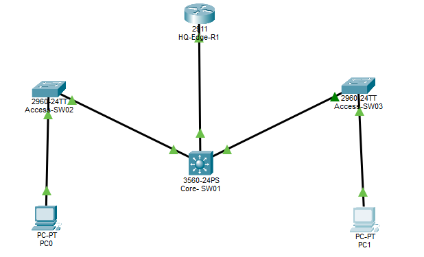

---

## 🗂️ VLAN Design
| VLAN | Name | Network | Gateway (SVI on Core-SW01) |
|------|------|---------|------------------------------|
| VLAN 10 | Engineering | 10.1.10.0/24 | 10.1.10.1 |
| VLAN 20 | Operations | 10.1.20.0/24 | 10.1.20.1 |
| — | Core ↔ Router link | 10.1.99.0/30 | n/a (point-to-point) |

---

## 💻 PC IP Configuration
| PC | VLAN | IP | Mask | Gateway |
|----|------|----|------|---------|
| PC0 | 10 | 10.1.10.10 | 255.255.255.0 | 10.1.10.1 |
| PC1 | 20 | 10.1.20.10 | 255.255.255.0 | 10.1.20.1 |

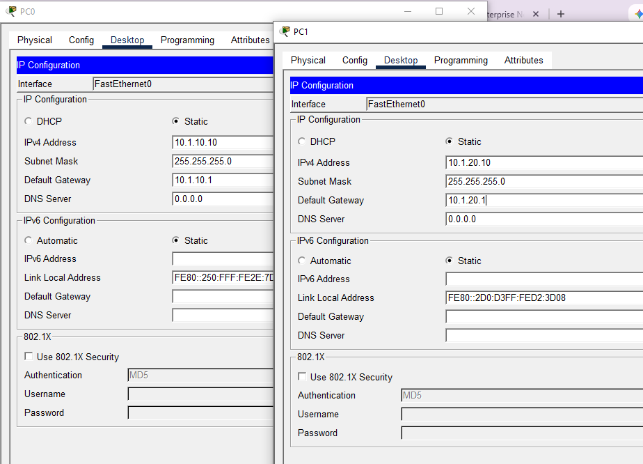

---

## 📋 Steps, Commands & Screenshots

### Step 1 — Build the Topology
Devices placed and cabled per the layout above; no CLI in this step (Packet Tracer GUI wiring only).


---

### Step 2 — Base Configuration of Core-SW01
Created VLANs 10 and 20, configured the routed uplink to the router, and built the VLAN 10/20 SVIs.
```
Switch#configure terminal
Switch(config)#hostname Core-SW01
Core-SW01(config)#vlan 10
Core-SW01(config-vlan)#name Engineering
Core-SW01(config)#vlan 20
Core-SW01(config-vlan)#name Operations
Core-SW01(config)#exit
Core-SW01(config)#ip routing
Core-SW01(config)#interface vlan 10
Core-SW01(config-if)#ip address 10.1.10.1 255.255.255.0
Core-SW01(config-if)#no shutdown
Core-SW01(config)#interface vlan 20
Core-SW01(config-if)#ip address 10.1.20.1 255.255.255.0
Core-SW01(config-if)#no shutdown
Core-SW01(config)#interface GigabitEthernet0/2
Core-SW01(config-if)#no switchport
Core-SW01(config-if)#ip address 10.1.99.2 255.255.255.252
Core-SW01(config-if)#no shutdown
```
> ⚠️ **Bug found here:** the VLAN 10 SVI was initially left as `shutdown` instead of `no shutdown`, which silently disabled PC0's gateway. This was corrected before final verification (see Step 7).

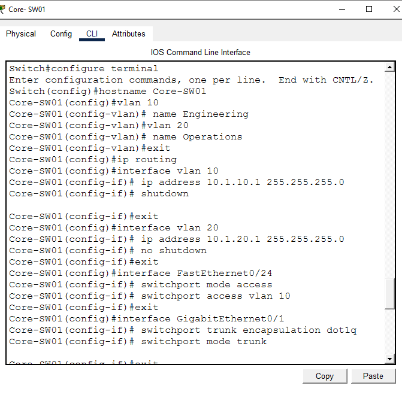

---

### Step 3 — Activating the Edge Router (HQ-Edge-R1)
Brought up the physical gateway link facing Core-SW01.
```
Router>enable
Router#configure terminal
Router(config)#hostname HQ-Edge-R1
HQ-Edge-R1(config)#interface GigabitEthernet0/1
HQ-Edge-R1(config-if)#ip address 10.1.99.1 255.255.255.252
HQ-Edge-R1(config-if)#no shutdown
```
**System response:**
```
%LINK-5-CHANGED: Interface GigabitEthernet0/1, changed state to up
%LINEPROTO-5-UPDOWN: Line protocol on Interface GigabitEthernet0/1, changed state to up
```
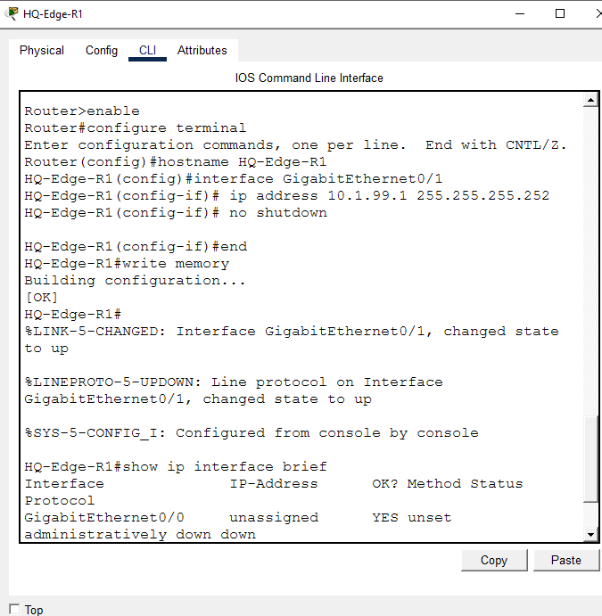

---

### Step 4 — Access Switch Configuration & Trunk Mismatch
Configured Access-SW02 and Access-SW03 with their access ports and uplink trunks.
```
Access-SW02(config)#vlan 10
Access-SW02(config-vlan)#name Engineering
Access-SW02(config)#interface FastEthernet0/1
Access-SW02(config-if)#switchport mode access
Access-SW02(config-if)#switchport access vlan 10
Access-SW02(config)#interface GigabitEthernet0/2
Access-SW02(config-if)#switchport mode trunk
```
The moment Access-SW02's uplink became a trunk, Core-SW01 logged:
```
%CDP-4-NATIVE_VLAN_MISMATCH: Native VLAN mismatch discovered on FastEthernet0/24 (10),
with Switch GigabitEthernet0/2 (1).
```
**Cause:** Core-SW01's Fa0/24 was still in static access mode (VLAN 10) while Access-SW02's Gi0/2 was a trunk — a Layer 2 mode mismatch that blocked PC0's traffic.

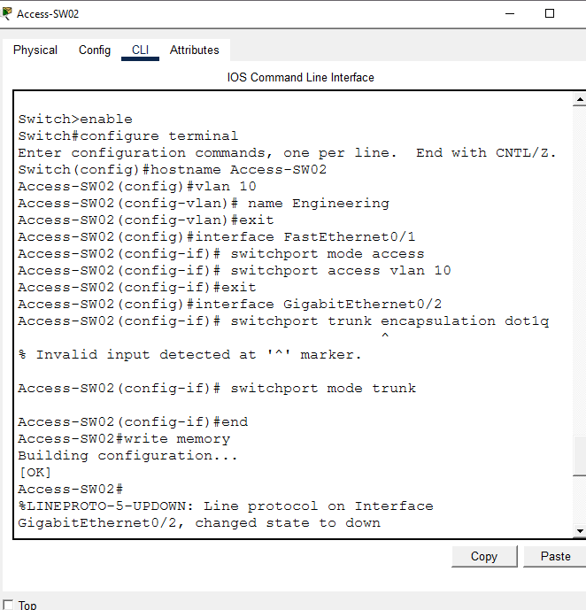
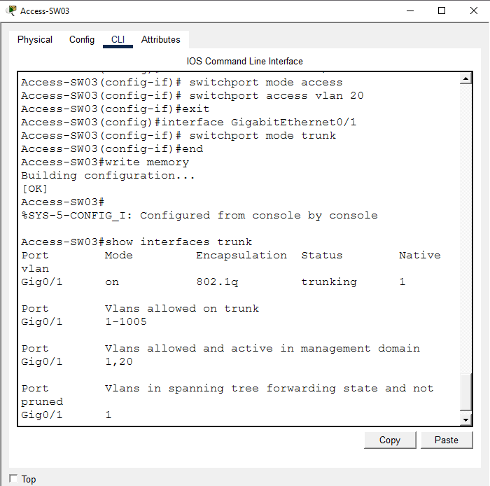

---

### Step 5 — Repairing the Core-SW01 Trunk Mismatch
```
Core-SW01(config)#interface FastEthernet0/24
Core-SW01(config-if)#switchport trunk encapsulation dot1q
Core-SW01(config-if)#switchport mode trunk
Core-SW01(config-if)#end
Core-SW01#write memory
```
Verification after the fix — both uplinks now trunking correctly:
```
Core-SW01#show interfaces trunk
Port      Mode   Encapsulation  Status      Native vlan
Fa0/24    on     802.1q         trunking    1
Gig0/1    on     802.1q         trunking    1
```
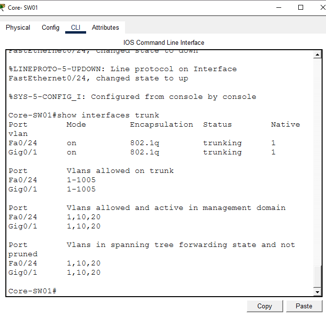

---

### Step 6 — Core-SW01 Default Route (Gateway of Last Resort)
After fixing the trunk, PC0 still couldn't reach beyond its own VLAN. `show ip route` on Core-SW01 showed no default path:
```
Gateway of last resort is not set
```
Fix applied directly on **Core-SW01**:
```
Core-SW01(config)#ip route 0.0.0.0 0.0.0.0 10.1.99.1
```
Confirmed afterward:
```
Core-SW01#show ip route
Gateway of last resort is 10.1.99.1 to network 0.0.0.0
C    10.1.10.0/24 is directly connected, Vlan10
C    10.1.20.0/24 is directly connected, Vlan20
C    10.1.99.0/30 is directly connected, GigabitEthernet0/2
S*   0.0.0.0/0 [1/0] via 10.1.99.1
```
*(Verified live from the saved .pkt file — Core-SW01 CLI.)*

---

### Step 7 — HQ-Edge-R1 Return Routes & VLAN 10 SVI Fix
Two remaining issues blocked end-to-end reachability:

1. **HQ-Edge-R1 had no route back** to either LAN subnet — pings from the LAN reached the router but replies were dropped.
2. **Core-SW01's VLAN 10 SVI was still shut down** (carried over from Step 2), so PC0 had no live gateway even after Layer 2/3 elsewhere was fixed.

Fixes applied:
```
! On HQ-Edge-R1
HQ-Edge-R1(config)#ip route 10.1.10.0 255.255.255.0 10.1.99.2
HQ-Edge-R1(config)#ip route 10.1.20.0 255.255.255.0 10.1.99.2

! On Core-SW01
Core-SW01(config)#interface vlan 10
Core-SW01(config-if)#no shutdown
```
**Before fix** (HQ-Edge-R1, no return routes):
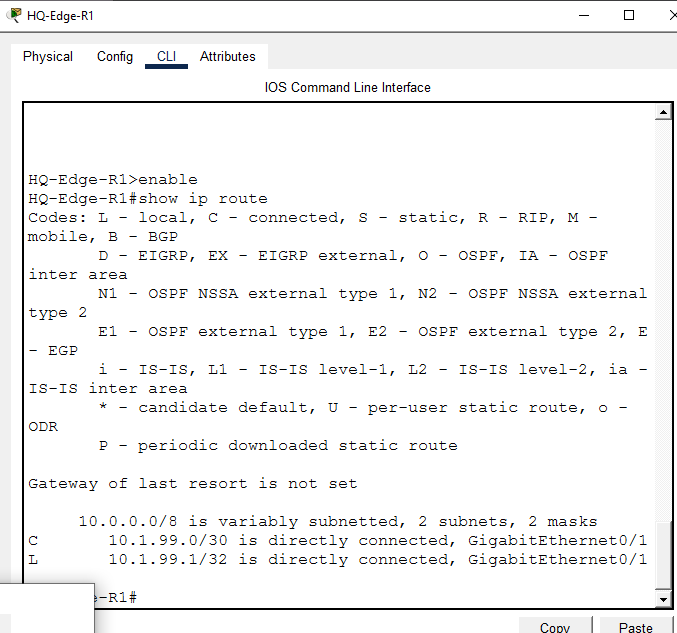

**After fix** (HQ-Edge-R1, return routes added):
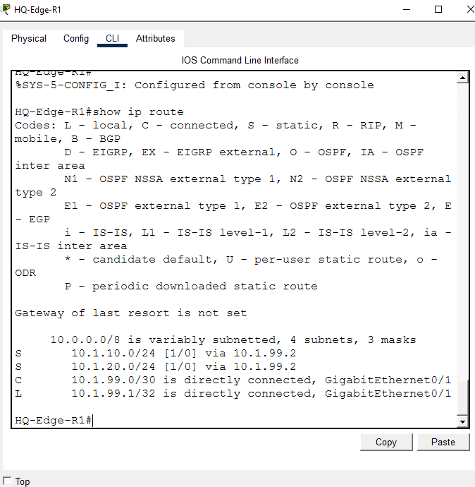

---

### Step 8 — Final Verification
End-to-end pings confirmed full reachability from both PCs to their gateway and to the router:
```
PC0> ping 10.1.10.1        → 0% loss
PC1> ping 10.1.20.1        → 0% loss
PC0> ping 10.1.99.1        → 0% loss (after initial ARP timeout)
PC1> ping 10.1.99.1        → 0% loss
```
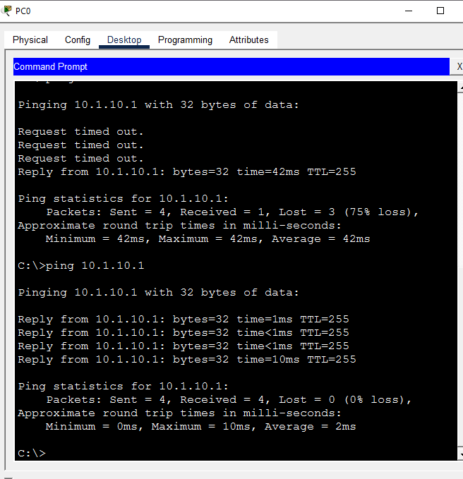
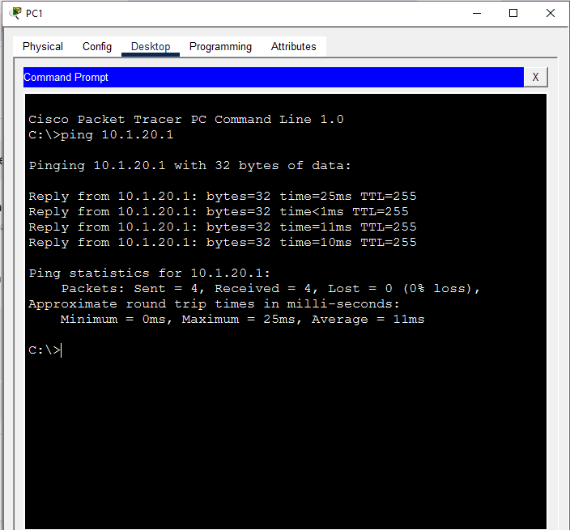
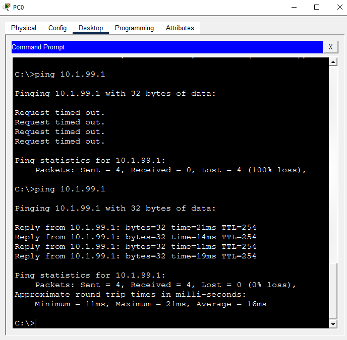
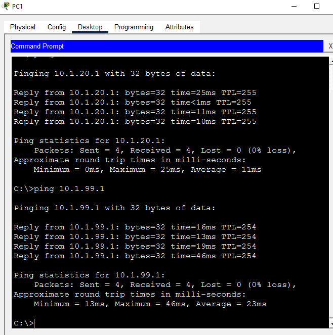

---

## 📟 Summary of Commands
| Command | Purpose |
|---------|---------|
| `vlan 10` / `name Engineering` | Create and name VLAN |
| `interface vlan 10` / `ip address ...` | Create inter-VLAN routing SVI |
| `no shutdown` (on SVI) | Activate the VLAN gateway interface |
| `switchport mode access` / `switchport access vlan` | Assign access port to VLAN |
| `switchport trunk encapsulation dot1q` / `switchport mode trunk` | Configure 802.1Q trunk |
| `no switchport` | Convert a switch port to a routed Layer 3 port |
| `ip route 0.0.0.0 0.0.0.0 <next-hop>` | Set gateway of last resort |
| `ip route <network> <mask> <next-hop>` | Add a specific return/static route |
| `show ip route` | Verify routing table and default route |
| `show interfaces trunk` | Verify trunk status, native VLAN, allowed VLANs |
| `write memory` | Save running-config to startup-config |

---

## ⚠️ Challenges & How They Were Solved
| Challenge | Root Cause | Solution |
|-----------|-----------|----------|
| `NATIVE_VLAN_MISMATCH` error on Core-SW01 | Core-SW01 Fa0/24 was access mode while Access-SW02 Gi0/2 was trunk mode | Set Fa0/24 to `switchport mode trunk` with dot1q encapsulation |
| PC0 couldn't reach beyond local VLAN | No default route on Core-SW01 ("Gateway of last resort is not set") | Added `ip route 0.0.0.0 0.0.0.0 10.1.99.1` on Core-SW01 |
| Ping to router timed out even after Core-SW01 fix | HQ-Edge-R1 had no return route to 10.1.10.0/24 or 10.1.20.0/24 | Added explicit static routes on HQ-Edge-R1 via 10.1.99.2 |
| PC0 still couldn't reach its own gateway | Core-SW01's VLAN 10 SVI was left `shutdown` from initial config | Issued `no shutdown` on `interface vlan 10` |

---

## 🧠 What I Learned
How to isolate and fix a multi-layer enterprise fault chain — a Layer 2 trunk/native VLAN mismatch, a disabled SVI gateway, and a Layer 3 missing default/return route — by reading `show ip route`, `show interfaces trunk`, and CDP error logs in sequence rather than assuming a single root cause.

---

## 📁 Files
| File | Description |
|------|-------------|
| `Enterprise_VLAN_InterVLAN_Routing_Troubleshooting_readme.md` | Full lab documentation |
| `Lab04_Network_Troubleshooting.pkt` | Packet Tracer file |
