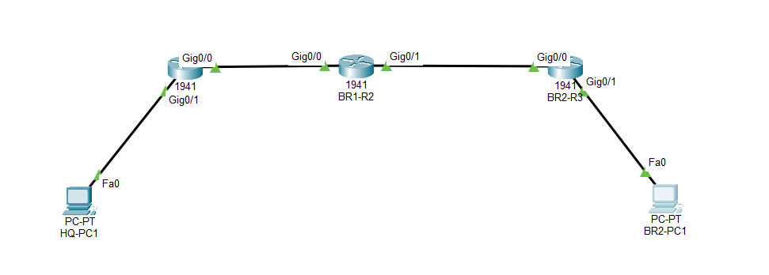
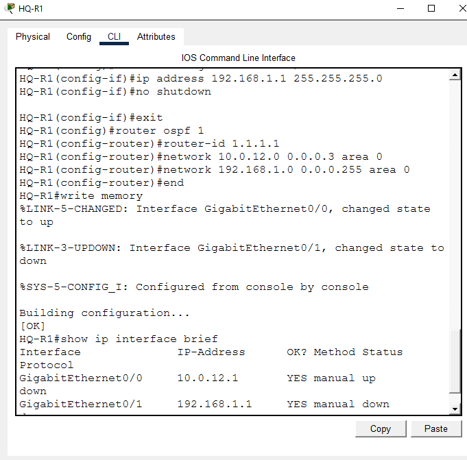
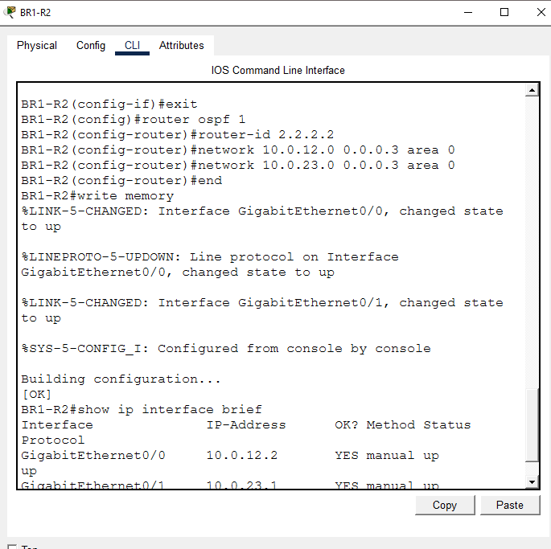
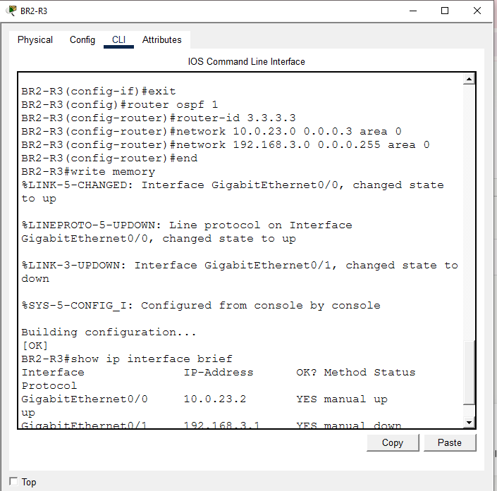
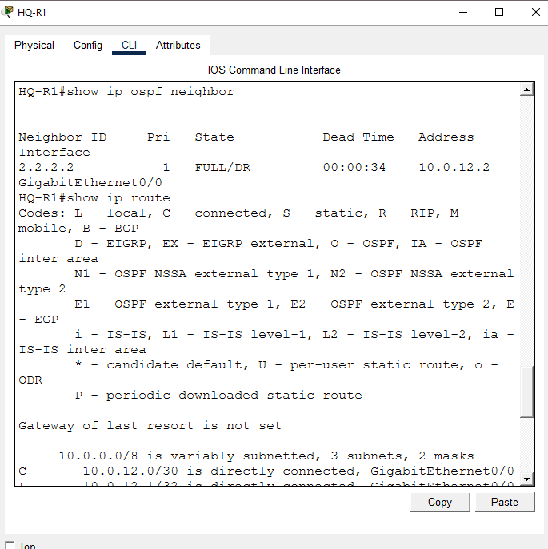
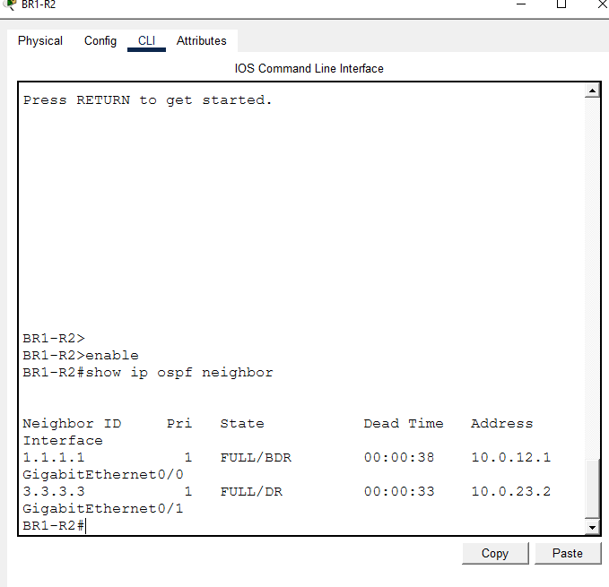
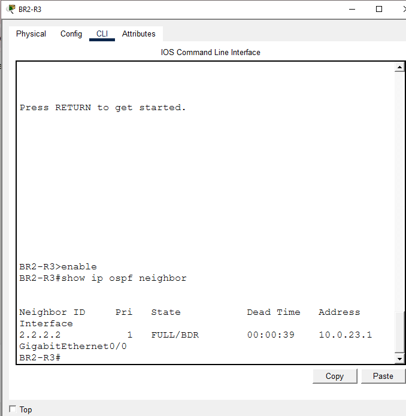
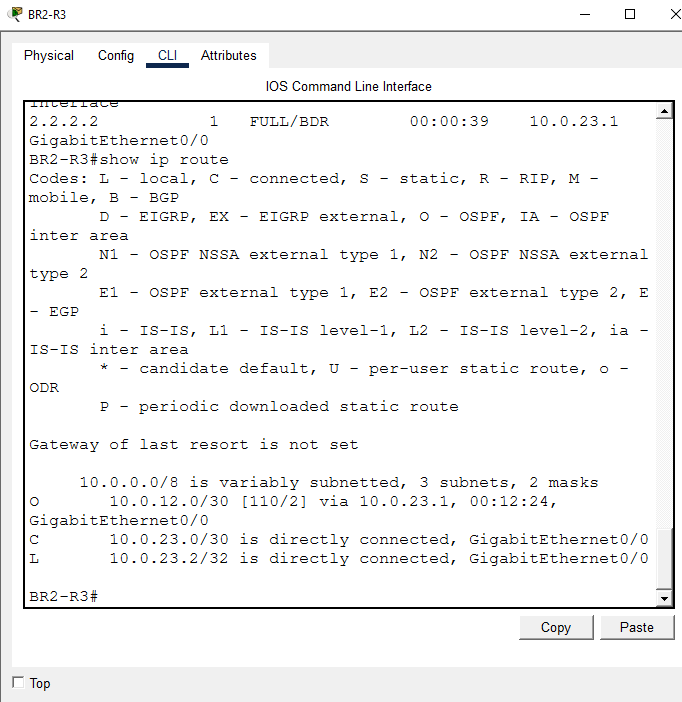
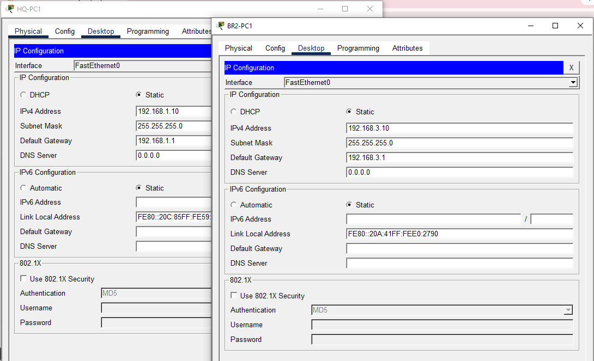
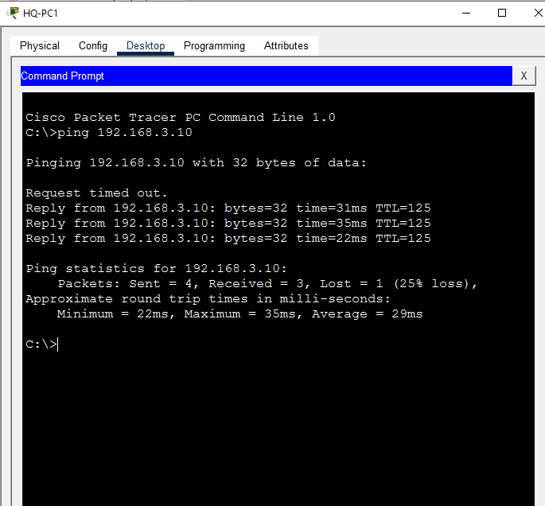

# Enterprise Network OSPF Single Area Routing Lab

**Domain:** Networking
**Difficulty:** Intermediate
**Tools:** Cisco Packet Tracer

---

## 🎯 Objective
Configure OSPF Single Area routing across a three-router enterprise network. Establish neighbor adjacencies, advertise networks, verify route tables, and test end-to-end connectivity between remote LANs.

---

## 🛠️ Tools & Technologies
| Tool | Purpose |
|------|---------|
| Cisco Packet Tracer | Network simulation |
| Router 1941 x3 | OSPF routing, IP addressing |
| OSPF Process 1 | Dynamic routing protocol, Area 0 |
| PC x2 | End-to-end connectivity testing |

---

## 🖧 Topology

### Devices
- 3 Routers (1941)
- 2 PCs

### Physical Connections

**Router to Router:**
| From | Interface | To | Interface | Cable |
|------|-----------|-----|-----------|-------|
| HQ-R1 | Gi0/0 | BR1-R2 | Gi0/0 | Copper Straight-Through |
| BR1-R2 | Gi0/1 | BR2-R3 | Gi0/0 | Copper Straight-Through |

**PCs to Routers:**
| PC | Router | Router Interface | Cable |
|----|--------|-----------------|-------|
| HQ-PC1 | HQ-R1 | Gi0/1 | Copper Straight-Through |
| BR2-PC1 | BR2-R3 | Gi0/1 | Copper Straight-Through |

---

## 🗂️ IP Addressing Table
| Device | Interface | IP Address | Subnet Mask | Purpose |
|--------|-----------|-----------|-------------|---------|
| HQ-R1 | Gi0/0 | 10.0.12.1 | 255.255.255.252 | Link to BR1-R2 |
| HQ-R1 | Gi0/1 | 192.168.1.1 | 255.255.255.0 | HQ LAN Gateway |
| BR1-R2 | Gi0/0 | 10.0.12.2 | 255.255.255.252 | Link to HQ-R1 |
| BR1-R2 | Gi0/1 | 10.0.23.1 | 255.255.255.252 | Link to BR2-R3 |
| BR2-R3 | Gi0/0 | 10.0.23.2 | 255.255.255.252 | Link to BR1-R2 |
| BR2-R3 | Gi0/1 | 192.168.3.1 | 255.255.255.0 | BR2 LAN Gateway |
| HQ-PC1 | NIC | 192.168.1.10 | 255.255.255.0 | HQ LAN Client |
| BR2-PC1 | NIC | 192.168.3.10 | 255.255.255.0 | BR2 LAN Client |

---

## 🔁 OSPF Design
| Parameter | Value |
|-----------|-------|
| Process ID | 1 |
| Area | 0 (Backbone) |
| HQ-R1 Router ID | 1.1.1.1 |
| BR1-R2 Router ID | 2.2.2.2 |
| BR2-R3 Router ID | 3.3.3.3 |

---

## 💻 PC IP Configuration
| PC | IP Address | Subnet Mask | Default Gateway |
|----|-----------|-------------|-----------------|
| HQ-PC1 | 192.168.1.10 | 255.255.255.0 | 192.168.1.1 |
| BR2-PC1 | 192.168.3.10 | 255.255.255.0 | 192.168.3.1 |

---

## 📋 Steps & Screenshots

### Step 1 — Build the Topology
Set up all devices and connect cables exactly as shown above. Arrange routers horizontally left to right: HQ-R1 → BR1-R2 → BR2-R3.
```
No CLI commands in this step — this is a physical/logical wiring step done
in the Packet Tracer GUI (drag devices, connect cables per the tables above).
```


---

### Step 2 — Configure HQ-R1
Assign IP addresses to interfaces and configure OSPF on HQ-R1.
```
enable
configure terminal
hostname HQ-R1
interface GigabitEthernet0/0
ip address 10.0.12.1 255.255.255.252
no shutdown
exit
interface GigabitEthernet0/1
ip address 192.168.1.1 255.255.255.0
no shutdown
exit
router ospf 1
router-id 1.1.1.1
network 10.0.12.0 0.0.0.3 area 0
network 192.168.1.0 0.0.0.255 area 0
end
write memory
```
```
show ip interface brief
```


---

### Step 3 — Configure BR1-R2
Assign IP addresses to interfaces and configure OSPF on BR1-R2.
```
enable
configure terminal
hostname BR1-R2
interface GigabitEthernet0/0
ip address 10.0.12.2 255.255.255.252
no shutdown
exit
interface GigabitEthernet0/1
ip address 10.0.23.1 255.255.255.252
no shutdown
exit
router ospf 1
router-id 2.2.2.2
network 10.0.12.0 0.0.0.3 area 0
network 10.0.23.0 0.0.0.3 area 0
end
write memory
```
```
show ip interface brief
```


---

### Step 4 — Configure BR2-R3
Assign IP addresses to interfaces and configure OSPF on BR2-R3.
```
enable
configure terminal
hostname BR2-R3
interface GigabitEthernet0/0
ip address 10.0.23.2 255.255.255.252
no shutdown
exit
interface GigabitEthernet0/1
ip address 192.168.3.1 255.255.255.0
no shutdown
exit
router ospf 1
router-id 3.3.3.3
network 10.0.23.0 0.0.0.3 area 0
network 192.168.3.0 0.0.0.255 area 0
end
write memory
```
```
show ip interface brief
```


---

### Step 5 — Verify HQ-R1 OSPF Neighbor
Confirm HQ-R1 has formed OSPF adjacency with BR1-R2.
```
show ip ospf neighbor
show ip route
```


---

### Step 6 — Verify BR1-R2 OSPF Neighbors
Confirm BR1-R2 sees both HQ-R1 and BR2-R3 as OSPF neighbors.
```
show ip ospf neighbor
```


---

### Step 7 — Verify BR2-R3 OSPF Neighbor
Confirm BR2-R3 has formed OSPF adjacency with BR1-R2.
```
show ip ospf neighbor
```


---

### Step 8 — Verify BR2-R3 Route Table
Confirm BR2-R3 has learned HQ-R1 networks via OSPF.
```
show ip route
```


---

### Step 9 — Add PCs and Configure IPs
Add HQ-PC1 to HQ-R1 Gi0/1 and BR2-PC1 to BR2-R3 Gi0/1. Assign static IPs as per the PC IP Configuration table above.
```
No CLI commands — configure IPs via PC Desktop > IP Configuration in Packet Tracer GUI.
```


---

### Step 10 — End-to-End Ping Test
Test connectivity from HQ-PC1 to BR2-PC1 across the full OSPF network.
```
ping 192.168.3.10
```


---

## 📟 Summary of Commands
| Command | Purpose |
|---------|---------|
| `router ospf 1` | Start OSPF process with ID 1 |
| `router-id 1.1.1.1` | Manually assign Router ID |
| `network x.x.x.x x.x.x.x area 0` | Advertise network into OSPF Area 0 |
| `no shutdown` | Activate interface |
| `show ip ospf neighbor` | Verify OSPF adjacency state |
| `show ip route` | Verify learned OSPF routes |
| `show ip interface brief` | Check interface status and IPs |
| `write memory` | Save configuration |
| `ping x.x.x.x` | Test end-to-end connectivity |

---

## ⚠️ Challenges & How I Solved Them
| Challenge | Solution |
|-----------|----------|
| Gi0/0 showing up/down on HQ-R1 | Normal — BR1-R2 was not yet configured. Resolved after BR1-R2 configuration |
| OSPF neighbor not forming | Verified network statements and wildcard masks matched exactly on both ends |
| Route table missing remote LAN networks | LAN interfaces were down/down due to no PC connected — resolved after adding PCs |
| Ping failing between PCs | Verified default gateway was correctly set on both PCs |

---

## 🧠 What I Learned
How to configure OSPF Single Area routing across a multi-router enterprise network, assign Router IDs manually, advertise networks using wildcard masks, verify neighbor adjacency states (FULL/DR and FULL/BDR), read and interpret OSPF route tables, and test end-to-end connectivity between remote LANs — all in one lab.

---

## 📁 Files
| File | Description |
|------|-------------|
| `enterprise_network_ospf_single_area_routing_lab/README.md | Full lab documentation |
| `Lab-8_ospf_single_area.pkt` | Packet Tracer file |


