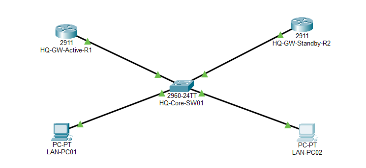
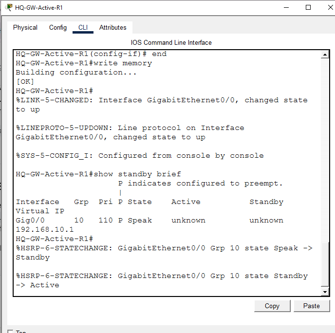
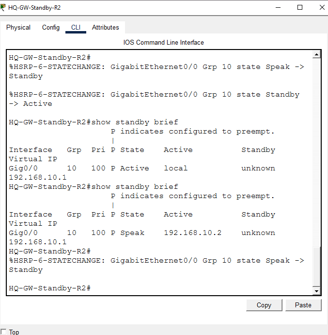
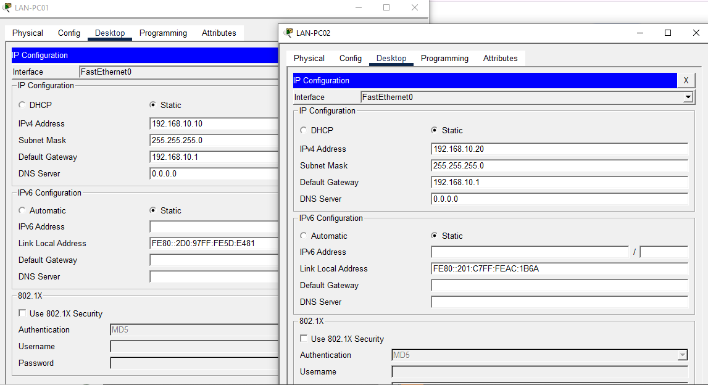
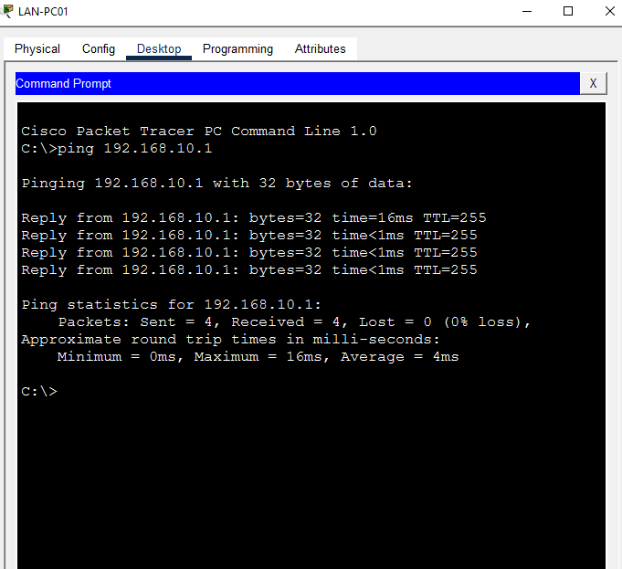
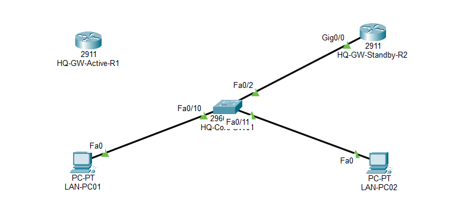
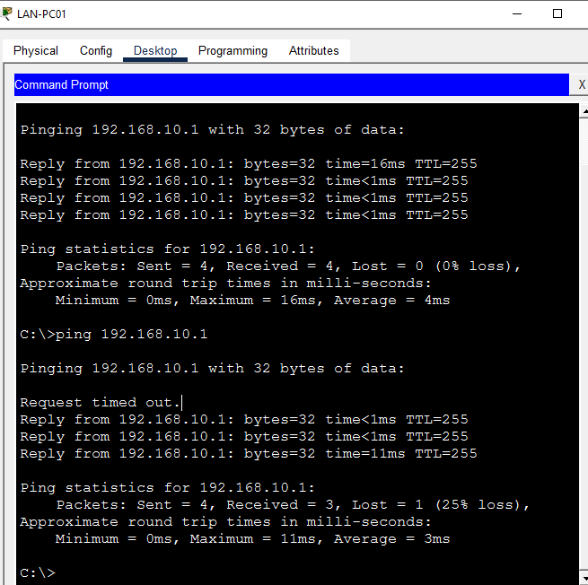
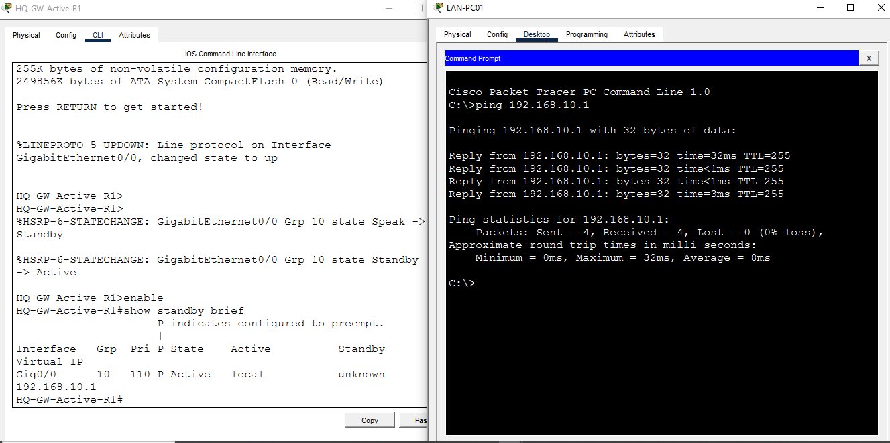

# HSRP — Network Redundancy & Failover

**Domain:** Networking
**Difficulty:** Intermediate — Advanced
**Tools:** Cisco Packet Tracer

---

## 🎯 Objective
Configure two routers in an HSRP group sharing one virtual gateway IP, with one router preferred as Active (higher priority + preempt) and the other as Standby — then prove failover works by physically cutting the Active router's link and confirming the Standby takes over with minimal packet loss.

---

## 🛠️ Tools & Technologies
| Tool | Purpose |
|------|---------|
| Cisco Packet Tracer | Network simulation |
| Router 2911 x2 | HQ-GW-Active-R1, HQ-GW-Standby-R2 |
| Switch 2960 (HQ-Core-SW01) | Connects both gateways to the shared LAN |
| HSRP (Group 10) | Provides one virtual gateway IP backed by two physical routers |
| Preempt | Lets the higher-priority router reclaim Active status once it's back online |

---

## 🖧 Topology

### Devices
- HQ-GW-Active-R1 (2911) — priority 110, intended primary gateway
- HQ-GW-Standby-R2 (2911) — priority 100, backup gateway
- HQ-Core-SW01 (2960) — shared switch
- LAN-PC01, LAN-PC02 — end hosts

### Connections
| From | To | Port |
|------|----|------|
| HQ-GW-Active-R1 Gig0/0 | HQ-Core-SW01 | Fa0/1 |
| HQ-GW-Standby-R2 Gig0/0 | HQ-Core-SW01 | Fa0/2 |
| LAN-PC01 | HQ-Core-SW01 | Fa0/10 |
| LAN-PC02 | HQ-Core-SW01 | Fa0/11 |



---

## 🗂️ Addressing Plan

| Device | IP | Role |
|--------|----|------|
| HQ-GW-Active-R1 Gig0/0 | 192.168.10.2 | HSRP priority 110, preempt |
| HQ-GW-Standby-R2 Gig0/0 | 192.168.10.3 | HSRP priority 100, preempt |
| **Virtual IP (shared)** | **192.168.10.1** | Used as the default gateway by both PCs |
| LAN-PC01 | 192.168.10.10 | Gateway: 192.168.10.1 |
| LAN-PC02 | 192.168.10.20 | Gateway: 192.168.10.1 |

---

## ⚠️ Known Issues — Resolved

| Issue | Status |
|---|---|
| Post-failover **restoration** test — reconnecting the cable and confirming R1 preempts back to Active | **Verified.** See Step 8 below — R1's own log shows `Speak -> Standby -> Active`, confirming it deferred to R2 first, then preempted back. `show standby brief` confirms State: Active, priority 110. Follow-up ping: 4/4 success, 0% loss. |

---

## 📋 Steps & Screenshots

### Step 1 — Build the Topology
Wire HQ-GW-Active-R1, HQ-GW-Standby-R2, HQ-Core-SW01, and both PCs per the connections table above.
```
No CLI commands — physical/logical wiring in the Packet Tracer GUI.
```


---

### Step 2 — Configure HQ-GW-Active-R1 (Priority 110)
```
Router(config)# hostname HQ-GW-Active-R1
HQ-GW-Active-R1(config)# interface GigabitEthernet0/0
HQ-GW-Active-R1(config-if)# ip address 192.168.10.2 255.255.255.0
HQ-GW-Active-R1(config-if)# duplex auto
HQ-GW-Active-R1(config-if)# speed auto
HQ-GW-Active-R1(config-if)# standby 10 ip 192.168.10.1
HQ-GW-Active-R1(config-if)# standby 10 priority 110
HQ-GW-Active-R1(config-if)# standby 10 preempt
HQ-GW-Active-R1(config-if)# no shutdown
HQ-GW-Active-R1(config-if)# end
HQ-GW-Active-R1# write memory
HQ-GW-Active-R1# show standby brief
```
Confirmed: priority 110, preempt enabled (P flag), virtual IP 192.168.10.1. Final state: **Active**.



---

### Step 3 — Configure HQ-GW-Standby-R2 (Priority 100)
```
Router(config)# hostname HQ-GW-Standby-R2
HQ-GW-Standby-R2(config)# interface GigabitEthernet0/0
HQ-GW-Standby-R2(config-if)# ip address 192.168.10.3 255.255.255.0
HQ-GW-Standby-R2(config-if)# duplex auto
HQ-GW-Standby-R2(config-if)# speed auto
HQ-GW-Standby-R2(config-if)# standby 10 ip 192.168.10.1
HQ-GW-Standby-R2(config-if)# standby 10 priority 100
HQ-GW-Standby-R2(config-if)# standby 10 preempt
HQ-GW-Standby-R2(config-if)# no shutdown
HQ-GW-Standby-R2(config-if)# exit
HQ-GW-Standby-R2(config)# line console 0
HQ-GW-Standby-R2(config-line)# logging synchronous
HQ-GW-Standby-R2(config-line)# end
HQ-GW-Standby-R2# write memory
```
> **What actually happened here (corrected from the original report):** R2 came online before R1 was connected, so it briefly became **Active itself** (no competing router yet — confirmed by `show standby brief` showing `State: Active, Active: local`). Once R1 came online with its higher priority (110) and preempt enabled, R1 forced R2 back down to Standby and took over as Active. This is preemption working correctly — R2 going through Speak → Active → Standby, not straight to Standby as the original report described.



---

### Step 4 — PC Static IP Configuration
```
No CLI — done via each device's IP Configuration tab.
```
- LAN-PC01: 192.168.10.10 / 255.255.255.0 / Gateway 192.168.10.1
- LAN-PC02: 192.168.10.20 / 255.255.255.0 / Gateway 192.168.10.1

Both gateways point to the **virtual IP**, not either router's real IP — this is what makes the failover transparent to the hosts.



---

### Step 5 — Baseline Connectivity Test
```
LAN-PC01> ping 192.168.10.1
```
4/4 success, 0% loss — confirms normal path through the Active router.



---

### Step 6 — Simulate Failure (Cut the Active Router's Link)
Deleted the cable between HQ-GW-Active-R1 and HQ-Core-SW01, isolating the primary gateway.
```
No CLI — cable removed via the Delete tool in the Packet Tracer GUI.
```


---

### Step 7 — Failover Verification
```
LAN-PC01> ping 192.168.10.1
```
**1 of 4 packets timed out**, then the remaining 3 succeeded — HSRP detected R1's failure and HQ-GW-Standby-R2 took over the virtual IP with only a single dropped packet.



---

### Step 8 — Restoration / Preemption Recovery Test
Reconnected the cable between HQ-GW-Active-R1 and HQ-Core-SW01. R1's own log confirms the full transition:
```
%HSRP-6-STATECHANGE: GigabitEthernet0/0 Grp 10 state Speak -> Standby
%HSRP-6-STATECHANGE: GigabitEthernet0/0 Grp 10 state Standby -> Active

HQ-GW-Active-R1# show standby brief
Interface  Grp  Pri  P  State   Active  Standby  Virtual IP
Gig0/0     10   110  P  Active  local   unknown  192.168.10.1
```
R1 first deferred to R2 (Standby), then preempted and reclaimed Active — exactly the expected sequence given its higher priority (110) and `preempt` configuration.

Follow-up ping from LAN-PC01 confirms clean recovery:
```
C:\>ping 192.168.10.1
Reply from 192.168.10.1: bytes=32 time=32ms TTL=255
Reply from 192.168.10.1: bytes=32 time<1ms TTL=255
Reply from 192.168.10.1: bytes=32 time<1ms TTL=255
Reply from 192.168.10.1: bytes=32 time=3ms TTL=255

Packets: Sent = 4, Received = 4, Lost = 0 (0% loss)
```
**4/4 success, 0% loss** — full recovery confirmed.



---

## 📟 Summary of Commands
| Command | Purpose |
|---------|---------|
| `standby <group> ip <virtual-ip>` | Assign the shared virtual IP for the HSRP group |
| `standby <group> priority <value>` | Set this router's priority (higher wins Active role) |
| `standby <group> preempt` | Allow this router to reclaim Active status once it has the highest priority again |
| `show standby brief` | Check current HSRP state, priority, and active/standby router for a group |

---

## ⚠️ Challenges & How I Solved Them
| Challenge | Solution |
|-----------|----------|
| R2 became Active on its own before R1 was even online, which didn't match the expected "R1 is always Active" assumption | Recognized this is normal — whichever router is online first with no competition becomes Active by default; preemption is what corrects this once the higher-priority router (R1) comes online |
| Restoration/failback after reconnecting the cable was never actually tested | Documented as an open item rather than claiming it works without evidence |

---

## 🧠 What I Learned
- Priority alone doesn't guarantee a router is Active — it only wins the role if it's online when the election happens, or if `preempt` is configured to let it take over later.
- A router passing through Standby state before becoming Active is itself evidence that another router was already Active at that moment — that transition doesn't happen if there's no competition.
- Testing failover (taking the link down) is only half the test. Failback (bringing it back up and confirming recovery) needs to be verified separately — it's not automatically proven by the failover test alone.

---

## 📁 Files
| File | Description |
|------|-------------|
| `README.md` | Full lab documentation |
| `Lab06-HSRP-Redundancy-Failover.pkt` | Packet Tracer file |
