# Multi-Area OSPF Routing Lab

**Domain:** Networking
**Difficulty:** Intermediate — Advanced
**Tools:** Cisco Packet Tracer

---

## 🎯 Objective
Build and verify a 3-router multi-area OSPF network, with one router acting as the Area Border Router (ABR) connecting Area 1, the backbone (Area 0), and Area 2. Confirm OSPF neighbor adjacency, inter-area route propagation, and end-to-end connectivity across areas.

---

## 🛠️ Tools & Technologies
| Tool | Purpose |
|------|---------|
| Cisco Packet Tracer | Network simulation |
| Router 2911 x3 | OSPF routing, area border function |
| Switch 2960-24TT x3 | LAN connectivity per area |
| OSPF (Single Process) | Dynamic inter-area routing |

---

## 🖧 Topology

### Devices
- Router0, Router1, Router2 (Cisco 2911)
- Switch0, Switch1, Switch2 (Cisco 2960-24TT)
- PC0, PC1, PC2, PC3, PC4, PC5

### Connections
| From | To | Port/Link |
|------|----|-----------|
| Router0 | Router1 | Gig0/0 ↔ Gig0/0 |
| Router1 | Router2 | Gig0/1 ↔ Gig0/2 |
| Router0 | Switch0 | Gig0/1 → Fa0/1 |
| Router1 | Switch1 | Gig0/2 → Fa0/1 |
| Router2 | Switch2 | Gig0/1 → Fa0/1 |
| Switch0 | PC3, PC0 | Fa0/2, Fa0/3 |
| Switch1 | PC1, PC4 | Fa0/2, Fa0/3 |
| Switch2 | PC5, PC2 | Fa0/2, Fa0/3 |

---

## 🗂️ IP Addressing Plan / OSPF Area Design

| Device | Interface | IP Address | Area |
|--------|-----------|------------|------|
| Router0 | Gig0/0 (to Router1) | 1.1.1.1/24 | 1 |
| Router0 | Gig0/1 (to Switch0) | 10.1.1.1/24 | 1 |
| Router1 | Gig0/0 (to Router0) | 1.1.1.2/24 | 1 |
| Router1 | Gig0/1 (to Router2) | 2.1.1.1/24 | 0 |
| Router1 | Gig0/2 (to Switch1) | 20.1.1.1/24 | 0 |
| Router2 | Gig0/2 (to Router1) | 2.1.1.2/24 | 0 |
| Router2 | Gig0/1 (to Switch2) | 30.1.1.1/24 | 2 |

**Router1 is the ABR** — it is the only router with interfaces in two different areas (Area 1 and Area 0). Router0 sits entirely in Area 1. Router2 sits entirely in Area 2, connected to the backbone via Area 0.

| PC | IP Address | Subnet Mask | Default Gateway |
|----|------------|--------------|------------------|
| PC3 | 10.1.1.2 | 255.255.255.0 | 10.1.1.1 |
| PC0 | 10.1.1.3 | 255.255.255.0 | 10.1.1.1 |
| PC1 | 20.1.1.2 | 255.255.255.0 | 20.1.1.1 |
| PC4 | 20.1.1.3 | 255.255.255.0 | 20.1.1.1 |
| PC5 | 30.1.1.2 | 255.255.255.0 | 30.1.1.1 |
| PC2 | 30.1.1.3 | 255.255.255.0 | 30.1.1.1 |

---

## 📋 Steps & Screenshots

### Step 1 — Build Topology
3 routers, 3 switches, 6 PCs wired and arranged per the connections table above.
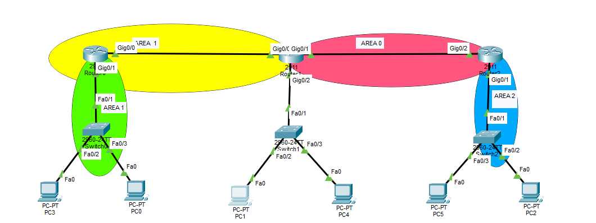

### Step 2 — Configure Router0 (Area 1)
```
interface GigabitEthernet0/0
ip address 1.1.1.1 255.255.255.0
no shutdown
exit
interface GigabitEthernet0/1
ip address 10.1.1.1 255.255.255.0
no shutdown
exit
router ospf 1
network 1.1.1.0 0.0.0.255 area 1
network 10.1.1.0 0.0.0.255 area 1
```
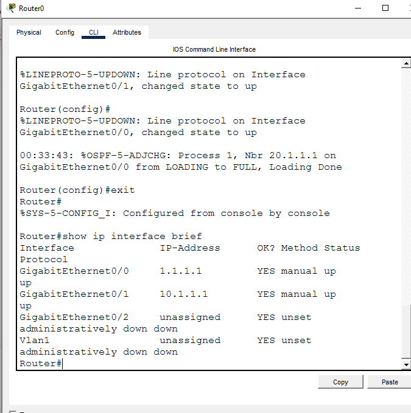
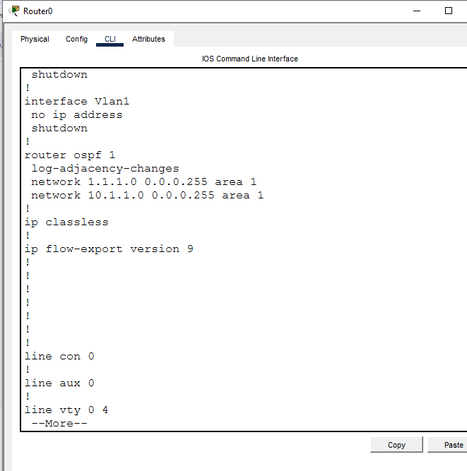

### Step 3 — Configure Router1 (ABR — Area 1 and Area 0)
```
interface GigabitEthernet0/0
ip address 1.1.1.2 255.255.255.0
no shutdown
exit
interface GigabitEthernet0/1
ip address 2.1.1.1 255.255.255.0
no shutdown
exit
interface GigabitEthernet0/2
ip address 20.1.1.1 255.255.255.0
no shutdown
exit
router ospf 1
network 1.1.1.0 0.0.0.255 area 1
network 2.1.1.0 0.0.0.255 area 0
network 20.1.1.0 0.0.0.255 area 0
```
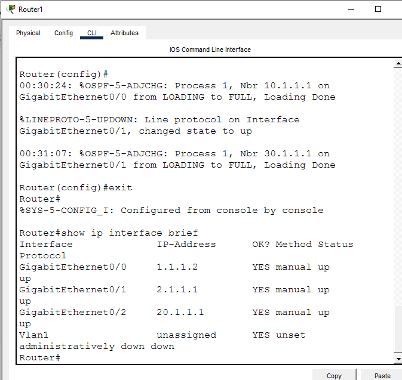
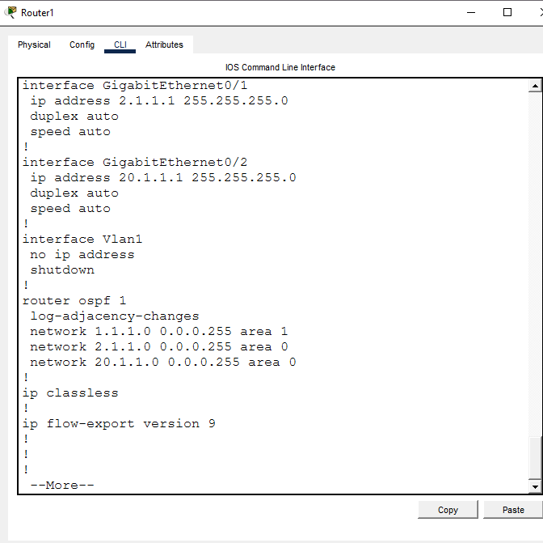

### Step 4 — Configure Router2 (Area 0 and Area 2)
```
interface GigabitEthernet0/2
ip address 2.1.1.2 255.255.255.0
no shutdown
exit
interface GigabitEthernet0/1
ip address 30.1.1.1 255.255.255.0
no shutdown
exit
router ospf 1
network 2.1.1.0 0.0.0.255 area 0
network 30.1.1.0 0.0.0.255 area 2
```
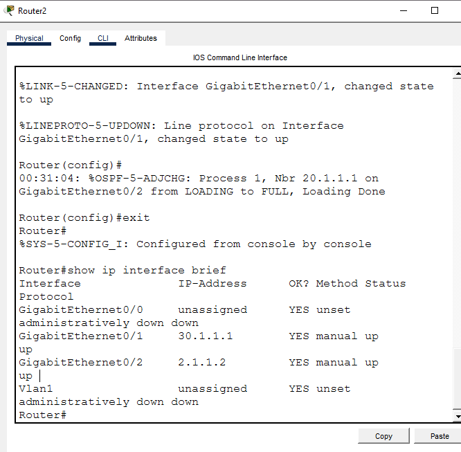
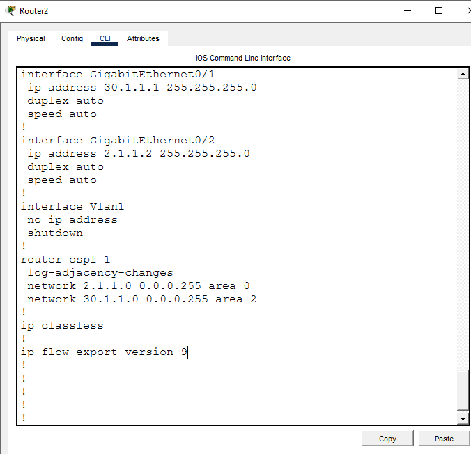

### Step 5 — Verify OSPF Neighbor Adjacency
```
show ip ospf neighbor
```
**Router0:**
```
Neighbor ID     Pri   State      Address     Interface
20.1.1.1        1     FULL/DR    1.1.1.2     GigabitEthernet0/0
```
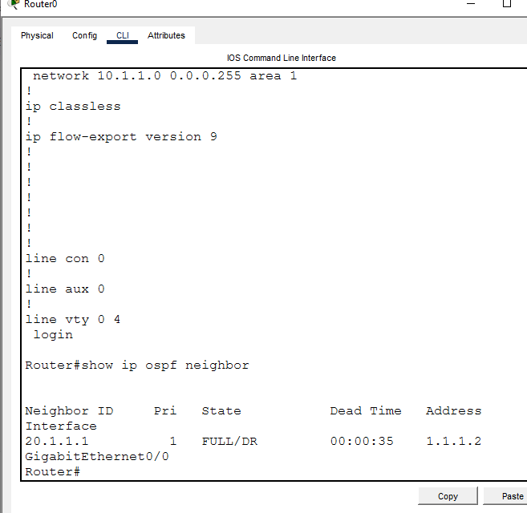

**Router1:**
```
Neighbor ID     Pri   State        Address       Interface
10.1.1.1        1     FULL/BDR     1.1.1.1       GigabitEthernet0/0
30.1.1.1        1     FULL/DR      2.1.1.2       GigabitEthernet0/1
```
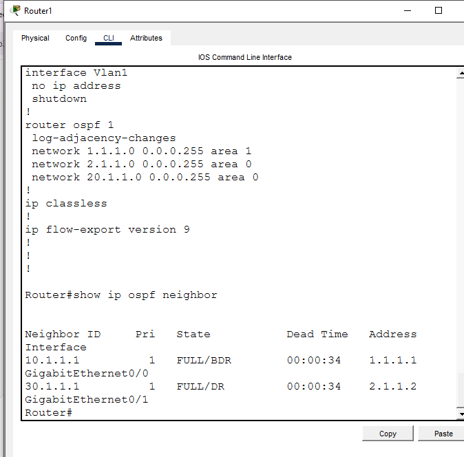

**Router2:**
```
Neighbor ID     Pri   State        Address       Interface
20.1.1.1        1     FULL/BDR     2.1.1.1       GigabitEthernet0/2
```
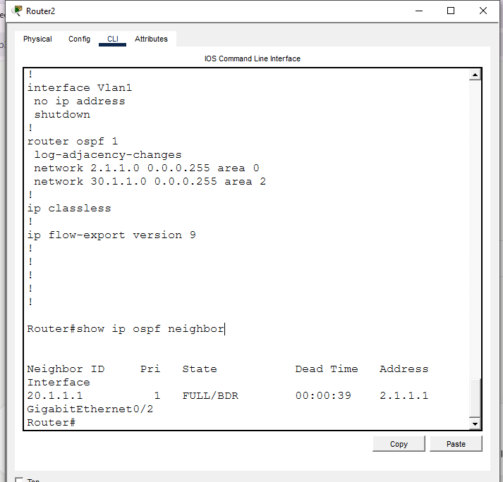

All three routers show **FULL** state — confirms OSPF adjacency formed correctly across all links, not just Hello packets being exchanged.

### Step 6 — Verify Route Tables (Inter-Area Routes)
```
show ip route
```
**Router0** — learns Area 0 and Area 2 networks as inter-area (O IA):
```
O IA  2.1.1.0/24   [110/2] via 1.1.1.2
O IA  20.1.1.0/24  [110/2] via 1.1.1.2
O IA  30.1.1.0/24  [110/3] via 1.1.1.2
```
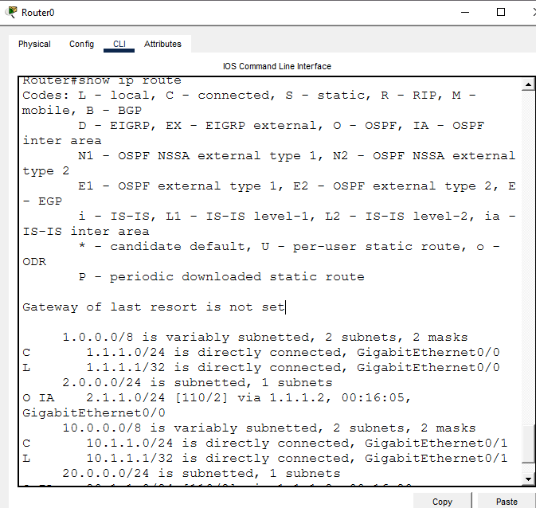

**Router1 (ABR)** — same-area route to Router0's LAN shows as plain O; Area 2 route shows as O IA:
```
O     10.1.1.0/24  [110/2] via 1.1.1.1
O IA  30.1.1.0/24  [110/2] via 2.1.1.2
```
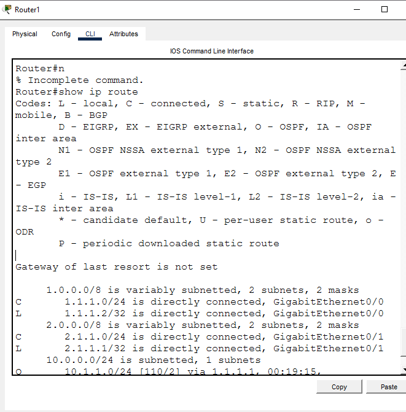

**Router2** — learns Area 1 and Router1's LAN as inter-area:
```
O IA  1.1.1.0/24   [110/2] via 2.1.1.1
O IA  10.1.1.0/24  [110/3] via 2.1.1.1
O     20.1.1.0/24  [110/2] via 2.1.1.1
```
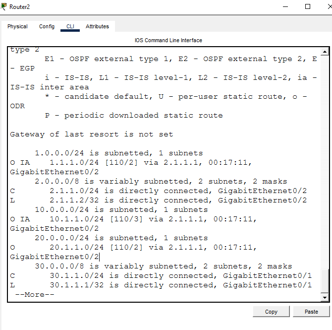

The mix of plain **O** (same-area) and **O IA** (inter-area) tags across the three tables confirms the area boundaries are working exactly as designed — not just that routes exist, but that OSPF is correctly distinguishing intra-area vs inter-area paths.

### Step 7 — PC IP Configuration
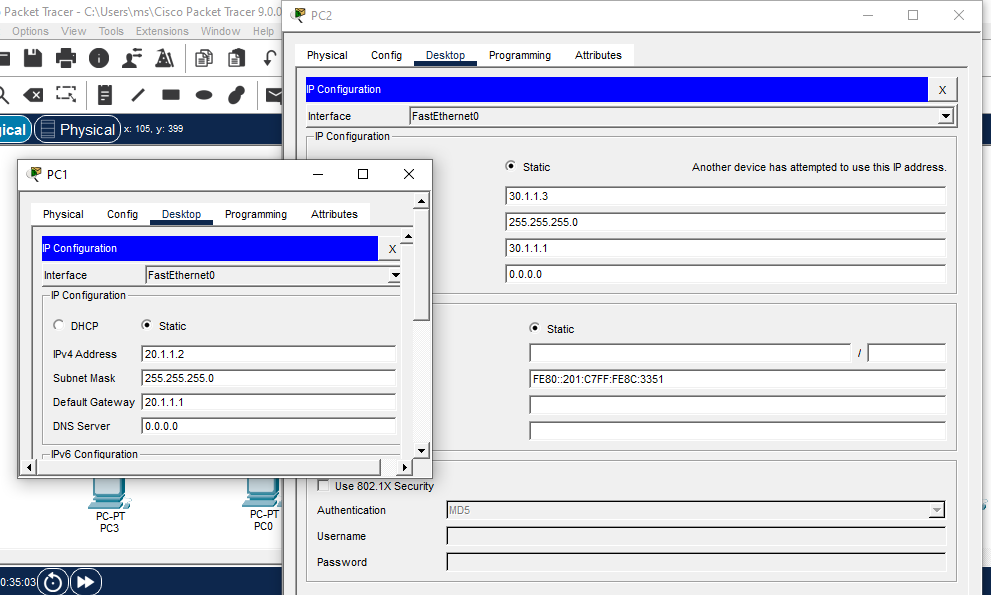

### Step 8 — Cross-Area Ping Test
```
PC0> ping 30.1.1.3
```
PC0 (Area 1) successfully reaches PC2 (Area 2) — full round trip through Router0 → Router1 (ABR) → Router2:
```
Packets: Sent = 4, Received = 4, Lost = 0 (0% loss)
Packets: Sent = 4, Received = 4, Lost = 0 (0% loss)
```
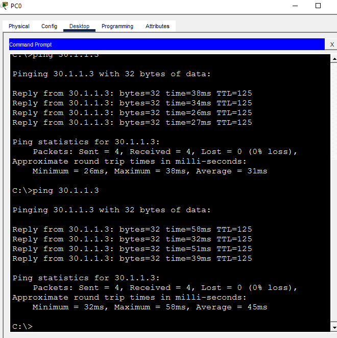

---

## 📟 Summary of Commands
| Command | Purpose |
|---------|---------|
| `router ospf 1` | Start OSPF process |
| `network <net> <wildcard> area <id>` | Assign network to OSPF area |
| `show ip ospf neighbor` | Verify adjacency state |
| `show ip route` | Verify route propagation and area tags (O / O IA) |
| `show ip interface brief` | Verify interface IPs and up/up status |
| `ping` | End-to-end connectivity test |

---

## ⚠️ Challenges & How I Solved Them
| Challenge | Solution |
|-----------|----------|
| Original topology diagram left Router1's downlink network ambiguous between Area 1 and Area 0 | Decided explicitly: since Router1 is the ABR, its own LAN (20.1.1.0/24) was assigned to Area 0 (backbone) rather than left undefined |
| Initial OSPF config attempt failed with a syntax error | Cause was using `gig0/0` as an interface abbreviation, which Packet Tracer's IOS doesn't accept — fixed by using the full `GigabitEthernet0/0` name |
| PC2 and PC5 were accidentally assigned the same IP address (30.1.1.3), triggering an IP conflict warning | Identified via the conflict warning on PC2's IP Configuration screen, corrected by reassigning PC5 to 30.1.1.2 to match the original addressing plan |

---

## 🧠 What I Learned
- How to design and assign OSPF areas correctly when a router sits between two areas (ABR role), including deciding which area a router's own LAN belongs to
- The difference between plain **O** and **O IA** route tags in `show ip route` — same-area vs inter-area routes — and why this is stronger proof of correct area design than a route simply existing
- That a successful ping does not by itself prove OSPF is routing correctly — `show ip ospf neighbor` (FULL state) and `show ip route` (correct O/IA tagging) are the real verification steps
- Cisco IOS in Packet Tracer requires full interface names (`GigabitEthernet0/0`), not shorthand like `gig0/0`

---

## 📁 Files
| File | Description |
|------|--------------|
| `README.md` | Full lab documentation |
| `multi-area-ospf-lab.pkt` | Packet Tracer file |
