# NAT & PAT Address Translation

**Domain:** Networking
**Difficulty:** Intermediate
**Tools:** Cisco Packet Tracer

---

## 🎯 Objective
Configure Static NAT, Dynamic NAT, and PAT (NAT Overload) on a single gateway router, translating private inside addresses to public addresses, and verify each mechanism independently.

---

## 🛠️ Tools & Technologies
| Tool | Purpose |
|------|---------|
| Cisco Packet Tracer | Network simulation |
| Router 2911 (Router1) | NAT gateway — inside/outside boundary |
| Router 2911 (ISP) | Simulates the public/outside network |
| Switch 2960 | Inside LAN switching |
| Static NAT | Fixed 1-to-1 mapping for Server1 |
| Dynamic NAT | Pool-based 1-to-1 mapping for PC1 |
| PAT (Overload) | Many-to-1, port-based mapping for PC2 |

---

## 🖧 Topology

### Devices
- Router1 — NAT gateway
- ISP — simulates the outside/internet
- Switch — inside LAN
- PC1, PC2, Server1 — inside hosts
- Outside-pc — external/internet host

### Connections
| From | To |
|------|----|
| PC1, PC2, Server1 | Switch |
| Switch | Router1 Gig0/0 |
| Router1 Gig0/1 | ISP Gig0/0 |
| ISP Gig0/1 | Outside-pc |


---

## 🗂️ IP Addressing Plan

### Inside LAN — 192.168.1.0/24
| Device | IP | Mask | Gateway |
|--------|----|------|---------|
| Router1 Gig0/0 (inside) | 192.168.1.1 | 255.255.255.0 | — |
| PC1 | 192.168.1.10 | 255.255.255.0 | 192.168.1.1 |
| PC2 | 192.168.1.11 | 255.255.255.0 | 192.168.1.1 |
| Server1 | 192.168.1.100 | 255.255.255.0 | 192.168.1.1 |

### WAN Link — 203.0.113.0/24
| Device | IP | Mask |
|--------|----|------|
| Router1 Gig0/1 (outside) | 203.0.113.1 | 255.255.255.0 |
| ISP Gig0/0 | 203.0.113.2 | 255.255.255.0 |

> Note: this link uses a full /24, not a /30 — this avoids the broadcast-address problem from an earlier attempt at this lab, where the static NAT public IP landed on a /30's broadcast address by mistake.

### Outside / "Internet" Segment — 198.51.100.0/24
| Device | IP | Mask | Gateway |
|--------|----|------|---------|
| ISP Gig0/1 | 198.51.100.1 | 255.255.255.0 | — |
| Outside-pc | 198.51.100.10 | 255.255.255.0 | 198.51.100.1 |

### NAT Translation Plan
| Type | Inside Host | Public Address | Mechanism |
|------|-------------|-----------------|-----------|
| Static NAT | Server1 (192.168.1.100) | 203.0.113.10 | Fixed 1-to-1 |
| Dynamic NAT | PC1 (192.168.1.10) | Pool: 203.0.113.20–203.0.113.22 | 1-to-1 from a pool |
| PAT / Overload | PC2 (192.168.1.11) | 203.0.113.1 (Router1's own outside IP) | Many-to-1, port-based |

---

## 📋 Steps & Screenshots

### Step 1 — Build the Topology
Wire Router1, ISP, Switch, PC1, PC2, Server1, and Outside-pc per the connections table above.
```
No CLI commands — physical/logical wiring in the Packet Tracer GUI.
```
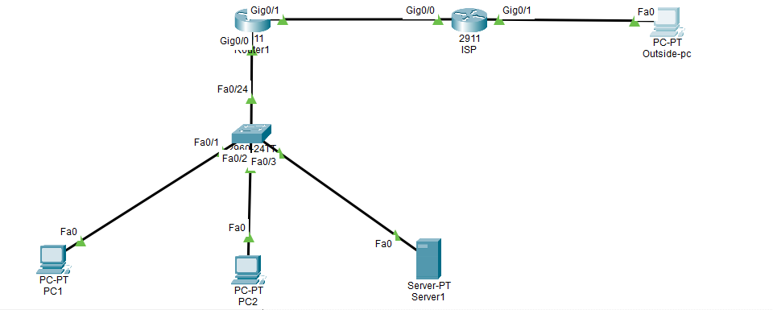

---

### Step 2 — Assign IPs to End Devices
PC1, PC2, Server1, and Outside-pc configured with static IPs per the addressing plan above.
```
No CLI — done via each device's IP Configuration tab.
```
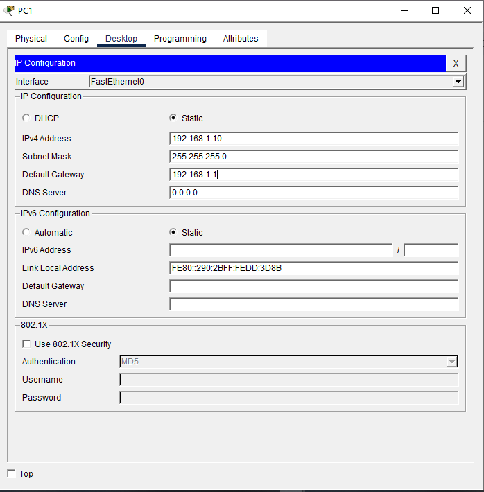

---

### Step 3 — Configure Router1 Inside Interface
```
Router> enable
Router# configure terminal
Router(config)# interface g0/0
Router(config-if)# ip address 192.168.1.1 255.255.255.0
Router(config-if)# ip nat inside
Router(config-if)# no shutdown
Router(config-if)# exit
```
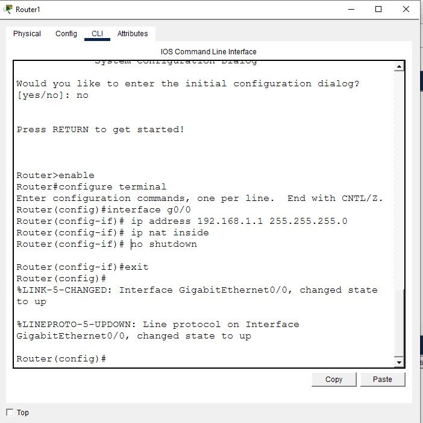

---

### Step 4 — Configure Router1 Outside Interface
```
Router(config)# interface g0/1
Router(config-if)# ip address 203.0.113.1 255.255.255.0
Router(config-if)# ip nat outside
Router(config-if)# no shutdown
Router(config-if)# exit
```
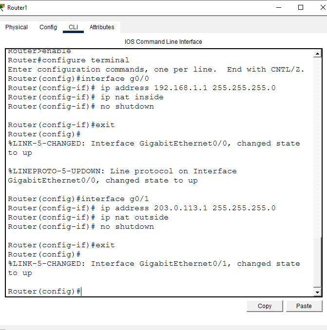

---

### Step 5 — Configure ISP Router
```
Router> enable
Router# configure terminal
Router(config)# interface g0/0
Router(config-if)# ip address 203.0.113.2 255.255.255.0
Router(config-if)# no shutdown
Router(config-if)# exit
Router(config)# interface g0/1
Router(config-if)# ip address 198.51.100.1 255.255.255.0
Router(config-if)# no shutdown
Router(config-if)# exit
```
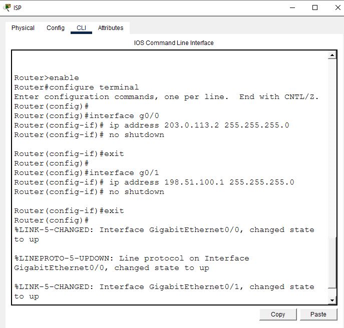

---

### Step 6 — Default Route on Router1
```
Router(config)# ip route 0.0.0.0 0.0.0.0 203.0.113.2
Router(config)# exit
```
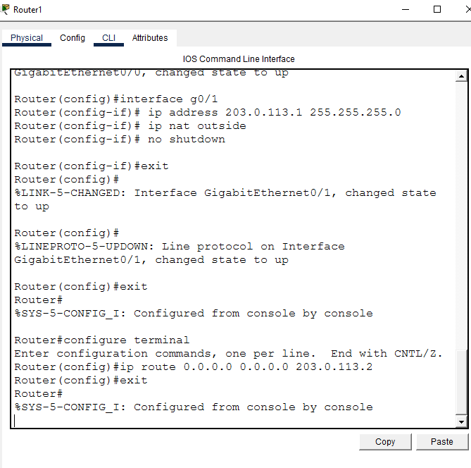

---

### Step 7 — Pre-NAT Test
```
Outside-pc> ping 192.168.1.100
```
Result: **Destination host unreachable** (4/4) — confirms the private IP is not reachable from outside before NAT is configured.

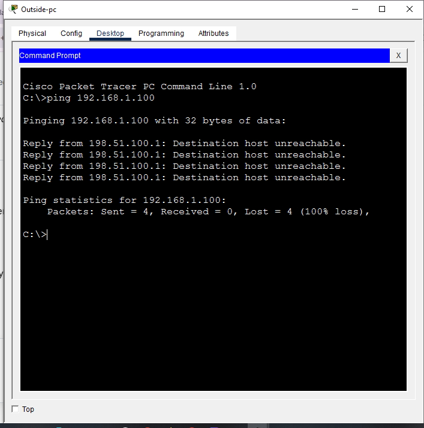

---

### Step 8 — Configure Static NAT (Server1)
```
Router# configure terminal
Router(config)# ip nat inside source static 192.168.1.100 203.0.113.10
Router(config)# exit
```
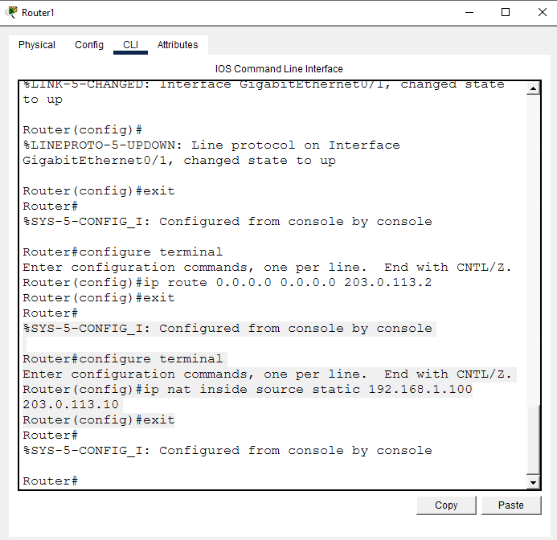

---

### Step 9 — Test Static NAT
```
Outside-pc> ping 203.0.113.10
```
First attempt: 2 of 4 timed out (50% loss). Retried: 4/4 success.

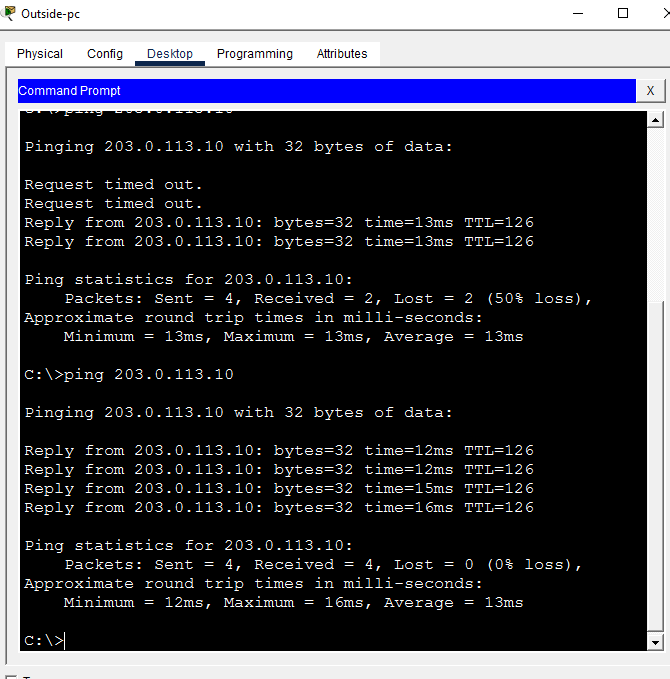

---

### Step 10 — Configure Dynamic NAT (PC1)
```
Router# configure terminal
Router(config)# access-list 1 permit host 192.168.1.10
Router(config)# ip nat pool NAT_POOL 203.0.113.20 203.0.113.22 netmask 255.255.255.0
Router(config)# ip nat inside source list 1 pool NAT_POOL
Router(config)# exit
```
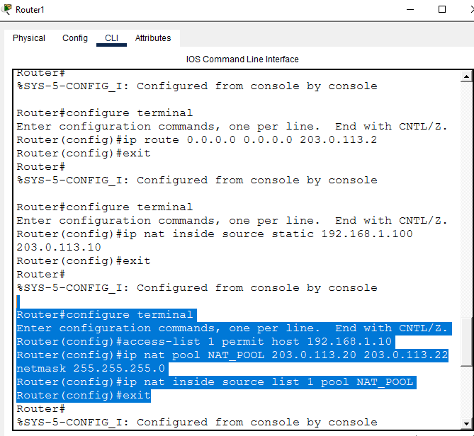

---

### Step 11 — Test Dynamic NAT
```
PC1> ping 198.51.100.10
Router1# show ip nat translations
```
Translation table confirms the mechanism is working:
```
icmp  203.0.113.20:1   192.168.1.10:1   198.51.100.10:1
icmp  203.0.113.20:2   192.168.1.10:2   198.51.100.10:2
...through :8
```
PC1's traffic is correctly translated through the pool address `203.0.113.20`.

**Note:** an initial capture showed 100% ping loss with "Destination host unreachable" from the ISP — a transient blip. A retry came back clean (4/4, 0% loss), confirming both NAT translation and end-to-end connectivity are working correctly.

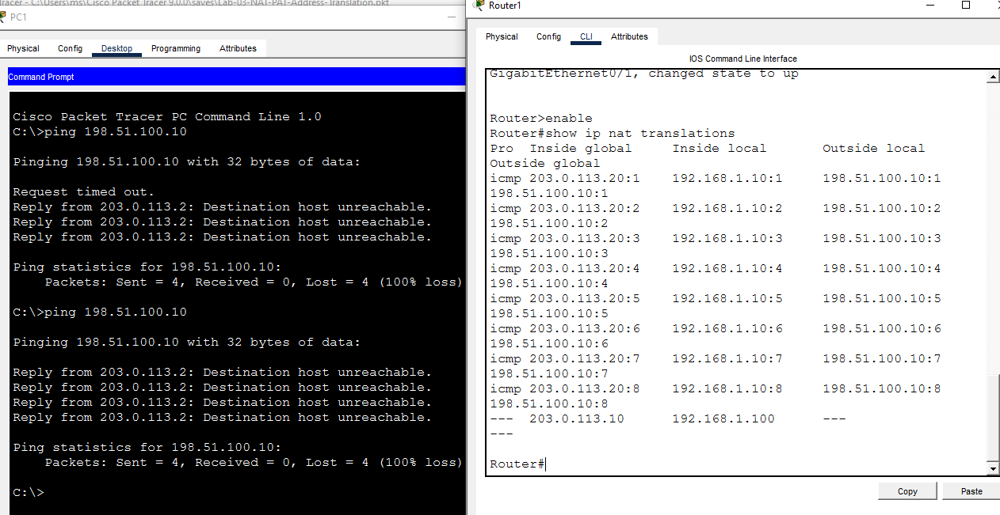

---

### Step 12 — Configure PAT / Overload (PC2)
```
Router# configure terminal
Router(config)# access-list 2 permit host 192.168.1.11
Router(config)# ip nat inside source list 2 interface g0/1 overload
Router(config)# exit
```
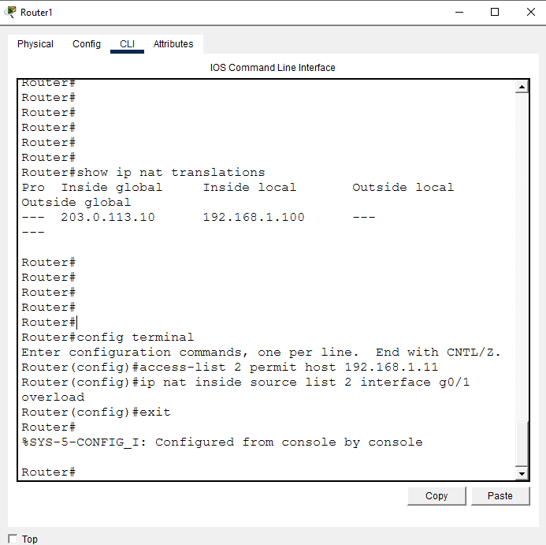

---

### Step 13 — Test PAT / Overload
```
PC2> ping 198.51.100.10
Router1# show ip nat translations
```
Ping: 4/4 success. Translation table, checked immediately after, confirms PAT working correctly:
```
icmp  203.0.113.1:1   192.168.1.11:1   198.51.100.10:1
icmp  203.0.113.1:2   192.168.1.11:2   198.51.100.10:2
icmp  203.0.113.1:3   192.168.1.11:3   198.51.100.10:3
icmp  203.0.113.1:4   192.168.1.11:4   198.51.100.10:4
```
PC2's traffic is translated through Router1's own outside interface (`203.0.113.1`), with a unique port number per session — this is the defining feature of PAT/Overload, distinguishing it from Dynamic NAT.

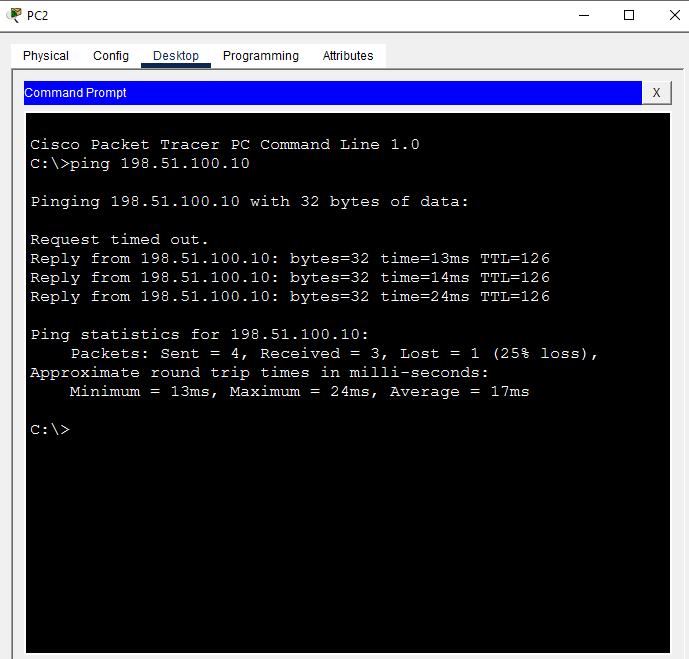
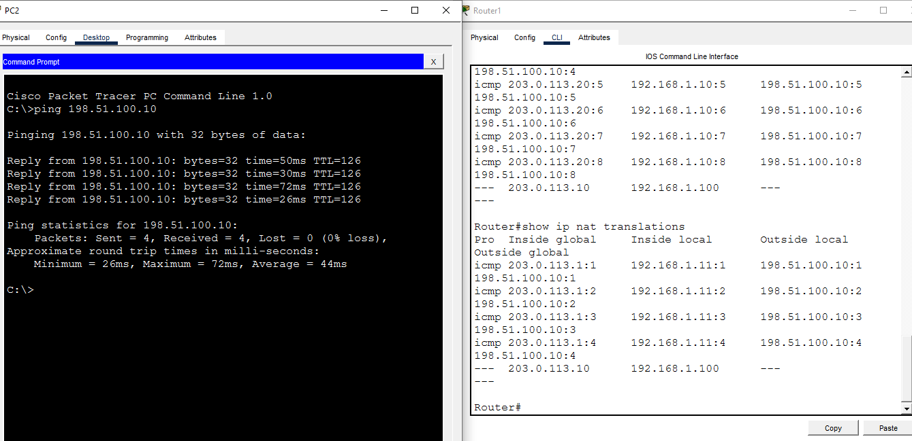

---

### Step 14 — Verify All Translations Together
```
Router1# show ip nat translations
Router1# show ip nat translations verbose
Router1# show ip nat statistics
```
- `show ip nat translations`: only the static entry present
- `show ip nat translations verbose`: rejected with "Invalid input" — Packet Tracer's simulated IOS doesn't support the `verbose` keyword
- `show ip nat statistics`: shows `Total translations: 1 (1 static, 0 dynamic, 0 extended)` and the pool at `allocated 0 (0%), refCount 0`

> **Note on timing:** this snapshot was captured before the retests documented in Steps 11 and 13 — at this point, neither ICMP session was active, which is why it shows 0 dynamic/extended. It's kept here as the original verification step; the later, immediate-capture retests in Steps 11 and 13 are the ones that actually confirm Dynamic NAT and PAT are working.

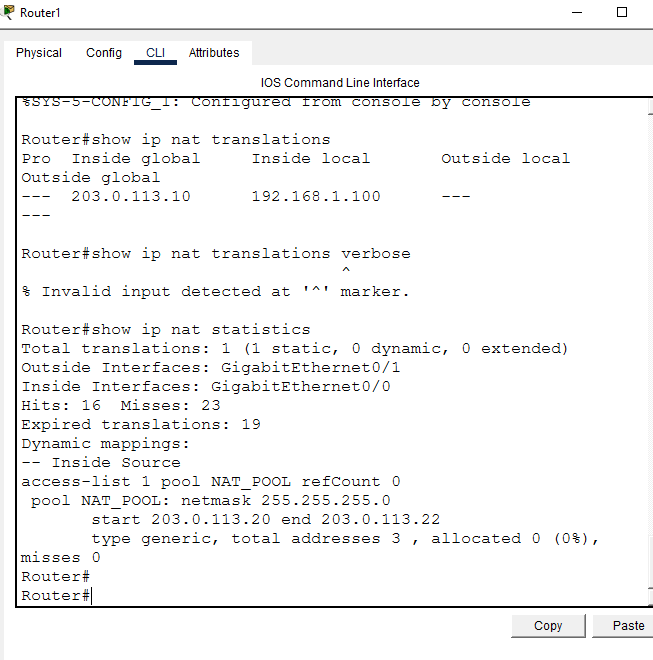

---

### Step 15 — Final Check
```
Router1# show ip interface brief
Router1# show ip route
```
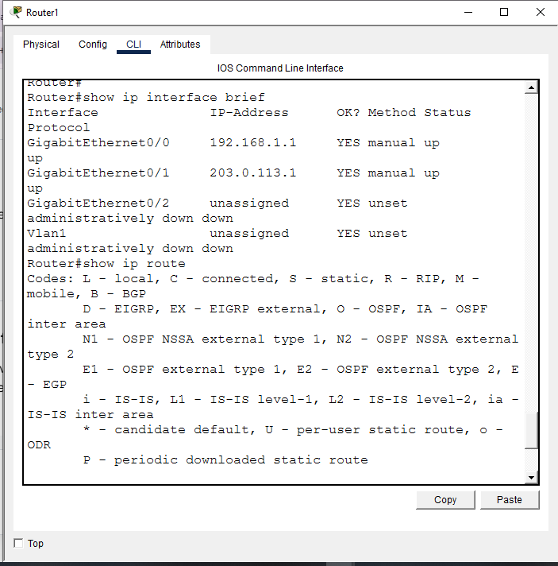

---

### Step 16 — Save Config
```
Router1# copy running-config startup-config
```
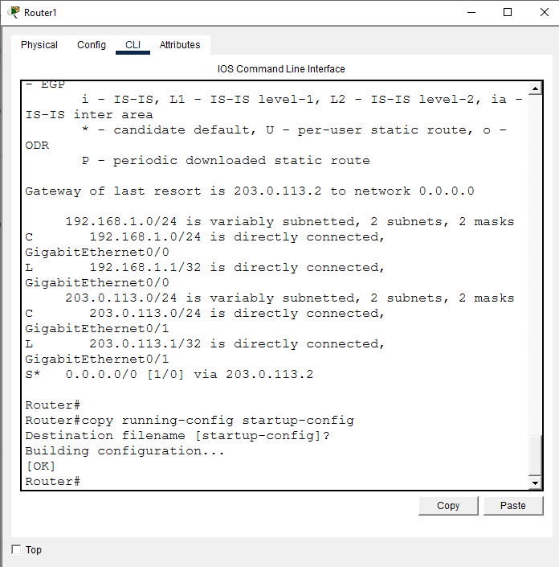

---

## 📟 Summary of Commands
| Command | Purpose |
|---------|---------|
| `ip nat inside` / `ip nat outside` | Mark NAT boundary interfaces |
| `ip nat inside source static <local> <global>` | Static 1-to-1 NAT |
| `ip nat pool <name> <start> <end> netmask <mask>` | Define a public address pool |
| `ip nat inside source list <acl> pool <name>` | Dynamic NAT using a pool |
| `ip nat inside source list <acl> interface <int> overload` | PAT/Overload using one public IP |
| `show ip nat translations` | View active NAT mappings — must be checked immediately after generating traffic, ICMP entries expire fast |
| `show ip nat statistics` | View hits/misses and pool allocation — the clearest way to confirm whether a dynamic rule has ever actually been used |

---

## ⚠️ Challenges & How I Solved Them
| Challenge | Solution |
|-----------|----------|
| Earlier attempt at this lab put the static NAT public IP on a /30's broadcast address | Rebuilt the WAN link as a /24, giving room for the static IP, the dynamic pool, and the PAT overload address all within one valid, non-broadcast subnet |
| Dynamic NAT and PAT pings succeeded, but the first `show ip nat translations` check came too late — the ICMP entries had already expired, showing no proof either mechanism actually fired | Retested with the ping and the translation-table check run back-to-back in the same session — both now show confirmed entries with port numbers |
| A retest ping briefly failed completely (100% loss, twice) right after Dynamic NAT was already confirmed in the table | Retried once more — came back clean, 4/4 success. Confirmed as a one-off blip rather than a real config issue |

**All three NAT mechanisms (Static, Dynamic, PAT) are fully confirmed — both translation table evidence and clean end-to-end pings.**

---

## 🧠 What I Learned
- A successful ping doesn't tell you *which* NAT mechanism handled it — only `show ip nat translations`, checked at the right moment, proves that.
- ICMP-based NAT translations age out quickly. If there's any gap between generating traffic and checking the table, the evidence can disappear even though the mechanism worked correctly in the moment.
- `show ip nat statistics` is actually the most reliable verification tool for dynamic/PAT rules, since `allocated` and `refCount` reflect real usage over time, not just a single snapshot that depends on perfect timing.
- Subnet sizing matters even for "outside" addresses you don't control directly — a /30 only has 2 usable host addresses, and picking the broadcast or network address breaks NAT silently (the command is accepted with no error).

---

## 📁 Files
| File | Description |
|------|-------------|
| `README.md` | Full lab documentation |
| `Lab_NAT_PAT_Address_Translation.pkt` | Packet Tracer file |
