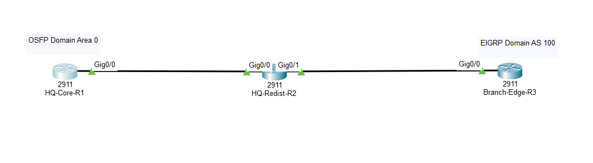
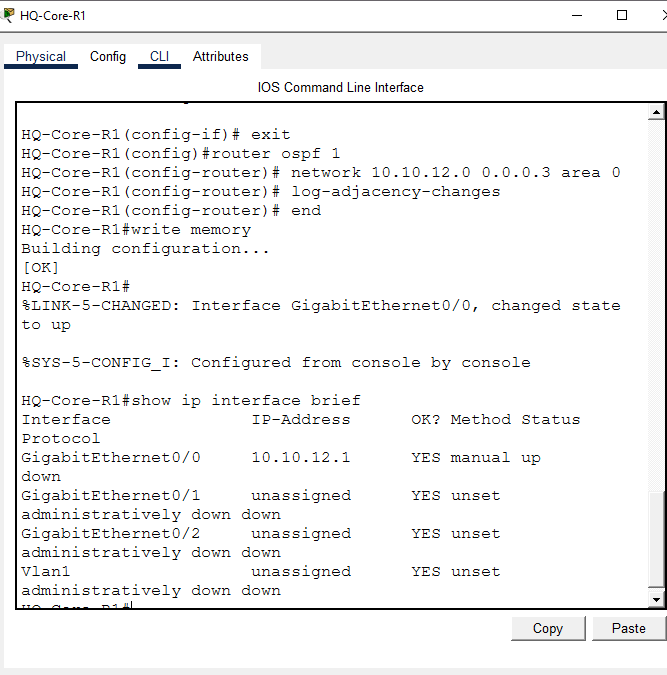
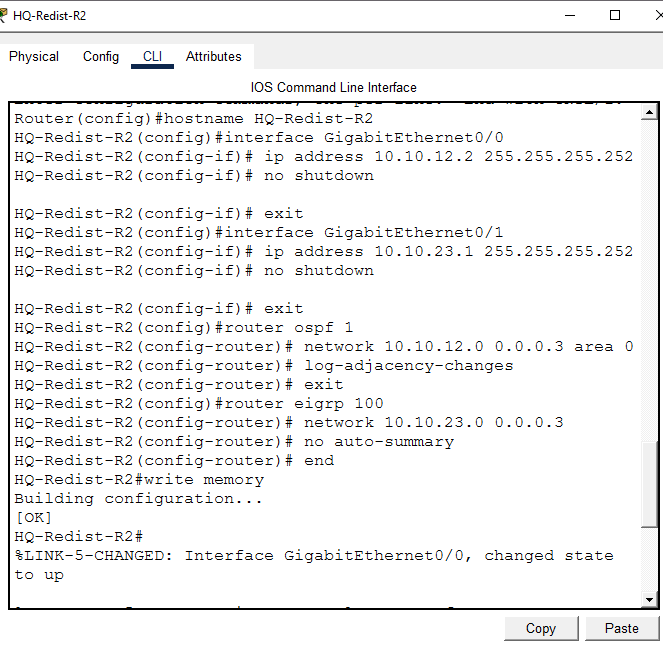
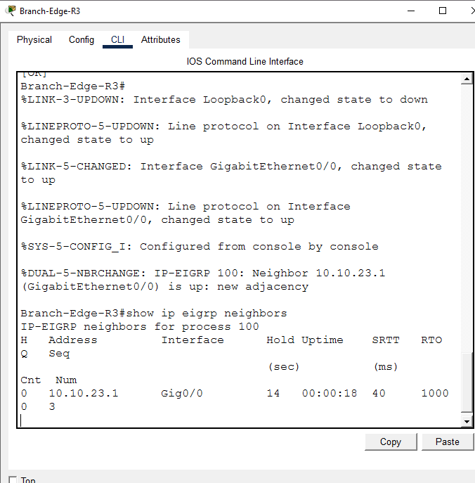
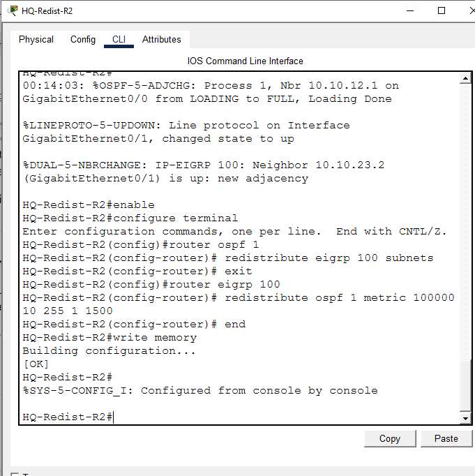
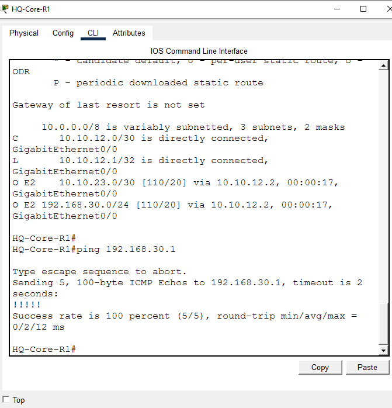

# OSPF ↔ EIGRP Route Redistribution

**Domain:** Networking
**Difficulty:** Advanced
**Tools:** Cisco Packet Tracer

---

## 🎯 Objective
Connect an OSPF domain and an EIGRP domain through a single boundary router, then configure mutual route redistribution so each protocol learns the other's routes — verified with full routing tables and an end-to-end ping across both domains.

---

## 🛠️ Tools & Technologies
| Tool | Purpose |
|------|---------|
| Cisco Packet Tracer | Network simulation |
| Router 2911 x3 | HQ-Core-R1 (OSPF), HQ-Redist-R2 (boundary), Branch-Edge-R3 (EIGRP) |
| OSPF Area 0 | Link-state routing on the core side |
| EIGRP AS 100 | Distance-vector routing on the branch side |
| Route Redistribution | Two-way translation between the two protocols at the boundary |

---

## 🖧 Topology

```
[OSPF Area 0]                [Redistribution Boundary]              [EIGRP AS 100]
 HQ-Core-R1  ---- Gig0/0 ---- HQ-Redist-R2 (Gig0/0 | Gig0/1) ---- Gig0/0 ---- Branch-Edge-R3
```

### Devices
- HQ-Core-R1 (2911) — OSPF-only router
- HQ-Redist-R2 (2911) — boundary router, runs both OSPF and EIGRP, redistributes between them
- Branch-Edge-R3 (2911) — EIGRP-only router, with a loopback simulating a branch LAN

---

## 🗂️ IP Addressing Plan

| Link | Subnet | Device | IP |
|------|--------|--------|-----|
| HQ-Core-R1 ↔ HQ-Redist-R2 | 10.10.12.0/30 | HQ-Core-R1 G0/0 | 10.10.12.1 |
| | | HQ-Redist-R2 G0/0 | 10.10.12.2 |
| HQ-Redist-R2 ↔ Branch-Edge-R3 | 10.10.23.0/30 | HQ-Redist-R2 G0/1 | 10.10.23.1 |
| | | Branch-Edge-R3 G0/0 | 10.10.23.2 |
| Branch-Edge-R3 Loopback0 (simulated LAN) | 192.168.30.0/24 | Branch-Edge-R3 Lo0 | 192.168.30.1 |

### Routing Plan
| Router | Protocol | Networks Advertised |
|--------|----------|----------------------|
| HQ-Core-R1 | OSPF 1, Area 0 | 10.10.12.0/30 |
| HQ-Redist-R2 | OSPF 1, Area 0 | 10.10.12.0/30 |
| HQ-Redist-R2 | EIGRP 100 | 10.10.23.0/30 |
| Branch-Edge-R3 | EIGRP 100 | 10.10.23.0/30, 192.168.30.0/24 |

---

## 📋 Steps & Screenshots

### Step 1 — Build the Topology
Deploy the 3 routers in a line: HQ-Core-R1 — HQ-Redist-R2 — Branch-Edge-R3.
```
No CLI commands — physical/logical wiring in the Packet Tracer GUI.
```


---

### Step 2 — HQ-Core-R1: Interface + OSPF
```
Router(config)# hostname HQ-Core-R1
HQ-Core-R1(config)# interface GigabitEthernet0/0
HQ-Core-R1(config-if)# description LINK_TO_HQ-REDIST-R2
HQ-Core-R1(config-if)# ip address 10.10.12.1 255.255.255.252
HQ-Core-R1(config-if)# no shutdown
HQ-Core-R1(config-if)# exit
HQ-Core-R1(config)# router ospf 1
HQ-Core-R1(config-router)# router-id 1.1.1.1
HQ-Core-R1(config-router)# network 10.10.12.0 0.0.0.3 area 0
HQ-Core-R1(config-router)# log-adjacency-changes
HQ-Core-R1(config-router)# end
HQ-Core-R1# write memory
```
> At this point, `show ip interface brief` shows G0/0's line protocol as **down** — expected, since HQ-Redist-R2 wasn't configured yet, so there was no neighbor to bring the link up with.



---

### Step 3 — HQ-Redist-R2: Dual Interfaces + OSPF + EIGRP
```
Router(config)# hostname HQ-Redist-R2
HQ-Redist-R2(config)# interface GigabitEthernet0/0
HQ-Redist-R2(config-if)# description LINK_TO_HQ-CORE-R1
HQ-Redist-R2(config-if)# ip address 10.10.12.2 255.255.255.252
HQ-Redist-R2(config-if)# no shutdown
HQ-Redist-R2(config-if)# exit
HQ-Redist-R2(config)# interface GigabitEthernet0/1
HQ-Redist-R2(config-if)# description LINK_TO_BRANCH-EDGE-R3
HQ-Redist-R2(config-if)# ip address 10.10.23.1 255.255.255.252
HQ-Redist-R2(config-if)# no shutdown
HQ-Redist-R2(config-if)# exit
HQ-Redist-R2(config)# router ospf 1
HQ-Redist-R2(config-router)# router-id 2.2.2.2
HQ-Redist-R2(config-router)# network 10.10.12.0 0.0.0.3 area 0
HQ-Redist-R2(config-router)# log-adjacency-changes
HQ-Redist-R2(config-router)# exit
HQ-Redist-R2(config)# router eigrp 100
HQ-Redist-R2(config-router)# network 10.10.23.0 0.0.0.3
HQ-Redist-R2(config-router)# no auto-summary
HQ-Redist-R2(config-router)# end
HQ-Redist-R2# write memory
```


---

### Step 4 — Branch-Edge-R3: Loopback (Simulated LAN) + Interface + EIGRP
```
Router(config)# hostname Branch-Edge-R3
Branch-Edge-R3(config)# interface Loopback0
Branch-Edge-R3(config-if)# description SIMULATED_BRANCH_OFFICE_LAN
Branch-Edge-R3(config-if)# ip address 192.168.30.1 255.255.255.0
Branch-Edge-R3(config-if)# exit
Branch-Edge-R3(config)# interface GigabitEthernet0/0
Branch-Edge-R3(config-if)# description LINK_TO_HQ-REDIST-R2
Branch-Edge-R3(config-if)# ip address 10.10.23.2 255.255.255.252
Branch-Edge-R3(config-if)# no shutdown
Branch-Edge-R3(config-if)# exit
Branch-Edge-R3(config)# router eigrp 100
Branch-Edge-R3(config-router)# network 10.10.23.0 0.0.0.3
Branch-Edge-R3(config-router)# network 192.168.30.0 0.0.0.255
Branch-Edge-R3(config-router)# no auto-summary
Branch-Edge-R3(config-router)# end
Branch-Edge-R3# write memory
```
EIGRP adjacency comes up immediately after, confirmed via:
```
Branch-Edge-R3# show ip eigrp neighbors
```


---

### Step 5 — Two-Way Redistribution on HQ-Redist-R2 (the Boundary Router)
```
HQ-Redist-R2(config)# router ospf 1
HQ-Redist-R2(config-router)# redistribute eigrp 100 subnets
HQ-Redist-R2(config-router)# exit
HQ-Redist-R2(config)# router eigrp 100
HQ-Redist-R2(config-router)# redistribute ospf 1 metric 100000 10 255 1 1500
HQ-Redist-R2(config-router)# end
HQ-Redist-R2# write memory
```
> The `subnets` keyword on the OSPF side is required — without it, only classful network-level routes get redistributed, and the actual subnets (like `10.10.23.0/30`) would be silently dropped.
>
> The EIGRP-side metric (`100000 10 255 1 1500` = bandwidth, delay, reliability, load, MTU) has to be manually seeded because OSPF routes don't carry an EIGRP-compatible metric on their own.



---

### Step 6 — Verify: Routing Table + End-to-End Ping
On HQ-Core-R1 (the far OSPF-only router):
```
HQ-Core-R1# show ip route
HQ-Core-R1# ping 192.168.30.1
```
Routing table shows the EIGRP-originated routes injected into OSPF as `O E2`:
```
O E2    10.10.23.0/30 [110/20] via 10.10.12.2
O E2    192.168.30.0/24 [110/20] via 10.10.12.2
```
Ping to Branch-Edge-R3's loopback (192.168.30.1) — **100% success (5/5)**, confirming the route is not just present in the table but actually usable end-to-end across both domains.



---

## 📟 Summary of Commands
| Command | Purpose |
|---------|---------|
| `router ospf <id>` / `router eigrp <as>` | Start a routing process |
| `network <ip> <wildcard> area <id>` | Advertise a network into OSPF |
| `network <ip> <wildcard>` (EIGRP) | Advertise a network into EIGRP |
| `no auto-summary` | Prevent EIGRP from auto-summarizing at classful boundaries |
| `redistribute eigrp <as> subnets` | Inject EIGRP routes into OSPF (subnets keyword is mandatory for non-classful routes) |
| `redistribute ospf <id> metric <bw> <delay> <rel> <load> <mtu>` | Inject OSPF routes into EIGRP with a manually seeded metric |
| `show ip route` | Confirm redistributed routes appear (look for `O E2` / `D EX`) |
| `show ip ospf neighbor` / `show ip eigrp neighbors` | Confirm adjacencies formed |

---

## ⚠️ Challenges & How I Solved Them
| Challenge | Solution |
|-----------|----------|
| OSPF and EIGRP can't natively exchange routes — they use completely different metric systems | Configured two-way redistribution on the single boundary router (HQ-Redist-R2), seeding a manual metric on the EIGRP side since OSPF routes don't carry one EIGRP understands |
| Risk of subnetted routes being dropped during redistribution | Used the `subnets` keyword on the OSPF redistribution command — without it, only classful-boundary routes would have been passed through, silently dropping `10.10.23.0/30` |

---

## 🧠 What I Learned
- Redistribution isn't automatic in either direction — you need an explicit `redistribute` command under *each* routing process at the boundary router, and EIGRP requires you to manually supply a metric since it has no way to interpret OSPF's cost.
- The `subnets` keyword matters more than it looks — leaving it off doesn't cause an error, it just quietly excludes subnetted routes, which is the kind of mistake that's easy to miss without actually checking the routing table afterward.
- A route appearing in `show ip route` doesn't fully prove the path works — the ping test across both domains is what actually confirms end-to-end forwarding, not just that the route entry exists.

---

## 📁 Files
| File | Description |
|------|-------------|
| `README.md` | Full lab documentation |
| `Lab5_OSPF_EIGRP_Redistribution.pkt` | Packet Tracer file |
