# Routing Protocols — OSPF, EIGRP, RIP & Static

**Domain:** Networking  
**Difficulty:** Intermediate  
**Tools:** Cisco Packet Tracer

---

## 🎯 Objective
Configure and compare Static, RIP v2, EIGRP and OSPF routing protocols across a 
multi-router enterprise topology. Migrate between protocols, verify routing tables 
and test end-to-end connectivity after each protocol implementation.

---

## 🛠️ Tools & Technologies

| Tool | Purpose |
|------|---------|
| Cisco Packet Tracer | Network simulation |
| Router 2811 x3 | Multi-protocol routing |
| Switch 2960-24TT x3 | LAN switching |
| Static Routing | Manual route configuration |
| RIP v2 | Distance vector legacy protocol |
| EIGRP | Cisco hybrid enterprise protocol |
| OSPF | Industry standard link state routing |

---

## 📊 Protocol Comparison

| Protocol | Type | AD | Metric | Real World Use |
|----------|------|----|--------|----------------|
| Static | Manual | 1 | None | Small networks, default routes |
| RIP v2 | Distance Vector | 120 | Hop count | Legacy networks only |
| EIGRP | Hybrid | 90 | Bandwidth + Delay | Cisco enterprise |
| OSPF | Link State | 110 | Cost (bandwidth) | Industry standard |

---

## 🖧 Topology

### Devices
- 3 Routers (2811)
- 3 Switches (2960-24TT)
- 3 PCs

### Physical Connections

| From | Interface | To | Interface | Cable |
|------|-----------|----|-----------|-------|
| PC1 | Fa0 | SW1 | Fa0/1 | Straight-Through |
| SW1 | Fa0/24 | R1 | G0/0 | Straight-Through |
| PC2 | Fa0 | SW2 | Fa0/2 | Straight-Through |
| SW2 | Fa0/24 | R2 | G0/0 | Straight-Through |
| PC3 | Fa0 | SW3 | Fa0/3 | Straight-Through |
| SW3 | Fa0/24 | R3 | G0/0 | Straight-Through |
| R1 | G0/1 | R2 | G0/1 | Cross-Over |
| R2 | G0/2 | R3 | G0/1 | Cross-Over |

---

## 🌐 IP Addressing

| Device | Interface | IP Address | Subnet Mask | Description |
|--------|-----------|------------|-------------|-------------|
| R1 | G0/0 | 192.168.1.1 | 255.255.255.0 | LAN 1 Gateway |
| R1 | G0/1 | 10.0.12.1 | 255.255.255.252 | WAN Link to R2 |
| R2 | G0/0 | 192.168.2.1 | 255.255.255.0 | LAN 2 Gateway |
| R2 | G0/1 | 10.0.12.2 | 255.255.255.252 | WAN Link to R1 |
| R2 | G0/2 | 10.0.23.1 | 255.255.255.252 | WAN Link to R3 |
| R3 | G0/0 | 192.168.3.1 | 255.255.255.0 | LAN 3 Gateway |
| R3 | G0/1 | 10.0.23.2 | 255.255.255.252 | WAN Link to R2 |
| PC1 | — | 192.168.1.10 | 255.255.255.0 | Gateway 192.168.1.1 |
| PC2 | — | 192.168.2.10 | 255.255.255.0 | Gateway 192.168.2.1 |
| PC3 | — | 192.168.3.10 | 255.255.255.0 | Gateway 192.168.3.1 |

---

## 💻 PC IP Configuration

| PC | IP Address | Subnet Mask | Gateway |
|----|------------|-------------|---------|
| PC1 | 192.168.1.10 | 255.255.255.0 | 192.168.1.1 |
| PC2 | 192.168.2.10 | 255.255.255.0 | 192.168.2.1 |
| PC3 | 192.168.3.10 | 255.255.255.0 | 192.168.3.1 |

---

## 📋 Steps & Screenshots

### Step 1 — Build the Topology
```
No CLI commands in this step — physical/logical wiring done in the
Packet Tracer GUI (place devices, connect cables per the tables above).
```
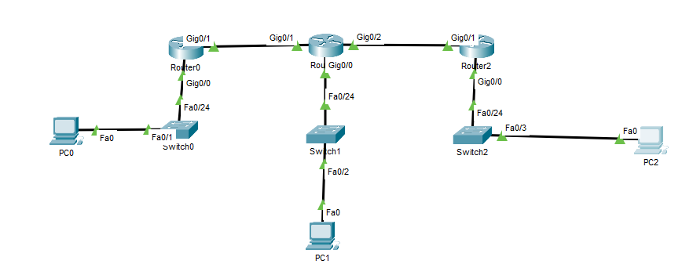

### Step 2 — Configure IP Addressing on All Routers
```
Router(config)# hostname R1
R1(config)# no ip domain-lookup
R1(config)# interface g0/0
R1(config-if)# ip address 192.168.1.1 255.255.255.0
R1(config-if)# no shutdown
R1(config-if)# exit
R1(config)# interface g0/1
R1(config-if)# ip address 10.0.12.1 255.255.255.252
R1(config-if)# no shutdown

Router(config)# hostname R2
R2(config)# no ip domain-lookup
R2(config)# interface g0/0
R2(config-if)# ip address 192.168.2.1 255.255.255.0
R2(config-if)# no shutdown
R2(config-if)# exit
R2(config)# interface g0/1
R2(config-if)# ip address 10.0.12.2 255.255.255.252
R2(config-if)# no shutdown
R2(config-if)# exit
R2(config)# interface g0/2
R2(config-if)# ip address 10.0.23.1 255.255.255.252
R2(config-if)# no shutdown

Router(config)# hostname R3
R3(config)# no ip domain-lookup
R3(config)# interface g0/0
R3(config-if)# ip address 192.168.3.1 255.255.255.0
R3(config-if)# no shutdown
R3(config-if)# exit
R3(config)# interface g0/1
R3(config-if)# ip address 10.0.23.2 255.255.255.252
R3(config-if)# no shutdown
```
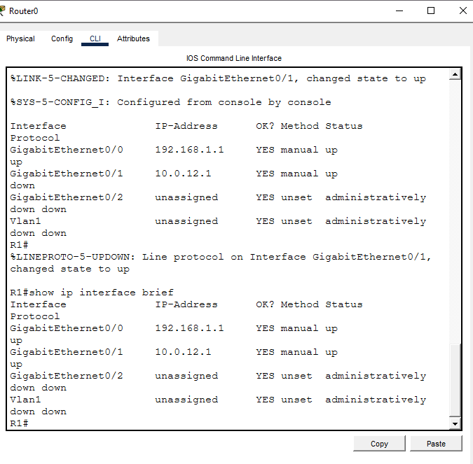
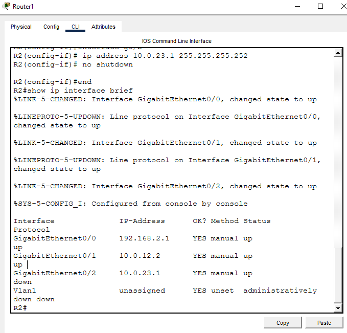
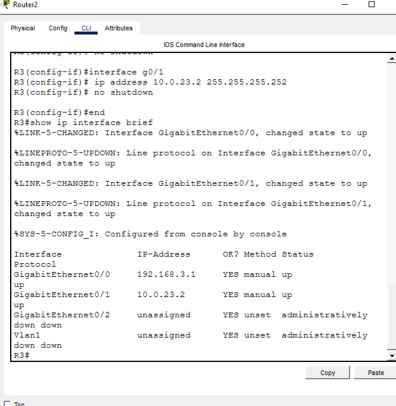

### Step 3 — Configure Static Routes
```
R1(config)# ip route 192.168.2.0 255.255.255.0 10.0.12.2
R1(config)# ip route 192.168.3.0 255.255.255.0 10.0.12.2

R2(config)# ip route 192.168.1.0 255.255.255.0 10.0.12.1
R2(config)# ip route 192.168.3.0 255.255.255.0 10.0.23.2

R3(config)# ip route 192.168.1.0 255.255.255.0 10.0.23.1
R3(config)# ip route 192.168.2.0 255.255.255.0 10.0.23.1
```
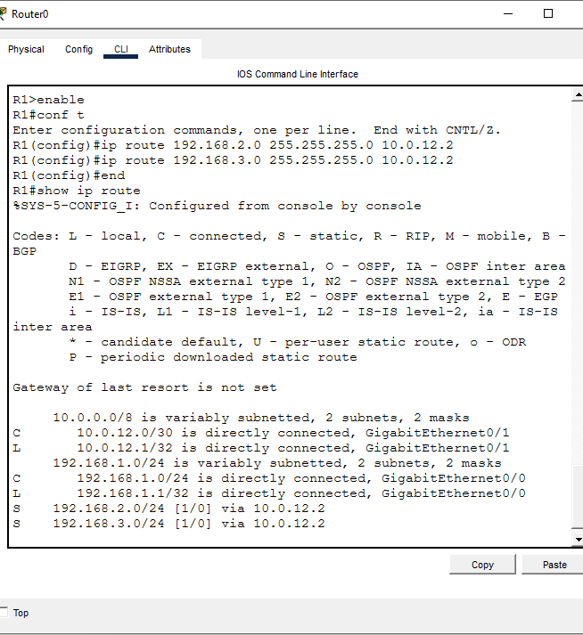

### Step 4 — Test Static Connectivity
```
R1# show ip route
PC1> ping 192.168.3.10
```
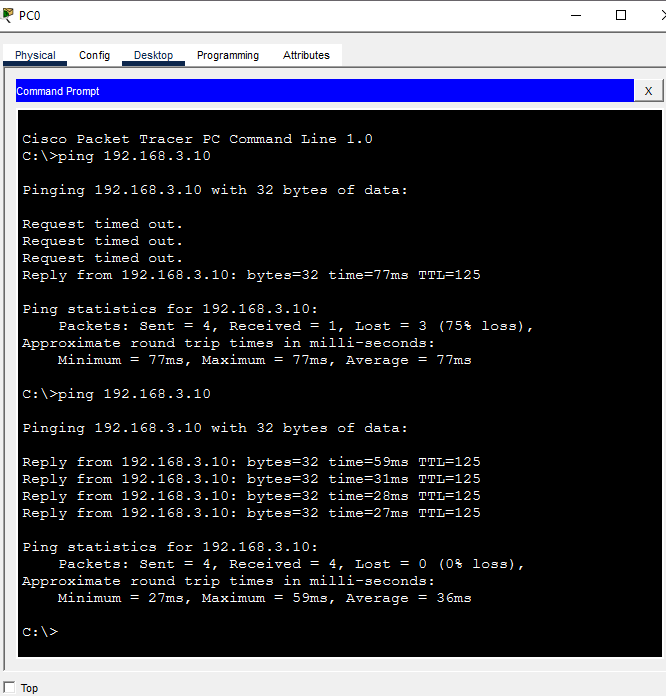

### Step 5 — Migrate to RIP v2
```
R1(config)# no ip route 192.168.2.0 255.255.255.0 10.0.12.2
R1(config)# no ip route 192.168.3.0 255.255.255.0 10.0.12.2
R1(config)# router rip
R1(config-router)# version 2
R1(config-router)# no auto-summary
R1(config-router)# network 192.168.1.0
R1(config-router)# network 10.0.12.0

R2(config)# no ip route 192.168.1.0 255.255.255.0 10.0.12.1
R2(config)# no ip route 192.168.3.0 255.255.255.0 10.0.23.2
R2(config)# router rip
R2(config-router)# version 2
R2(config-router)# no auto-summary
R2(config-router)# network 192.168.2.0
R2(config-router)# network 10.0.12.0
R2(config-router)# network 10.0.23.0

R3(config)# no ip route 192.168.1.0 255.255.255.0 10.0.23.1
R3(config)# no ip route 192.168.2.0 255.255.255.0 10.0.23.1
R3(config)# router rip
R3(config-router)# version 2
R3(config-router)# no auto-summary
R3(config-router)# network 192.168.3.0
R3(config-router)# network 10.0.23.0
```
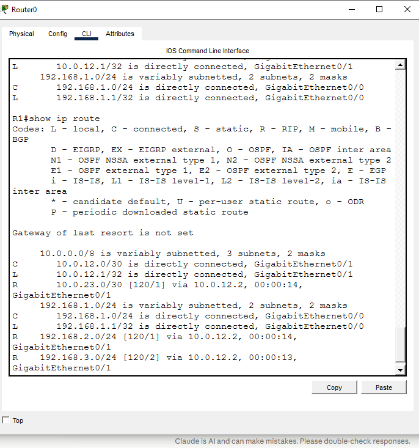

### Step 6 — Test RIP Connectivity
```
R1# show ip route
PC1> ping 192.168.3.10
```
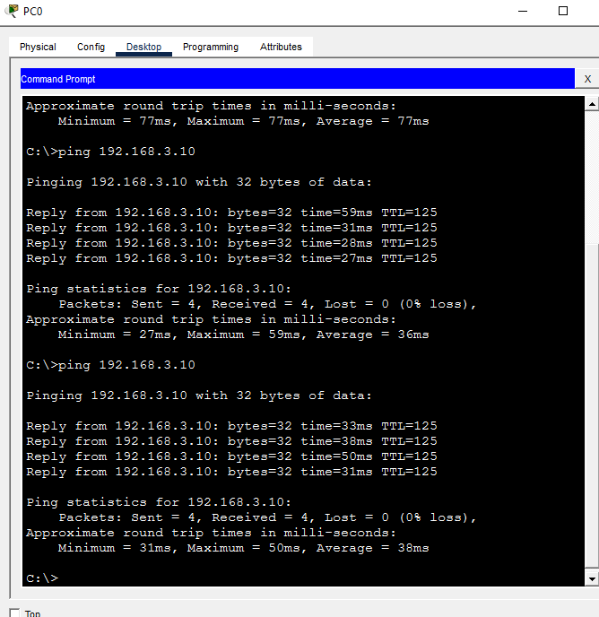

### Step 7 — Migrate to OSPF
```
R1(config)# no router rip
R1(config)# router ospf 1
R1(config-router)# network 192.168.1.0 0.0.0.255 area 0
R1(config-router)# network 10.0.12.0 0.0.0.3 area 0

R2(config)# no router rip
R2(config)# router ospf 1
R2(config-router)# network 192.168.2.0 0.0.0.255 area 0
R2(config-router)# network 10.0.12.0 0.0.0.3 area 0
R2(config-router)# network 10.0.23.0 0.0.0.3 area 0

R3(config)# no router rip
R3(config)# router ospf 1
R3(config-router)# network 192.168.3.0 0.0.0.255 area 0
R3(config-router)# network 10.0.23.0 0.0.0.3 area 0
```
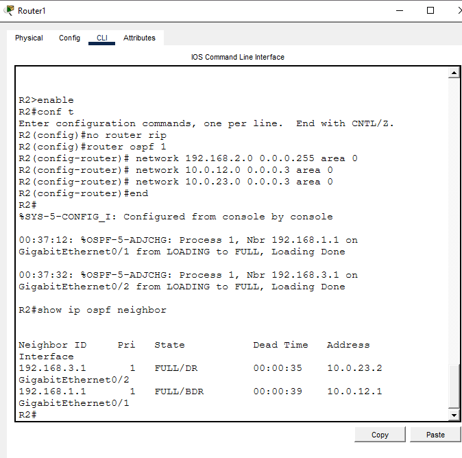
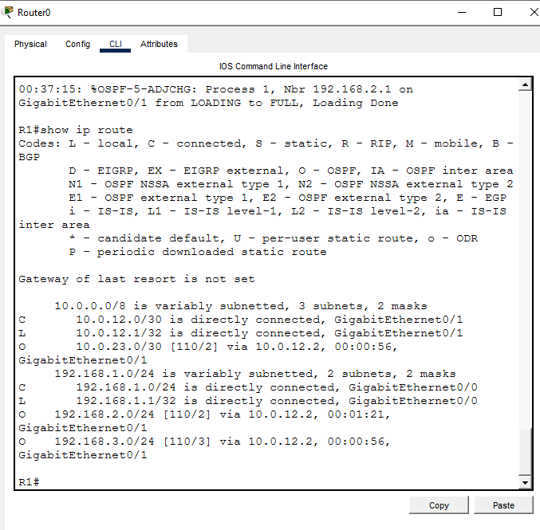

### Step 8 — Test OSPF Connectivity
```
R2# show ip ospf neighbor
R1# show ip route
PC1> ping 192.168.3.10
```
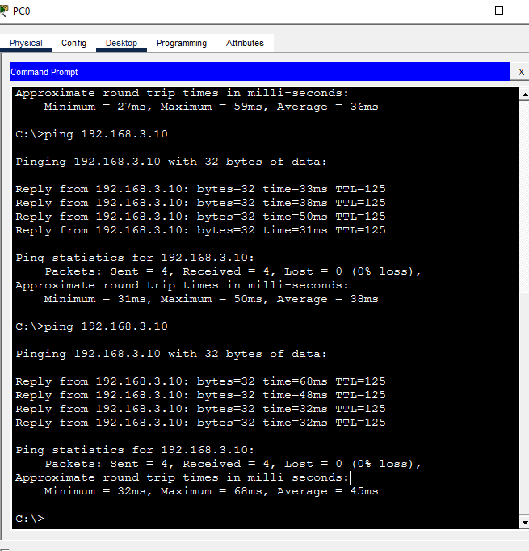

### Step 9 — Migrate to EIGRP
```
R1(config)# no router ospf 1
R1(config)# router eigrp 100
R1(config-router)# network 192.168.1.0 0.0.0.255
R1(config-router)# network 10.0.12.0 0.0.0.3
R1(config-router)# no auto-summary

R2(config)# no router ospf 1
R2(config)# router eigrp 100
R2(config-router)# network 192.168.2.0 0.0.0.255
R2(config-router)# network 10.0.12.0 0.0.0.3
R2(config-router)# network 10.0.23.0 0.0.0.3
R2(config-router)# no auto-summary

R3(config)# no router ospf 1
R3(config)# router eigrp 100
R3(config-router)# network 192.168.3.0 0.0.0.255
R3(config-router)# network 10.0.23.0 0.0.0.3
R3(config-router)# no auto-summary
```
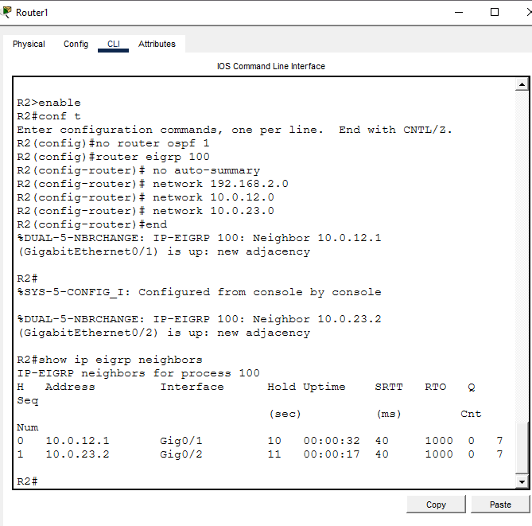
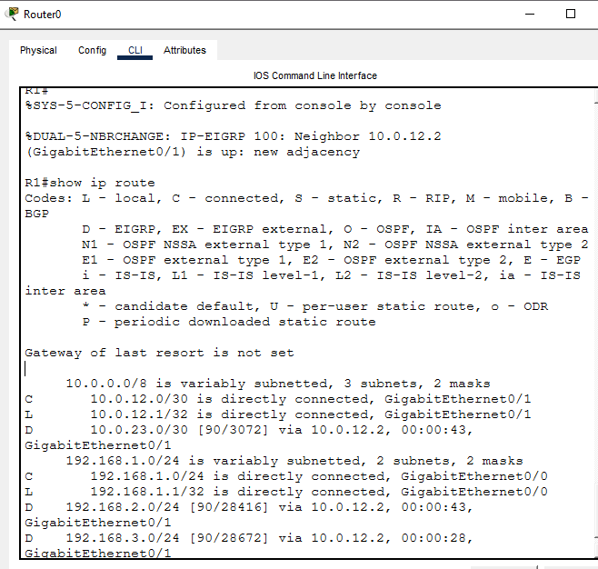

### Step 10 — Test EIGRP Connectivity
```
R2# show ip eigrp neighbors
R1# show ip route
PC1> ping 192.168.3.10
```
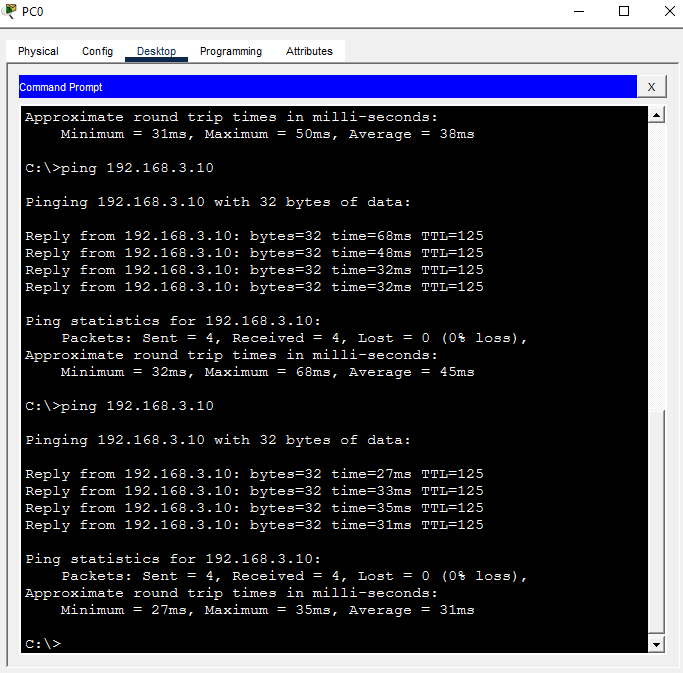

---

## 📟 Summary of Commands

| Command | Purpose |
|---------|---------|
| `hostname R1` | Set router hostname |
| `no ip domain-lookup` | Disable DNS lookup |
| `ip address x.x.x.x x.x.x.x` | Assign IP to interface |
| `no shutdown` | Enable interface |
| `ip route` | Configure static route |
| `no ip route` | Remove static route |
| `router rip` | Enable RIP |
| `version 2` | Use RIP version 2 |
| `no auto-summary` | Disable auto summarization |
| `router eigrp 100` | Enable EIGRP AS 100 |
| `show ip eigrp neighbors` | Verify EIGRP neighbors |
| `router ospf 1` | Enable OSPF process 1 |
| `network x.x.x.x area 0` | Add network to OSPF area 0 |
| `show ip route` | View full routing table |
| `show ip ospf neighbor` | Verify OSPF neighbors |
| `show ip interface brief` | Verify interface status |
| `copy running-config startup-config` | Save configuration |

---

## 📸 Screenshot Summary

| File Name | When Taken |
|-----------|------------|
| SS1-topology.png | After building full topology |
| SS2-R1-interfaces.png | show ip interface brief — R1 up/up |
| SS3-R2-interfaces.png | show ip interface brief — R2 up/up |
| SS4-R3-interfaces.png | show ip interface brief — R3 up/up |
| SS5-static-R1-route.png | show ip route — S routes visible on R1 |
| SS6-static-ping.png | Ping PC1 to PC3 — 4/4 success static |
| SS7-rip-R1-route.png | show ip route — R routes visible on R1 |
| SS8-rip-ping.png | Ping PC1 to PC3 — 4/4 success RIP |
| SS9-ospf-R2-neighbors.png | show ip ospf neighbor — FULL state R2 |
| SS10-ospf-R1-route.png | show ip route — O routes visible on R1 |
| SS11-ospf-ping.png | Ping PC1 to PC3 — 4/4 success OSPF |
| SS12-eigrp-R2-neighbors.png | show ip eigrp neighbors — R2 |
| SS13-eigrp-R1-route.png | show ip route — D routes visible on R1 |
| SS14-eigrp-ping.png | Ping PC1 to PC3 — 4/4 success EIGRP |

---

## ⚠️ Challenges & How I Solved Them

| Challenge | Solution |
|-----------|----------|
| G0/1 on R1 showing up/down initially | Normal — other side not configured yet. Resolved after R2 was configured |
| Wrong IP configured on R1 G0/1 (10.0.0.1 instead of 10.0.12.1) | Used `no ip address` then reassigned correct IP 10.0.12.1 |
| First ping timing out after static routing | ARP resolution on first ping is normal. Second ping was 4/4 success |
| R routes not appearing immediately after RIP on R1 | RIP needs all routers configured first. Routes appeared after R2 and R3 RIP config |
| PC IPs not configured — ping failing | Set IP, subnet and gateway manually on each PC via Desktop → IP Configuration |

---

## 🧠 What I Learned
How to configure and compare four routing protocols on the same topology,
understand administrative distance and when each protocol is preferred,
migrate between protocols without losing connectivity, read and interpret
routing tables to identify S, R, O and D routes, verify neighbor adjacencies
for OSPF and EIGRP, and troubleshoot common issues like wrong IP assignment
and ARP resolution delays.

---

## 📁 Files

| File | Description |
|------|-------------|
| README.md | Full lab documentation |
| screenshots/ | All 14 lab screenshots |
