# Enterprise Multi-Site Syslog Server Configuration
**Domain:** Network Security / IT Operations
**Difficulty:** Intermediate — Advanced
**Tools:** Cisco Packet Tracer

---

## 🎯 Objective
Configure centralized logging (Syslog) across a two-site enterprise network (HQ and Branch), with static routing for WAN connectivity, real-time log timestamps, and ACL-based security hardening to restrict who can send logs to the Syslog server.

---

## 🛠 Tools & Technologies
| Tool | Purpose |
|------|---------|
| Cisco Packet Tracer | Network simulation |
| Router 2911 x2 | Inter-site routing (HQ + Branch) |
| Switch 2960 x2 | Access-layer switching at each site |
| Syslog Server | Centralized log collection |
| Static Routing | HQ ↔ Branch reachability |
| ACL | Restrict syslog (UDP 514) traffic to authorized devices |

---

## Topology

### Devices
- 2 Routers (2911) — HQ-Router, Branch-Router
- 2 Switches (2960) — HQ-Switch, Branch-Switch
- 1 Syslog Server (Server-PT) — SYSLOG-Server
- 2 PCs — HQ-PC, Branch-PC

### Physical Connections
| From | Port | To | Port | Cable |
|------|------|----|------|-------|
| HQ-PC | FastEthernet0 | HQ-Switch | Fa0/1 | Copper Straight-through |
| SYSLOG-Server | FastEthernet0 | HQ-Switch | Fa0/2 | Copper Straight-through |
| HQ-Switch | Fa0/24 | HQ-Router | G0/0 | Copper Straight-through |
| HQ-Router | G0/1 | Branch-Router | G0/1 | Copper Straight-through |
| Branch-Router | G0/0 | Branch-Switch | Fa0/24 | Copper Straight-through |
| Branch-Switch | Fa0/1 | Branch-PC | FastEthernet0 | Copper Straight-through |


---

## 🗂 IP Address Plan
| Device | Interface | IP Address | Subnet Mask | Gateway |
|--------|-----------|------------|--------------|---------|
| HQ-Router | G0/0 | 192.168.1.1 | 255.255.255.0 | — |
| HQ-Router | G0/1 | 10.0.0.1 | 255.255.255.252 | — |
| Branch-Router | G0/0 | 192.168.2.1 | 255.255.255.0 | — |
| Branch-Router | G0/1 | 10.0.0.2 | 255.255.255.252 | — |
| HQ-PC | FastEthernet0 | 192.168.1.20 | 255.255.255.0 | 192.168.1.1 |
| Branch-PC | FastEthernet0 | 192.168.2.20 | 255.255.255.0 | 192.168.2.1 |
| SYSLOG-Server | FastEthernet0 | 192.168.1.10 | 255.255.255.0 | 192.168.1.1 |

---

## 📋 Steps & Screenshots

### Step 1 — Build the Topology
Place and connect all devices exactly as shown in the table above.
```
No CLI commands in this step — physical/logical wiring done in the
Packet Tracer GUI (drag devices, connect cables per the table above).
```
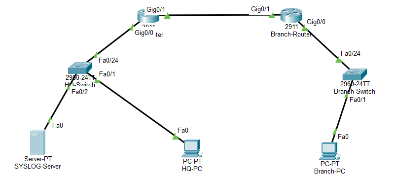

---

### Step 2 — IP Addressing (Routers)
Assign IP addresses to both routers' interfaces and bring them up.
```
HQ-Router(config)# interface g0/0
HQ-Router(config-if)# ip address 192.168.1.1 255.255.255.0
HQ-Router(config-if)# no shutdown
HQ-Router(config-if)# exit
HQ-Router(config)# interface g0/1
HQ-Router(config-if)# ip address 10.0.0.1 255.255.255.252
HQ-Router(config-if)# no shutdown
```
```
Branch-Router(config)# interface g0/0
Branch-Router(config-if)# ip address 192.168.2.1 255.255.255.0
Branch-Router(config-if)# no shutdown
Branch-Router(config-if)# exit
Branch-Router(config)# interface g0/1
Branch-Router(config-if)# ip address 10.0.0.2 255.255.255.252
Branch-Router(config-if)# no shutdown
```
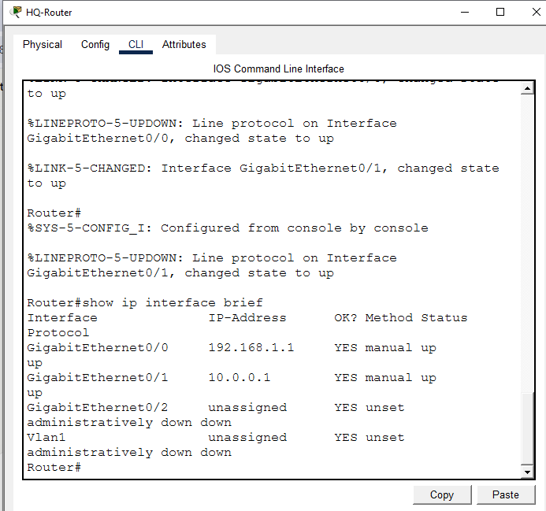
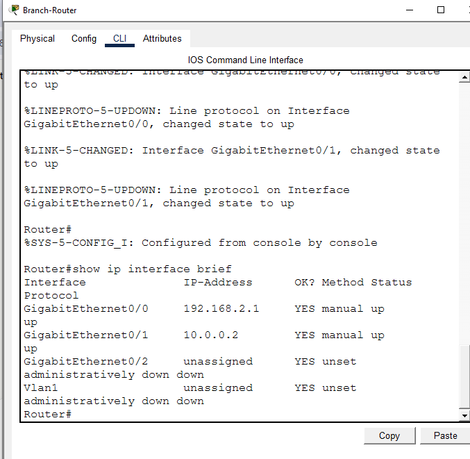

---

### Step 3 — IP Addressing (HQ-PC, Branch-PC, SYSLOG-Server)
Set static IPs on the end devices (Desktop → IP Configuration).
```
HQ-PC: IP 192.168.1.20, Mask 255.255.255.0, Gateway 192.168.1.1
Branch-PC: IP 192.168.2.20, Mask 255.255.255.0, Gateway 192.168.2.1
SYSLOG-Server: IP 192.168.1.10, Mask 255.255.255.0, Gateway 192.168.1.1
```
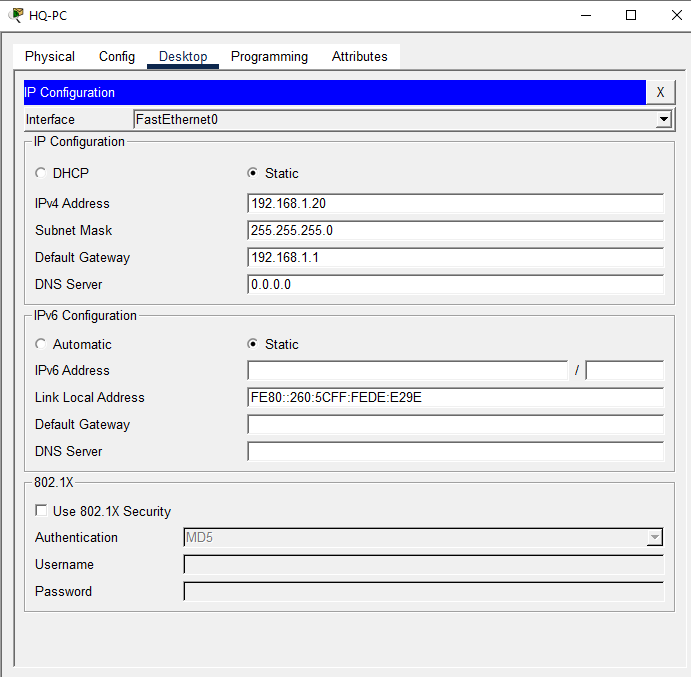

---

### Step 4 — Static Routing (HQ ↔ Branch)
Since HQ and Branch are on different subnets, static routes are required so each site can reach the other's network.
```
HQ-Router(config)# ip route 192.168.2.0 255.255.255.0 10.0.0.2
Branch-Router(config)# ip route 192.168.1.0 255.255.255.0 10.0.0.1
```
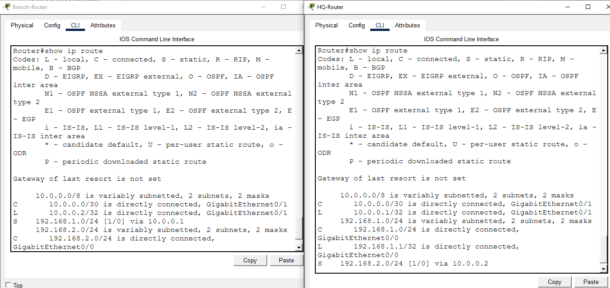

---

### Step 5 — Connectivity Test (HQ ↔ Branch)
Verify HQ-PC can reach Branch-PC across the WAN link.
```
HQ-PC> ping 192.168.2.20
```
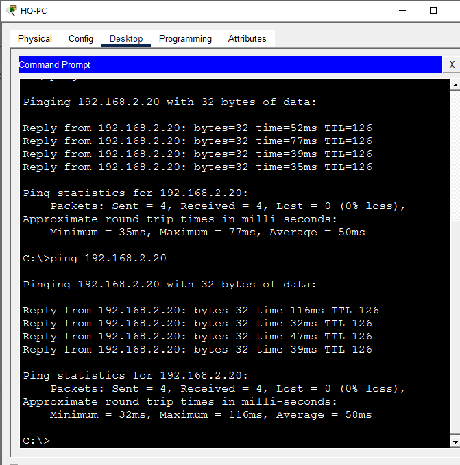

---

### Step 6 — Enable Syslog Service on the Server
Turn on the Syslog service so the server can start receiving log messages.
```
SYSLOG-Server > Services tab > SYSLOG > Service: On
```
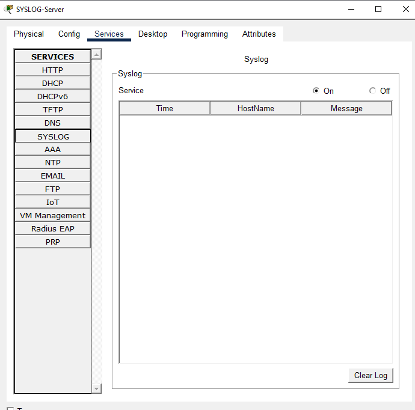

---

### Step 7 — Enable Accurate Log Timestamps
Add timestamps to log messages so each entry can be traced to an exact time.
```
HQ-Router(config)# service timestamps log datetime msec
Branch-Router(config)# service timestamps log datetime msec
```
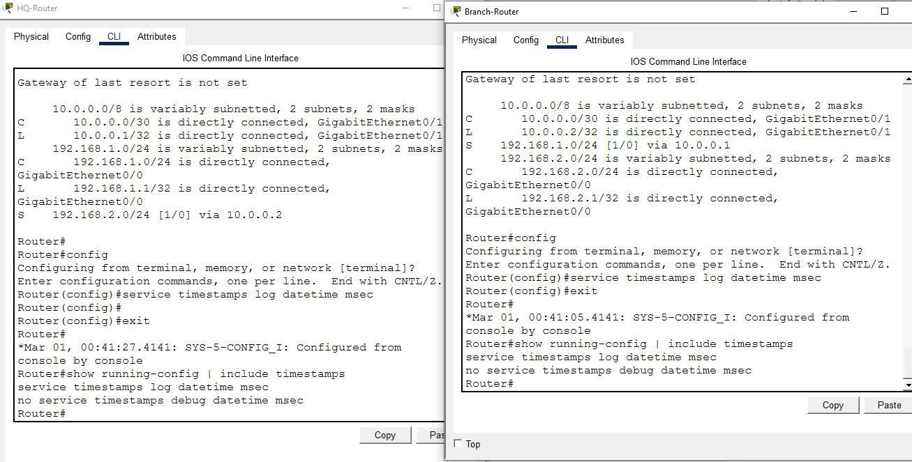

---

### Step 8 — Point HQ-Router to the Syslog Server
```
HQ-Router(config)# logging host 192.168.1.10
HQ-Router(config)# logging trap debugging
```
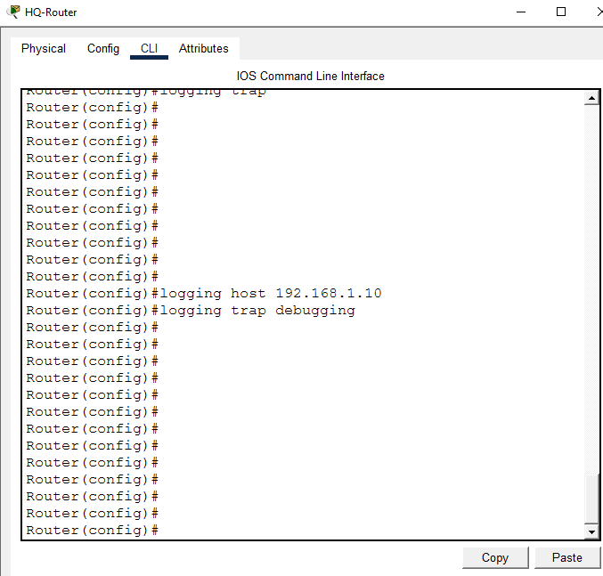

---

### Step 9 — Point Branch-Router to the Syslog Server
```
Branch-Router(config)# logging host 192.168.1.10
Branch-Router(config)# logging trap debugging
```
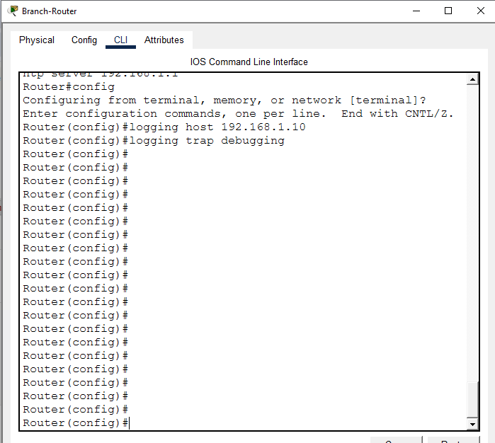

---

### Step 10 — Point Both Switches to the Syslog Server
```
HQ-Switch(config)# logging host 192.168.1.10
HQ-Switch(config)# logging trap debugging
Branch-Switch(config)# logging host 192.168.1.10
Branch-Switch(config)# logging trap debugging
```
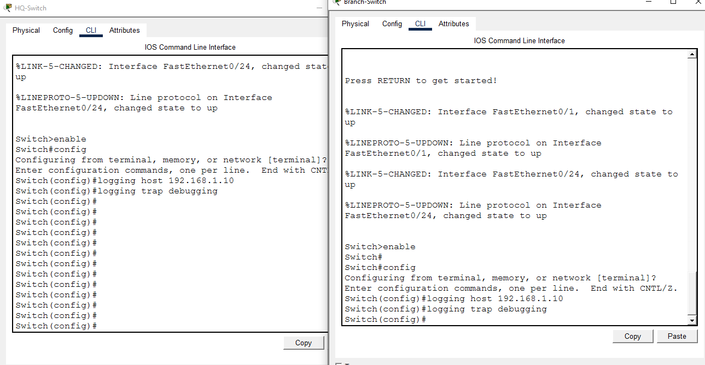

---

### Step 11 — Trigger a Real Log Event
Flap the Branch-Router's LAN interface to generate a genuine log message.
```
Branch-Router(config)# interface g0/0
Branch-Router(config-if)# shutdown
Branch-Router(config-if)# no shutdown
```
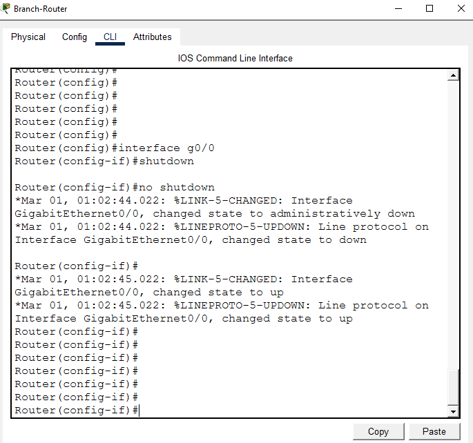

---

### Step 12 — Confirm the Log Reached the Server (Cross-WAN Proof)
Check the Syslog server's log table for an entry sourced from the Branch site.
```
SYSLOG-Server > Services > SYSLOG > log table
```
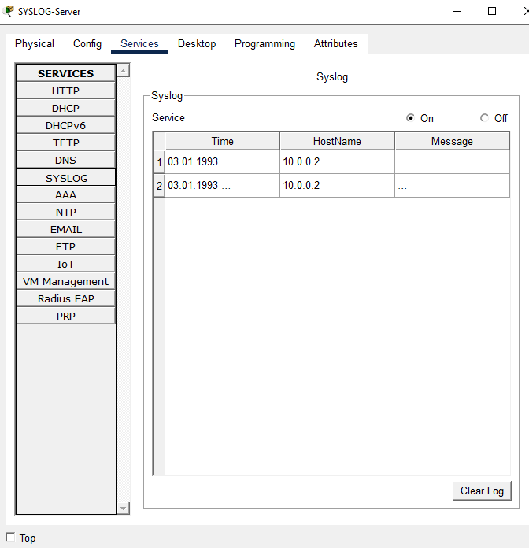

---

### Step 13 — Restrict Syslog Traffic with an ACL (Security Hardening)
Only allow the HQ-Router and Branch-Router (via the WAN-facing interface address) to send traffic to the Syslog server's UDP 514 port; deny everyone else.
```
HQ-Router(config)# access-list 120 permit udp host 192.168.1.1 host 192.168.1.10 eq 514
HQ-Router(config)# access-list 120 permit udp host 10.0.0.1 host 192.168.1.10 eq 514
HQ-Router(config)# access-list 120 deny udp any host 192.168.1.10 eq 514
HQ-Router(config)# access-list 120 permit ip any any
HQ-Router(config)# interface g0/0
HQ-Router(config-if)# ip access-group 120 in
```
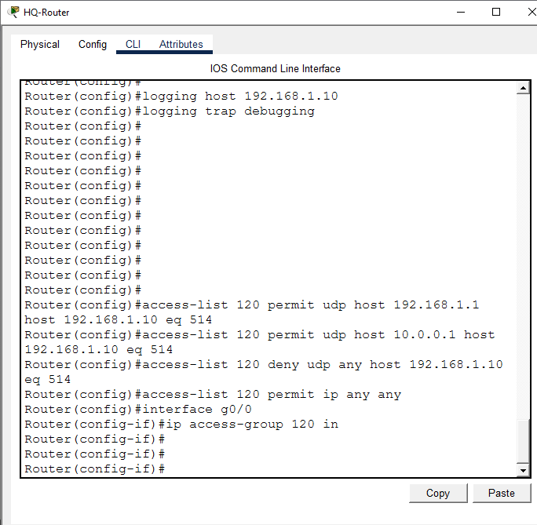

---

### Step 14 — Verify the ACL
```
HQ-Router# show access-lists
```
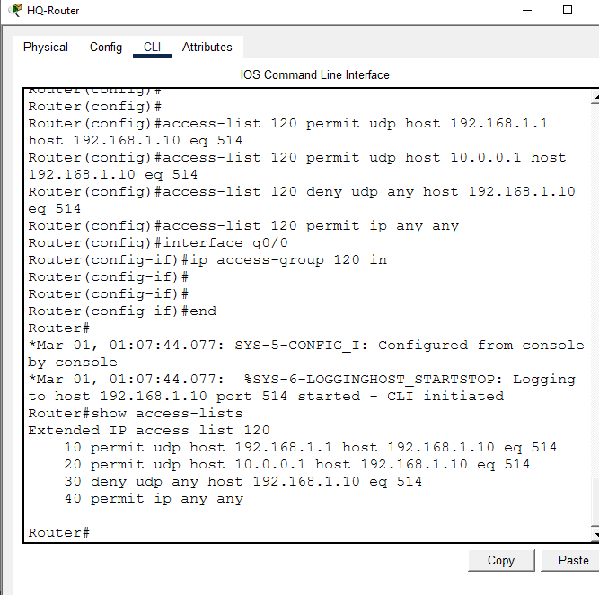

---

### Step 15 — Final Verification
```
HQ-Router# show logging
HQ-Router# show running-config | include logging
```
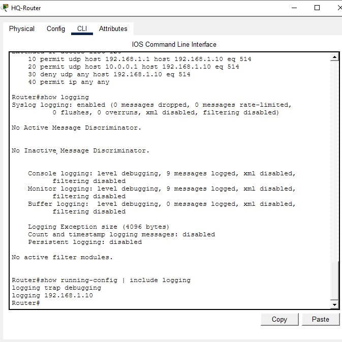

---

### Step 16 — Save Configuration
Save the running configuration on all four devices so changes survive a reload.
```
HQ-Router# copy running-config startup-config
Branch-Router# copy running-config startup-config
HQ-Switch# copy running-config startup-config
Branch-Switch# copy running-config startup-config
```
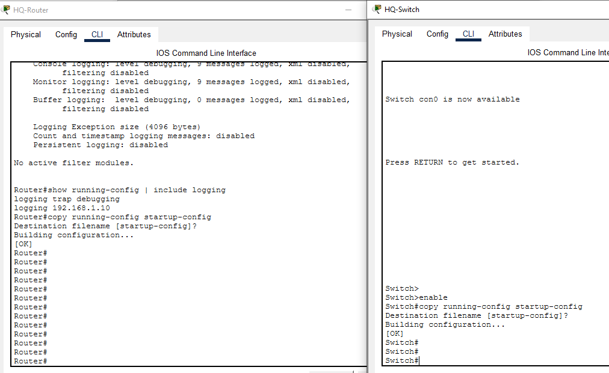

---

## 📟 Summary of Commands
| Command | Purpose |
|---------|---------|
| `ip address` / `no shutdown` | Bring up an interface |
| `ip route` | Static route for inter-site reachability |
| `service timestamps log datetime msec` | Add accurate timestamps to log messages |
| `logging host` | Set the Syslog server's IP |
| `logging trap debugging` | Set the severity level of logs sent to the server |
| `interface g0/0` + `shutdown` / `no shutdown` | Generate a real log event for testing |
| `access-list 120 ...` | Restrict which devices can reach the Syslog server |
| `ip access-group 120 in` | Apply the ACL to an interface |
| `show access-lists` | Verify ACL rules and hit counters |
| `show logging` | View local log buffer and logging configuration |
| `copy running-config startup-config` | Save configuration |

---

## ⚠️ Challenges & How I Solved Them
| Challenge | Solution |
|-----------|----------|
| `logging trap informational` was rejected as invalid input on this router's IOS image | Ran `logging trap ?` to see supported keywords — this Packet Tracer image only supported `debugging`, so switched to `logging trap debugging` |
| Originally planned to include NTP time sync (`ntp master` / `ntp server`) between sites | Branch-Router consistently showed "unsynchronized, stratum 16, never updated" even with the command correctly applied — a known Packet Tracer NTP simulation limitation. Rather than fake a synced screenshot, the NTP step was dropped from the lab entirely |

---

## 🧠 What I Learned
How to centralize logging across a multi-site network using a single Syslog server, how to make log entries time-traceable, how static routing enables cross-site visibility for security monitoring, and how to harden the logging path itself with an ACL so only authorized routers can submit logs — preventing log injection or spoofing from an untrusted source.

---

## 📁 Files
| File | Description |
|------|-------------|
| `README.md` | Full lab documentation |
| `syslog-multisite-logging-enterprise.pkt` | Packet Tracer file |
