# Standard ACL Implementation

**Domain:** Network Security
**Difficulty:** Intermediate — Advanced
**Tools:** Cisco Packet Tracer, Router 2911, Switch 2960

---

## 🎯 Objective
Simulate, configure, and verify Standard Access Control Lists (ACLs) on a multi-router enterprise network — including numbered ACLs, named ACLs, wildcard masks, interface application, traffic filtering, and full connectivity testing — using Cisco Packet Tracer.

---

## 🛠️ Tools & Technologies

| Tool | Purpose |
|------|---------|
| Cisco Packet Tracer | Network topology simulation |
| Router 2911 (x3) | Branch, Core, and HQ routing |
| Switch 2960 (x2) | LAN switching at Branch and HQ |
| Standard ACL | Layer 3 traffic filtering by source IP |
| Named ACL | Human-readable ACL configuration |
| Wildcard Mask | ACL host/network matching |
| Static Routing | Inter-network routing |
| ping | Connectivity testing |
| show access-lists | ACL verification |

---

## 🖧 Topology

### Devices
| Device | Model | Role |
|--------|-------|------|
| Branch-R1 | Router 2911 | Branch Gateway |
| Core-R2 | Router 2911 | Core Router (ACL applied here) |
| HQ-R3 | Router 2911 | HQ Gateway |
| Branch-SW1 | Switch 2960 | Branch LAN Switch |
| HQ-SW2 | Switch 2960 | HQ LAN Switch |
| Branch-PC0 | PC | Branch User (Permitted) |
| Branch-PC1 | PC | Branch User (Blocked by ACL) |
| HQ-PC2 | PC | HQ User |
| HQ-PC3 | PC | HQ User |
| HQ-Server | Server | HQ Server |

### Physical Connections
| From | Port | To | Port | Cable |
|------|------|----|------|-------|
| Branch-PC0 | Fa0 | Branch-SW1 | Fa0/1 | Copper Straight-Through |
| Branch-PC1 | Fa0 | Branch-SW1 | Fa0/2 | Copper Straight-Through |
| Branch-SW1 | Fa0/24 | Branch-R1 | Gig0/0 | Copper Straight-Through |
| Branch-R1 | Gig0/1 | Core-R2 | Gig0/0 | Copper Straight-Through |
| Core-R2 | Gig0/1 | HQ-R3 | Gig0/0 | Copper Straight-Through |
| HQ-R3 | Gig0/1 | HQ-SW2 | Fa0/24 | Copper Straight-Through |
| HQ-SW2 | Fa0/1 | HQ-PC2 | Fa0 | Copper Straight-Through |
| HQ-SW2 | Fa0/2 | HQ-PC3 | Fa0 | Copper Straight-Through |
| HQ-SW2 | Fa0/3 | HQ-Server | Fa0 | Copper Straight-Through |

### IP Design
| Device | Interface | IP Address | Subnet Mask | Gateway |
|--------|-----------|------------|-------------|---------|
| Branch-R1 | Gig0/0 | 192.168.1.1 | 255.255.255.0 | — |
| Branch-R1 | Gig0/1 | 10.0.0.1 | 255.255.255.252 | — |
| Core-R2 | Gig0/0 | 10.0.0.2 | 255.255.255.252 | — |
| Core-R2 | Gig0/1 | 10.0.1.1 | 255.255.255.252 | — |
| HQ-R3 | Gig0/0 | 10.0.1.2 | 255.255.255.252 | — |
| HQ-R3 | Gig0/1 | 192.168.2.1 | 255.255.255.0 | — |
| Branch-PC0 | Fa0 | 192.168.1.10 | 255.255.255.0 | 192.168.1.1 |
| Branch-PC1 | Fa0 | 192.168.1.11 | 255.255.255.0 | 192.168.1.1 |
| HQ-PC2 | Fa0 | 192.168.2.20 | 255.255.255.0 | 192.168.2.1 |
| HQ-PC3 | Fa0 | 192.168.2.21 | 255.255.255.0 | 192.168.2.1 |
| HQ-Server | Fa0 | 192.168.2.10 | 255.255.255.0 | 192.168.2.1 |

---

## 🐛 Simulated Issues
| # | Issue | Type |
|---|-------|------|
| 1 | Branch-PC1 can reach HQ Server without restriction | No ACL configured |
| 2 | All branch traffic unrestricted to HQ network | Missing access control |
| 3 | Numbered ACL needs replacing with named ACL | ACL management issue |

---

## 📋 Steps & Screenshots

### Step 1 — Build the Topology
Set up all devices and connect cables as shown in the topology table.
```
No CLI commands — physical wiring done in Packet Tracer GUI.
Drag devices onto canvas and connect cables per the topology table.
Rename all devices: Branch-R1, Core-R2, HQ-R3, Branch-SW1, HQ-SW2,
Branch-PC0, Branch-PC1, HQ-PC2, HQ-PC3, HQ-Server
```
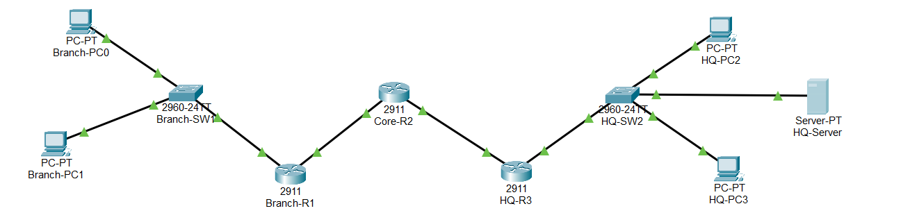

---

### Step 2 — Configure Branch-R1
Set up IP addresses on Branch router interfaces.
```
enable
configure terminal
interface gig0/0
ip address 192.168.1.1 255.255.255.0
no shutdown
exit
interface gig0/1
ip address 10.0.0.1 255.255.255.252
no shutdown
exit
```
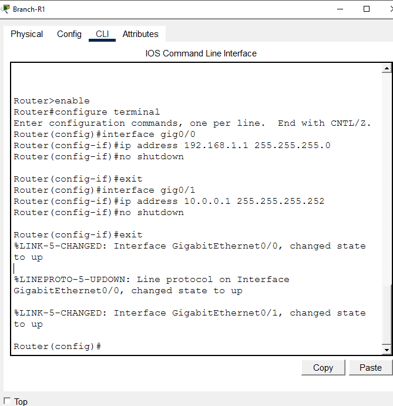

---

### Step 3 — Configure Core-R2
Set up IP addresses on Core router interfaces.
```
enable
configure terminal
interface gig0/0
ip address 10.0.0.2 255.255.255.252
no shutdown
exit
interface gig0/1
ip address 10.0.1.1 255.255.255.252
no shutdown
exit
```
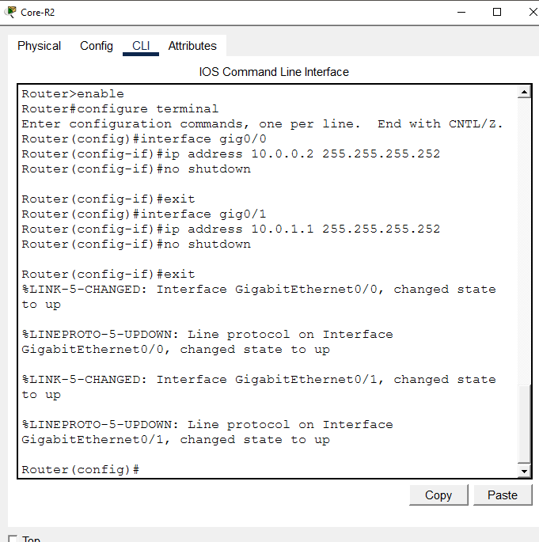

---

### Step 4 — Configure HQ-R3
Set up IP addresses on HQ router interfaces.
```
enable
configure terminal
interface gig0/0
ip address 10.0.1.2 255.255.255.252
no shutdown
exit
interface gig0/1
ip address 192.168.2.1 255.255.255.0
no shutdown
exit
```
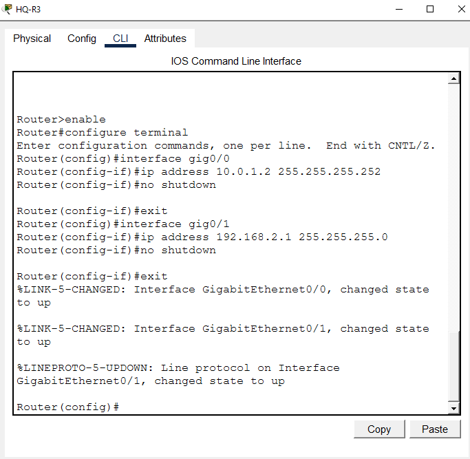

---

### Step 5 — Configure PC and Server IPs
Assign static IPs to all end devices.
```
Branch-PC0 → Desktop → IP Configuration → Static
→ IP: 192.168.1.10 | Mask: 255.255.255.0 | GW: 192.168.1.1

Branch-PC1 → Desktop → IP Configuration → Static
→ IP: 192.168.1.11 | Mask: 255.255.255.0 | GW: 192.168.1.1

HQ-PC2 → Desktop → IP Configuration → Static
→ IP: 192.168.2.20 | Mask: 255.255.255.0 | GW: 192.168.2.1

HQ-PC3 → Desktop → IP Configuration → Static
→ IP: 192.168.2.21 | Mask: 255.255.255.0 | GW: 192.168.2.1

HQ-Server → Desktop → IP Configuration → Static
→ IP: 192.168.2.10 | Mask: 255.255.255.0 | GW: 192.168.2.1
```
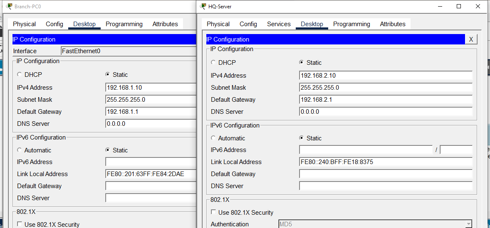

---

### Step 6 — Configure Static Routing
Add static routes on all three routers for full inter-network connectivity.
```
Branch-R1:
ip route 10.0.1.0 255.255.255.252 10.0.0.2
ip route 192.168.2.0 255.255.255.0 10.0.0.2

Core-R2:
ip route 192.168.1.0 255.255.255.0 10.0.0.1
ip route 192.168.2.0 255.255.255.0 10.0.1.2

HQ-R3:
ip route 192.168.1.0 255.255.255.0 10.0.1.1
ip route 10.0.0.0 255.255.255.252 10.0.1.1
```
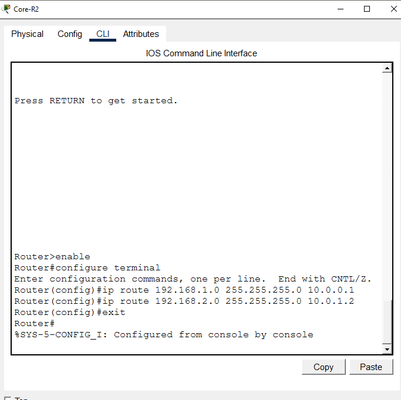

---

### Step 7 — Pre-ACL Ping Test
Verify full connectivity before applying ACL — all pings should succeed.
```
Branch-PC0> ping 192.168.2.10  → Reply
Branch-PC0> ping 192.168.2.20  → Reply
Branch-PC0> ping 192.168.2.21  → Reply
Branch-PC1> ping 192.168.2.10  → Reply (will be blocked after ACL)

→ All hosts reachable — no restrictions yet
```
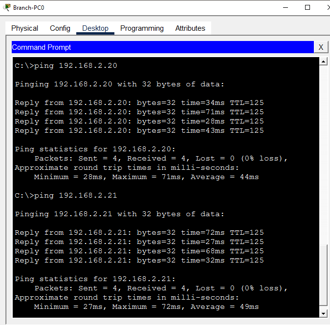

---

### Step 8 — Configure Standard Numbered ACL
Create a standard numbered ACL on Core-R2 to block Branch-PC1.
```
enable
configure terminal
access-list 10 deny 192.168.1.11 0.0.0.0
access-list 10 permit any
exit

→ ACL 10: deny host 192.168.1.11
→ ACL 10: permit any
```
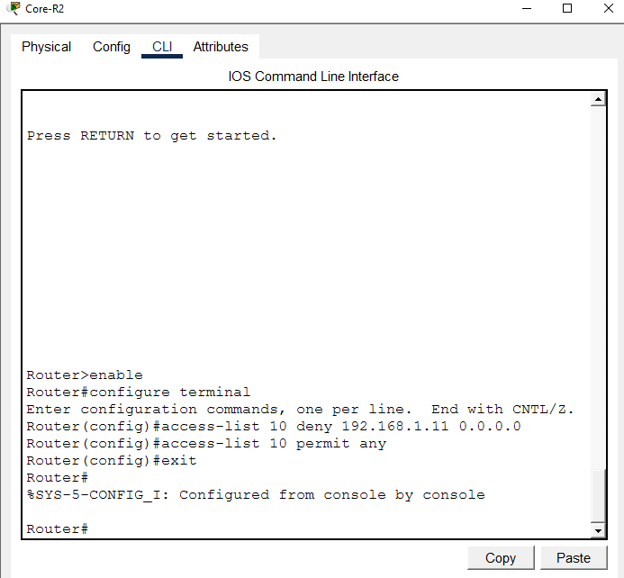

---

### Step 9 — Apply ACL to Interface
Apply the ACL inbound on Core-R2 Gig0/0 to filter incoming Branch traffic.
```
enable
configure terminal
interface gig0/0
ip access-group 10 in
exit

→ ACL 10 applied inbound on Gig0/0
→ All traffic from Branch filtered through ACL
```
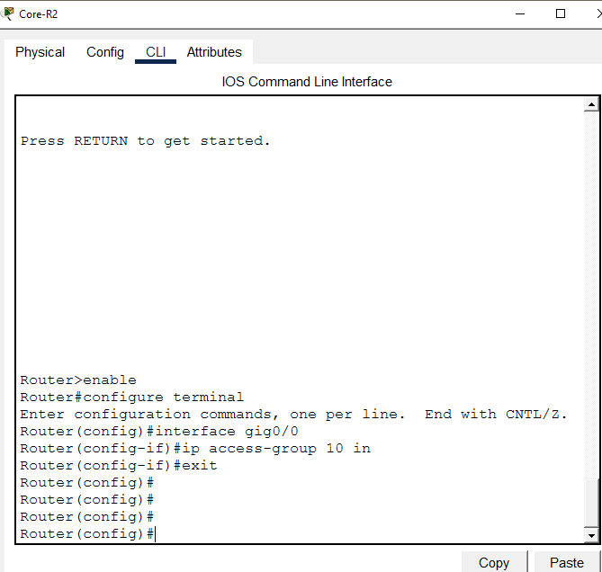

---

### Step 10 — Verify ACL Configuration
Confirm ACL is correctly configured and applied to the interface.
```
show access-lists
→ Standard IP access list 10
    10 deny host 192.168.1.11
    20 permit any

show ip interface gig0/0
→ Inbound access list is 10
```
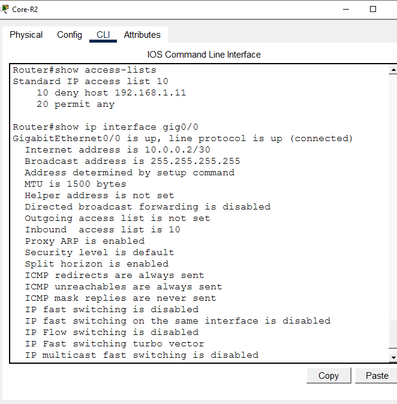

---

### Step 11 — Test Blocked Traffic
Confirm Branch-PC1 is blocked from reaching HQ network.
```
Branch-PC1> ping 192.168.2.10
→ Request timed out — BLOCKED by ACL ✅

Branch-PC1> ping 192.168.2.20
→ Request timed out — BLOCKED by ACL ✅
```
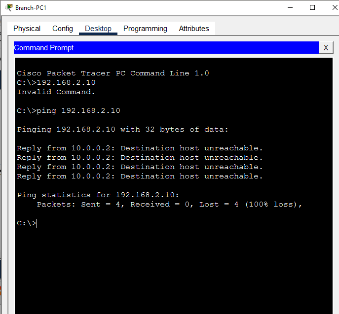

---

### Step 12 — Test Permitted Traffic
Confirm Branch-PC0 can still reach HQ network (permitted by ACL).
```
Branch-PC0> ping 192.168.2.10  → Reply ✅
Branch-PC0> ping 192.168.2.20  → Reply ✅

→ PC0 traffic permitted — ACL working correctly
```
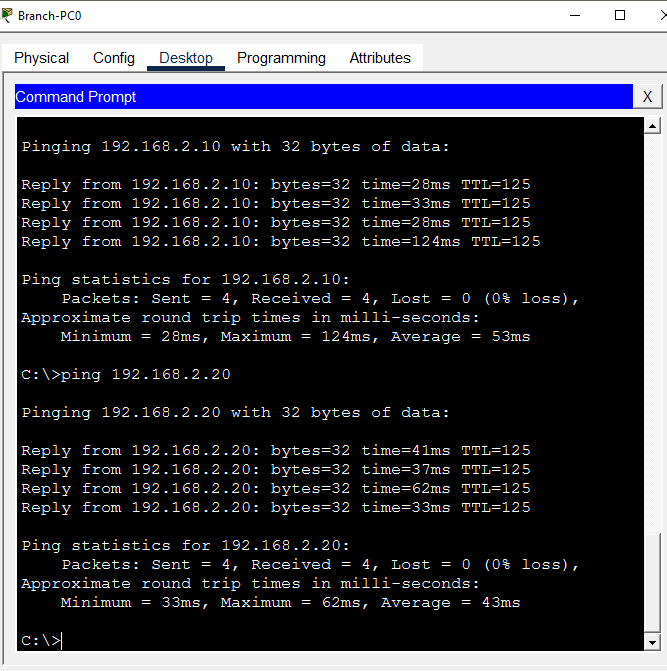

---

### Step 13 — Configure Named ACL
Replace numbered ACL with a more manageable named ACL.
```
enable
configure terminal
ip access-list standard BLOCK_PC1
deny 192.168.1.11 0.0.0.0
permit any
exit

→ Named ACL BLOCK_PC1 created
→ Same rules as numbered ACL 10
```
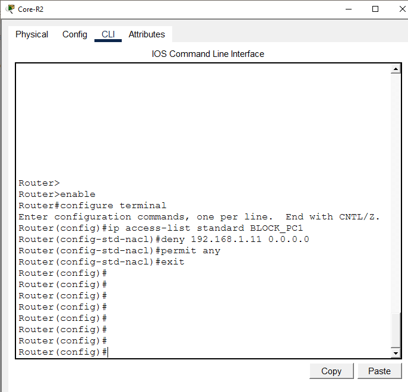

---

### Step 14 — Verify Named ACL
Confirm named ACL is correctly configured.
```
show access-lists

→ Standard IP access list BLOCK_PC1
    10 deny host 192.168.1.11
    20 permit any
→ Named ACL confirmed
```
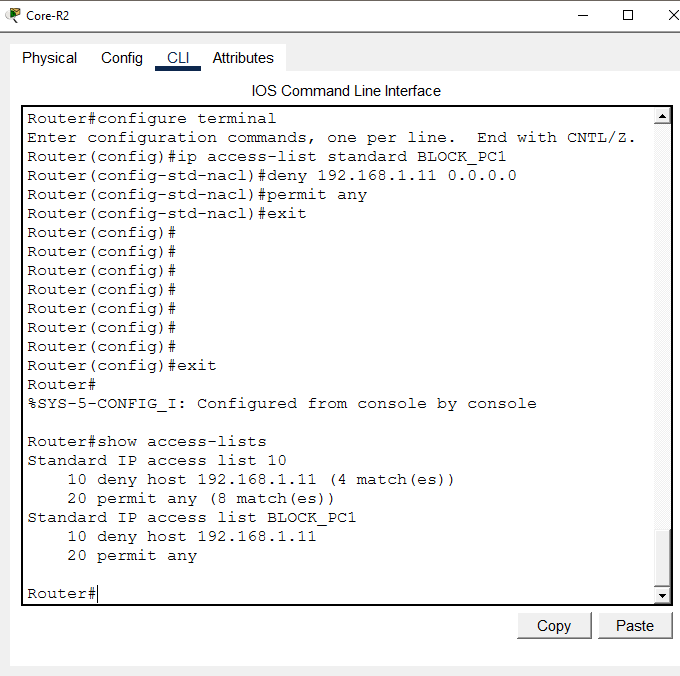

---

### Step 15 — Remove Numbered ACL and Apply Named ACL
Remove old numbered ACL and apply named ACL to interface.
```
enable
configure terminal
interface gig0/0
no ip access-group 10 in
exit
no access-list 10
interface gig0/0
ip access-group BLOCK_PC1 in
exit

→ ACL 10 removed
→ BLOCK_PC1 applied inbound on Gig0/0
```
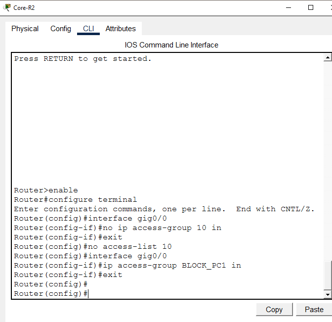

---

### Step 16 — Final ACL Verification
Verify only named ACL is active and applied correctly.
```
show access-lists
→ Standard IP access list BLOCK_PC1
    10 deny host 192.168.1.11
    20 permit any

show ip interface gig0/0
→ Inbound access list is BLOCK_PC1
→ Numbered ACL 10 removed ✅
```
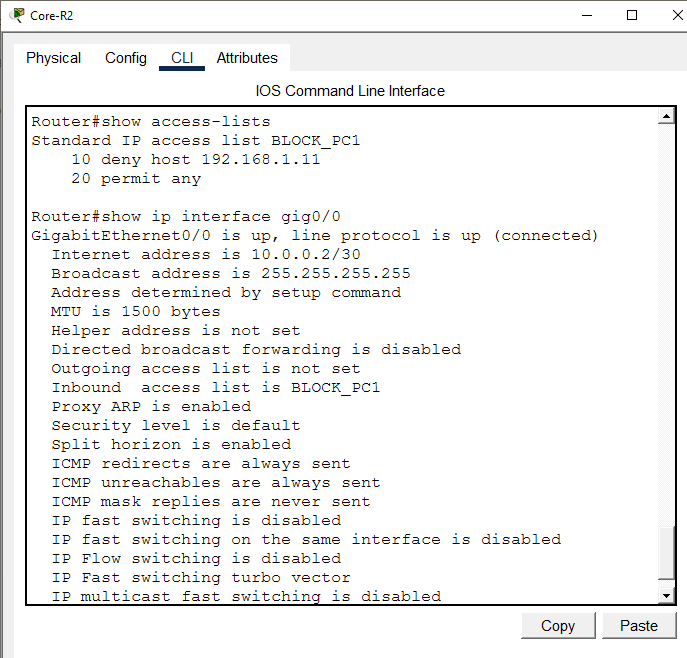

---

### Step 17 — Full Connectivity Final Test
Final verification — PC0 permitted, PC1 blocked.
```
Branch-PC0> ping 192.168.2.10  → Reply ✅ (permitted)
Branch-PC0> ping 192.168.2.20  → Reply ✅ (permitted)
Branch-PC1> ping 192.168.2.10  → Timeout ✅ (blocked)

→ ACL working correctly — lab complete
```
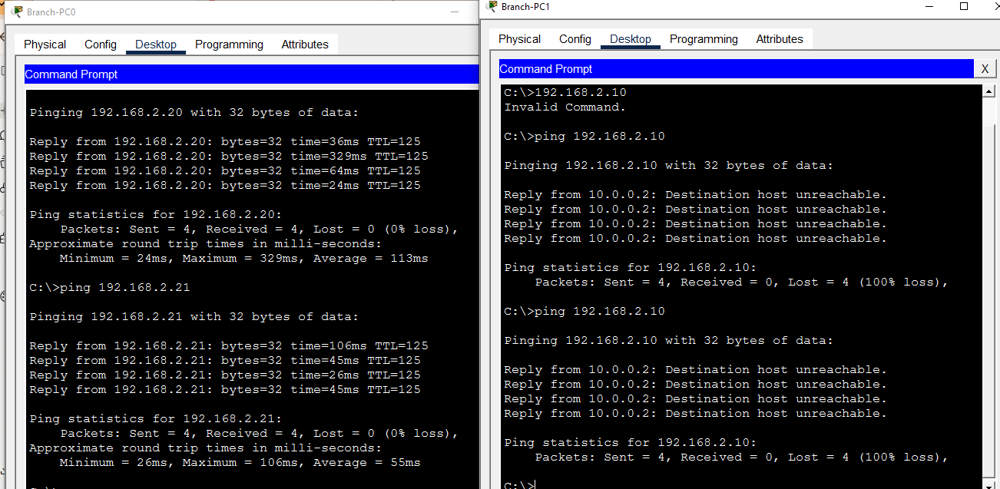

---

## 📟 Summary of Commands

| Command | Purpose |
|---------|---------|
| `access-list <num> deny <ip> <wildcard>` | Create numbered standard ACL deny rule |
| `access-list <num> permit any` | Permit all other traffic |
| `ip access-list standard <name>` | Create named standard ACL |
| `ip access-group <acl> in/out` | Apply ACL to interface |
| `no ip access-group <acl> in` | Remove ACL from interface |
| `no access-list <num>` | Delete numbered ACL |
| `show access-lists` | Verify ACL configuration and hit counts |
| `show ip interface <int>` | Verify ACL applied to interface |
| `ip route <network> <mask> <next-hop>` | Configure static route |
| `ping <ip>` | Test connectivity |

---

## ⚠️ Challenges & How I Solved Them

| Challenge | Solution |
|-----------|----------|
| HQ-PC3 ping not replying initially | Verified routing table on HQ-R3 — static routes confirmed correct, PC3 IP and gateway rechecked |
| Numbered ACL hard to manage | Replaced with named ACL BLOCK_PC1 for better readability and manageability |
| ACL applied in wrong direction | Applied inbound on Core-R2 Gig0/0 — filters traffic coming FROM Branch network |
| Old ACL conflicting with new named ACL | Removed numbered ACL 10 with `no access-list 10` before applying named ACL |
| permit any missing from ACL | Added `permit any` after deny rule — without it all traffic would be blocked (implicit deny) |

---

## 🧠 What I Learned

How to implement and manage Standard Access Control Lists on a multi-router Cisco network — including numbered and named ACL creation, wildcard mask usage for host/network matching, inbound interface application, traffic filtering verification using ping tests, and replacing numbered ACLs with named ACLs for better enterprise manageability — using Cisco Packet Tracer for full network simulation.

---

## 📁 Files

| File | Description |
|------|-------------|
| `README.md` | Full lab documentation |
| `standard-acl-lab.pkt` | Packet Tracer file |
| `screenshots/` | 17 step-by-step screenshots folder |
