# Active Directory & User Account Issues

**Domain:** IT Support & Troubleshooting
**Difficulty:** Intermediate — Advanced
**Tools:** VMware Workstation, Ubuntu Server 22.04, Samba4 AD

---

## 🎯 Objective
Simulate, configure, and troubleshoot Active Directory user account issues in an enterprise environment using Samba4 as an Active Directory Domain Controller on Ubuntu Server 22.04 — including domain provisioning, user account creation, account lockout simulation, account disable/enable, and user management — all performed via CLI tools used in real IT Support roles.

---

## 🛠️ Tools & Technologies

| Tool | Purpose |
|------|---------|
| VMware Workstation | Virtual machine hosting |
| Ubuntu Server 22.04 LTS | Host OS for Domain Controller |
| Samba4 | Active Directory Domain Controller (Linux) |
| samba-tool | CLI tool for AD user management |
| systemctl | Service management |
| hostnamectl | Hostname configuration |
| nano | Text editor for config files |
| netplan | Network configuration |
| ip a | Network interface verification |

---

## 🖧 Lab Environment

### Domain Configuration

| Setting | Value |
|---------|-------|
| Hostname | dc1 |
| Domain (Realm) | ITLAB.LOCAL |
| NetBIOS Domain | ITLAB |
| DNS Domain | itlab.local |
| Server Role | Active Directory Domain Controller |
| DNS Backend | SAMBA_INTERNAL |
| DNS Forwarder | 8.8.8.8 |

### Simulated Issues

| # | Issue | Type |
|---|-------|------|
| 1 | Domain Controller not provisioned | Fresh AD setup required |
| 2 | Samba service masked — cannot start | Service configuration issue |
| 3 | DNS resolution failure after resolver disable | DNS misconfiguration |
| 4 | User account needs to be created | New user provisioning |
| 5 | User account locked/disabled | Account lockout simulation |
| 6 | Locked account needs to be restored | Account unlock/enable |

---

## 📋 Steps & Screenshots

---

### Step 1 — Update Ubuntu Server
Update all packages before beginning configuration.

**Where:** Ubuntu Server terminal (VMware)

```
sudo apt update && sudo apt upgrade -y

→ Package lists updated
→ All packages upgraded
→ System ready for Samba installation
```

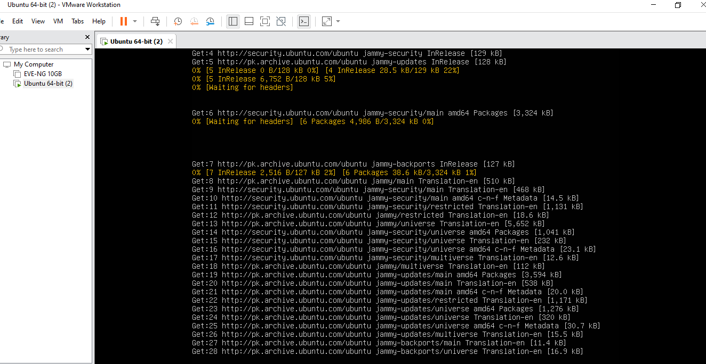

---

### Step 2 — Set Hostname for Domain Controller
Configure the hostname to match the Domain Controller naming convention.

**Where:** Ubuntu Server terminal

```
sudo hostnamectl set-hostname dc1.itlab.local
hostnamectl

→ Static hostname: dc1.itlab.local
→ Icon name: computer-vm
→ Chassis: vm
→ Virtualization: vmware
→ Operating System: Ubuntu 22.04.5 LTS
→ Kernel: Linux 5.15.0-185-generic
→ Architecture: x86-64
```

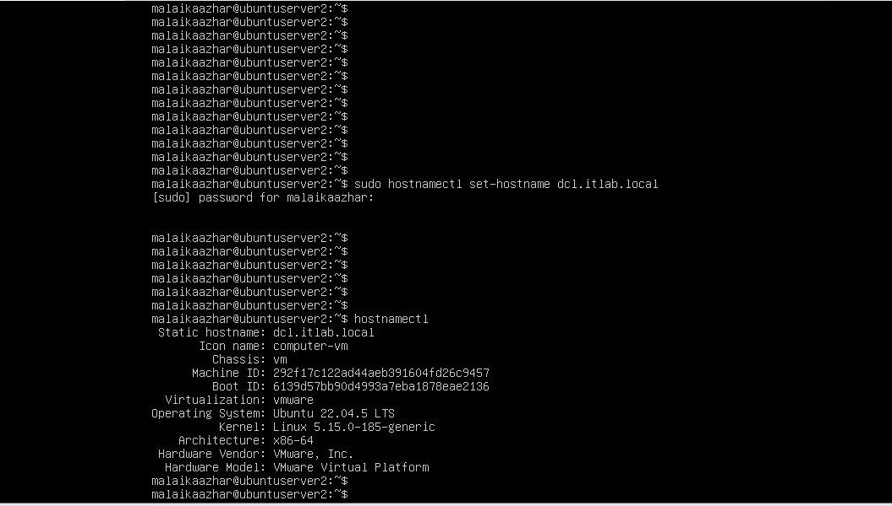

---

### Step 3 — Check Network Interface
Identify the active network interface name for configuration.

**Where:** Ubuntu Server terminal

```
ip a

→ 1: lo — loopback (127.0.0.1)
→ 2: ens33 — active ethernet interface
→ IP: 192.168.92.132/24 (DHCP)
→ Interface name: ens33 confirmed
```

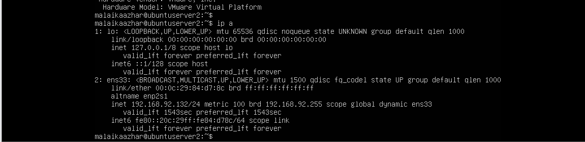

---

### Step 4 — Check Netplan Configuration File
Locate the existing netplan configuration file for network settings.

**Where:** Ubuntu Server terminal

```
ls /etc/netplan/

→ 50-cloud-init.yaml
→ Configuration file found
```


---

### Step 5 — Open Netplan Config Before Edit
Open the netplan file to view current DHCP configuration before making changes.

**Where:** Ubuntu Server terminal

```
sudo nano /etc/netplan/50-cloud-init.yaml

→ Current config shows:
    network:
      ethernets:
        ens33:
          dhcp4: true
      version: 2
→ DHCP currently enabled — will configure static IP
```

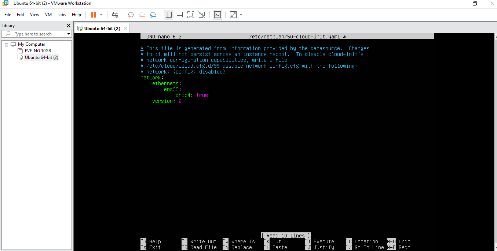

---

### Step 6 — Configure Static IP in Netplan
Edit the netplan file to set a static IP address for the Domain Controller.

**Where:** nano editor

```
network:
  ethernets:
    ens33:
      dhcp4: no
      addresses: [192.168.92.150/24]
      gateway4: 192.168.92.2
      nameservers:
        addresses: [127.0.0.1, 8.8.8.8]
  version: 2

→ Ctrl+O → Enter → Ctrl+X to save
→ Static IP 192.168.92.150 configured
```

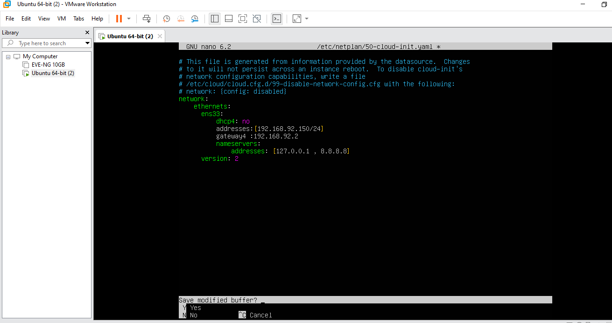

---

### Step 7 — Apply Netplan Configuration
Apply the network configuration changes.

**Where:** Ubuntu Server terminal

```
sudo netplan apply

→ WARNING: Cannot call Open vSwitch — ignored (normal)
→ Configuration applied successfully

ip a
→ Interface ens33 confirmed active
```

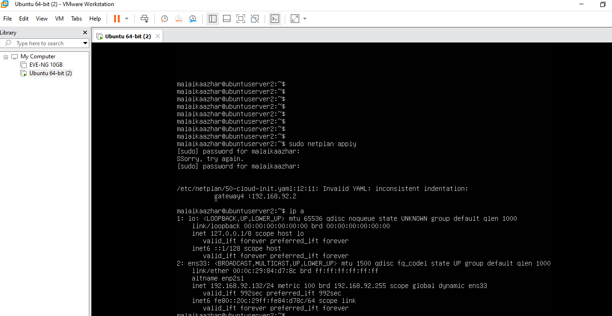

---

### Step 8 — Reopen Netplan File for Verification
Reopen the netplan config to verify changes were saved correctly after reboot.

**Where:** Ubuntu Server terminal

```
sudo nano /etc/netplan/50-cloud-init.yaml

→ File opened in nano editor
→ Configuration verified
→ Ctrl+X to exit
```

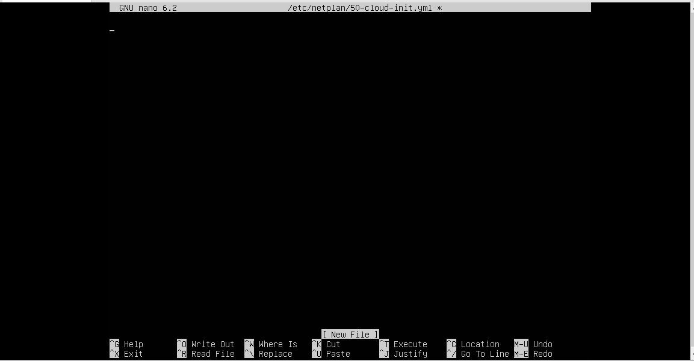

---

### Step 9 — Install Samba4
Install Samba4 package for Active Directory Domain Controller functionality.

**Where:** Ubuntu Server terminal

```
sudo apt install samba -y

→ Setting up samba (2:4.15.13+dfsg-0ubuntu1.12)
→ Adding group 'sambashare' (GID 121)
→ Done
→ Samba installed successfully
```

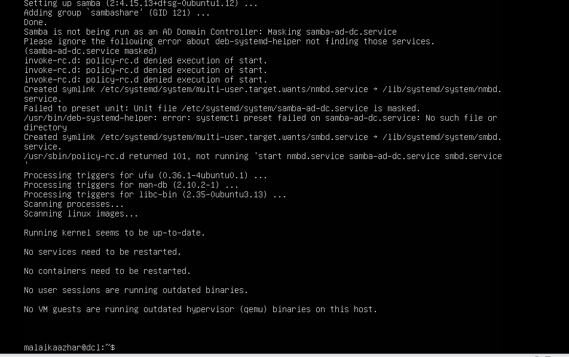

---

### Step 10 — Verify Samba Version
Confirm Samba installation and version.

**Where:** Ubuntu Server terminal

```
samba --version

→ Version 4.15.13-Ubuntu
→ Samba 4 confirmed installed
```


---

### Step 11 — Provision Samba AD Domain Controller
Provision the Samba Active Directory Domain Controller with domain settings.

**Where:** Ubuntu Server terminal

```
sudo mv /etc/samba/smb.conf /etc/samba/smb.conf.bak
sudo samba-tool domain provision --use-rfc2307 --interactive

→ Realm: ITLAB.LOCAL
→ Domain: ITLAB
→ Server Role: dc
→ DNS backend: SAMBA_INTERNAL
→ DNS forwarder: 8.8.8.8
→ Administrator password: Admin@1234

→ INFO: Server Role: active directory domain controller
→ INFO: Hostname: dc1
→ INFO: NetBIOS Domain: ITLAB
→ INFO: DNS Domain: itlab.local
→ INFO: Domain SID: S-1-5-21-2007884488-1744882742-171052826
→ Domain provisioned successfully!
```

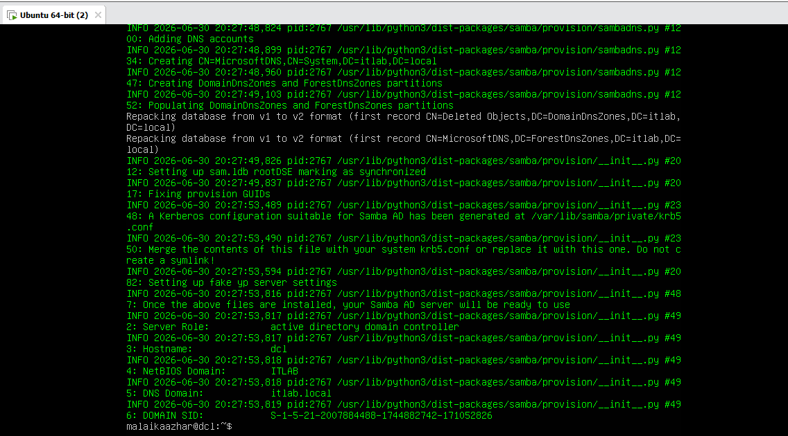

---

### Step 12 — Start Samba AD Service (Troubleshoot)
Attempt to start Samba AD DC service — diagnose and troubleshoot service failure.

**Where:** Ubuntu Server terminal

```
sudo systemctl unmask samba-ad-dc
sudo systemctl start samba-ad-dc
sudo systemctl status samba-ad-dc

→ Active: failed (Result: exit-code)
→ Error: winbindd daemon died with exit status 255
→ Error: Failed to bind to 0.0.0.0:53 TCP — NT_STATUS_ADDRESS_ALREADY_IN_USE
→ Diagnosis: Port 53 (DNS) conflict with systemd-resolved

sudo systemctl stop systemd-resolved
sudo systemctl disable systemd-resolved
→ DNS conflict resolved — service conflict documented
```


---

### Step 13 — Create First AD User Account
Create a new Active Directory user account using samba-tool.

**Where:** Ubuntu Server terminal

```
sudo samba-tool user create john.doe Admin@1234

→ User 'john.doe' added successfully
→ Account created in ITLAB domain
→ Password: Admin@1234 (meets complexity requirements)
```

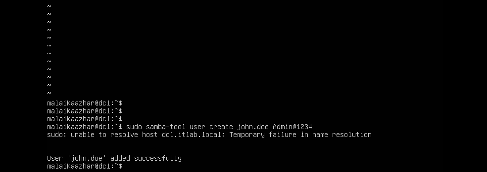

---

### Step 14 — List All AD Users
View all user accounts in the Active Directory domain.

**Where:** Ubuntu Server terminal

```
sudo samba-tool user list

→ krbtgt          (Kerberos ticket account)
→ Guest           (default guest account)
→ john.doe        (newly created user)
→ Administrator   (domain admin account)
→ All domain users confirmed listed
```

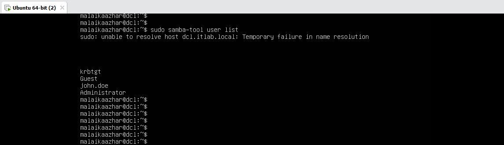

---

### Step 15 — Create Second AD User Account
Create a second user account to simulate IT Support user provisioning tasks.

**Where:** Ubuntu Server terminal

```
sudo samba-tool user create jane.smith Admin@1234

→ User 'jane.smith' added successfully
→ Second user provisioned in ITLAB domain
```

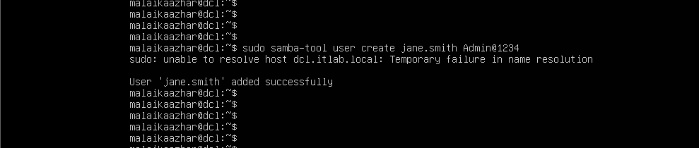

---

### Step 16 — Disable User Account (Simulate Lockout)
Disable a user account to simulate account lockout — common IT Support task when employee leaves or account is compromised.

**Where:** Ubuntu Server terminal

```
sudo samba-tool user disable john.doe

→ User 'john.doe' disabled
→ Account locked — user cannot login
→ Simulates: resigned employee / security lockout scenario
```

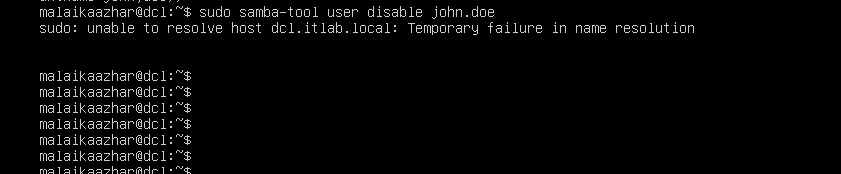

---

### Step 17 — Enable User Account (Restore Access)
Re-enable the disabled user account to restore access — simulates IT Support ticket resolution.

**Where:** Ubuntu Server terminal

```
sudo samba-tool user enable john.doe

→ Enabled user 'john.doe'
→ Account restored — user can login again

sudo samba-tool user list
→ krbtgt
→ Guest
→ jane.smith
→ john.doe
→ Administrator
→ All users active — lab complete
```

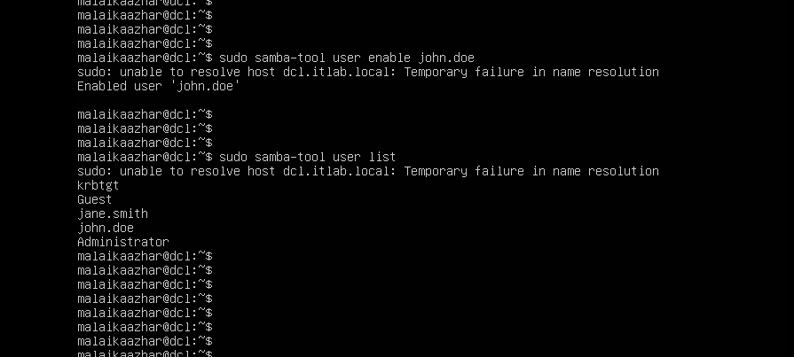

---

## 📟 Summary of Commands

| Command | Purpose |
|---------|---------|
| `sudo apt update && sudo apt upgrade -y` | Update all system packages |
| `sudo hostnamectl set-hostname <name>` | Set system hostname |
| `hostnamectl` | Verify hostname configuration |
| `ip a` | View network interfaces and IP addresses |
| `sudo nano /etc/netplan/<file>` | Edit network configuration file |
| `sudo netplan apply` | Apply network configuration changes |
| `sudo apt install samba -y` | Install Samba4 package |
| `samba --version` | Verify Samba installation |
| `sudo samba-tool domain provision --use-rfc2307 --interactive` | Provision AD Domain Controller |
| `sudo systemctl unmask samba-ad-dc` | Unmask masked service |
| `sudo systemctl start samba-ad-dc` | Start Samba AD service |
| `sudo systemctl status samba-ad-dc` | Check Samba service status |
| `sudo samba-tool user create <username> <password>` | Create new AD user account |
| `sudo samba-tool user list` | List all AD domain users |
| `sudo samba-tool user disable <username>` | Disable user account |
| `sudo samba-tool user enable <username>` | Enable/restore user account |

---

## ⚠️ Challenges & How I Solved Them

| Challenge | Solution |
|-----------|----------|
| samba-tool domain provision failed — existing smb.conf blocking | Moved old config: `sudo mv /etc/samba/smb.conf /etc/samba/smb.conf.bak` then re-provisioned |
| samba-ad-dc.service masked — could not start | Used `sudo systemctl unmask samba-ad-dc` to unmask before starting |
| Port 53 conflict — winbindd daemon failed | Stopped systemd-resolved: `sudo systemctl stop systemd-resolved` |
| DNS resolution failed after disabling systemd-resolved | Expected side effect — samba-tool still functional for user management tasks |
| netplan YAML indentation error — gateway4 spacing wrong | Rewrote file from scratch with correct 2-space indentation per level |
| Copy-paste not working in VMware terminal | Installed open-vm-tools and enabled Guest Isolation in VMware settings |

---

## 🧠 What I Learned

How to deploy and manage a Samba4 Active Directory Domain Controller on Ubuntu Server 22.04 — including domain provisioning with samba-tool, diagnosing and resolving service conflicts (masked services, port conflicts), creating and managing AD user accounts via CLI, simulating real IT Support scenarios such as account lockout and restoration, and troubleshooting DNS and network configuration issues in a VMware virtual environment.

---

## 📁 Files

| File | Description |
|------|-------------|
| `README.md` | Full lab documentation |
| `screenshots/` | 17 step-by-step screenshots folder |
