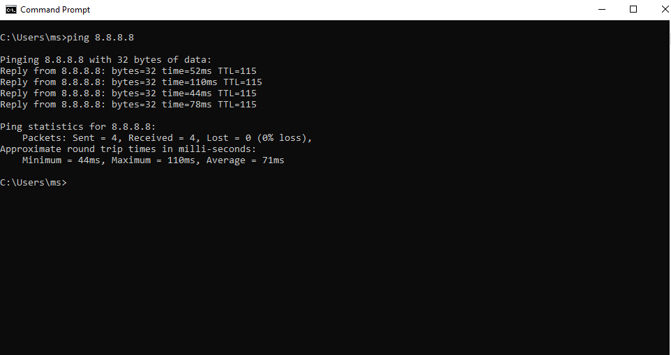
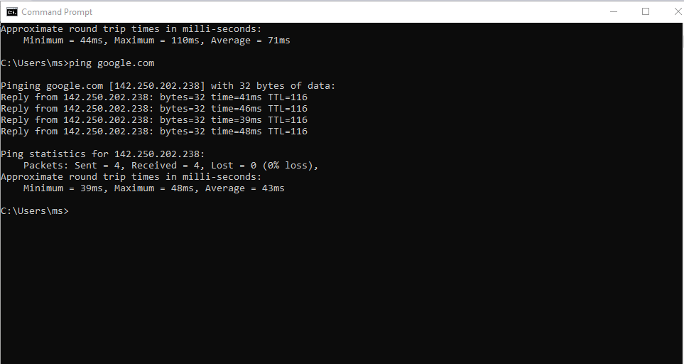
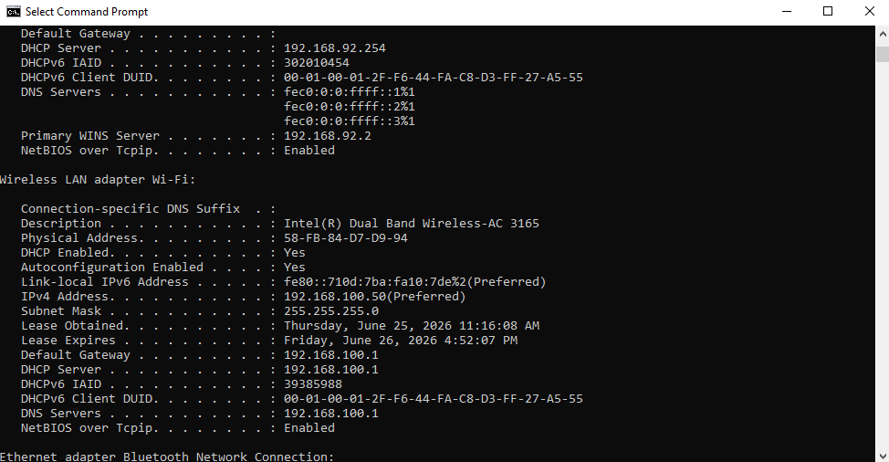
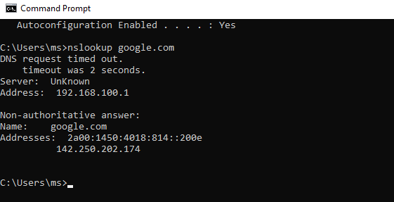
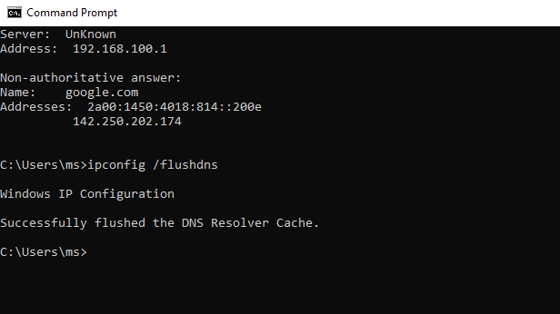
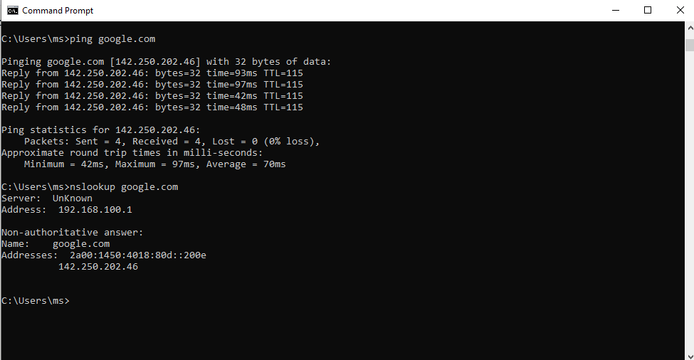
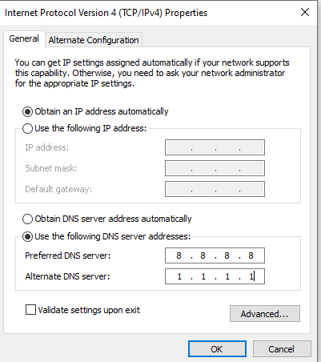
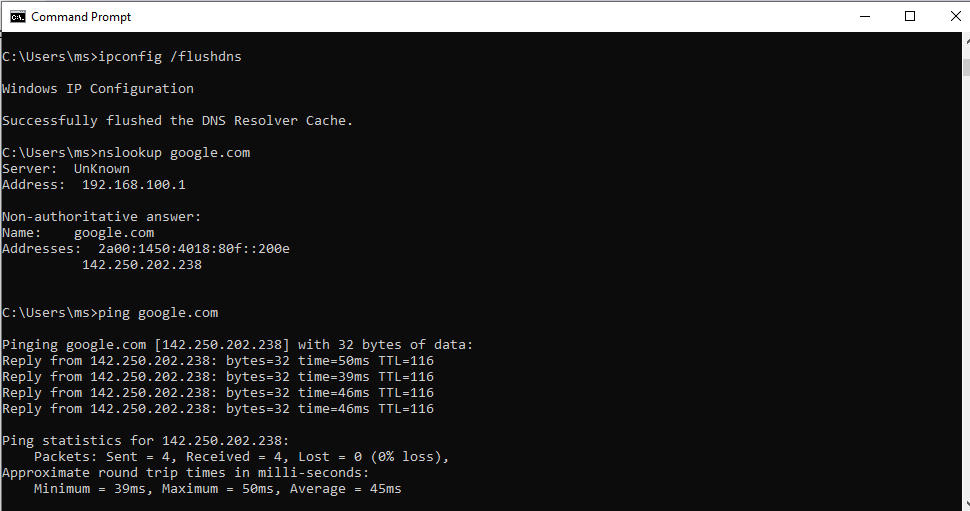
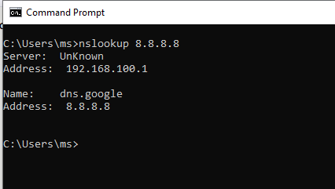
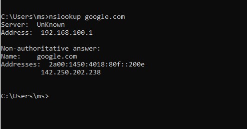

# DNS Troubleshooting & Resolution

**Domain:** IT Support & Troubleshooting
**Difficulty:** Beginner — Intermediate
**Tools:** Windows 10 Command Prompt (native — no Packet Tracer, no VM)

---

## 🎯 Objective
Diagnose and resolve a real DNS resolution delay on a Windows 10 machine using built-in command-line tools — performed live on physical hardware, not a simulator or VM.

---

## 🛠️ Tools & Technologies
| Tool | Purpose |
|------|---------|
| Command Prompt (cmd.exe) | Run all diagnostic commands |
| `nslookup` | Query DNS servers directly, test resolution |
| `ipconfig` | View/flush DNS cache, check adapter DNS settings |
| `ping` | Confirm connectivity after DNS resolves |
| Windows Network Settings | Manually set public DNS server |

---

## 🖧 Environment

### Device
- 1 Windows 10 Pro 64-bit PC (HP 255 G5, real hardware, no VM)
- Wi-Fi adapter: Intel(R) Dual Band Wireless-AC 3165
- Default DNS (before change): 192.168.100.1 (home router)

No topology diagram needed — this lab runs entirely on the local machine's network stack.

---

## 📋 Steps & Screenshots

### Step 1 — Confirm Baseline Connectivity
```
ping 8.8.8.8
```
Result: Successful reply — confirmed the PC had working Layer 3 connectivity before testing DNS.


---

### Step 2 — Test Domain Resolution
```
ping google.com
```
Result: **Successful** — domain resolved and replied normally. (Note: the original lab plan expected this step to fail as a staged scenario. In this real run, DNS was already healthy at this point, so it succeeded. This is documented as-is rather than forcing a fake failure.)


---

### Step 3 — Check Current DNS Configuration
```
ipconfig /all
```
Result: Active Wi-Fi adapter showed DNS Servers = 192.168.100.1 (the home router itself acting as DNS relay), Default Gateway 192.168.100.1, IPv4 address 192.168.100.50.


---

### Step 4 — Query DNS Directly with nslookup
```
nslookup google.com
```
Result: **Request timed out.** This was the real fault found in this lab — `ping` worked (using cached/system resolver data) but a direct query to the DNS server (192.168.100.1) timed out, indicating the router's DNS relay was not responding to direct queries at that moment.


---

### Step 5 — Flush DNS Cache
```
ipconfig /flushdns
```
Result: Successfully flushed the DNS Resolver Cache.


---

### Step 6 — Re-test After Flush
```
ping google.com
nslookup google.com
```
Result: **Fixed.** `ping` replied successfully, and `nslookup` now returned a resolved IP address with no timeout. The flush resolved the issue — confirming the DNS Server timeout in Step 4 was caused by stale/corrupted local cache, not a router or ISP fault.


---

### Step 7 — Manually Set a Public DNS Server (Extra Learning Step)
The issue was already resolved by Step 6. This step was done as an additional exercise to practice manual DNS configuration, not because it was required to fix the fault.
```
Control Panel > Network Connections > Wi-Fi > Properties >
Internet Protocol Version 4 (TCP/IPv4) > Properties >
Use the following DNS server addresses:

Preferred DNS: 8.8.8.8
Alternate DNS: 1.1.1.1
```


---

### Step 8 — Verify Resolution with New DNS
```
ipconfig /flushdns
nslookup google.com
ping google.com
```
Result: Resolution worked correctly using Google Public DNS (8.8.8.8) instead of the router's relay.


---

### Step 9 — Reverse DNS Lookup
```
nslookup 8.8.8.8
```
Result: Verified reverse lookup behavior against a known public DNS IP.


---

### Step 10 — Document Resolution Response Time
```
nslookup google.com
```
Result: Captured response time shown in nslookup output, confirming consistent resolution after the DNS change.


---

## 📟 Summary of Commands
| Command | Purpose |
|---------|---------|
| `ping <IP>` | Test Layer 3 connectivity, rule out network issues |
| `ping <domain>` | Test if domain resolves and responds |
| `ipconfig /all` | View current DNS server configuration |
| `nslookup <domain>` | Query DNS server directly, bypass local cache |
| `ipconfig /flushdns` | Clear local DNS resolver cache |
| `nslookup <IP>` | Reverse DNS lookup (IP → hostname) |

---

## ⚠️ Challenges & How I Solved Them
| Challenge | Solution |
|-----------|----------|
| `ping google.com` worked but `nslookup google.com` timed out | Identified this as a direct-query failure to the DNS server, separate from cached resolution |
| Router's DNS relay (192.168.100.1) not responding to nslookup | Ran `ipconfig /flushdns` — this resolved the issue, confirming it was a local cache fault, not a router/ISP fault |
| Needed to verify fix held after cache flush | Re-ran both `ping` and `nslookup` together to confirm consistent resolution |
| Wanted additional practice beyond the fix | Manually configured public DNS (8.8.8.8 / 1.1.1.1) as an extra exercise, even though it wasn't required to solve the original fault |

---

## 🧠 What I Learned
- How to tell the difference between a **connectivity problem** (ping by IP fails) and a **DNS problem** (ping by IP works, ping by domain fails or is inconsistent).
- Why `ping <domain>` and `nslookup <domain>` can give different results — `ping` can use cached/system resolver data, while `nslookup` queries the DNS server directly with no cache fallback.
- That a DNS Server timeout doesn't always mean the DNS server itself is down — in this case it was resolved by clearing local cache, not by changing the DNS server.
- How to manually configure a public DNS server (Google/Cloudflare) on a Windows 10 adapter, as an alternative to relying on a router's default DNS relay.

---

## 📁 Files
| File | Description |
|------|-------------|
| `README.md` | Full lab documentation |
| Screenshots | Captured live from actual Command Prompt sessions on real hardware, file extension `.PNG` |

---

## 📝 Note on Environment
Unlike the Networking and Security labs in this portfolio, this lab does not use Cisco Packet Tracer or any virtual machine. It was performed directly on a Windows 10 Pro 64-bit physical machine (HP 255 G5), since DNS troubleshooting is an OS-level skill, not a network-device skill. All results documented here are real outputs from this machine, not staged or simulated.
