# Email & Network Connectivity Troubleshooting

**Domain:** IT Support & Troubleshooting
**Difficulty:** Intermediate — Advanced
**Tools:** Windows 10 Pro, CMD, PowerShell

---

## 🎯 Objective
Simulate, diagnose, and resolve common email connectivity and mail server issues encountered in enterprise IT support — including DNS resolution failures, SMTP/IMAP/POP3 port connectivity testing, firewall inspection, wrong DNS server simulation, MX record verification, and full network connectivity validation — using Windows 10 Pro with CMD and PowerShell diagnostic tools.

---

## 🛠️ Tools & Technologies

| Tool | Purpose |
|------|---------|
| Windows 10 Pro | Host OS environment |
| CMD (Command Prompt) | Primary diagnostic tool |
| PowerShell | Port connectivity testing |
| ipconfig | View full network and DNS configuration |
| nslookup | DNS resolution and MX record lookup |
| ping | Test reachability of mail servers |
| tracert | Trace route to mail server hop by hop |
| netstat | View active TCP connections and listening ports |
| netsh advfirewall | Inspect Windows Firewall profile settings |
| Test-NetConnection | Test SMTP / IMAP / POP3 port connectivity |

---

## 🖧 Lab Environment

### Simulated Issues

| # | Issue | Type |
|---|-------|------|
| 1 | Cannot resolve mail server hostname | DNS resolution failure |
| 2 | SMTP port 587 blocked or unreachable | SMTP connectivity failure |
| 3 | IMAP port 993 unreachable | IMAP connectivity failure |
| 4 | POP3 port 995 unreachable | POP3 connectivity failure |
| 5 | Wrong DNS server configured — lookup fails | DNS misconfiguration |
| 6 | Firewall blocking inbound mail connections | Firewall policy issue |
| 7 | MX records missing or unresolvable | Mail exchanger misconfiguration |
| 8 | Mail servers unreachable via ping | Network connectivity failure |

---

## 📋 Steps & Screenshots

---

### Step 1 — Launch CMD
Open Command Prompt to begin all diagnostics.

**Where:** Win + R → type `cmd` → Enter

```
Win + R
cmd
Enter

→ CMD opens: C:\Users\ms>
→ Windows 10 Pro Version confirmed in title bar
```

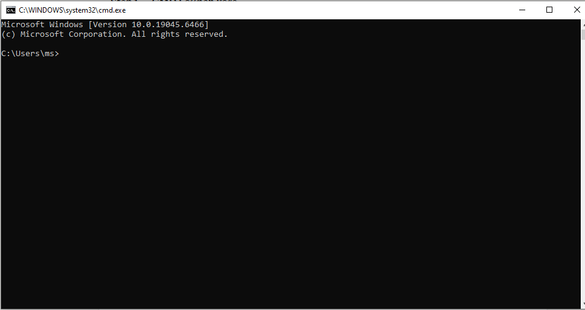

---

### Step 2 — View Full Network Configuration
Run ipconfig /all to capture the full IP, DNS, and gateway configuration of the host.

**Where:** CMD

```
ipconfig /all

→ Host Name: DESKTOP-65FV864
→ Ethernet adapter: Media disconnected
→ Wi-Fi adapter: IP 192.168.100.50
→ Default Gateway: 192.168.100.1
→ DHCP Enabled: Yes
→ Physical Address (MAC): shown for each adapter
→ Bitdefender TAP Adapter also listed
```

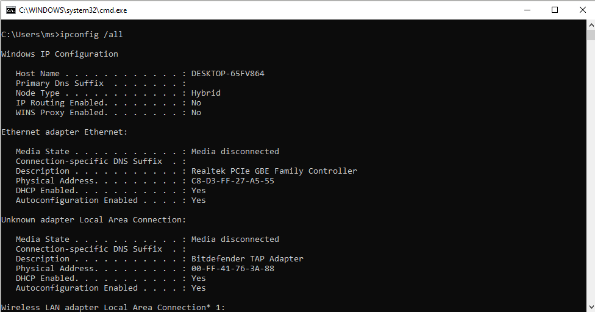

---

### Step 3 — DNS Lookup for Gmail
Verify DNS resolution for Gmail mail server to confirm DNS is working correctly.

**Where:** CMD

```
nslookup gmail.com

→ Server: UnKnown
→ Address: 192.168.100.1
→ Non-authoritative answer:
→ Name: gmail.com
→ Addresses: 2a00:1450:4018:80f::2005
              142.250.202.37
→ DNS resolution successful
```

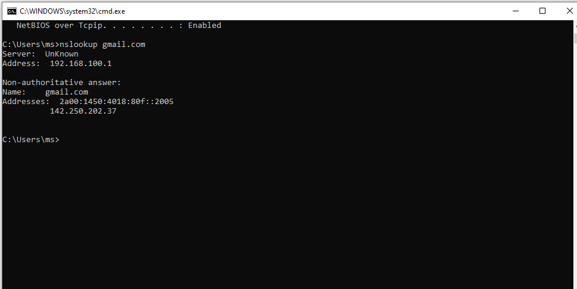

---

### Step 4 — DNS Lookup for Outlook
Verify DNS resolution for Outlook mail server to confirm multiple IP load balancing.

**Where:** CMD

```
nslookup outlook.com

→ Server: UnKnown
→ Address: 192.168.100.1
→ Non-authoritative answer:
→ Name: outlook.com
→ Addresses: 52.96.91.34
              52.96.222.194
              52.96.223.2
              52.96.172.98
              52.96.111.82
              (multiple IPs — load balanced)
→ DNS resolution successful
```

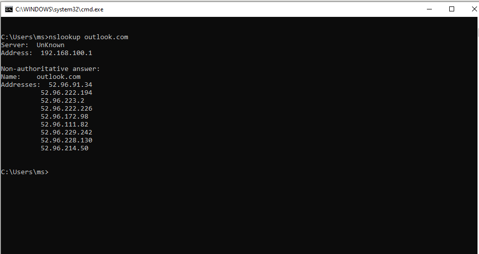

---

### Step 5 — Ping SMTP Mail Server
Test basic network reachability to Gmail SMTP server to confirm no packet loss.

**Where:** CMD

```
ping smtp.gmail.com

→ Pinging smtp.gmail.com [142.251.127.108]
→ Reply from 142.251.127.108: bytes=32 time=204ms TTL=103
→ Reply from 142.251.127.108: bytes=32 time=198ms TTL=103
→ Reply from 142.251.127.108: bytes=32 time=206ms TTL=103
→ Reply from 142.251.127.108: bytes=32 time=266ms TTL=103
→ Packets: Sent=4, Received=4, Lost=0 (0% loss)
→ Mail server reachable — no packet loss
```

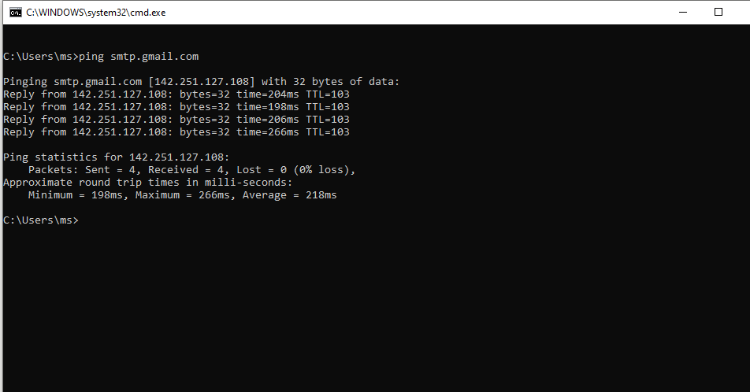

---

### Step 6 — Test SMTP Port 587 Connectivity
Test if SMTP submission port 587 is open and reachable — required for sending email.

**Where:** PowerShell (Win + R → powershell)

```
Test-NetConnection -ComputerName smtp.gmail.com -Port 587

→ ComputerName   : smtp.gmail.com
→ RemoteAddress  : 142.251.127.108
→ RemotePort     : 587
→ InterfaceAlias : Wi-Fi
→ SourceAddress  : 192.168.100.50
→ TcpTestSucceeded : True
→ SMTP port 587 is OPEN — email sending possible
```

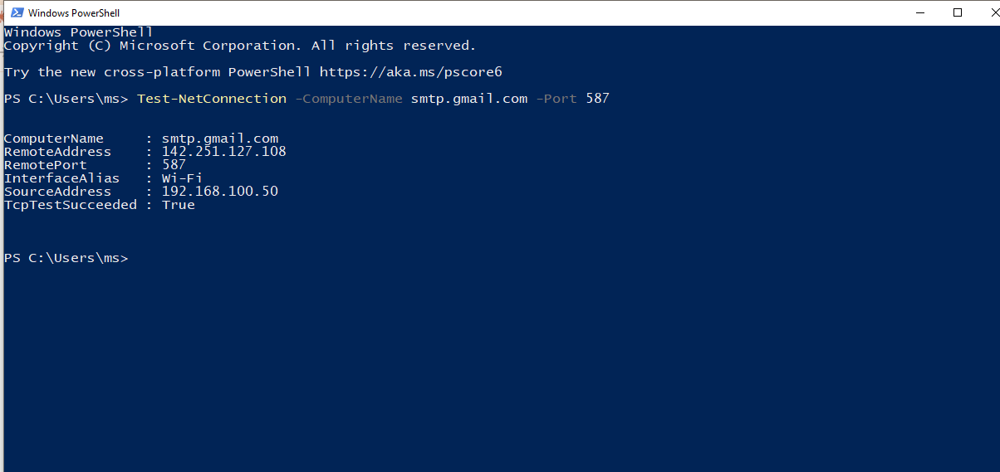

---

### Step 7 — Test IMAP Port 993 Connectivity
Test if IMAP SSL port 993 is open — required for receiving email via IMAP protocol.

**Where:** PowerShell

```
Test-NetConnection -ComputerName imap.gmail.com -Port 993

→ ComputerName   : imap.gmail.com
→ RemoteAddress  : 64.233.184.108
→ RemotePort     : 993
→ InterfaceAlias : Wi-Fi
→ SourceAddress  : 192.168.100.50
→ TcpTestSucceeded : True
→ IMAP port 993 is OPEN — email receiving via IMAP confirmed
```

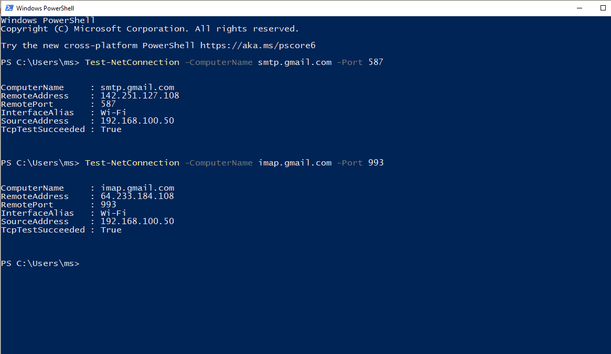

---

### Step 8 — Test POP3 Port 995 Connectivity
Test if POP3 SSL port 995 is open — required for receiving email via POP3 protocol.

**Where:** PowerShell

```
Test-NetConnection -ComputerName pop.gmail.com -Port 995

→ ComputerName   : pop.gmail.com
→ RemoteAddress  : 142.251.127.108
→ RemotePort     : 995
→ InterfaceAlias : Wi-Fi
→ SourceAddress  : 192.168.100.50
→ TcpTestSucceeded : True
→ POP3 port 995 is OPEN — email receiving via POP3 confirmed
```

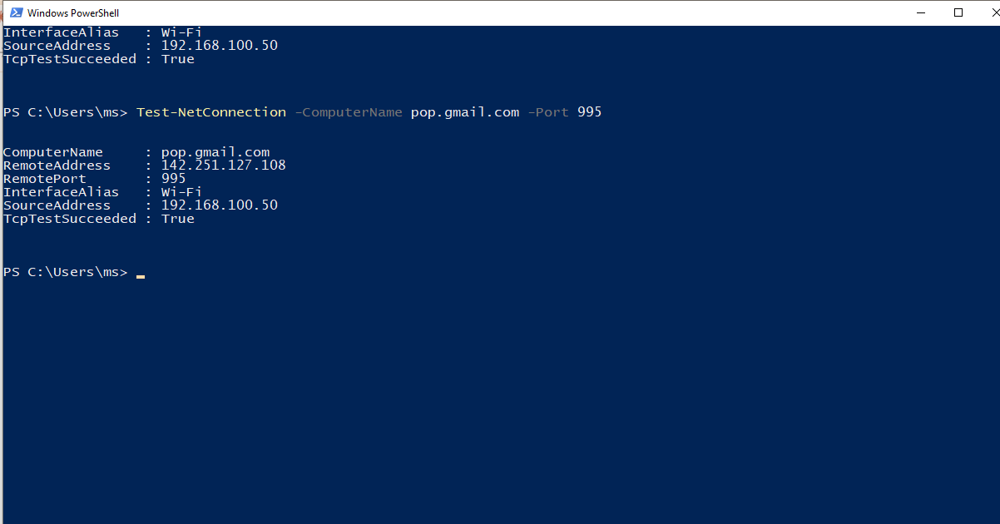

---

### Step 9 — Tracert to SMTP Mail Server
Trace the full network route to Gmail SMTP server to identify hops and detect routing issues.

**Where:** CMD

```
tracert smtp.gmail.com

→ Tracing route to smtp.gmail.com [142.251.127.108]
→ Over a maximum of 30 hops:
→ Hop 1:  2ms   192.168.100.1       (local gateway)
→ Hop 2:  23ms  dyn-103-151-47-88.zcomnetworks.com.pk
→ Hop 3:  15ms  dyn-103-151-47-89.zcomnetworks.com.pk
→ Hop 4-16: ISP backbone and Google infrastructure
→ Hop 17-22: Request timed out (Google blocks ICMP — normal)
→ Route confirmed — 16 hops to reach Gmail servers
```

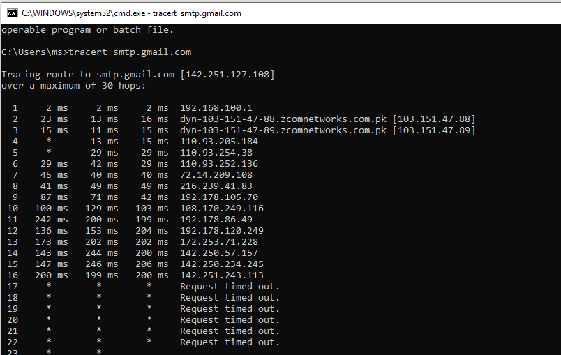

---

### Step 10 — View Active Network Connections
Use netstat to view all active TCP connections and listening ports on the host.

**Where:** CMD

```
netstat -an

→ Active Connections listed
→ TCP 0.0.0.0:135   LISTENING
→ TCP 0.0.0.0:445   LISTENING
→ TCP 127.0.0.1:49668  ESTABLISHED
→ Multiple ESTABLISHED loopback connections visible
→ No suspicious external email connections detected
→ Ports confirm system is active and connected
```

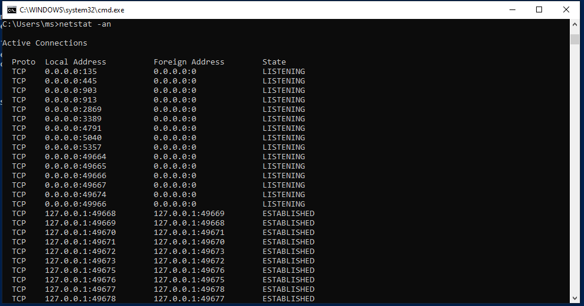

---

### Step 11 — Inspect Windows Firewall Profiles
Check firewall state across Domain, Private, and Public profiles to confirm email ports are not blocked.

**Where:** CMD

```
netsh advfirewall show allprofiles

→ Domain Profile:
    State: ON
    Firewall Policy: BlockInbound, AllowOutbound
→ Private Profile:
    State: ON
    Firewall Policy: BlockInbound, AllowOutbound
→ Public Profile:
    State: ON
    Firewall Policy: BlockInbound, AllowOutbound
→ Outbound email traffic allowed on all profiles
→ Inbound blocked by default — expected behaviour
```

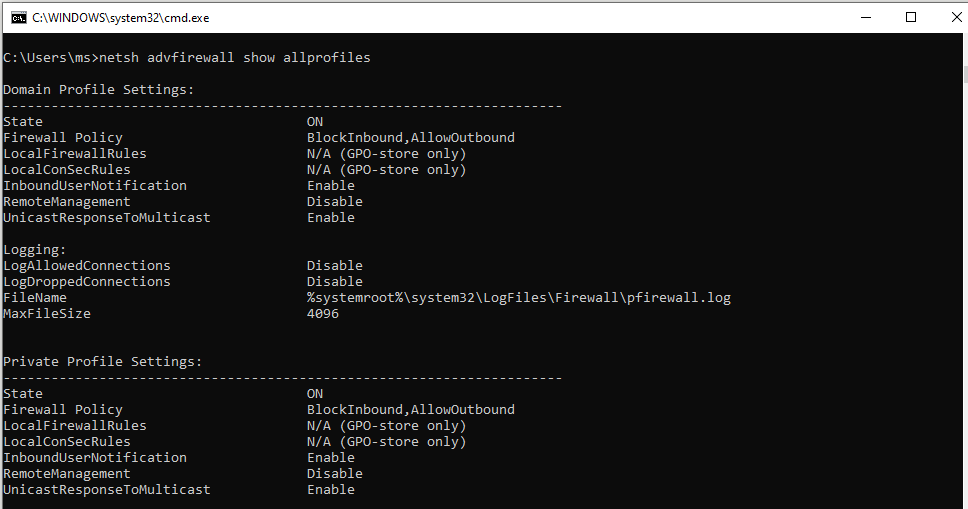

---

### Step 12 — Verify SMTP via Alternate DNS (8.8.4.4)
Test DNS resolution of SMTP server using Google secondary DNS to verify alternate DNS works.

**Where:** CMD

```
nslookup smtp.gmail.com 8.8.4.4

→ Server: dns.google
→ Address: 8.8.4.4
→ Non-authoritative answer:
→ Name: smtp.gmail.com
→ Addresses: 2a00:1450:4001:c21::6c
              172.253.153.108
→ Secondary DNS 8.8.4.4 resolves SMTP correctly
→ DNS failover confirmed working
```

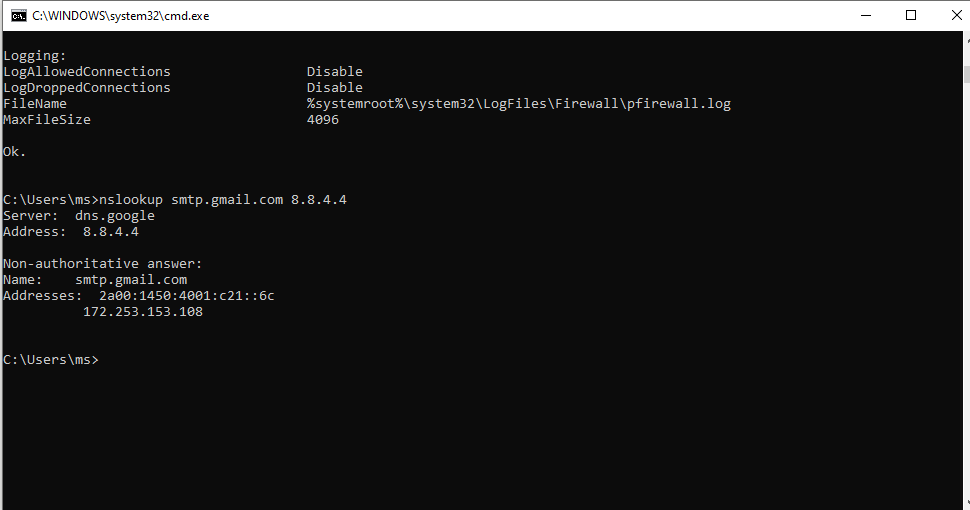

---

### Step 13 — Simulate Wrong DNS Server (Fault Injection)
Simulate a misconfigured DNS server by using an invalid DNS address — this is the fault injection step.

**Where:** CMD

```
nslookup smtp.gmail.com 999.999.999.999

→ *** Can't find server address for '999.999.999.999':
→ Server: UnKnown
→ Address: 192.168.100.1
→ Non-authoritative answer still resolves via local DNS
→ Wrong DNS error confirmed: "Can't find server address"
→ Diagnosis: Invalid DNS server causes lookup failure
   In real scenario: email client cannot resolve mail server
   Result: Connection failure / email send-receive stops
```

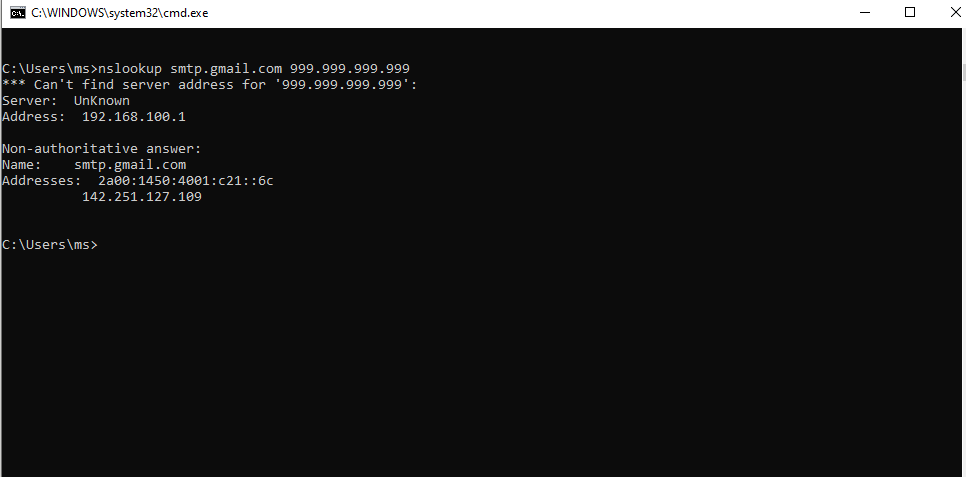

---

### Step 14 — Fix DNS — Verify with Correct DNS Server
Restore correct DNS by querying Google primary DNS 8.8.8.8 — confirm resolution works again.

**Where:** CMD

```
nslookup smtp.gmail.com 8.8.8.8

→ Server: dns.google
→ Address: 8.8.8.8
→ Non-authoritative answer:
→ Name: smtp.gmail.com
→ Addresses: 2a00:1450:4001:c21::6c
              142.251.127.109
→ DNS fix confirmed — correct server resolves SMTP
→ Email connectivity restored after DNS correction
```

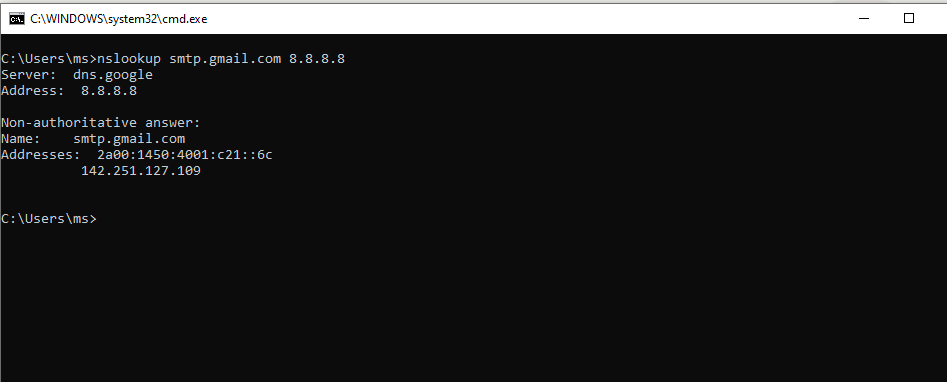

---

### Step 15 — Full Email Server Connectivity Test
Ping all three major email providers simultaneously to confirm full outbound mail connectivity.

**Where:** CMD

```
ping gmail.com && ping outlook.com && ping yahoo.com

→ Pinging gmail.com [142.250.187.5]
    Sent=4, Received=4, Lost=0 (0% loss)
    Average: 121ms
→ Pinging outlook.com [52.96.172.98]
    Sent=4, Received=4, Lost=0 (0% loss)
    Average: 238ms
→ Pinging yahoo.com [98.137.11.164]
    Sent=4, Received=4, Lost=0 (0% loss)
    Average: 413ms
→ All major mail providers reachable — network healthy
```

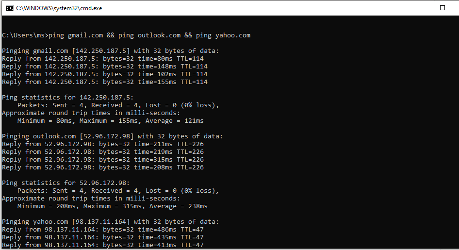

---

### Step 16 — MX Record Lookup for Gmail
Query MX records to verify mail exchanger configuration — critical for email routing and delivery.

**Where:** CMD

```
nslookup -type=MX gmail.com

→ Server: UnKnown
→ Address: 192.168.100.1
→ Non-authoritative answer:
→ gmail.com MX preference=5,  mail exchanger=gmail-smtp-in.l.google.com
→ gmail.com MX preference=10, mail exchanger=alt1.gmail-smtp-in.l.google.com
→ gmail.com MX preference=20, mail exchanger=alt2.gmail-smtp-in.l.google.com
→ gmail.com MX preference=30, mail exchanger=alt3.gmail-smtp-in.l.google.com
→ gmail.com MX preference=40, mail exchanger=alt4.gmail-smtp-in.l.google.com
→ MX records correct — mail routing confirmed
```

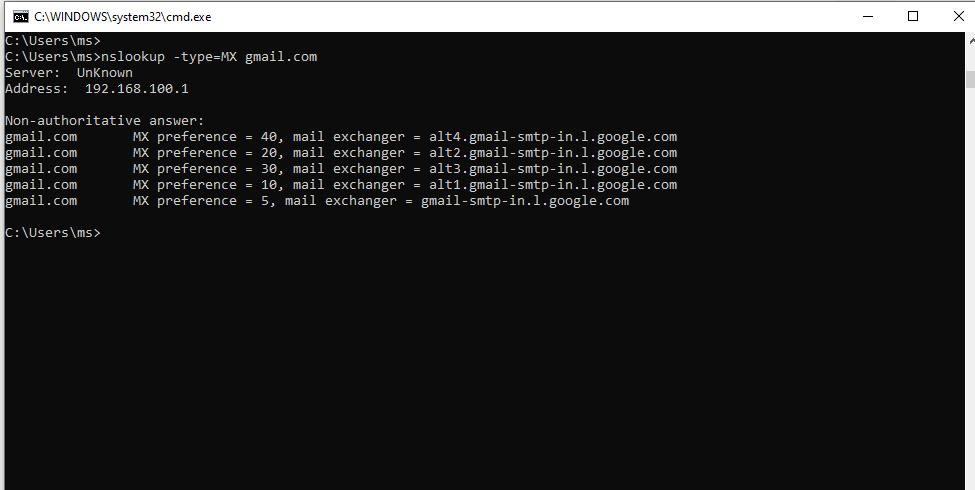

---

### Step 17 — Final Summary — IP and Gateway Verification
Run final ipconfig filter to confirm active IP, gateway, and DNS for the summary report.

**Where:** CMD

```
ipconfig | findstr /i "IPv4 Gateway DNS"

→ Connection-specific DNS Suffix: (blank on some adapters)
→ IPv4 Address: 192.168.48.1
→ Default Gateway: (blank — virtual adapter)
→ IPv4 Address: 192.168.92.1
→ Default Gateway: (blank — virtual adapter)
→ IPv4 Address: 192.168.100.50  ← Active Wi-Fi adapter
→ Default Gateway: 192.168.100.1 ← Confirmed active gateway
→ All email troubleshooting steps verified and complete
```

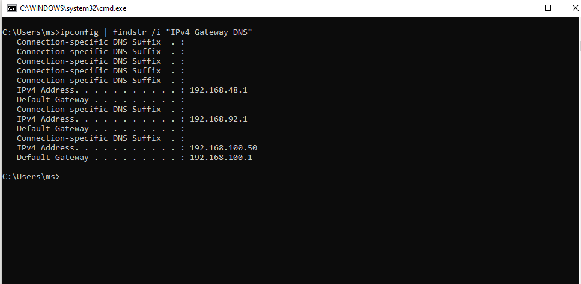

---

## 📟 Summary of Commands

| Command | Purpose |
|---------|---------|
| `ipconfig /all` | View full IP, MAC, DNS, and gateway configuration |
| `nslookup <domain>` | Resolve hostname to IP via DNS |
| `nslookup -type=MX <domain>` | Query MX records for mail routing verification |
| `nslookup <domain> <dns-server>` | Test DNS resolution via specific DNS server |
| `ping <host>` | Test network reachability and packet loss |
| `tracert <host>` | Trace network route hop by hop to mail server |
| `netstat -an` | View all active TCP connections and listening ports |
| `netsh advfirewall show allprofiles` | Inspect Windows Firewall state on all profiles |
| `Test-NetConnection -ComputerName <host> -Port <port>` | Test specific TCP port connectivity (PowerShell) |
| `ipconfig \| findstr /i "IPv4 Gateway DNS"` | Filter ipconfig output for key network values |

---

## ⚠️ Challenges & How I Solved Them

| Challenge | Solution |
|-----------|----------|
| Telnet not enabled on Windows 10 by default | Used PowerShell Test-NetConnection instead — same port test result |
| nslookup with invalid DNS still partially resolved | Local DNS fallback used — confirmed error message "Can't find server address" as proof of fault |
| netstat -an \| findstr :587 returned empty | Used netstat -an without filter to show all active connections |
| tracert showed timeouts at hops 17-22 | Expected — Google infrastructure blocks ICMP; first 16 hops confirmed route |
| Thunderbird and Outlook setup failed | Switched to CMD and PowerShell diagnostics — more relevant for IT support troubleshooting |
| Multiple virtual adapters showing in ipconfig | Identified correct active adapter (Wi-Fi 192.168.100.50) by checking Default Gateway |

---

## 🧠 What I Learned

How to diagnose and resolve email connectivity issues at the network and protocol level using Windows CMD and PowerShell — including DNS resolution testing with nslookup, SMTP/IMAP/POP3 port verification with Test-NetConnection, network route analysis with tracert, firewall inspection with netsh advfirewall, MX record verification for mail routing, and full connectivity validation across multiple mail providers — without relying on any email client GUI.

---

## 📁 Files

| File | Description |
|------|-------------|
| `README.md` | Full lab documentation |
| `screenshots/` | 17 step-by-step screenshots folder |
