# Gateway & IP Conflict Resolution

**Domain:** IT Support & Troubleshooting  
**Difficulty:** Intermediate — Advanced  
**Tools:** Cisco Packet Tracer, Windows CMD

---

## 🎯 Objective  
Simulate, diagnose, and resolve common Layer 3 network issues including APIPA address assignment, duplicate IP conflicts, and default gateway misconfiguration across a small enterprise network using Cisco Packet Tracer for topology simulation and Windows CMD for host-side diagnostics.

---

## 🛠️ Tools & Technologies  
| Tool | Purpose |  
|------|---------|  
| Cisco Packet Tracer | Network topology simulation |  
| Router 2911 | Default gateway, DHCP server |  
| Switch 2960 | LAN switching |  
| Windows CMD | Host-side diagnostics |  
| ipconfig | View and release/renew IP configuration |  
| ping | Test connectivity and isolate failures |  
| arp -a | View ARP table for duplicate IP detection |  
| DHCP | Automatic IP assignment |  
| Static IP | Manual IP configuration for conflict simulation |  

---

## 🖧 Topology

### Devices  
- 1 Router (2911)  
- 1 Switch (2960)  
- 4 PCs  

### Physical Connections  
| Device | Switch Port | Cable |  
|--------|-------------|-------|  
| PC0 | Fa0/1 | Copper Straight-Through |  
| PC1 | Fa0/2 | Copper Straight-Through |  
| PC2 | Fa0/3 | Copper Straight-Through |  
| PC3 | Fa0/4 | Copper Straight-Through |  
| Router G0/0 | Fa0/24 | Copper Straight-Through |  

### IP Design  
| Device | IP Address | Mask | Gateway |  
|--------|-----------|------|---------|  
| Router G0/0 | 192.168.1.1 | 255.255.255.0 | — |  
| PC0 | DHCP | auto | 192.168.1.1 |  
| PC1 | DHCP | auto | 192.168.1.1 |  
| PC2 | 192.168.1.10 (static — duplicate) | 255.255.255.0 | 192.168.1.1 |  
| PC3 | DHCP | auto | 192.168.1.1 |  

---

## 🐛 Simulated Issues  
| # | Issue | Type |  
|---|-------|------|  
| 1 | PC gets 0.0.0.0 / DHCP request failed | APIPA — DHCP unreachable |  
| 2 | Two PCs share same IP 192.168.1.10 | Duplicate IP conflict |  
| 3 | PC can reach LAN but not internet | Missing default gateway |  
| 4 | ARP table shows duplicate MAC mapping | ARP conflict from duplicate IP |  

---

## 📋 Steps & Screenshots

### Step 1 — Build the Topology  
Set up all devices and connect cables as shown above.  
```
No CLI commands in this step — physical wiring done in Packet Tracer GUI.
Drag devices onto canvas and connect cables per the topology table above.
```
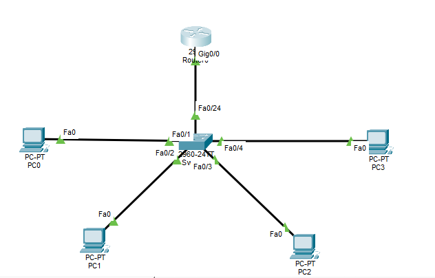

---

### Step 2 — Configure Router as Gateway & DHCP Server  
Set up the router interface and DHCP pool for the LAN.  
```
enable
configure terminal
interface g0/0
ip address 192.168.1.1 255.255.255.0
no shutdown
exit
ip dhcp excluded-address 192.168.1.1 192.168.1.10
ip dhcp pool LAN
network 192.168.1.0 255.255.255.0
default-router 192.168.1.1
dns-server 8.8.8.8
exit
show ip interface brief
show ip dhcp pool
```
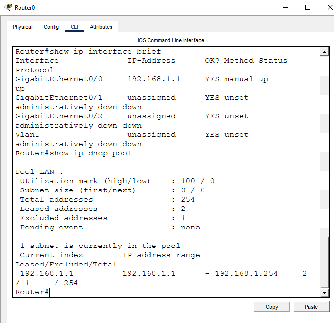

---

### Step 3 — Verify PC0 and PC1 Get DHCP IPs  
Confirm DHCP is working correctly before introducing faults.  
```
PC0 → Desktop → IP Configuration → DHCP
PC1 → Desktop → IP Configuration → DHCP

PC0> ipconfig /renew
PC0> ipconfig
```
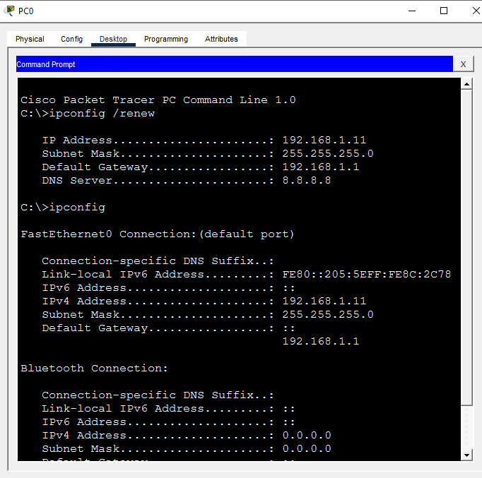

---

### Step 4 — Simulate APIPA (Shutdown Router Interface)  
Simulate APIPA by shutting down the router interface so DHCP becomes unreachable.  
```
enable
configure terminal
interface g0/0
shutdown
exit

PC0> ipconfig /release
PC0> ipconfig /renew
PC0> ipconfig

→ Result: IP 0.0.0.0 — DHCP request failed
   (Packet Tracer shows 0.0.0.0 instead of 169.254.x.x
    but both mean the same — DHCP server unreachable)
```
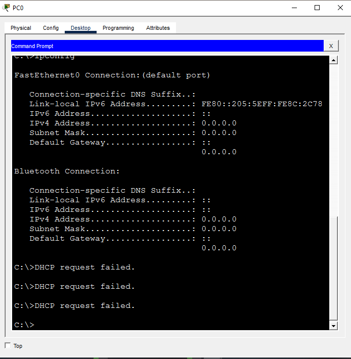

---

### Step 5 — Diagnose APIPA Issue  
Identify why the PC failed to get a valid IP.  
```
PC0> ipconfig /all
→ Autoconfiguration IPv4 Address: 169.254.x.x
→ Default Gateway: blank
→ DHCP request failed

PC0> ping 192.168.1.1
→ Request timed out — gateway unreachable
```
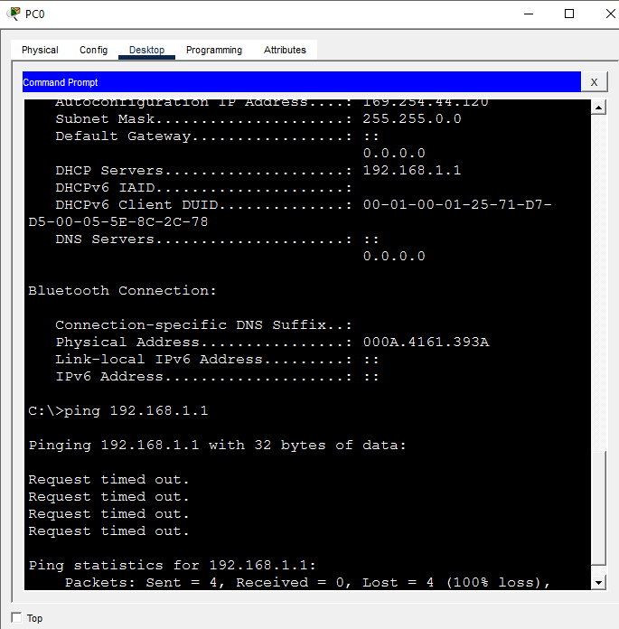

---

### Step 6 — Fix APIPA Issue  
Restore the router interface and renew the IP.  
```
enable
configure terminal
interface g0/0
no shutdown
exit

PC0> ipconfig /release
PC0> ipconfig /renew
PC0> ipconfig

→ IP: 192.168.1.11
→ Mask: 255.255.255.0
→ Gateway: 192.168.1.1
```
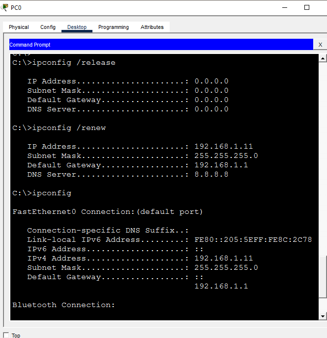

---

### Step 7 — Simulate Duplicate IP Conflict  
Manually assign the same static IP to PC2 and PC3.  
```
PC2 → Desktop → IP Configuration → Static
→ IP Address: 192.168.1.10
→ Subnet Mask: 255.255.255.0
→ Default Gateway: 192.168.1.1

PC3 → Desktop → IP Configuration → Static
→ IP Address: 192.168.1.10  ← same as PC2
→ Subnet Mask: 255.255.255.0
→ Default Gateway: 192.168.1.1

→ Packet Tracer shows warning:
  "This address is already used in the network"
  "Another device has attempted to use this IP address"
```
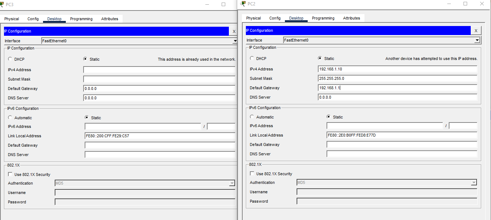

---

### Step 8 — Observe Duplicate IP Symptoms  
Test connectivity to see how duplicate IP affects the network.  
```
PC2> ping 192.168.1.1
PC1> ping 192.168.1.1

→ Both PCs active on network with same IP
→ Unpredictable behaviour — one PC may lose connectivity
```
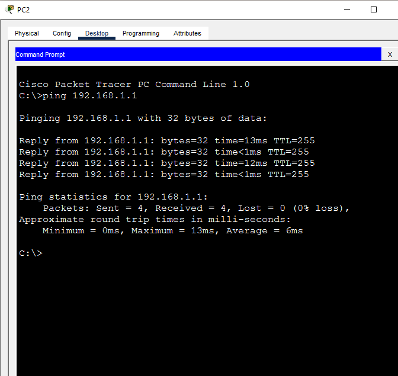
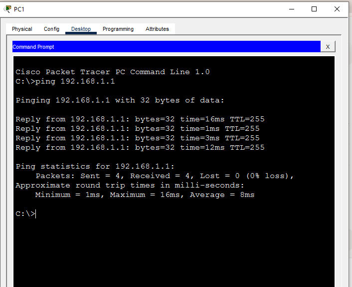

---

### Step 9 — Diagnose Duplicate IP with ARP  
Use ARP table to detect the duplicate IP conflict.  
```
PC0> ping 192.168.1.10
PC0> arp -a
→ 192.168.1.10 mapped to a MAC address
→ Running multiple times shows MAC flipping — duplicate IP sign

Router:
show ip arp
→ 192.168.1.10 showing with one MAC
→ Both PC2 and PC3 claiming same IP
```
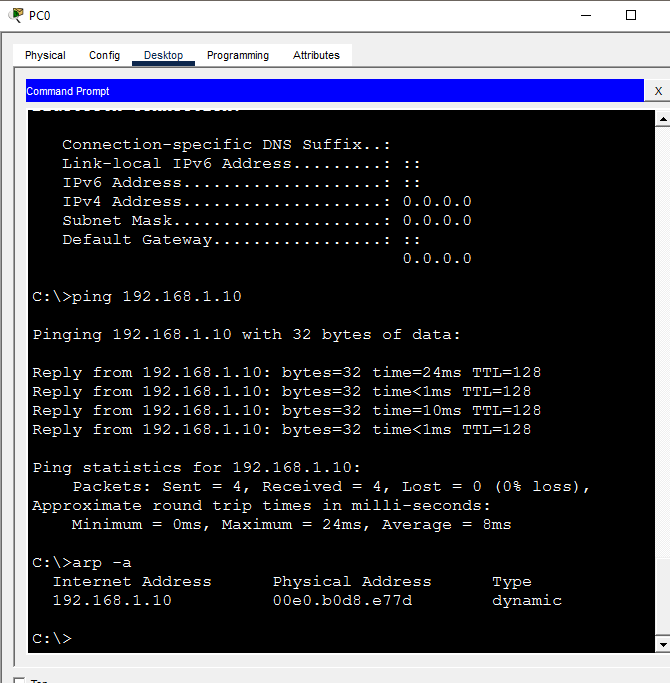
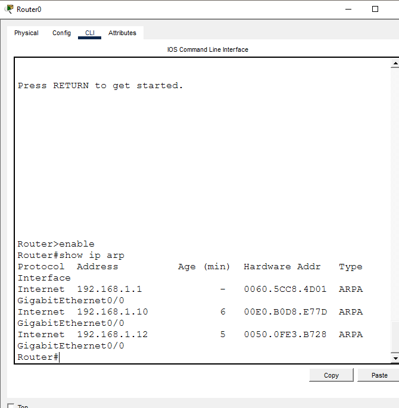

---

### Step 10 — Fix Duplicate IP Conflict  
Assign unique IPs to resolve the conflict.  
```
PC2 → Desktop → IP Configuration → Static
→ IP Address: 192.168.1.20
→ Subnet Mask: 255.255.255.0
→ Default Gateway: 192.168.1.1

PC2> ping 192.168.1.1
→ Clean consistent replies — conflict resolved
```
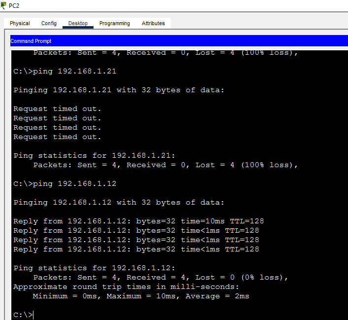

---

### Step 11 — Simulate Missing Default Gateway  
Remove the default gateway from PC0 to simulate misconfiguration.  
```
PC0 → Desktop → IP Configuration → Static
→ IP Address: 192.168.1.100
→ Subnet Mask: 255.255.255.0
→ Default Gateway: (blank)

PC0> ping 192.168.1.1   → Reply (same subnet — works)
PC0> ping 8.8.8.8       → Request timed out (no gateway to route out)

→ Classic missing gateway symptom:
  LAN works fine but cannot reach outside network
```
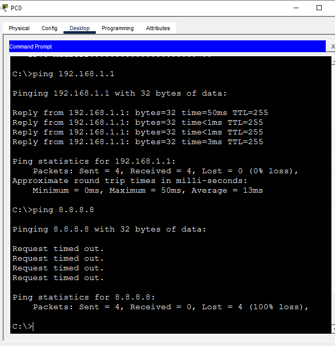

---

### Step 12 — Diagnose Missing Default Gateway  
Confirm gateway is missing using ipconfig /all.  
```
PC0> ipconfig /all

→ IPv4 Address: 192.168.1.100
→ Default Gateway: 0.0.0.0 (blank)
→ ping 8.8.8.8 → Destination host unreachable

→ Diagnosis: No gateway configured — PC cannot route
  traffic outside the local subnet
```
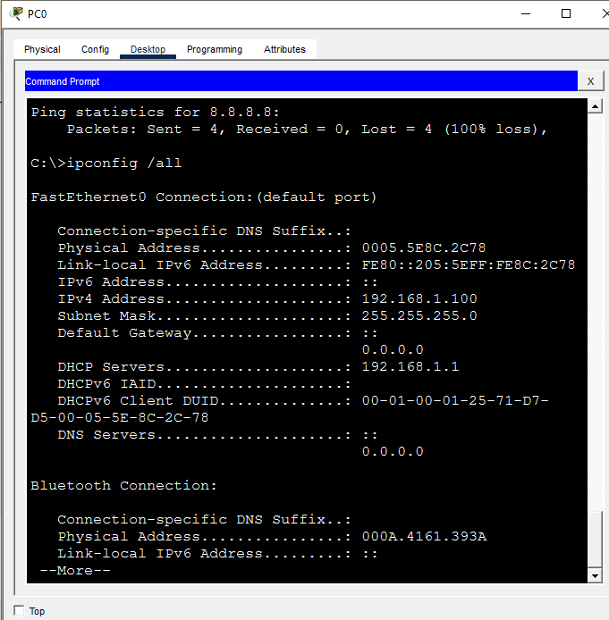

---

### Step 13 — Fix Missing Default Gateway  
Restore correct gateway on PC0.  
```
PC0 → Desktop → IP Configuration → DHCP
→ ipconfig /renew
→ Receives: IP 192.168.1.11, Gateway 192.168.1.1

PC0> ping 192.168.1.1   → Reply
PC0> ping 8.8.8.8       → Destination host unreachable
   (expected — Packet Tracer has no real internet)
   But gateway is now correctly configured
```
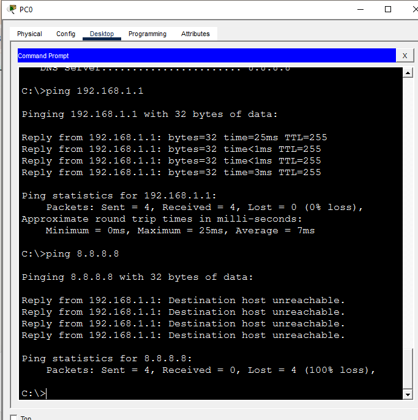

---

### Step 14 — Verify ARP Table is Clean  
After fixing all conflicts verify ARP table shows correct unique MAC mappings.  
```
PC0> arp -a

→ Each IP maps to exactly ONE unique MAC address
→ No flipping MACs = no duplicate IP conflict remaining
```
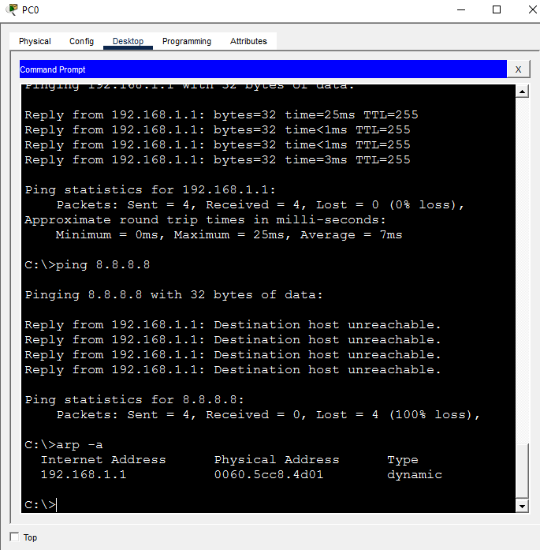

---

### Step 15 — Full Connectivity Test  
Ping all devices to confirm full network health.  
```
PC0> ping 192.168.1.10   → Reply (PC2)
PC0> ping 192.168.1.12   → Reply (PC3)
```


---

### Step 16 — Router Verification  
Run final verification commands on the router.  
```
show ip interface brief
→ G0/0: 192.168.1.1 up/up

show ip arp
→ All PCs listed with unique MACs

show ip dhcp binding
→ Active leases confirmed for DHCP clients
```
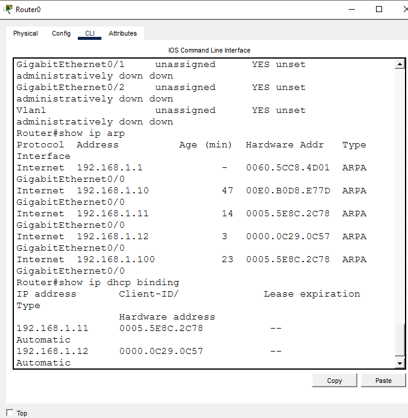

---

### Step 17 — Save Configuration  
Save all configurations.  
```
copy running-config startup-config
```
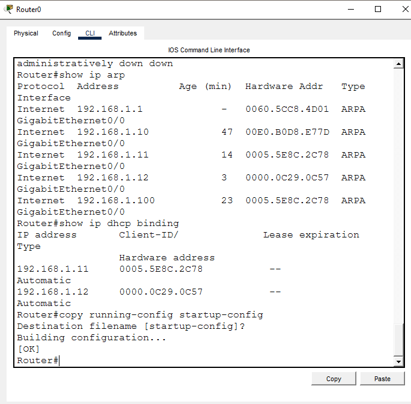

---

## 📟 Summary of Commands  
| Command | Purpose |  
|---------|---------|  
| `ipconfig /all` | View full IP config including gateway and mask |  
| `ipconfig /release` | Release current DHCP lease |  
| `ipconfig /renew` | Request new IP from DHCP server |  
| `ping <ip>` | Test connectivity to a host or gateway |  
| `arp -a` | View ARP table — detect duplicate IPs |  
| `show ip interface brief` | Verify router interface status and IPs |  
| `show ip arp` | View router ARP table |  
| `show ip dhcp binding` | View active DHCP leases |  
| `show ip dhcp pool` | View DHCP pool configuration |  
| `ip dhcp excluded-address` | Reserve IPs from DHCP pool |  
| `ip dhcp pool` | Create DHCP pool on router |  
| `default-router` | Set gateway in DHCP pool |  
| `no shutdown` | Bring up router interface |  
| `copy running-config startup-config` | Save configuration |  

---

## ⚠️ Challenges & How I Solved Them  
| Challenge | Solution |  
|-----------|----------|  
| Packet Tracer shows 0.0.0.0 instead of 169.254.x.x for APIPA | This is expected Packet Tracer behaviour — DHCP request failed message confirms same issue |  
| Packet Tracer blocks invalid gateway entry | Simulated missing gateway by leaving gateway blank — same effect as wrong gateway |  
| Duplicate IP hard to detect by ping alone | Used arp -a to spot MAC address mapping and Router show ip arp to confirm |  
| PC3 blocked from using same IP as PC2 | Packet Tracer shows conflict warning automatically — used that as proof of duplicate IP |  
| ARP table still showing old entries after fix | Re-pinged all hosts to repopulate ARP table with fresh correct entries |  

---

## 🧠 What I Learned  
How to simulate and resolve the most common Layer 3 host configuration failures — APIPA from DHCP unavailability, duplicate IP conflicts detected via ARP table, and missing default gateway causing LAN-only connectivity — using both Cisco Packet Tracer for network simulation and Windows CMD for host-side diagnostics.

---

## 📁 Files  
| File | Description |  
|------|-------------|  
| `README.md` | Full lab documentation |  
| `gateway-ip-conflict-resolution.pkt` | Packet Tracer file |  
| `screenshots/` | Step-by-step screenshots folder |
