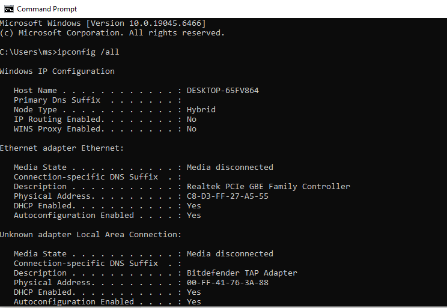
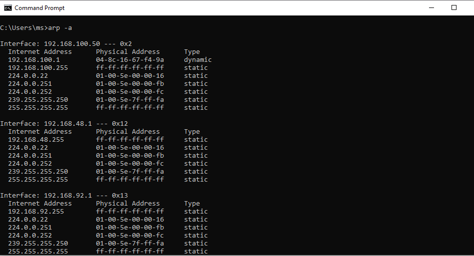
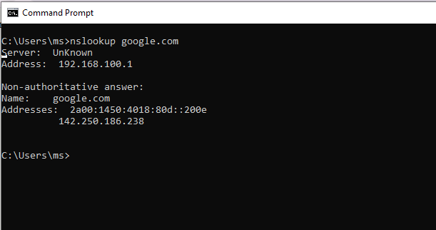
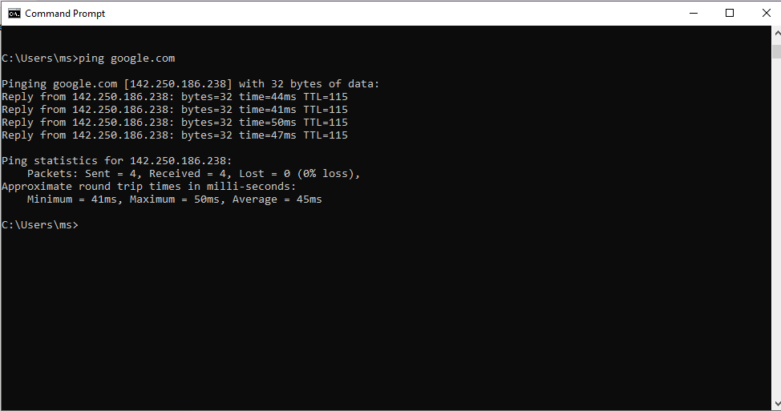
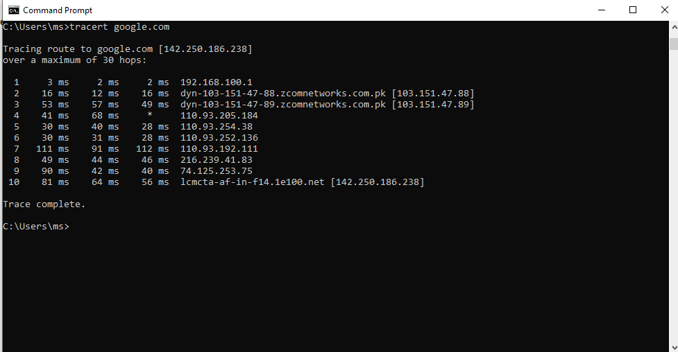
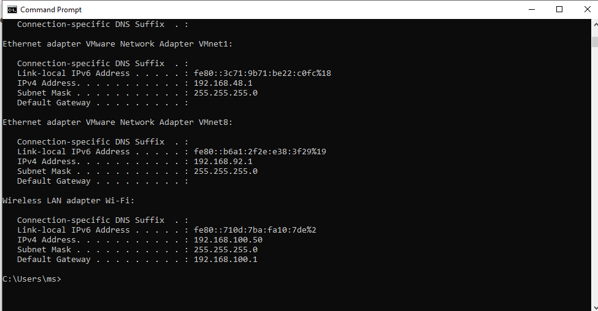
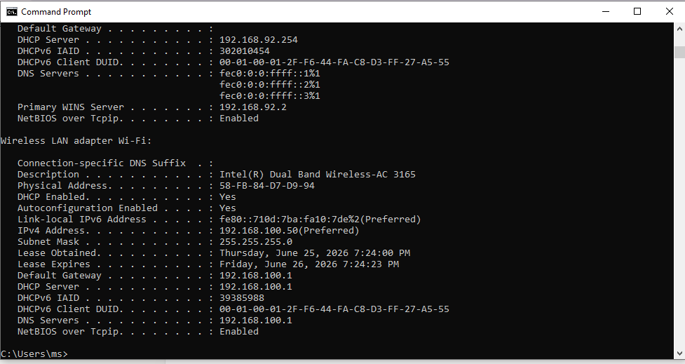
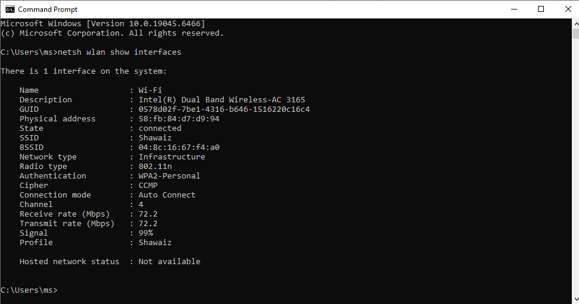
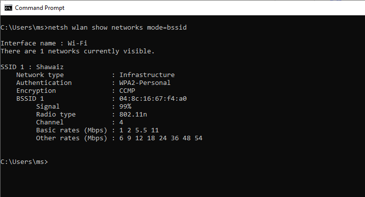
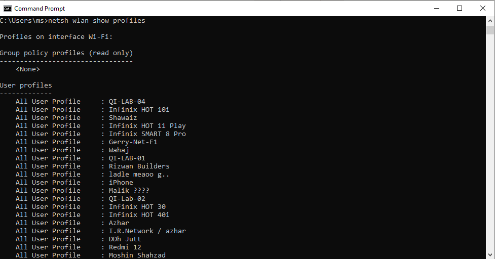

# LAN & Wi-Fi Connectivity Diagnostics

**Domain:** IT Support & Troubleshooting
**Difficulty:** Intermediate — Advanced
**Tools:** Windows Command Prompt (cmd.exe)

---

## 🎯 Objective
Diagnose real-world LAN and Wi-Fi connectivity using native Windows tools — verifying IP configuration, ARP cache, DNS resolution, reachability, path tracing, DHCP lease renewal, and wireless SSID/channel interference — all performed directly on a personal PC (no simulator required).

---

## 🛠️ Tools & Technologies
| Tool | Purpose |
|------|---------|
| Command Prompt (cmd.exe) | Native Windows network diagnostics |
| `ipconfig` | View/release/renew IP configuration |
| `arp` | View ARP cache (IP-to-MAC mappings) |
| `nslookup` | DNS resolution testing |
| `ping` | Basic reachability test |
| `tracert` | Path/hop trace to a destination |
| `netsh wlan` | Wireless SSID, channel, and profile diagnostics |

---

## 🖧 Environment
| Item | Detail |
|------|--------|
| Device | Personal Windows PC |
| Connection Type | Wi-Fi |
| Gateway | 192.168.100.1 |
| Wi-Fi IP | 192.168.100.50 |
| Other Adapters | VMnet1 (192.168.48.1), VMnet8 (192.168.92.1) — VMware virtual adapters, expected/inactive for this lab |

---

## 📋 Steps & Screenshots

### Step 1 — IP Baseline Check
Capture full IP configuration before diagnostics.
```
ipconfig /all
```
Confirms IP address, subnet mask, default gateway, DNS servers, and MAC address for each adapter.


---

### Step 2 — ARP Cache Check
View IP-to-MAC address mappings on the local network.
```
arp -a
```
Used to detect duplicate IP/MAC conflicts and confirm the gateway's MAC address.


---

### Step 3 — DNS Resolution Test
Verify that hostnames resolve correctly through the configured DNS server.
```
nslookup google.com
```
Confirms DNS server address and the resolved IP for the queried domain.


---

### Step 4 — Ping Connectivity Test
Test basic reachability and packet loss to an external host.
```
ping google.com
```
Result: 0% packet loss — connection is healthy.


---

### Step 5 — Tracert Path Analysis
Trace the hop-by-hop path traffic takes to reach an external destination.
```
tracert google.com
```
Shows each router hop (including local gateway 192.168.100.1) and latency per hop.


---

### Step 6 — DHCP Release & Renew
Release and renew the DHCP-assigned IP address to confirm DHCP server responsiveness.
```
ipconfig /release
ipconfig /renew
```
Note: inactive adapters (Ethernet, VMware adapters) report "media disconnected" — expected, since only Wi-Fi is active.


---

### Step 7 — Final Verification
Re-check full IP configuration after renewal to confirm the lease was retained correctly.
```
ipconfig /all
```
Result: Wi-Fi adapter retained IP 192.168.100.50 after renewal — DHCP server functioning correctly.


---

### Step 8 — Current SSID & Channel Check
Identify the currently connected SSID, signal strength, and Wi-Fi channel.
```
netsh wlan show interfaces
```
Shows connected SSID, BSSID, authentication type, channel number, and signal percentage.


---

### Step 9 — Channel Interference Check
List nearby wireless networks and the channels they broadcast on.
```
netsh wlan show networks mode=bssid
```
If multiple nearby networks share the same or overlapping channel as the current connection, this indicates channel interference — a common cause of Wi-Fi slowdowns and drops.


---

### Step 10 — Saved Wi-Fi Profiles
List all Wi-Fi networks previously saved on this PC.
```
netsh wlan show profiles
```
Useful for auditing which networks a device has connected to and removing stale/unused profiles.


---

## 📟 Summary of Commands
| Command | Purpose |
|---------|---------|
| `ipconfig /all` | View full IP, MAC, gateway, DNS config |
| `arp -a` | View ARP cache (IP-to-MAC mappings) |
| `nslookup` | Test DNS resolution |
| `ping` | Test basic reachability |
| `tracert` | Trace path/hops to a destination |
| `ipconfig /release` / `/renew` | Drop and re-request DHCP lease |
| `netsh wlan show interfaces` | View current SSID, channel, signal |
| `netsh wlan show networks mode=bssid` | View nearby SSIDs and their channels |
| `netsh wlan show profiles` | View saved Wi-Fi profiles |

---

## ⚠️ Challenges & How I Solved Them
| Challenge | Solution |
|-----------|----------|
| `/release` showed "media disconnected" errors | Confirmed these were inactive adapters (Ethernet, VMware virtual adapters); active connection was Wi-Fi, which worked correctly |
| Confusion on which window to run commands in | Clarified all commands run in the same Command Prompt session, one after another |
| Lab title required SSID/channel diagnostics not yet covered | Added `netsh wlan` commands (Steps 8–10) to capture SSID, channel, and interference data |
| Verifying DHCP actually worked | Compared IP before and after `/renew` — confirmed same IP retained, proving DHCP server responded correctly |

---

## 🧠 What I Learned
How to perform real-world LAN and Wi-Fi diagnostics directly on a personal PC using built-in Windows tools — checking IP configuration, ARP mappings, DNS resolution, reachability, path tracing, DHCP behavior, and wireless SSID/channel interference — without needing a network simulator.

---

## 📁 Files
| File | Description |
|------|-------------|
| `README.md` | Full lab documentation |
| `screenshots/` | Folder containing all 10 step screenshots (.PNG) |
