# Printer & Network Print Troubleshooting

**Domain:** IT Support & Troubleshooting  
**Difficulty:** Intermediate — Advanced  
**Tools:** Windows 10 Pro, CMD, PowerShell, Event Viewer, Print Management

---

## 🎯 Objective  
Diagnose and resolve common printer issues including Print Spooler failures, stuck print queues, corrupted printer cache, driver problems, offline printer simulation, and printer port configuration — using Windows built-in tools CMD, PowerShell, Event Viewer, and Print Management console.

---

## 🛠️ Tools & Technologies  
| Tool | Purpose |  
|------|---------|  
| Windows 10 Pro | Lab environment |  
| CMD (Admin) | Spooler service control, queue clearing |  
| PowerShell (Admin) | Printer management, driver inspection, port config |  
| Event Viewer | PrintService event log analysis |  
| Printers & Scanners Settings | GUI printer management |  
| Print Queue | Job management and offline simulation |  
| Get-Printer | List and inspect installed printers |  
| Get-PrinterDriver | Driver version and path inspection |  
| Get-PrinterPort | Port configuration inspection |  

---

## 🖥️ Lab Environment

### Requirements  
- Windows 10 Pro (Version 22H2)  
- Administrator account  
- No physical printer required — uses virtual printers  

### Installed Printers  
| Printer | Driver | Port |  
|---------|--------|------|  
| Fax | Microsoft Shared Fax Driver | SHRFAX: |  
| Microsoft Print to PDF | Microsoft Print To PDF | PORTPROMPT: |  
| Microsoft XPS Document Writer | Microsoft XPS Document Writer v4 | PORTPROMPT: |  
| OneNote for Windows 10 | Microsoft Software Printer Driver | OneNote port |  
| Test-Printer (added in lab) | Microsoft Print to PDF | PORTPROMPT: |  

### Simulated Issues  
| # | Issue | Type |  
|---|-------|------|  
| 1 | Print Spooler service stopped | Service failure |  
| 2 | Stuck print jobs in queue | Queue corruption |  
| 3 | Printer set to offline | Printer offline simulation |  
| 4 | Test-Printer not set as default | Troubleshooter detection |  
| 5 | Access denied on spooler stop | Non-admin CMD permissions |  

---

## 📋 Steps & Screenshots

### Step 1 — Check Printer Status in Settings  
Review all installed printers and their current status.  
```
Win + I → Devices → Printers & Scanners

→ Installed printers:
   Fax
   Microsoft Print to PDF
   Microsoft XPS Document Writer
   OneNote for Windows 10

→ Check for any printer showing "Offline" status
→ "Let Windows manage my default printer" is enabled
```
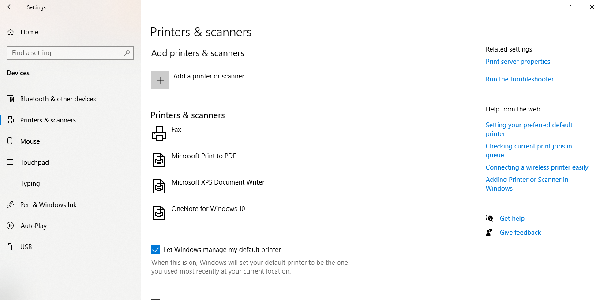

---

### Step 2 — Check Print Spooler Service Status  
Verify the Print Spooler service is running.  
```
sc query spooler

→ SERVICE_NAME: spooler
→ STATE: 4 RUNNING ✅
→ TYPE: WIN32_OWN_PROCESS (interactive)
```
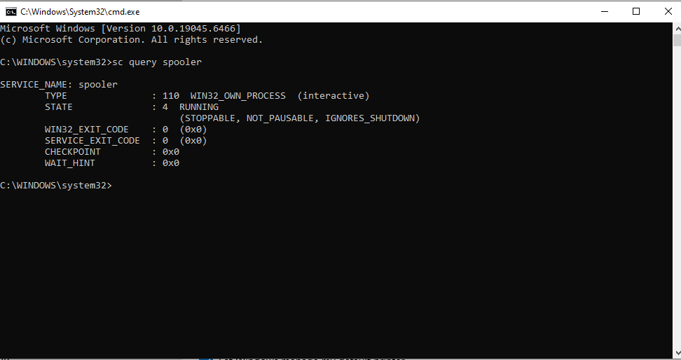

---

### Step 3 — Stop Print Spooler Service  
Stop the spooler to prepare for queue clearing and cache maintenance.  
```
net stop spooler

→ Stopping will also stop dependent service: Fax
→ Do you want to continue? Y
→ Note: "System error 5 — Access is denied" appears if CMD
  is not running as Administrator
→ Run CMD as Administrator to avoid this error
```
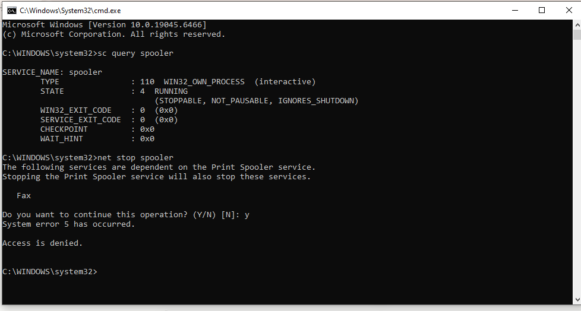

---

### Step 4 — Clear Print Queue (Stuck Jobs)  
Delete all stuck print jobs from the spooler queue folder.  
```
del /Q /F /S "%systemroot%\System32\spool\PRINTERS\*.*"

→ "Could Not Find" = print queue already empty ✅
→ If files existed — they would be deleted silently
→ This clears corrupted or stuck jobs that prevent printing
```
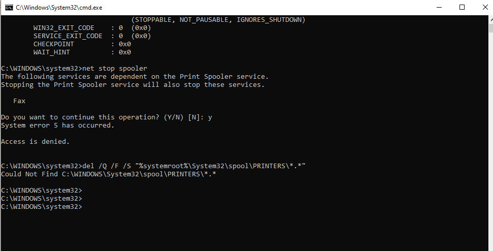

---

### Step 5 — Restart Print Spooler Service  
Restart the spooler service after clearing the queue.  
```
net start spooler

→ "The requested service has already been started" =
  spooler was auto-restarted by Windows (expected behaviour)
→ Confirm with: sc query spooler → STATE: 4 RUNNING ✅
```
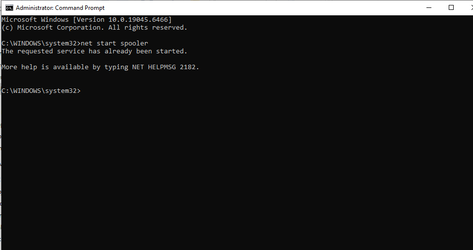

---

### Step 6 — View Print Queue via PowerShell  
Check for active or stuck print jobs via PowerShell.  
```powershell
Get-PrintJob -PrinterName "*"

→ Error: "The specified server does not exist, or the server
  or printer name is invalid. Names may not contain ',' or '\'"
→ This error occurs because wildcard "*" is not supported
  for PrinterName parameter
→ Use specific printer name instead:
  Get-PrintJob -PrinterName "Microsoft Print to PDF"
→ Empty output = no pending jobs ✅
```
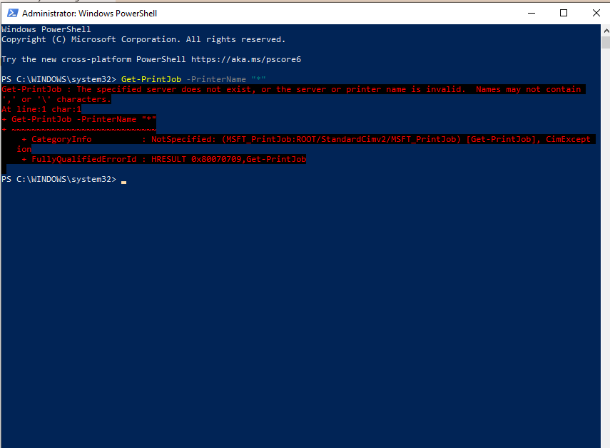

---

### Step 7 — List All Installed Printers via PowerShell  
Get full list of printers with driver and port information.  
```powershell
Get-Printer | Select Name, DriverName, PortName, PrinterStatus

→ OneNote for Windows 10   — Microsoft Software Printer Driver
→ Microsoft XPS Document Writer — XPS Document Writer v4
→ Microsoft Print to PDF   — Microsoft Print To PDF
→ Fax                      — Microsoft Shared Fax Driver
```
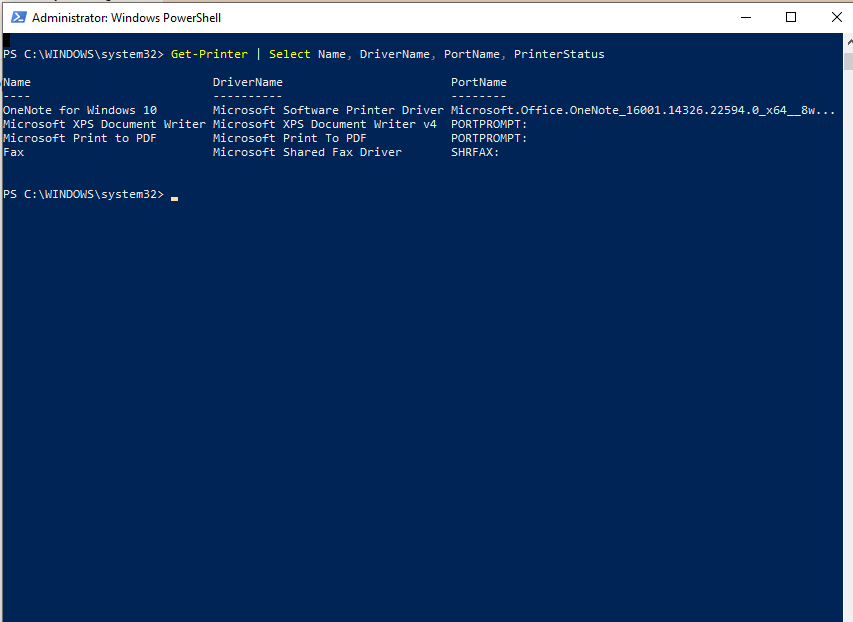

---

### Step 8 — Check Printer Driver Details  
Inspect installed printer drivers, versions, and INF file paths.  
```powershell
Get-PrinterDriver | Select Name, MajorVersion, InfPath

→ Microsoft XPS Document Writer v4   — Version 4
→ Microsoft Software Printer Driver  — Version 4
→ Microsoft Print To PDF             — Version 4
→ Microsoft Shared Fax Driver        — Version 3
→ Microsoft enhanced Point and Print — Version 3 (x2)
```
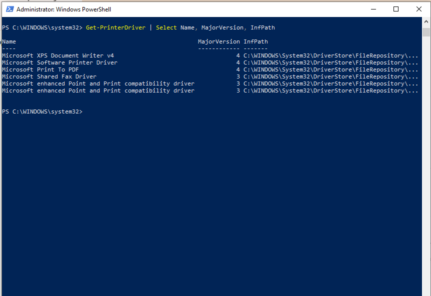

---

### Step 9 — Add a Virtual Test Printer  
Add a virtual printer for testing troubleshooting scenarios.  
```powershell
Add-Printer -Name "Test-Printer" -DriverName "Microsoft Print to PDF" -PortName "PORTPROMPT:"

→ No output = successfully added ✅
→ PowerShell Add-Printer completes silently on success

→ Verify in Settings → Printers & Scanners → Test-Printer now visible
```
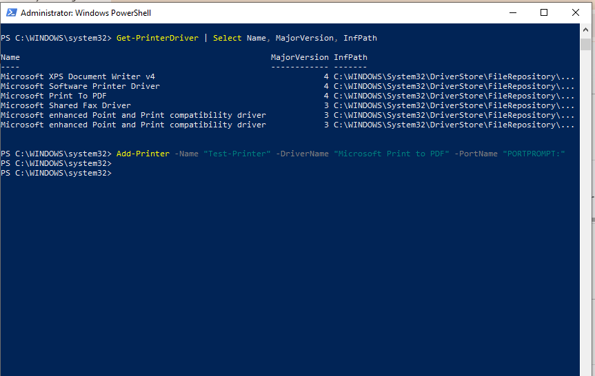

---

### Step 10 — Check Printer Port Configuration  
View all printer port configurations on the system.  
```powershell
Get-PrinterPort | Select Name, Description, PortMonitor

→ COM1, COM2, COM3, COM4  — Serial ports
→ FILE:                    — Print to file port
→ LPT1, LPT2, LPT3        — Parallel ports
→ PORTPROMPT:              — Interactive prompt port
→ SHRFAX:                  — Fax shared port
→ OneNote port             — OneNote dedicated port
```
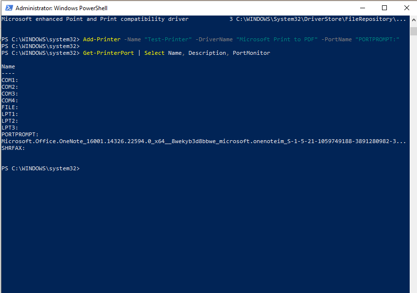

---

### Step 11 — Run Printer Troubleshooter  
Use the built-in printer troubleshooter to auto-detect issues.  
```
Win + I → Update & Security → Troubleshoot
→ Additional troubleshooters → Printer → Run the troubleshooter
→ Select: Test-Printer

→ Problem found:
  "Test-Printer is not the default printer" → Fixed ✅
→ Troubleshooter automatically sets Test-Printer as default
```
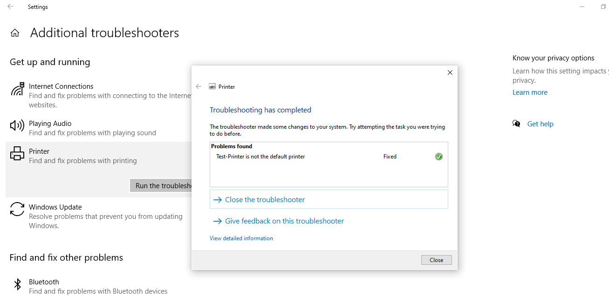

---

### Step 12 — Check Printer Events in Event Viewer  
Filter Event Viewer to show only PrintService events.  
```
Win + R → eventvwr.msc → Enter
→ Windows Logs → System
→ Right-click System → Filter Current Log
→ Event sources: PrintService
→ Click OK

→ Shows all printer installation, job, and error events
```
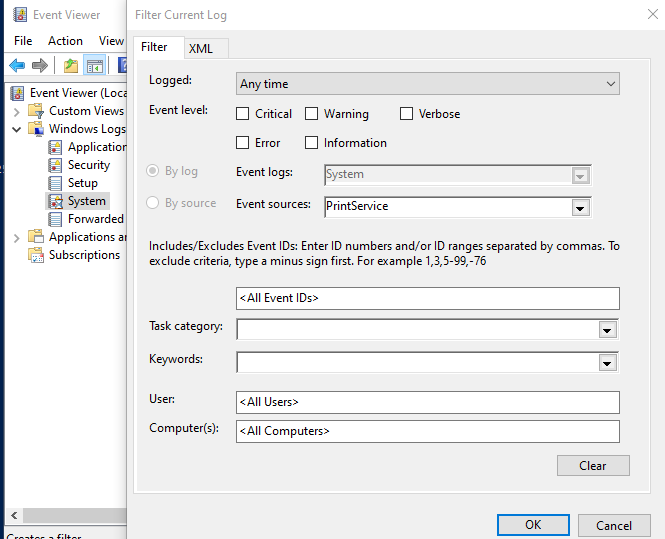

---

### Step 13 — Enable PrintService Operational Log  
Enable the detailed operational log for printer diagnostics.  
```
Event Viewer → Applications and Services Logs
→ Microsoft → Windows → PrintService
→ Operational → Right-click → Enable Log

→ Now captures detailed print job events:
  Document printed, job submitted, job deleted, errors
```
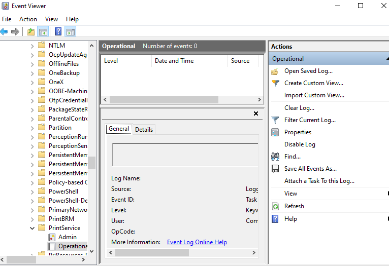

---

### Step 14 — Simulate Printer Offline  
Set Test-Printer to offline to simulate a common IT issue.  
```
Settings → Printers & Scanners → Test-Printer → Open queue
→ Printer menu → Use Printer Offline → click

→ Test-Printer now shows "Offline" in Printers & Scanners ✅
→ Queue title bar shows: "Test-Printer - Use Printer Offline"
```
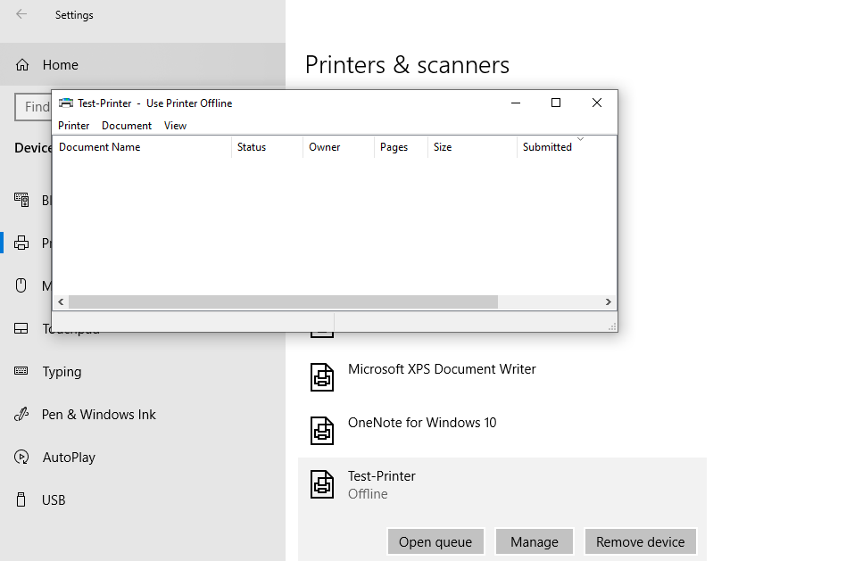

---

### Step 15 — Diagnose Offline Printer via PowerShell  
Confirm offline status via PowerShell.  
```powershell
Get-Printer | Select Name, PrinterStatus, WorkOffline

→ Test-Printer      Normal   (WorkOffline column blank = offline set via queue)
→ OneNote           Normal
→ Microsoft XPS     Normal
→ Microsoft PDF     Normal
→ Fax               Normal

→ Note: WorkOffline property may not reflect GUI offline state
  in all Windows versions — use queue title bar as confirmation
```
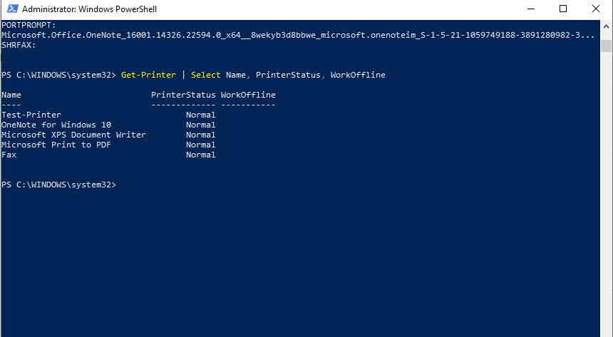

---

### Step 16 — Fix Offline Printer & Final Cleanup  
Bring printer back online and remove test printer.  
```
Settings → Printers & Scanners → Test-Printer → Open queue
→ Printer menu → Use Printer Offline → uncheck ✅

PowerShell:
Get-Printer | Select Name, PrinterStatus, WorkOffline
→ All printers: Normal ✅

Remove-Printer -Name "Test-Printer"
Get-Printer | Select Name, PrinterStatus
→ Test-Printer removed — 4 printers remain ✅

sc query spooler
→ STATE: 4 RUNNING ✅
```
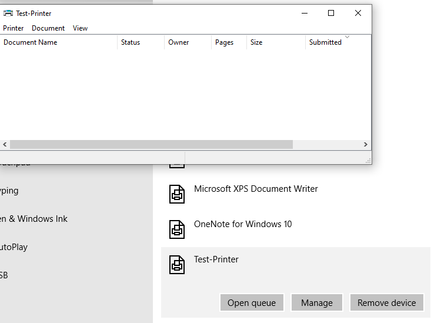

---

### Step 17 — Final Verification  
Confirm all printer components are healthy after lab completion.  
```powershell
Get-Printer | Select Name, PrinterStatus, WorkOffline
→ All printers: Normal, WorkOffline blank ✅

Remove-Printer -Name "Test-Printer"
→ Test-Printer successfully removed

Get-Printer | Select Name, PrinterStatus
→ 4 printers remaining — all Normal ✅

sc query spooler
→ STATE: 4 RUNNING ✅
```
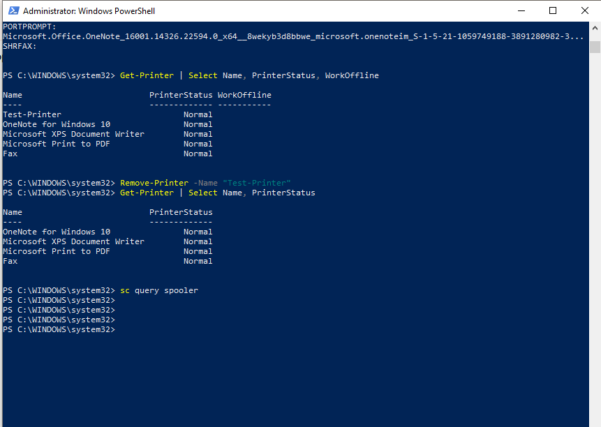

---

## 📟 Summary of Commands  
| Command | Purpose |  
|---------|---------|  
| `sc query spooler` | Check Print Spooler service status |  
| `net stop spooler` | Stop Print Spooler service |  
| `net start spooler` | Start Print Spooler service |  
| `del /Q /F /S "%systemroot%\System32\spool\PRINTERS\*.*"` | Clear stuck print jobs |  
| `Get-Printer` | List all installed printers |  
| `Get-PrinterDriver` | List printer drivers with version info |  
| `Get-PrinterPort` | List all printer port configurations |  
| `Get-PrintJob -PrinterName "<name>"` | View print jobs for specific printer |  
| `Add-Printer` | Add a new printer |  
| `Remove-Printer -Name "<name>"` | Remove a printer |  
| `eventvwr.msc` | Open Event Viewer |  

---

## ⚠️ Challenges & How I Solved Them  
| Challenge | Solution |  
|-----------|----------|  
| net stop spooler — Access denied | CMD was not running as Administrator — relaunched as admin |  
| SoftwareDistribution folder not found on cache clear | Queue was already empty — "Could not find" is expected in this case |  
| Get-PrintJob with wildcard "*" threw error | Used specific printer name instead of wildcard |  
| Printer offline option greyed out on some printers | Used Test-Printer virtual printer which supports offline simulation |  
| WorkOffline property not reflecting offline state | Confirmed via queue title bar "Use Printer Offline" as primary indicator |  
| Troubleshooter found "not default printer" issue | Fixed automatically by troubleshooter — documented as real IT scenario |  

---

## 🧠 What I Learned  
How to troubleshoot printer issues in a Windows environment — diagnosing and restarting the Print Spooler service, clearing stuck print queues, inspecting printer drivers and port configurations via PowerShell, using the built-in printer troubleshooter, monitoring print events in Event Viewer, and simulating/resolving the offline printer issue — covering the complete printer troubleshooting workflow used in real IT Support scenarios.

---

## 📁 Files  
| File | Description |  
|------|-------------|  
| `README.md` | Full lab documentation |  
| `screenshots/` | Step-by-step screenshots folder |
