# Remote Desktop & VPN Troubleshooting

**Domain:** IT Support & Troubleshooting  
**Difficulty:** Intermediate — Advanced  
**Tools:** Windows 10 Pro, CMD, PowerShell, Group Policy Editor, Registry Editor, Event Viewer

---

## 🎯 Objective  
Simulate, diagnose, and resolve common Remote Desktop Protocol (RDP) issues including firewall blocking, service failures, registry misconfiguration, and Group Policy restrictions using Windows built-in tools — CMD, PowerShell, Event Viewer, and Group Policy Editor.

---

## 🛠️ Tools & Technologies  
| Tool | Purpose |  
|------|---------|  
| Windows 10 Pro | Lab environment |  
| CMD (Admin) | RDP port verification, service control, firewall rules |  
| PowerShell (Admin) | Registry queries, service status, firewall rule inspection |  
| Event Viewer | RDP session event logs |  
| Group Policy Editor (gpedit.msc) | RDP connection policy configuration |  
| Registry Editor | fDenyTSConnections value — RDP enable/disable |  
| netstat | Port 3389 listening verification |  
| netsh advfirewall | Firewall rule management |  
| sc / net | Windows service control |  

---

## 🖥️ Lab Environment

### Requirements  
- Windows 10 Pro (Version 22H2 or later)  
- Administrator account  
- No additional hardware or VM required  

### Simulated Issues  
| # | Issue | Type |  
|---|-------|------|  
| 1 | RDP disabled on system | System Properties misconfiguration |  
| 2 | Wrong IP / unreachable host | Connection to invalid address |  
| 3 | Firewall blocking port 3389 | Custom block rule on RDP port |  
| 4 | RDP service stopped | TermService not running |  
| 5 | RDP disabled via Registry | fDenyTSConnections = 1 |  
| 6 | Group Policy restricting RDP | GPO connection policy |  

---

## 📋 Steps & Screenshots

### Step 1 — Enable Remote Desktop on Windows  
Enable RDP via System Properties.  
```
Win + R → sysdm.cpl → Enter
→ Remote tab
→ Select: "Allow remote connections to this computer"
→ Apply → OK
```
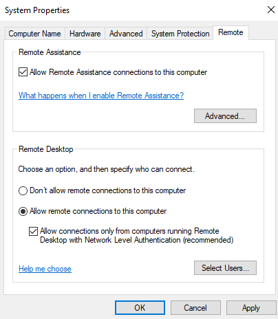

---

### Step 2 — Verify RDP Port 3389 is Listening  
Confirm RDP port is active and listening.  
```
netstat -an | find "3389"

→ TCP  0.0.0.0:3389   LISTENING
→ TCP  [::]:3389      LISTENING
```
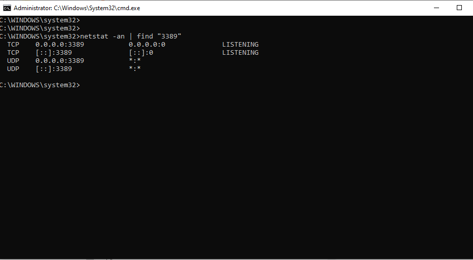

---

### Step 3 — Check IP Address for RDP Connection  
Identify the machine IP to use for RDP connections.  
```
ipconfig

→ Wi-Fi IPv4 Address: 192.168.100.50
→ Subnet Mask: 255.255.255.0
→ Default Gateway: 192.168.100.1
```
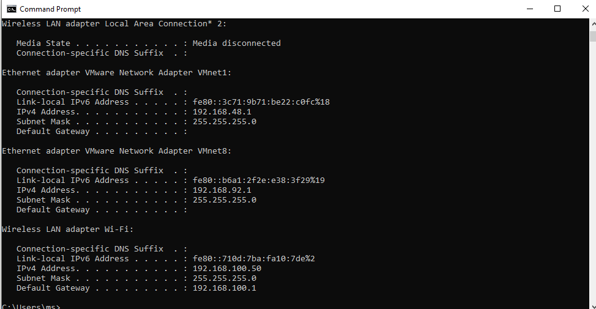

---

### Step 4 — Simulate RDP Console Session Error  
Attempt RDP connection to localhost — simulates console session conflict error.  
```
mstsc /v:192.168.100.50

→ Error: "Your computer could not connect to another console
  session on the remote computer because you already have
  a console session in progress."

→ This is a common IT Support error when a user is already
  logged into the machine physically
```
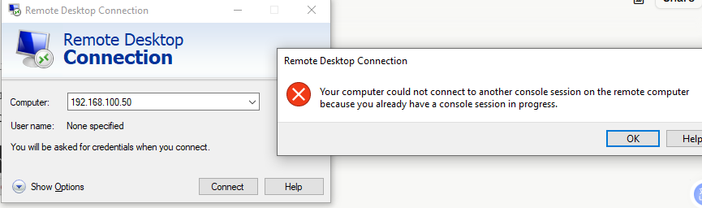

---

### Step 5 — Simulate RDP Connection to Invalid IP  
Test RDP connection to a non-existent host to simulate wrong IP error.  
```
mstsc /v:192.168.1.999

→ Error: "Remote Desktop can't find the computer 192.168.1.999.
  This might mean that 192.168.1.999 does not belong to the
  specified network. Verify the computer name and domain."

→ Common cause: wrong IP entered, typo, or host offline
```
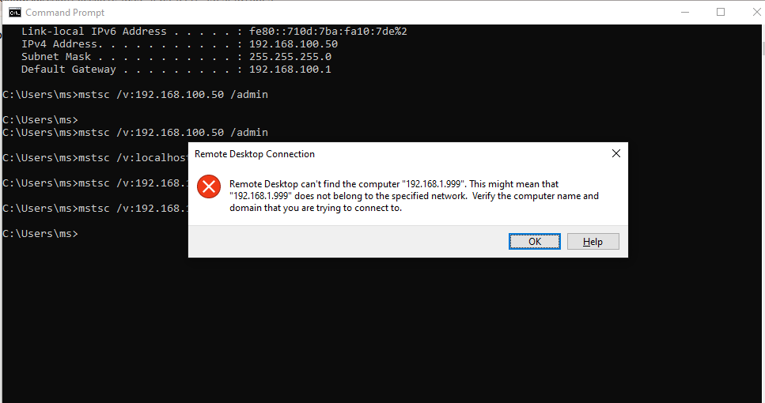

---

### Step 6 — Check Windows Firewall RDP Rule  
Verify the Windows Firewall allow rule for RDP port 3389.  
```
netsh advfirewall firewall show rule name="Remote Desktop - User Mode (TCP-In)"

→ Rule Name: Remote Desktop - User Mode (TCP-In)
→ Enabled: Yes
→ Action: Allow
→ LocalPort: 3389
→ Profiles: Domain, Private, Public
```
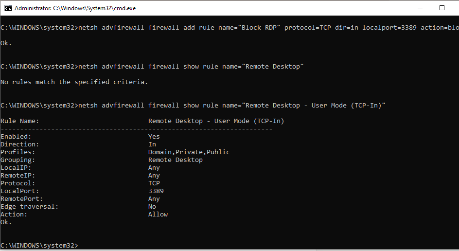

---

### Step 7 — Simulate Firewall Blocking RDP  
Add a custom block rule on port 3389 to simulate firewall blocking RDP.  
```
netsh advfirewall firewall add rule name="Block RDP" protocol=TCP dir=in localport=3389 action=block
```
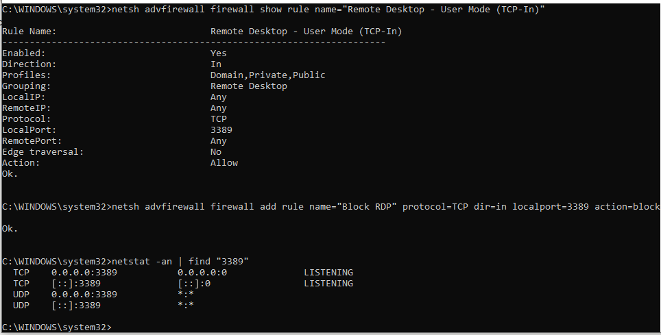

---

### Step 8 — Diagnose Firewall Blocking RDP  
Confirm the block rule is active and identify it as the cause.  
```
netsh advfirewall firewall show rule name="Block RDP"

→ Rule Name: Block RDP
→ Enabled: Yes
→ Action: Block   ← this is blocking RDP
→ LocalPort: 3389
```
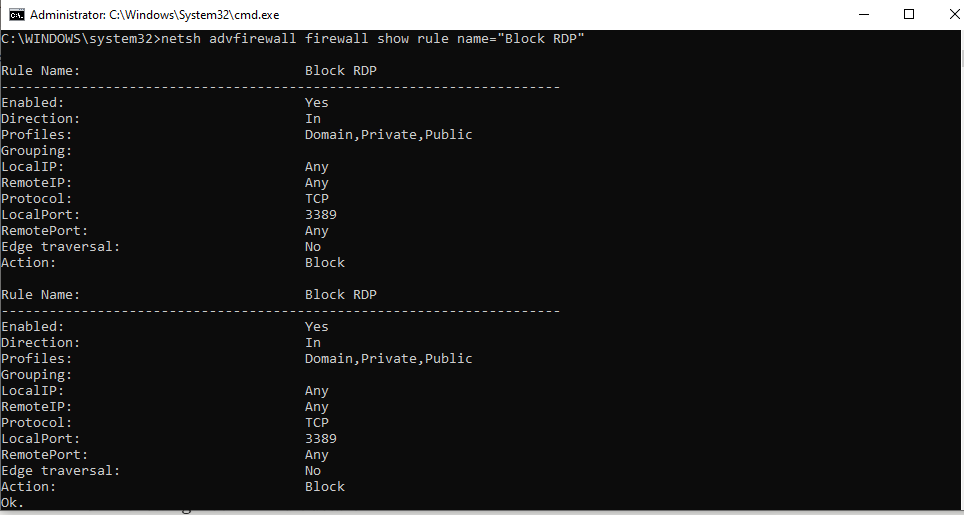

---

### Step 9 — Fix Firewall — Remove Block Rule  
Delete the block rule to restore RDP connectivity.  
```
netsh advfirewall firewall delete rule name="Block RDP"

→ Verify:
netsh advfirewall firewall show rule name="Block RDP"
→ No rules match the specified criteria ✅
```
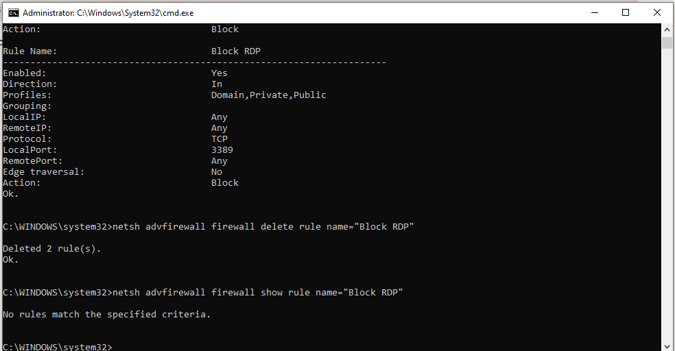

---

### Step 10 — Check RDP Event Logs  
Review RDP session events in Event Viewer.  
```
Win + R → eventvwr.msc → Enter
→ Applications and Services Logs
→ Microsoft → Windows
→ TerminalServices-LocalSessionManager
→ Operational

Event IDs to look for:
→ Event 21 — Session logon succeeded
→ Event 22 — Shell start notification
→ Event 23 — Session logoff
→ Event 25 — Session reconnected
→ Event 40 — Session disconnected
```
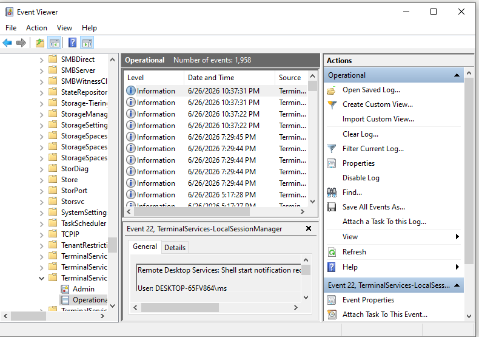

---

### Step 11 — Check RDP Service Status  
Verify the Remote Desktop service (TermService) is running.  
```
sc query TermService

→ SERVICE_NAME: TermService
→ STATE: 4 RUNNING ✅
```
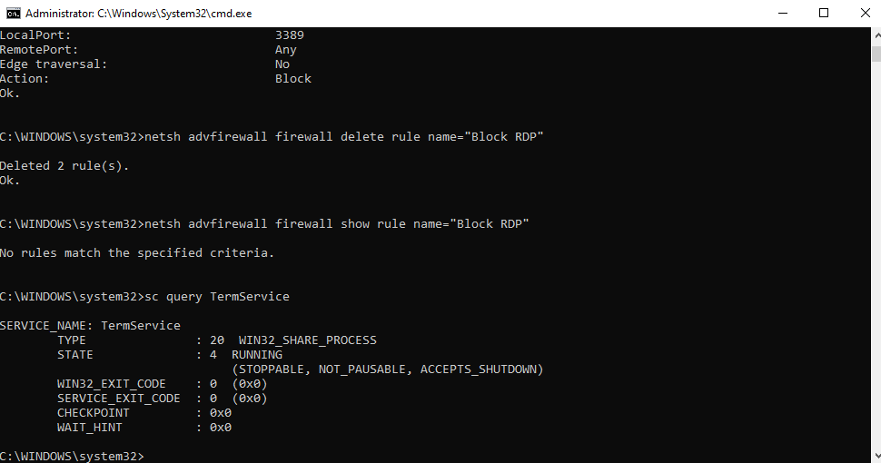

---

### Step 12 — Simulate RDP Service Stopped  
Stop the TermService to simulate RDP service failure.  
```
net stop TermService
→ Y (confirm)

sc query TermService
→ STATE: 1 STOPPED ← RDP service down
```
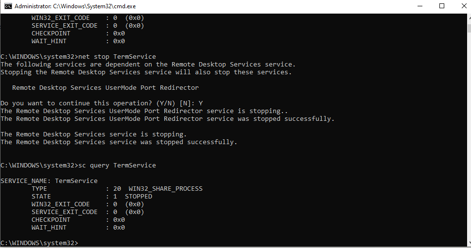

---

### Step 13 — Fix RDP Service — Restart  
Start the TermService again to restore RDP.  
```
net start TermService

sc query TermService
→ STATE: 4 RUNNING ✅
```
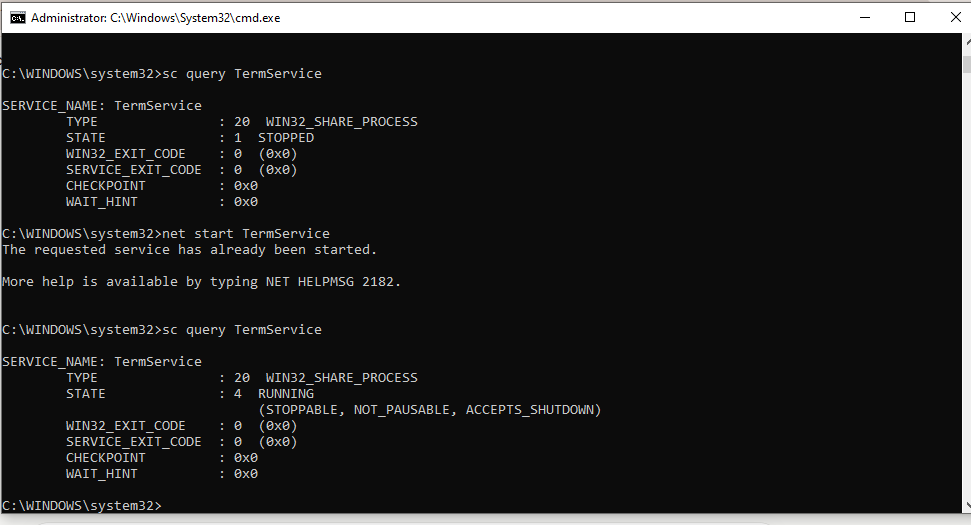

---

### Step 14 — Check RDP Registry Setting  
Verify fDenyTSConnections registry value — controls RDP enable/disable.  
```
reg query "HKLM\SYSTEM\CurrentControlSet\Control\Terminal Server" /v fDenyTSConnections

→ fDenyTSConnections = 0x0 ← RDP enabled ✅
→ If value = 0x1 → RDP disabled via registry
```
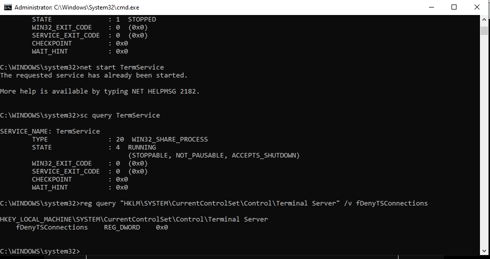

---

### Step 15 — Simulate RDP Disabled via Registry  
Set fDenyTSConnections to 1 to disable RDP via registry.  
```
reg add "HKLM\SYSTEM\CurrentControlSet\Control\Terminal Server" /v fDenyTSConnections /t REG_DWORD /d 1 /f

→ Verify:
reg query "HKLM\SYSTEM\CurrentControlSet\Control\Terminal Server" /v fDenyTSConnections
→ fDenyTSConnections = 0x1 ← RDP disabled
```
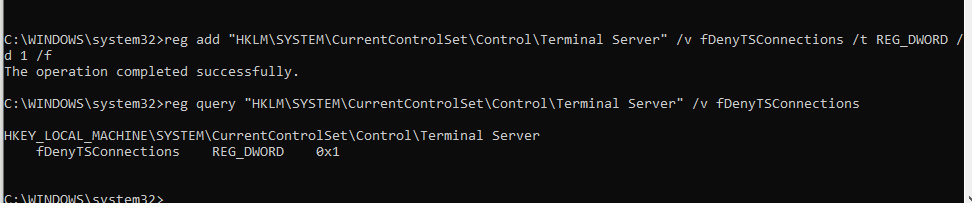

---

### Step 16 — Fix RDP Registry Setting  
Restore fDenyTSConnections to 0 to re-enable RDP.  
```
reg add "HKLM\SYSTEM\CurrentControlSet\Control\Terminal Server" /v fDenyTSConnections /t REG_DWORD /d 0 /f

→ Verify:
reg query "HKLM\SYSTEM\CurrentControlSet\Control\Terminal Server" /v fDenyTSConnections
→ fDenyTSConnections = 0x0 ← RDP enabled ✅
```
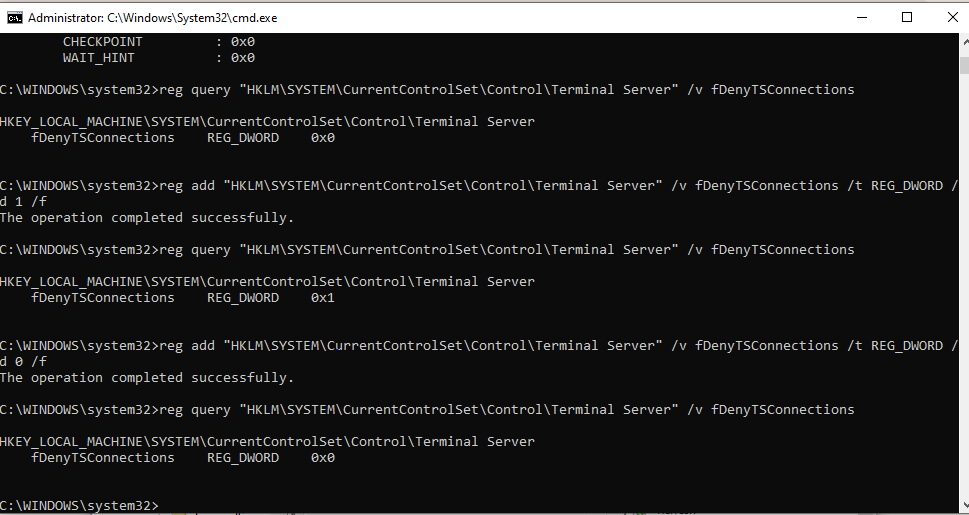

---

### Step 17 — Check RDP Policy via Group Policy Editor  
Verify Group Policy settings for Remote Desktop connections.  
```
Win + R → gpedit.msc → Enter
→ Computer Configuration
→ Administrative Templates
→ Windows Components
→ Remote Desktop Services
→ Remote Desktop Session Host
→ Connections

→ "Allow users to connect remotely using Remote Desktop Services"
   → Set to: Enabled ✅
→ "Limit number of connections"
   → Not Configured
```
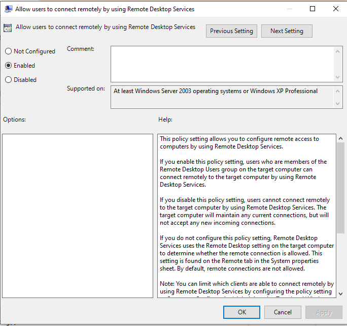

---

### Step 18 — Final RDP Verification via CMD  
Run all verification commands together to confirm RDP is fully operational.  
```
netstat -an | find "3389"
→ LISTENING ✅

netsh advfirewall firewall show rule name="Block RDP"
→ No rules match ✅

sc query TermService
→ STATE: 4 RUNNING ✅
```
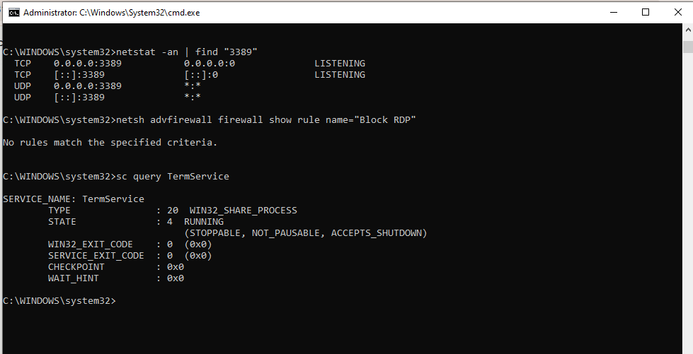

---

### Step 19 — PowerShell RDP Troubleshooting  
Use PowerShell to verify RDP status, service, and firewall rules.  
```powershell
# Check RDP registry status
Get-ItemProperty "HKLM:\SYSTEM\CurrentControlSet\Control\Terminal Server" -Name fDenyTSConnections

# Check RDP service
Get-Service TermService | Select Name, Status, StartType

# Check firewall RDP rules
Get-NetFirewallRule | Where-Object {$_.DisplayName -like "*Remote Desktop*"} | Select DisplayName, Enabled, Action
```
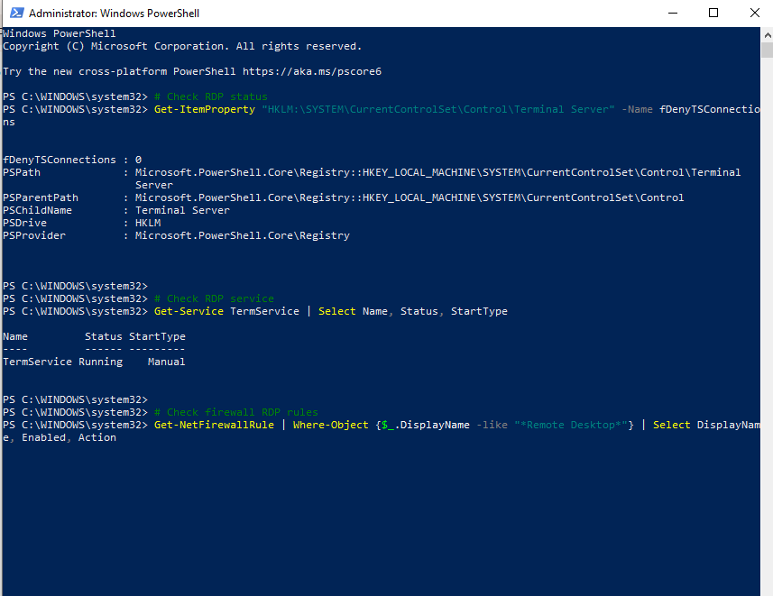

---

### Step 20 — Final Verification & Summary  
Confirm all RDP components are healthy.  
```
netstat -an | find "3389"
→ 0.0.0.0:3389 LISTENING ✅

sc query TermService
→ STATE: 4 RUNNING ✅

reg query "HKLM\SYSTEM\CurrentControlSet\Control\Terminal Server" /v fDenyTSConnections
→ fDenyTSConnections = 0x0 ✅
```
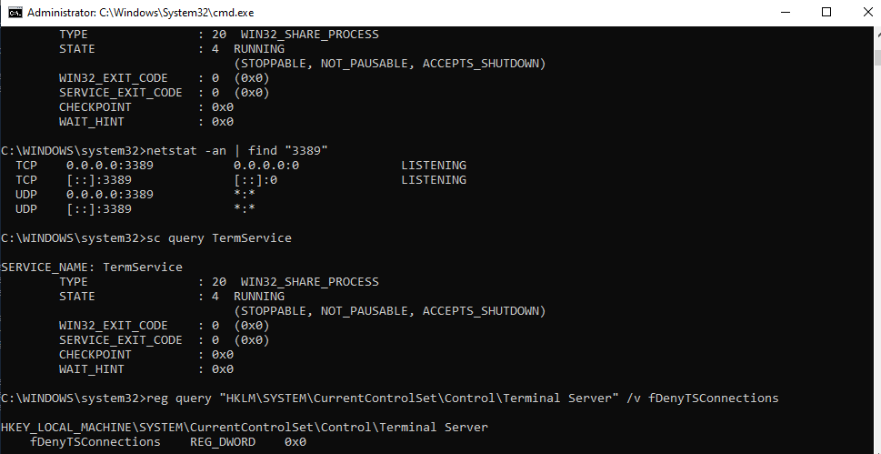

---

## 📟 Summary of Commands  
| Command | Purpose |  
|---------|---------|  
| `netstat -an \| find "3389"` | Verify RDP port 3389 is listening |  
| `sc query TermService` | Check RDP service status |  
| `net stop TermService` | Stop RDP service |  
| `net start TermService` | Start RDP service |  
| `netsh advfirewall firewall show rule` | View firewall rules |  
| `netsh advfirewall firewall add rule` | Add firewall rule |  
| `netsh advfirewall firewall delete rule` | Delete firewall rule |  
| `reg query` | Query registry value |  
| `reg add` | Add or modify registry value |  
| `mstsc /v:<ip>` | Connect via RDP |  
| `mstsc /v:<ip> /admin` | Connect via RDP bypassing console session |  
| `gpedit.msc` | Open Group Policy Editor |  
| `eventvwr.msc` | Open Event Viewer |  
| `Get-Service TermService` | PowerShell — check RDP service |  
| `Get-NetFirewallRule` | PowerShell — list firewall rules |  

---

## ⚠️ Challenges & How I Solved Them  
| Challenge | Solution |  
|-----------|----------|  
| RDP console session conflict error | Used /admin flag to bypass — identified as existing session issue |  
| Wrong IP RDP error | Verified correct IP via ipconfig before attempting connection |  
| Firewall blocking RDP silently | Used netsh to list rules — found custom Block RDP rule on port 3389 |  
| TermService stopped — RDP unavailable | Used sc query to diagnose, net start to restore service |  
| RDP disabled via registry | Queried fDenyTSConnections — found value 0x1, corrected to 0x0 |  
| Group Policy restricting connections | Checked gpedit.msc Connections folder — enabled Allow remote connections policy |  

---

## 🧠 What I Learned  
How to systematically troubleshoot Remote Desktop Protocol issues using Windows built-in tools — covering all six common RDP failure points: system properties misconfiguration, firewall blocking port 3389, TermService failure, registry-level disable, Group Policy restrictions, and wrong IP/host errors — using CMD, PowerShell, Event Viewer, Registry, and Group Policy Editor.

---

## 📁 Files  
| File | Description |  
|------|-------------|  
| `README.md` | Full lab documentation |  
| `screenshots/` | Step-by-step screenshots folder |
