# System Diagnostics & Desktop Support

**Domain:** IT Support & Troubleshooting  
**Difficulty:** Intermediate  
**Tools:** Windows 10/11, Event Viewer, Task Manager, Device Manager, CMD, PowerShell

---

## 🎯 Objective  
Diagnose and resolve common desktop support issues including high CPU/memory usage, driver failures, OS errors, slow performance, and application crashes using built-in Windows diagnostic tools.

---

## 🛠️ Tools & Technologies  
| Tool | Purpose |  
|------|---------|  
| Event Viewer | View system, application, and security logs |  
| Task Manager | Monitor CPU, RAM, disk, and process usage |  
| Device Manager | Identify and fix driver issues |  
| Resource Monitor | Deep-dive process and resource analysis |  
| Reliability Monitor | Timeline of system errors and crashes |  
| System Configuration (msconfig) | Manage startup and boot options |  
| CMD / PowerShell | Command-line diagnostics and repairs |  
| SFC / DISM | System file and image repair |  

---

## 🖥️ Lab Environment

### Devices  
- 1 Windows 10/11 PC (physical or VM)  
- Internet access (optional, for driver downloads)

### Simulated Issues  
| # | Issue | Type |  
|---|-------|------|  
| 1 | PC running very slow | High CPU / RAM usage |  
| 2 | Unknown device in Device Manager | Missing/corrupt driver |  
| 3 | Application crash on startup | OS / app error |  
| 4 | Blue Screen of Death (BSOD) entry in logs | Critical system error |  
| 5 | Corrupted system files | Windows image integrity |  

---

## 📋 Steps & Screenshots

### Step 1 — Open Task Manager & Check Resource Usage  
Open Task Manager to identify what is consuming system resources.  
```
Right-click Taskbar → Task Manager
  OR
Press: Ctrl + Shift + Esc

→ Click "More details" if compact view shows
→ Go to: Performance tab → observe CPU, Memory, Disk, Network usage
→ Go to: Processes tab → sort by CPU or Memory (click column header)
→ Identify any process using abnormally high resources
```
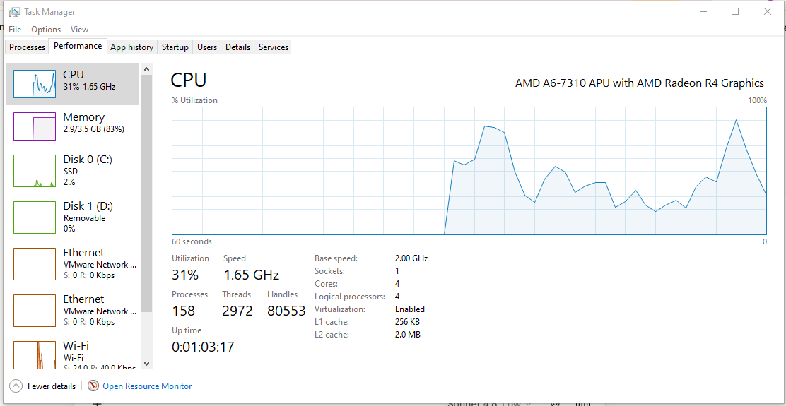

---

### Step 2 — Identify High CPU Process  
Find which process is causing high CPU usage.  
```
Task Manager → Processes tab
→ Click "CPU" column header to sort descending
→ Look for process at top consuming high %
→ Right-click suspicious process → "Open file location"
→ Right-click suspicious process → "Search online" (to verify if legit)
→ If malicious or unnecessary: Right-click → "End Task"
```
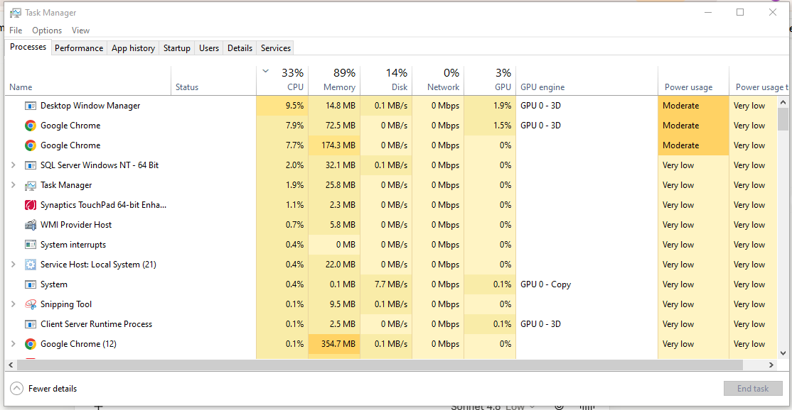

---

### Step 3 — Check Startup Programs  
Disable unnecessary startup programs that slow boot time.  
```
Task Manager → Startup tab
→ Review list of programs set to run at startup
→ Check "Startup impact" column (High / Medium / Low)
→ Right-click any unnecessary high-impact program → Disable

  OR via System Configuration:
  Win + R → type: msconfig → Enter
  → Startup tab → Open Task Manager (links to same view)
```
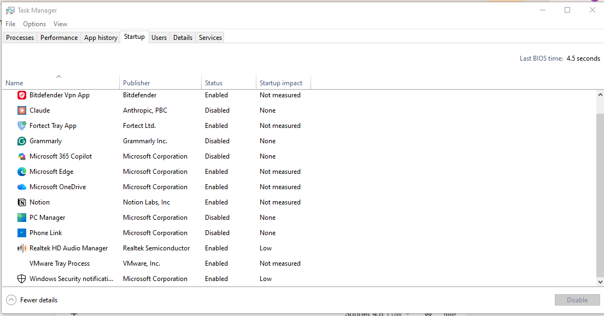

---

### Step 4 — Open Resource Monitor for Deep Analysis  
Use Resource Monitor for a more detailed view of resource consumption.  
```
Task Manager → Performance tab → "Open Resource Monitor" (bottom link)
  OR
Win + R → type: resmon → Enter

→ CPU tab: shows per-process CPU threads and handles
→ Memory tab: shows Working Set, Commit, and Shareable per process
→ Disk tab: shows read/write per process and file being accessed
→ Network tab: shows active connections per process
```
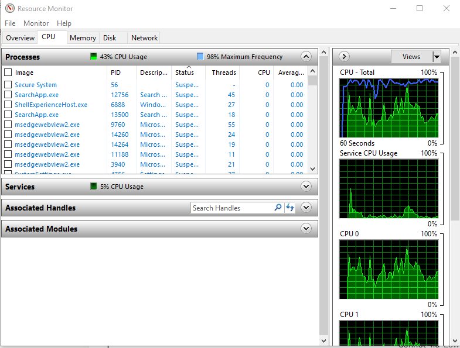

---

### Step 5 — Open Event Viewer  
Open Event Viewer to check system and application logs for errors.  
```
Win + R → type: eventvwr.msc → Enter
  OR
Right-click Start → Event Viewer

→ Expand: Windows Logs
   → Application  (app crashes, errors)
   → System       (driver failures, OS errors)
   → Security     (login events, audit logs)
```
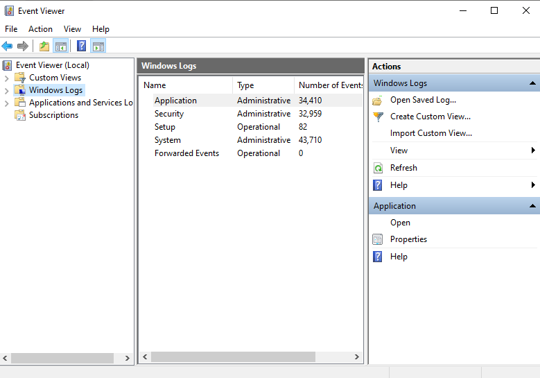

---

### Step 6 — Filter Critical & Error Events  
Filter logs to find only critical errors — ignore informational noise.  
```
Event Viewer → Windows Logs → System
→ Right-click "System" → Filter Current Log
→ Event level: check ✅ Critical  ✅ Error
→ Click OK

→ Review filtered list
→ Click any event to read:
   - Event ID
   - Source
   - Description
   - Date/Time
```
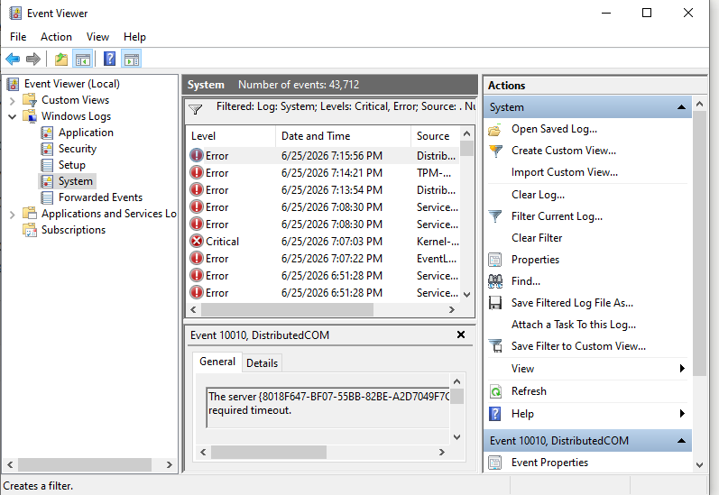

---

### Step 7 — Investigate a Specific Event ID  
Understand what a specific Event ID means.  
```
Example — Common Event IDs:
| Event ID | Meaning |
|----------|---------|
| 41        | Kernel-Power — unexpected shutdown / BSOD |
| 6008      | Unexpected shutdown |
| 1000      | Application crash (App Error) |
| 7034      | Service crashed unexpectedly |
| 10016     | DCOM permission error |

→ Note the Event ID from the log
→ Right-click event → "Attach Task to This Event" (to alert on recurrence)
  OR search: "Event ID XXXX" online for KB articles
```
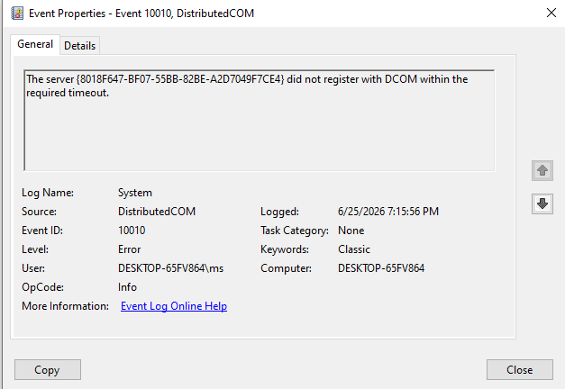

---

### Step 8 — Check Reliability Monitor  
Reliability Monitor shows a visual timeline of crashes, errors, and installs.  
```
Win + R → type: perfmon /rel → Enter
  OR
Control Panel → Security and Maintenance → Reliability Monitor

→ View the stability index graph (1–10 scale)
→ Click any red X (Critical) or yellow triangle (Warning) on the timeline
→ Bottom pane shows: problem signature, date, application involved
→ Click "View technical details" for full crash info
→ Click "Check for solution" to query Microsoft KB
```
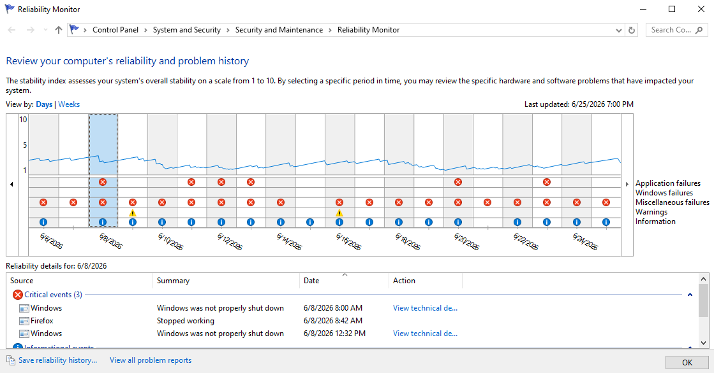

---

### Step 9 — Open Device Manager & Find Driver Issues  
Identify devices with missing, corrupted, or outdated drivers.  
```
Win + X → Device Manager
  OR
Win + R → type: devmgmt.msc → Enter

→ Look for devices with:
   ⚠️  Yellow triangle  = driver error / missing driver
   ❌  Red X            = device disabled
   ❓  Unknown device   = no driver installed

→ Click "View" menu → "Show hidden devices" (reveals ghost devices)
→ Expand any category to inspect individual devices
```
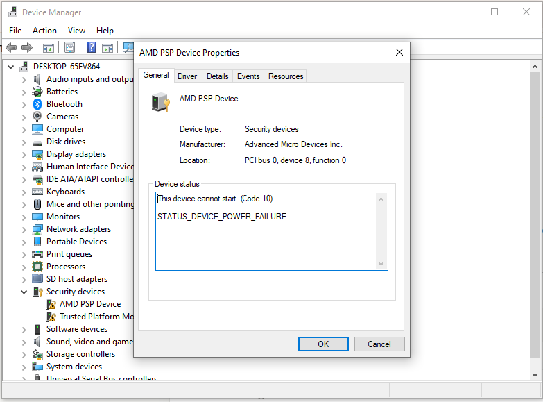

---

### Step 10 — Fix a Driver Issue  
Update, roll back, or reinstall a faulty driver.  
```
Device Manager → Right-click the problematic device

Option A — Update Driver:
→ "Update driver" → "Search automatically for drivers"
→ If not found: "Browse my computer" → point to downloaded .inf file

Option B — Roll Back Driver (if issue started after update):
→ Right-click device → Properties → Driver tab
→ "Roll Back Driver" (grayed out if no previous version)

Option C — Uninstall & Reinstall:
→ Right-click device → "Uninstall device"
→ Check: "Delete the driver software for this device"
→ Action menu → "Scan for hardware changes" (reinstalls fresh)
```
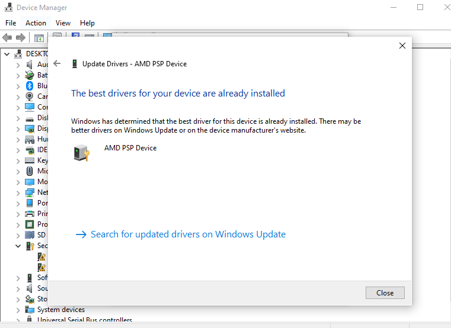

---

### Step 11 — Check Driver Details via PowerShell  
List all installed drivers and spot unsigned or problematic ones.  
```powershell
# List all installed drivers
Get-WmiObject Win32_PnPSignedDriver | Select DeviceName, DriverVersion, Manufacturer | Format-Table

# Check for unsigned drivers specifically
Get-WmiObject Win32_PnPSignedDriver | Where-Object {$_.IsSigned -eq $false} | Select DeviceName, Manufacturer

# Check driver version for a specific device (e.g. display)
Get-WmiObject Win32_PnPSignedDriver | Where-Object {$_.DeviceName -like "*Display*"} | Select DeviceName, DriverVersion
```
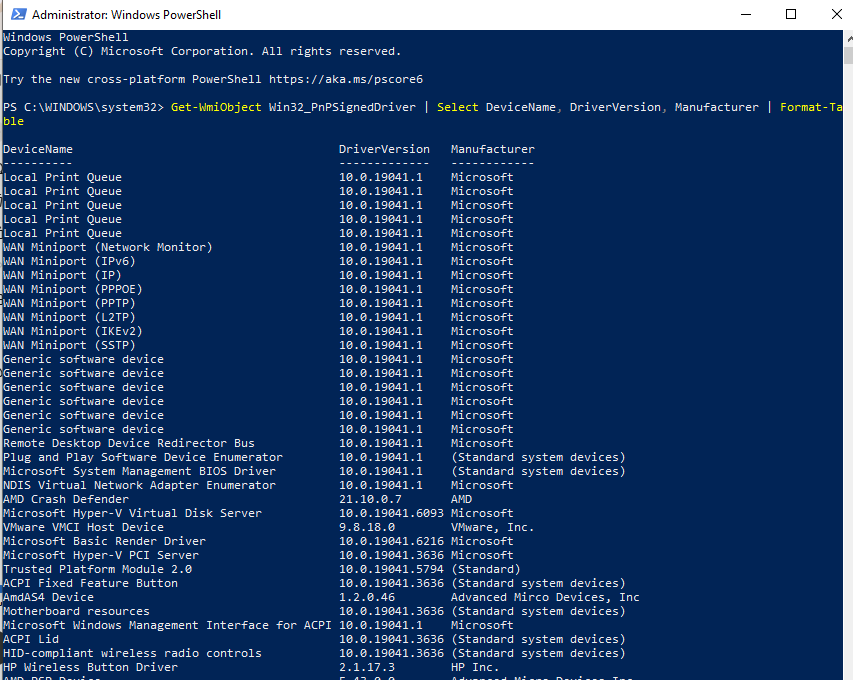

---

### Step 12 — Run System File Checker (SFC)  
Scan and repair corrupted Windows system files.  
```
Open CMD as Administrator:
  Win + S → type: cmd → Right-click → "Run as administrator"

Run SFC:
  sfc /scannow

→ Wait for scan to complete (5–10 minutes)
→ Possible results:
   ✅ "Windows Resource Protection did not find any integrity violations."
   🔧 "Windows Resource Protection found corrupt files and successfully repaired them."
   ❌ "Windows Resource Protection found corrupt files but was unable to fix some of them."
      → If this: run DISM next (Step 13)
```
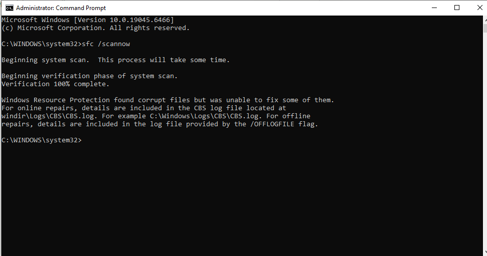

---

### Step 13 — Run DISM to Repair Windows Image  
If SFC couldn't fix files, use DISM to repair the Windows component store.  
```
CMD (Administrator):

# Step 1 — Check image health
DISM /Online /Cleanup-Image /CheckHealth

# Step 2 — Scan for corruption
DISM /Online /Cleanup-Image /ScanHealth

# Step 3 — Repair the image (downloads from Windows Update)
DISM /Online /Cleanup-Image /RestoreHealth

→ After DISM completes, run SFC again:
sfc /scannow
```
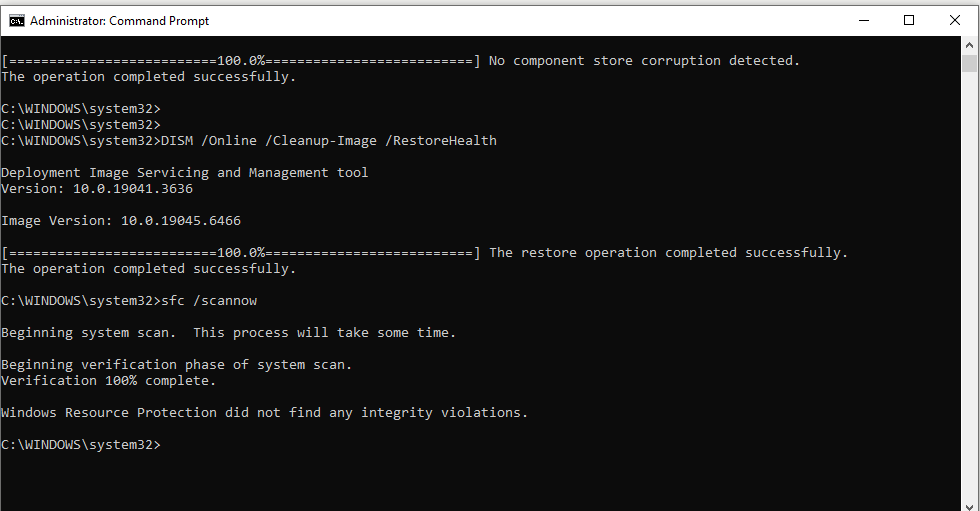

---

### Step 14 — Investigate Application Crash  
Find the root cause of a specific application that keeps crashing.  
```
Event Viewer → Windows Logs → Application
→ Filter: Level = Error
→ Source = "Application Error"
→ Look for Event ID 1000

→ Read the details:
   - Faulting application name (which app crashed)
   - Faulting module name (which DLL/component caused it)
   - Exception code (e.g. 0xc0000005 = Access Violation)

Common exception codes:
| Code       | Meaning |
|------------|---------|
| 0xc0000005 | Access violation (memory issue) |
| 0xc000007b | Wrong architecture (32-bit vs 64-bit DLL mismatch) |
| 0xe0434352 | .NET CLR crash |
| 0x80000003 | Breakpoint hit (debug code left in release) |
```
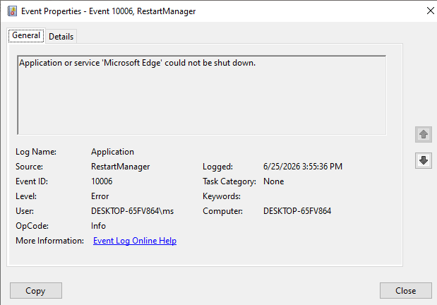

---

### Step 15 — Check Memory for Errors  
Run Windows Memory Diagnostic to test RAM for faults.  
```
Win + R → type: mdsched.exe → Enter
→ "Restart now and check for problems"
→ PC reboots and runs memory test automatically
→ After reboot, results appear in:
   Event Viewer → Windows Logs → System
   → Source: MemoryDiagnostics-Results
   → Event ID: 1201 (pass) or 1101 (fail / errors found)

  OR in CMD:
  wevtutil qe System "/q:*[System[Provider[@Name='Microsoft-Windows-MemoryDiagnostics-Results']]]" /f:text /c:1
```
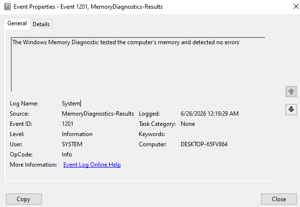

---

### Step 16 — Check Disk Health  
Verify disk health to rule out storage as the cause of errors.  
```
CMD (Administrator):

# Check disk for errors (requires reboot for system drive)
chkdsk C: /f /r

# Check SMART status via WMIC
wmic diskdrive get status, model, size

# PowerShell — detailed disk info
Get-PhysicalDisk | Select FriendlyName, HealthStatus, OperationalStatus, Size

→ HealthStatus should show: Healthy
→ If "Warning" or "Unhealthy" → back up data immediately and replace drive
```
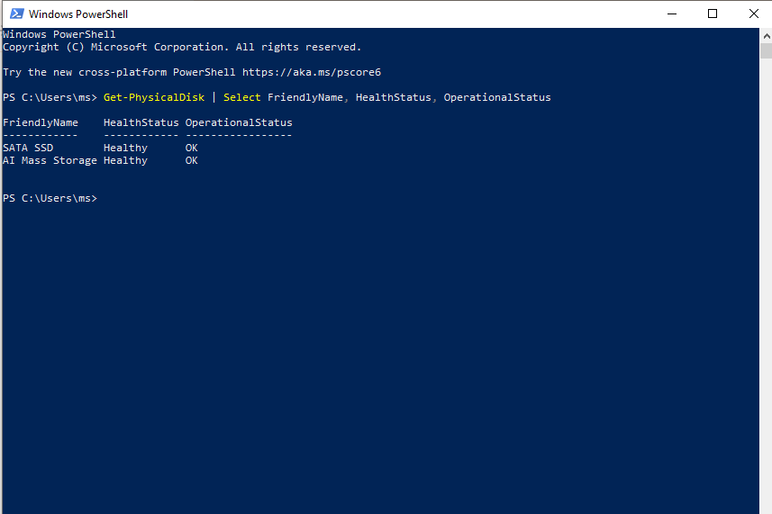

---

### Step 17 — Review BSOD (Blue Screen) Information  
Find BSOD details from Event Viewer and analyse the stop code.  
```
Event Viewer → Windows Logs → System
→ Filter: Level = Critical
→ Source = "BugCheck" or "Kernel-Power"
→ Event ID 41 = unexpected shutdown / power failure BSOD

Read the stop code from the event description:
   e.g. "0x0000007E" = SYSTEM_THREAD_EXCEPTION_NOT_HANDLED

Common BSOD stop codes:
| Stop Code | Cause |
|-----------|-------|
| 0x0000007E | Driver or system file exception |
| 0x0000000A | IRQL_NOT_LESS_OR_EQUAL — driver bug |
| 0x0000001E | KMODE_EXCEPTION_NOT_HANDLED |
| 0x00000050 | PAGE_FAULT_IN_NONPAGED_AREA — bad RAM/driver |
| 0x000000EF | CRITICAL_PROCESS_DIED |

→ Search stop code + driver name on Microsoft Learn or KB
```
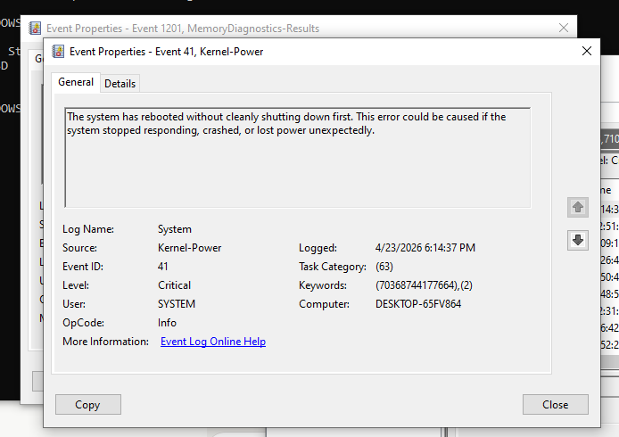

---

### Step 18 — Enable & Read Minidump Files  
Configure Windows to save crash dump files for deeper BSOD analysis.  
```
Win + R → type: sysdm.cpl → Enter
→ Advanced tab → Startup and Recovery → Settings
→ Under "Write debugging information":
   Select: "Small memory dump (256 KB)"
   Dump file: %SystemRoot%\Minidump

After a BSOD occurs, dump file appears at:
   C:\Windows\Minidump\

→ Open dump file with WinDbg (Windows Debugger):
   windbg -z C:\Windows\Minidump\<filename>.dmp
   → Type: !analyze -v
   → Look for: "Probably caused by" line
```
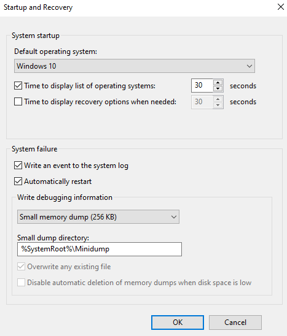

---

### Step 19 — Generate a System Health Report  
Use Performance Monitor to generate a full system diagnostics report.  
```
CMD (Administrator):

# Generate System Diagnostics report
perfmon /report

→ Windows collects data for 60 seconds automatically
→ Report opens in Performance Monitor browser
→ Review sections:
   - Warnings (yellow) and Errors (red)
   - Software Configuration
   - Hardware Configuration
   - CPU, Network, Disk, Memory analysis
   - Top processes by resource usage

  OR manually:
  Performance Monitor → Reports → System → System Diagnostics
```

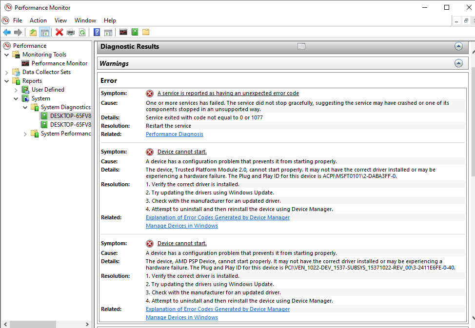

---

### Step 20 — Final Verification & Documentation  
Confirm the system is healthy after all fixes.  
```
# Verify SFC clean
sfc /scannow

# Confirm no critical events in last 24hrs
Get-EventLog -LogName System -EntryType Error,Warning -Newest 20

# Check uptime
systeminfo | find "System Boot Time"

# Confirm disk health
wmic diskdrive get status

# Confirm no unsigned drivers
Get-WmiObject Win32_PnPSignedDriver | Where-Object {$_.IsSigned -eq $false}
```
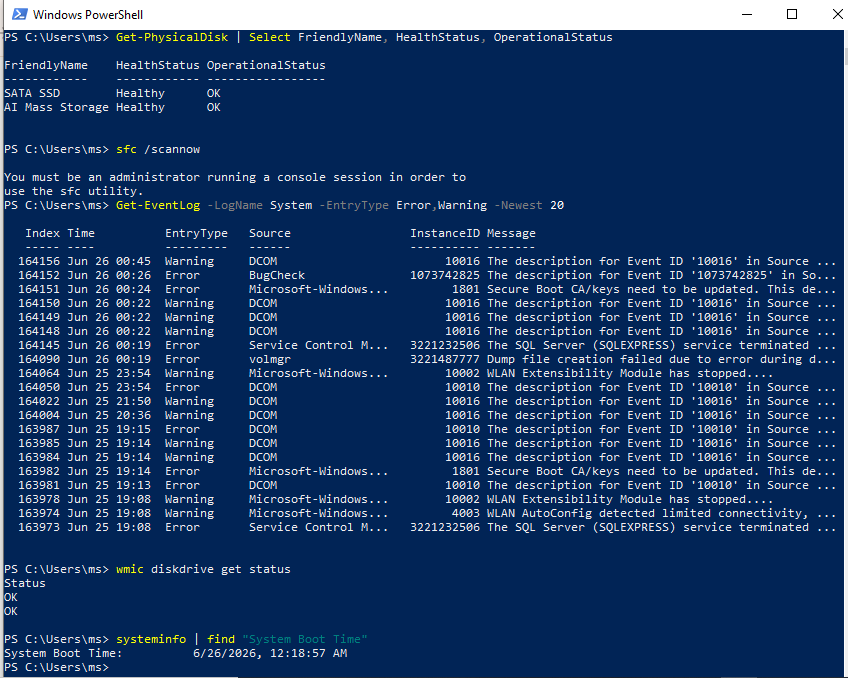

---

## 📟 Summary of Commands  
| Command / Tool | Purpose |  
|----------------|---------|  
| `Ctrl + Shift + Esc` | Open Task Manager |  
| `eventvwr.msc` | Open Event Viewer |  
| `devmgmt.msc` | Open Device Manager |  
| `resmon` | Open Resource Monitor |  
| `perfmon /rel` | Open Reliability Monitor |  
| `perfmon /report` | Generate System Health Report |  
| `msconfig` | Open System Configuration |  
| `mdsched.exe` | Windows Memory Diagnostic |  
| `sfc /scannow` | Scan and repair system files |  
| `DISM /Online /Cleanup-Image /RestoreHealth` | Repair Windows image |  
| `chkdsk C: /f /r` | Check and repair disk |  
| `wmic diskdrive get status` | Check SMART disk status |  
| `sysdm.cpl` | System Properties (minidump config) |  
| `Get-WmiObject Win32_PnPSignedDriver` | List all drivers via PowerShell |  
| `Get-EventLog -LogName System -EntryType Error` | Query event log via PowerShell |  

---

## ⚠️ Challenges & How I Solved Them  
| Challenge | Solution |  
|-----------|----------|  
| Event Viewer flooded with informational logs | Used Filter Current Log → selected only Critical and Error levels |  
| SFC found corrupt files but couldn't repair | Ran DISM /RestoreHealth first, then re-ran SFC |  
| Device Manager showed unknown device | Used "Show hidden devices" and matched Hardware ID online to find correct driver |  
| Application crash had no obvious cause | Cross-referenced Event ID 1000 faulting module with driver list in Device Manager |  
| BSOD stop code unclear | Enabled small memory dump, used !analyze -v in WinDbg to pinpoint the faulting driver |  

---

## 🧠 What I Learned  
How to systematically diagnose Windows desktop issues using Event Viewer, Task Manager, Device Manager, Resource Monitor, Reliability Monitor, SFC, DISM, and PowerShell — covering the full workflow from spotting symptoms to identifying root causes and applying fixes for driver failures, application crashes, BSOD events, and corrupted system files.

---

## 📁 Files  
| File | Description |  
|------|-------------|  
| `README.md` | Full lab documentation |  
| `screenshots/` | Step-by-step screenshots folder |
