# Windows Update & Patch Management

**Domain:** IT Support & Troubleshooting  
**Difficulty:** Intermediate — Advanced  
**Tools:** Windows 10 Pro, CMD, PowerShell, Event Viewer, DISM, SFC

---

## 🎯 Objective  
Diagnose and resolve common Windows Update issues including stuck updates, failed patches, corrupted update cache, and service failures using Windows built-in tools — CMD, PowerShell, DISM, SFC, and Event Viewer — covering the complete patch management troubleshooting workflow.

---

## 🛠️ Tools & Technologies  
| Tool | Purpose |  
|------|---------|  
| Windows 10 Pro | Lab environment |  
| CMD (Admin) | Service control, cache clearing, DISM, SFC |  
| PowerShell (Admin) | Update logs, installed patches, pending updates |  
| Event Viewer | WindowsUpdateClient event analysis |  
| Windows Update Settings | GUI update status and history |  
| DISM | Windows image health check and repair |  
| SFC | System file integrity verification |  
| PSWindowsUpdate | PowerShell module for update management |  
| Registry | Windows Update policy key inspection |  

---

## 🖥️ Lab Environment

### Requirements  
- Windows 10 Pro (Version 22H2)  
- Administrator account  
- Internet connection (for DISM RestoreHealth)  

### Simulated Issues  
| # | Issue | Type |  
|---|-------|------|  
| 1 | Windows Update reached end of support | EOL OS warning |  
| 2 | Update services not running | wuauserv / bits / cryptsvc stopped |  
| 3 | Corrupted update cache | SoftwareDistribution folder corrupt |  
| 4 | Windows image corruption | DISM component store issues |  
| 5 | System file integrity violations | SFC corruption check |  
| 6 | PSWindowsUpdate execution policy blocked | Script execution disabled |  

---

## 📋 Steps & Screenshots

### Step 1 — Check Windows Update Status  
Open Windows Update settings to check current update status.  
```
Win + I → Update & Security → Windows Update

→ Status shown:
  "Your version of Windows has reached the end of support"
  "Your device is no longer receiving security updates"
  → This is a real-world IT Support scenario — Windows 10 22H2 EOL
```
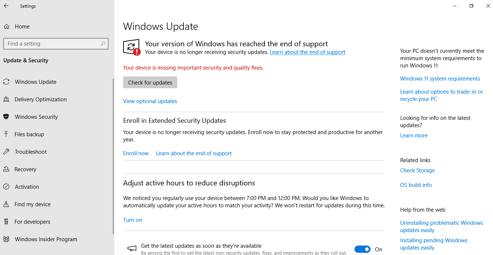

---

### Step 2 — Check Update History  
Review all previously installed updates and their status.  
```
Win + I → Update & Security → Windows Update → View update history

→ Quality Updates (19) listed
→ Most recent: Security Update for SQL Server 2019 (KB5090408)
   Successfully installed on 6/27/2026
→ Review for any Failed updates in the list
```
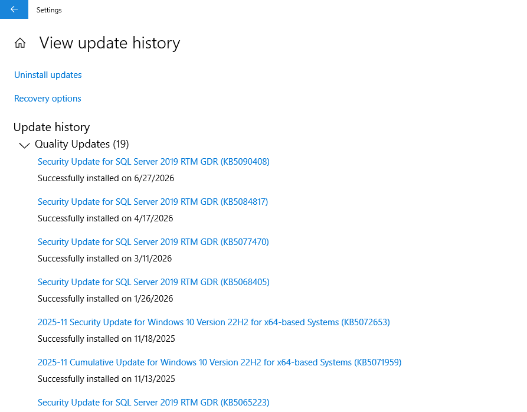

---

### Step 3 — Check Windows Update Service Status  
Verify all three Windows Update dependent services are running.  
```
sc query wuauserv
→ wuauserv (Windows Update): STATE 4 RUNNING ✅

sc query bits
→ bits (Background Intelligent Transfer): STATE 4 RUNNING ✅

sc query cryptsvc
→ cryptsvc (Cryptographic Services): STATE 4 RUNNING ✅
```
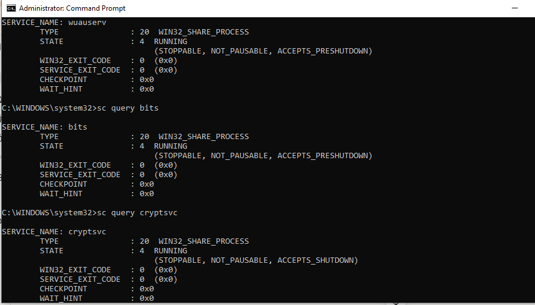

---

### Step 4 — Stop Windows Update Services  
Stop all three services to prepare for cache clearing.  
```
net stop wuauserv
→ Windows Update service stopped successfully

net stop bits
→ Background Intelligent Transfer Service stopped
  (Note: if already stopped — "service is not started" is expected)

net stop cryptsvc
→ Cryptographic Services stopped successfully
```
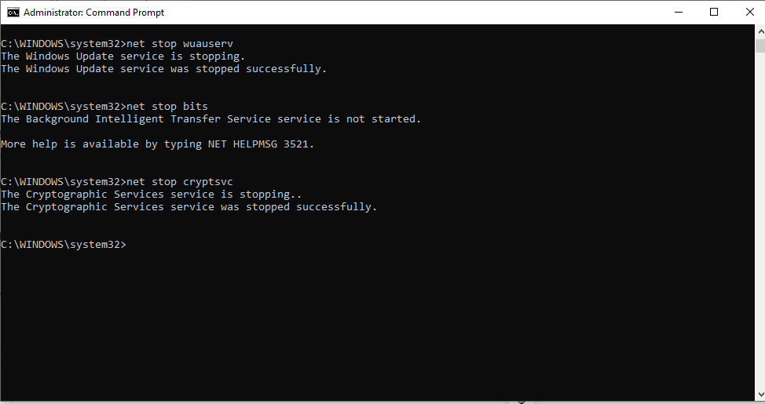

---

### Step 5 — Clear Windows Update Cache  
Delete the corrupted update cache folders.  
```
rd /s /q C:\Windows\SoftwareDistribution
rd /s /q C:\Windows\System32\catroot2

→ If folders already deleted or not found:
  "The system cannot find the file specified" — this is expected
  if cache was already cleared in a previous attempt
```
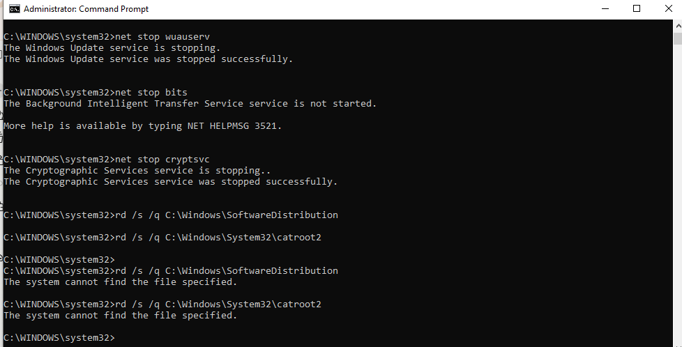

---

### Step 6 — Restart Windows Update Services  
Restart all three services after cache clearing.  
```
net start cryptsvc
→ Cryptographic Services started successfully ✅

net start bits
→ Background Intelligent Transfer Service started successfully ✅

net start wuauserv
→ Windows Update service started successfully ✅
```
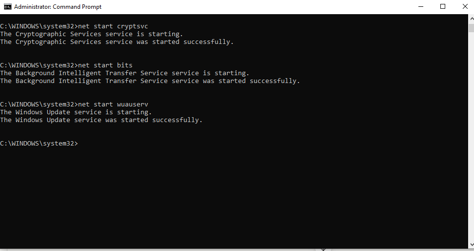

---

### Step 7 — Run Windows Update Troubleshooter  
Use the built-in troubleshooter to auto-detect and fix update issues.  
```
Win + I → Update & Security → Troubleshoot
→ Additional troubleshooters
→ Windows Update → Run the troubleshooter

→ Troubleshooter opens and detects problems automatically
→ "Detecting problems..." progress shown
```
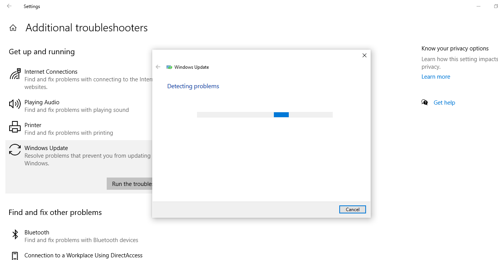

---

### Step 8 — Check Update Errors via Event Viewer  
Filter Event Viewer to show only Windows Update events.  
```
Win + R → eventvwr.msc → Enter
→ Windows Logs → System
→ Right-click System → Filter Current Log
→ Event sources: WindowsUpdateClient
→ Click OK

→ Shows all update installation started/succeeded/failed events
```
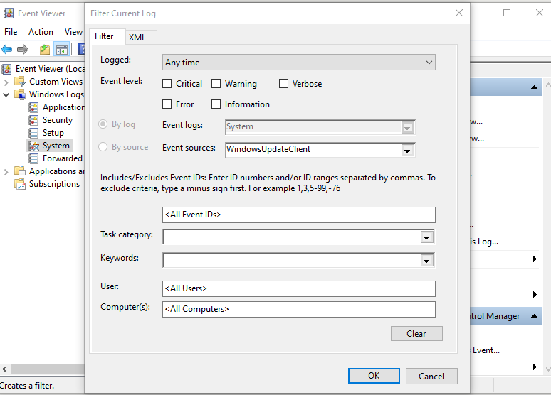

---

### Step 9 — Check Update Logs via PowerShell  
Query Windows Update event log entries using PowerShell.  
```powershell
Get-WinEvent -LogName System | Where-Object {$_.ProviderName -like "*WindowsUpdate*"} | Select TimeCreated, Message -First 10

→ Output shows:
  6/27/2026 — Installation Successful: Security Update
  6/27/2026 — Installation Started: Security Update
  6/26/2026 — Installation Successful: 9WZDNCRD29V9
  6/26/2026 — Windows Update started downloading an update
```
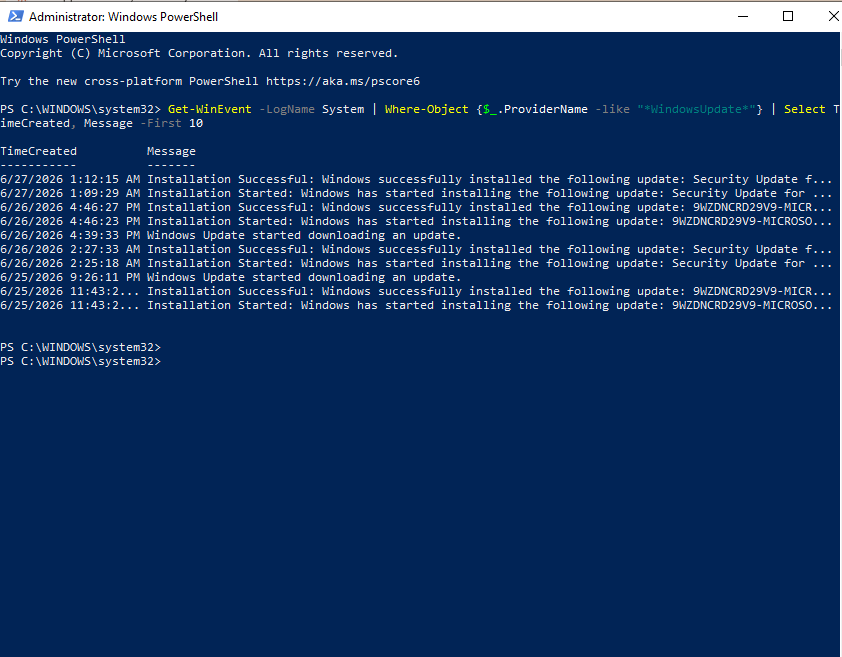

---

### Step 10 — Check Installed Updates via PowerShell  
List all installed Windows patches sorted by date.  
```powershell
Get-HotFix | Sort-Object InstalledOn -Descending | Select HotFixID, Description, InstalledOn -First 10

→ Output:
  KB5072653 — Security Update — 11/17/2025
  KB5071959 — Security Update — 11/12/2025
  KB5071982 — Security Update — 11/12/2025
  KB5066130 — Update         — 10/14/2025
  KB5066790 — Security Update — 10/14/2025
  (and more...)
```
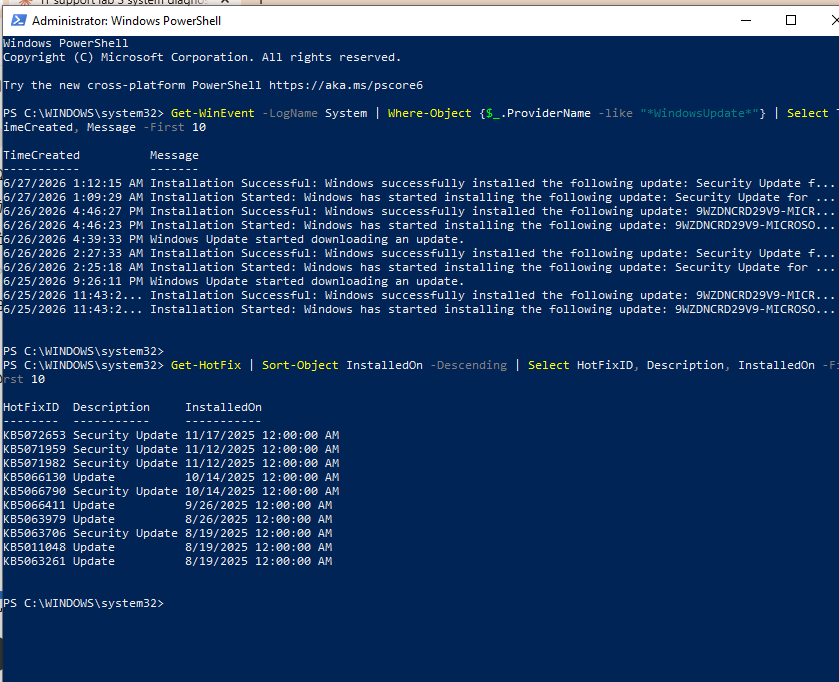

---

### Step 11 — Check Pending Updates via PowerShell  
Check if any updates are waiting to be installed.  
```powershell
(New-Object -ComObject Microsoft.Update.Session).CreateUpdateSearcher().Search("IsInstalled=0").Updates | Select Title, IsDownloaded

→ Empty output = no pending updates currently available
→ This confirms system is up to date for available patches
```
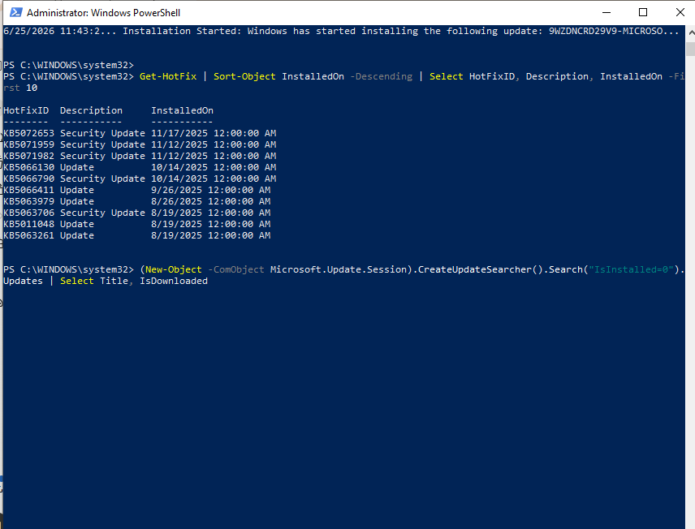

---

### Step 12 — Run DISM CheckHealth & ScanHealth  
Check Windows image integrity before attempting repair.  
```
DISM /Online /Cleanup-Image /CheckHealth
→ No component store corruption detected ✅
→ The operation completed successfully

DISM /Online /Cleanup-Image /ScanHealth
→ No component store corruption detected ✅
→ The operation completed successfully
```
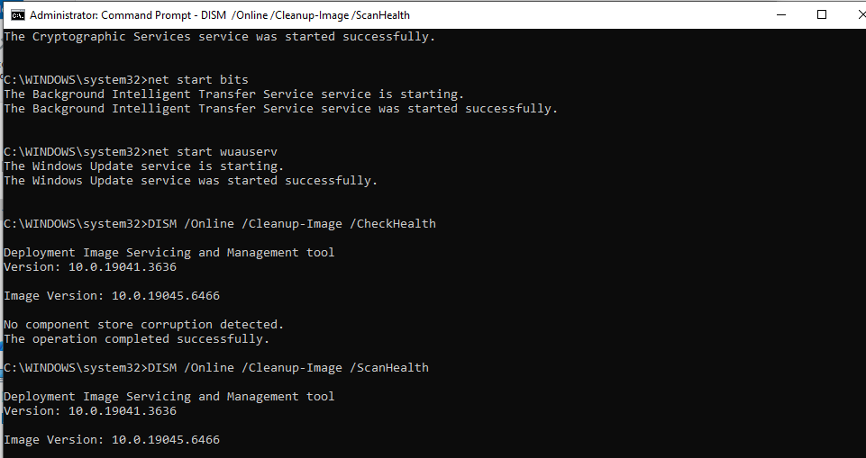

---

### Step 13 — Run DISM RestoreHealth  
Repair the Windows component store using Windows Update as source.  
```
DISM /Online /Cleanup-Image /RestoreHealth

→ [===========100.0%===========] The restore operation completed successfully
→ The operation completed successfully ✅

→ Note: Requires internet connection — downloads repair files
  from Windows Update servers automatically
```
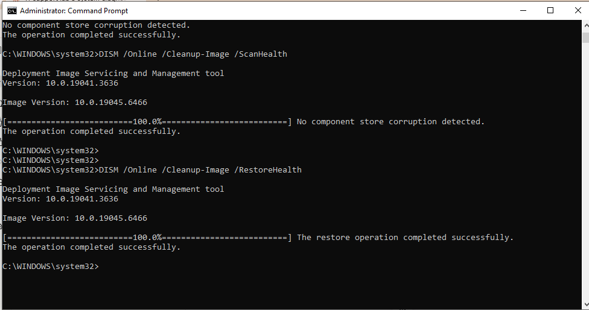

---

### Step 14 — Run SFC After DISM  
Verify and repair system files after DISM completes.  
```
sfc /scannow

→ Beginning system scan. This process will take some time.
→ Verification 100% complete.
→ Windows Resource Protection did not find any integrity violations. ✅
```
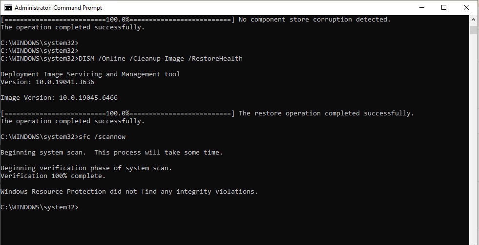

---

### Step 15 — Check Windows Update Registry Settings  
Inspect Group Policy registry keys that control Windows Update behavior.  
```
reg query "HKLM\SOFTWARE\Policies\Microsoft\Windows\WindowsUpdate"
→ ERROR: The system was unable to find the specified registry key or value.

reg query "HKLM\SOFTWARE\Policies\Microsoft\Windows\WindowsUpdate\AU"
→ ERROR: The system was unable to find the specified registry key or value.

→ Both errors are EXPECTED and HEALTHY ✅
→ Means: No Group Policy restrictions applied to Windows Update
→ If keys existed with values — would indicate GPO blocking updates
```
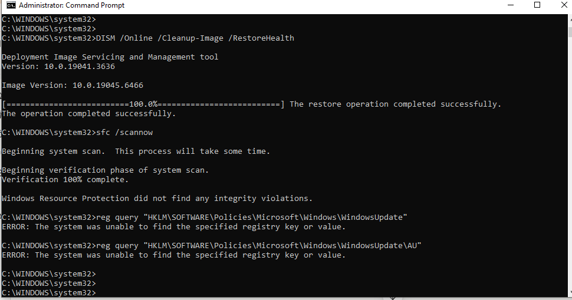

---

### Step 16 — Force Windows Update via PSWindowsUpdate Module  
Attempt to use PSWindowsUpdate PowerShell module for update management.  
```powershell
Install-Module PSWindowsUpdate -Force
Import-Module PSWindowsUpdate
Get-WindowsUpdate

→ Issue encountered:
  "running scripts is disabled on this system"
  → Execution Policy is blocking the module

→ This is a common IT Support issue — PowerShell execution policy
  set to Restricted prevents module loading

→ Fix:
  Set-ExecutionPolicy RemoteSigned -Scope CurrentUser
```
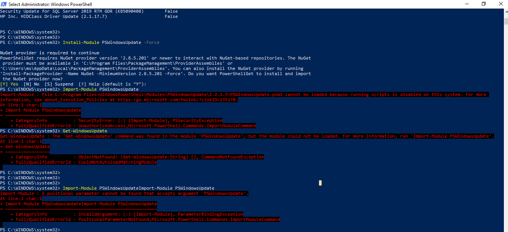

---

### Step 17 — Final Verification  
Run all final checks to confirm Windows Update health.  
```
CMD:
sc query wuauserv  → STATE: 4 RUNNING ✅
sc query bits      → STATE: 1 STOPPED (bits stops when idle — normal)
sfc /scannow       → No integrity violations ✅

PowerShell:
Get-HotFix | Sort-Object InstalledOn -Descending | Select HotFixID, InstalledOn -First 5
→ Most recent patches confirmed installed ✅
```
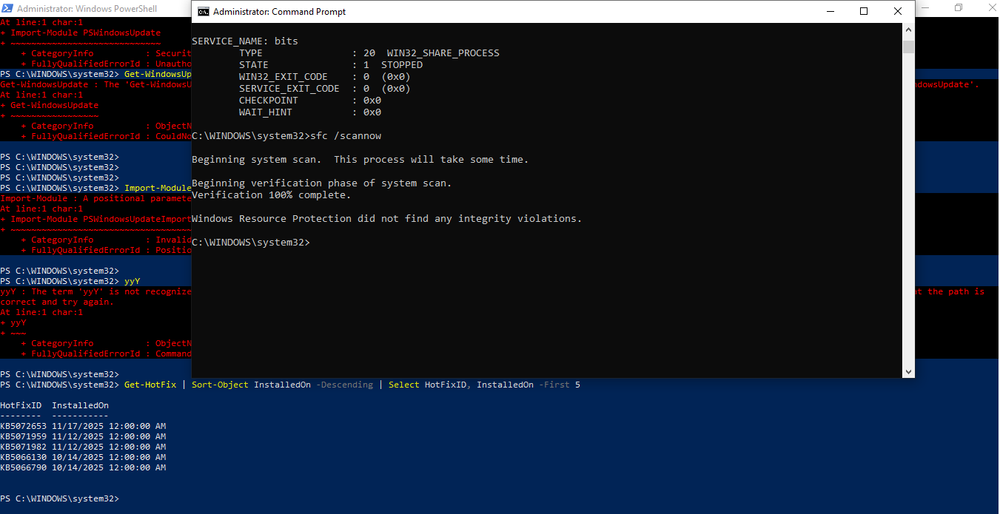

---

## 📟 Summary of Commands  
| Command | Purpose |  
|---------|---------|  
| `sc query wuauserv` | Check Windows Update service status |  
| `sc query bits` | Check BITS service status |  
| `sc query cryptsvc` | Check Cryptographic Services status |  
| `net stop wuauserv` | Stop Windows Update service |  
| `net start wuauserv` | Start Windows Update service |  
| `rd /s /q C:\Windows\SoftwareDistribution` | Clear update cache |  
| `rd /s /q C:\Windows\System32\catroot2` | Clear crypto catalog cache |  
| `DISM /Online /Cleanup-Image /CheckHealth` | Quick image health check |  
| `DISM /Online /Cleanup-Image /ScanHealth` | Deep image corruption scan |  
| `DISM /Online /Cleanup-Image /RestoreHealth` | Repair Windows image |  
| `sfc /scannow` | Scan and repair system files |  
| `reg query "HKLM\SOFTWARE\Policies\Microsoft\Windows\WindowsUpdate"` | Check update policy registry |  
| `Get-HotFix` | List installed Windows patches |  
| `Get-WinEvent -LogName System` | Query Windows event logs |  
| `Install-Module PSWindowsUpdate` | Install update management module |  
| `Set-ExecutionPolicy RemoteSigned` | Fix PowerShell execution policy |  

---

## ⚠️ Challenges & How I Solved Them  
| Challenge | Solution |  
|-----------|----------|  
| Windows 10 22H2 showing end of support warning | Documented as real-world IT scenario — identified via Windows Update settings |  
| BITS service already stopped when running net stop | Expected behaviour — BITS stops when not in use; confirmed with sc query |  
| SoftwareDistribution folder not found during rd command | Already cleared in previous attempt — "file not found" is expected in this case |  
| PSWindowsUpdate module blocked by execution policy | Identified Restricted execution policy as cause — fix: Set-ExecutionPolicy RemoteSigned |  
| Registry keys not found for Windows Update policy | Confirmed healthy — missing keys mean no GPO restrictions applied to updates |  
| BITS showing STOPPED in final verification | Normal — BITS only runs when transferring files, stops when idle |  

---

## 🧠 What I Learned  
How to perform complete Windows Update troubleshooting — stopping and restarting update services, clearing the SoftwareDistribution cache, repairing the Windows image with DISM, verifying system file integrity with SFC, inspecting update history and event logs via PowerShell, checking Group Policy registry restrictions, and resolving PowerShell execution policy issues that block update management modules.

---

## 📁 Files  
| File | Description |  
|------|-------------|  
| `README.md` | Full lab documentation |  
| `screenshots/` | Step-by-step screenshots folder |
